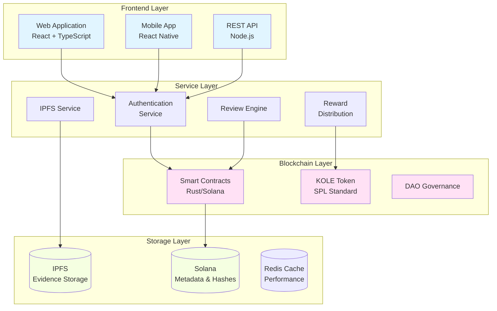

# KOLE - منصة كشف سوء سلوك قادة الرأي

<div align="center">


[](LICENSE)

**نظام بيئي لامركزي للمساءلة الشفافة لقادة الرأي**

[الموقع الإلكتروني](https://kolexposure.com) | [الورقة البيضاء](docs/whitepapers/Whitepaper_AR.md) | [English](README.md) | [中文](README_CN.md) | [المجتمع](https://t.me/kolexposure)

[](https://x.com/kolexposure) [](https://x.com/TODO_dream)

### 🌍 النسخ متعددة اللغات
[🇬🇧 English](README.md) | [🇨🇳 中文](README_CN.md) | [🇯🇵 日本語](README_JP.md) | [🇷🇺 Русский](README_RU.md) | [🇪🇸 Español](README_ES.md) | [🇰🇷 한국어](README_KR.md) | [🇸🇦 العربية](README_AR.md) | [🇹🇷 Türkçe](README_TR.md) | [🇧🇷 Português](README_PT.md) | [🇫🇷 Français](README_FR.md) | [🇩🇪 Deutsch](README_DE.md) | [🇮🇳 हिंदी](README_HI.md) | [🇮🇱 עברית](README_HE.md) | [🇻🇳 Tiếng Việt](README_VI.md) | [🇹🇭 ไทย](README_TH.md)

</div>

---

## 🎯 المهمة

تقوم KOLE ببناء نظام بيئي للإشراف اللامركزي يستفيد من تقنية البلوك تشين لكشف وتسجيل سوء سلوك قادة الرأي الرئيسيين (KOL) بشكل دائم. من خلال الحوكمة الشفافة للمجتمع والتخزين غير القابل للتغيير للأدلة، نحمي المستثمرين والمستهلكين من السلوك الاحتيالي في اقتصاد التأثير الرقمي.

## 🌟 الميزات الرئيسية

### 🔐 **تخزين الأدلة غير القابل للتغيير**
- **قائم على البلوك تشين**: جميع الأدلة مخزنة بشكل دائم على بلوك تشين سولانا
- **تكامل IPFS**: التخزين الموزع يضمن توفر الأدلة
- **مقاوم للتلاعب**: التجميع التشفيري يمنع التلاعب بالأدلة
- **التحقق العام**: يمكن لأي شخص التحقق من صحة الأدلة على السلسلة

### ⚖️ **نظام المراجعة اللامركزي**
- **هيئة محلفين مجتمعية**: آلية إجماع متعددة المراجعين
- **مراجعات مستقلة**: عملية مراجعة عمياء تمنع التواطؤ
- **تصنيف الخطورة**: نظام تصنيف من 5 مستويات لسوء السلوك
- **موافقة بالإجماع**: يجب على جميع المراجعين الموافقة للحصول على الشهادة

### 💰 **اقتصاد الرمز المميز (KOLE)**
- **إجمالي المعروض**: 1,000,000,000 KOLE (ثابت)
- **نظام المكافآت**: يحفز تقديم الأدلة والمراجعة
- **سحب الحظ**: مكافآت كل ساعة ويومية لحاملي الرموز
- **انكماشي**: آليات إعادة الشراء والحرق المنتظمة

### 🏛️ **حوكمة DAO**
- **مدفوع بالمجتمع**: حاملو الرموز يصوتون على قرارات المنصة
- **شفاف**: جميع عمليات الحوكمة على السلسلة
- **لامركزية تدريجية**: انتقال تدريجي إلى السيطرة الكاملة لـ DAO

## 📊 إحصائيات المنصة

| المقياس | القيمة |
|---------|--------|
| **البلوك تشين** | Solana |
| **سرعة المعاملة** | 65,000 TPS |
| **تكلفة المعاملة** | < $0.01 |
| **معيار الرمز** | SPL |
| **عنوان العقد (CA)** | `2EL3kJNYbgoqvtK4eyfNxgYiwm2V7B84kfMd1KLRpump` |
| **DEX** | [عرض على Raydium](https://raydium.io/swap/?inputCurrency=sol&outputCurrency=2EL3kJNYbgoqvtK4eyfNxgYiwm2V7B84kfMd1KLRpump) |
| **المستكشف** | [عرض على Solscan](https://solscan.io/token/2EL3kJNYbgoqvtK4eyfNxgYiwm2V7B84kfMd1KLRpump) |

## 🏗️ الهندسة المعمارية التقنية

> ⚠️ **مستخدمو الهاتف المحمول**: قد لا تعرض الرسوم البيانية على الهاتف المحمول. [عرض النسخة النصية هنا](docs/DIAGRAMS_VIEWER.md)



## 💎 علم الرموز

### التوزيع
| التخصيص | النسبة المئوية | الاستحقاق |
|----------|----------------|------------|
| **مكافآت المستخدم** | 40% | إلغاء القفل اليومي 0.5% |
| **مجموعة السحب** | 40% | متداول بالكامل |
| **تطوير النظام البيئي** | 10% | إلغاء القفل الشهري 1% |
| **الفريق والمستشارين** | 10% | إلغاء القفل الشهري 2% |

### هيكل المكافآت
| الإجراء | مكافأة KOLE |
|---------|-------------|
| **التقرير الأول** | 100,000 KOLE |
| **الأدلة التكميلية** | 20,000 KOLE |
| **المشاركة في المراجعة** | 50,000 KOLE |

### نظام السحب
| النوع | التكرار | مجموعة الجوائز | التوزيع |
|-------|---------|---------------|----------|
| **عادي** | كل ساعة | 10 SOL | نسبة 5:3:2 (3 فائزين) |
| **سوبر** | يومياً 00:00 SGT | 66 SOL | نسبة 40:20:6 (3 فائزين) |

**الأهلية**: امتلاك 300,000+ KOLE لمدة ساعة واحدة على الأقل

## 🗺️ خارطة الطريق

### ✅ المرحلة 1: الأساس (الربع الأول 2025)
- [x] إصدار الورقة البيضاء
- [x] تشكيل الفريق الأساسي
- [x] تصميم الهندسة المعمارية التقنية
- [x] تطوير العقود الذكية

### ✅ المرحلة 2: الإطلاق (الربع الثاني 2025)
- [x] نشر الشبكة الرئيسية
- [x] اختبار بيتا
- [x] إطلاق الموقع الرسمي
- [x] إصدار الرمز (KOLE)

### 🚀 المرحلة 3: التوسع (الربع الثالث 2025)
- [x] الإدراج في DEX
- [ ] تطبيق إدراج CEX
- [ ] تطوير الشراكات
- [ ] إطلاق التطبيق المحمول

### 🌍 المرحلة 4: العولمة (الربع الرابع 2025)
- [ ] دعم متعدد اللغات
- [ ] جسور عبر السلاسل
- [ ] نظام مراجعة بمساعدة الذكاء الاصطناعي
- [ ] انتقال كامل لـ DAO

### 🔮 المرحلة 5: المستقبل (2026+)
- [ ] إنشاء معايير الصناعة
- [ ] إطار الامتثال التنظيمي
- [ ] تكامل هوية Web3
- [ ] التوسع في الميتافيرس

## 🚀 البدء

### المتطلبات الأساسية
- Node.js 16+
- أدوات Solana CLI
- Git

### التثبيت
```bash
# استنساخ المستودع
git clone https://github.com/qdwqwdqwdqwd/KOLE.git
cd KOLE

# تثبيت التبعيات
npm install

# إعداد متغيرات البيئة
cp .env.example .env
# تحرير .env بتكوينك

# تشغيل خادم التطوير
npm run dev
```

### الوثائق
- 📖 [الورقة البيضاء الإنجليزية](docs/whitepapers/Whitepaper_EN.md)
- 📖 [中文白皮书](docs/whitepapers/Whitepaper_CN.md)
- 📖 [دليل المجتمع](docs/社区资料.md)
- 📖 [وثائق API](docs/api.md)

## 🤝 المساهمة

نرحب بمساهمات المجتمع! يرجى قراءة [دليل المساهمة](CONTRIBUTING.md) للبدء.

### كيفية المساهمة
1. عمل fork للمستودع
2. إنشاء فرع الميزة (`git checkout -b feature/AmazingFeature`)
3. تأكيد التغييرات (`git commit -m 'Add some AmazingFeature'`)
4. دفع إلى الفرع (`git push origin feature/AmazingFeature`)
5. فتح Pull Request

### إرشادات التطوير
- اتبع دليل نمط الكود
- اكتب اختبارات للميزات الجديدة
- حديث الوثائق حسب الحاجة
- تأكد من نجاح جميع الاختبارات قبل تقديم PR

## 🌐 المجتمع والدعم

### القنوات الرسمية
- 🌐 **الموقع الإلكتروني**: [https://kolexposure.com](https://kolexposure.com)
- 💬 **تليجرام**: [https://t.me/kolexposure](https://t.me/kolexposure)
- 🐦 **Twitter/X**:
  - الرئيسي: [@kolexposure](https://x.com/kolexposure)
  - التحديثات: [@TODO_dream](https://x.com/TODO_dream)
- 🎮 **ديسكورد**: [انضم للخادم](https://discord.com/invite/sZf44CseTf)
- 📧 **البريد الإلكتروني**: support@kolexposure.com
- 💰 **CA**: `2EL3kJNYbgoqvtK4eyfNxgYiwm2V7B84kfMd1KLRpump`

### الموارد
- [الأسئلة الشائعة](docs/FAQ.md)
- [الدروس التعليمية](docs/tutorials/)
- [أدلة الفيديو](https://youtube.com/@kolexposure)
- [المدونة](https://blog.kolexposure.com)

## 📄 الترخيص

هذا المشروع مرخص تحت رخصة MIT - راجع ملف [LICENSE](LICENSE) للتفاصيل.

## ⚠️ إخلاء المسؤولية

**مخاطر الاستثمار**: استثمار الأصول الرقمية ينطوي على مخاطر عالية. يرجى تقييم تحملك للمخاطر بعناية قبل المشاركة.

**حالة المنصة**: KOLE قيد التطوير النشط. الميزات والرموز وآليات الحوكمة قد تتغير.

**ليس نصيحة مالية**: هذه الوثائق لأغراض إعلامية فقط ولا تشكل نصيحة استثمارية.

**الامتثال التنظيمي**: المستخدمون مسؤولون عن الامتثال للقوانين واللوائح المحلية.

## 🙏 الشكر والتقدير

- مؤسسة سولانا للبنية التحتية للبلوك تشين
- مجتمع IPFS لحلول التخزين الموزع
- أعضاء مجتمعنا للدعم المستمر والتعليقات
- جميع المساهمين الذين ساعدوا في تشكيل هذا المشروع

---

<div align="center">

**بناء مستقبل شفاف للتأثير الرقمي**

© 2025 KOLE Platform | Powered by Blockchain Technology

</div>