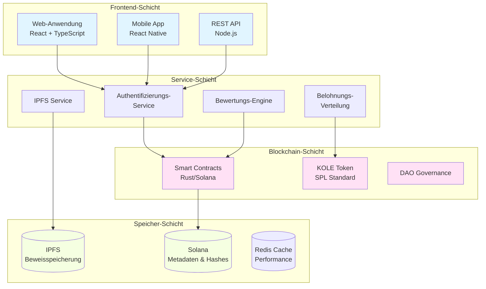

# KOLE - KOL-Fehlverhalten Aufdeckungsplattform

<div align="center">


[](LICENSE)

**Ein Dezentrales Ökosystem für Transparente KOL-Verantwortlichkeit**

[Website](https://kolexposure.com) | [Whitepaper](docs/whitepapers/Whitepaper_DE.md) | [Community](https://t.me/kolexposure)

[](https://x.com/kolexposure) [](https://x.com/TODO_dream)

### 🌍 Verfügbare Sprachen
[🇬🇧 English](README.md) | [🇨🇳 中文](README_CN.md) | [🇯🇵 日本語](README_JP.md) | [🇷🇺 Русский](README_RU.md) | [🇪🇸 Español](README_ES.md) | [🇰🇷 한국어](README_KR.md) | [🇸🇦 العربية](README_AR.md) | [🇹🇷 Türkçe](README_TR.md) | [🇧🇷 Português](README_PT.md) | [🇫🇷 Français](README_FR.md) | [🇩🇪 Deutsch](README_DE.md) | [🇮🇳 हिंदी](README_HI.md) | [🇮🇱 עברית](README_HE.md) | [🇻🇳 Tiếng Việt](README_VI.md) | [🇹🇭 ไทย](README_TH.md)

</div>

---

## 🎯 Mission

KOLE baut ein dezentrales Überwachungsökosystem auf, das Blockchain-Technologie nutzt, um Fehlverhalten von Key Opinion Leaders (KOL) aufzudecken und permanent zu dokumentieren. Durch transparente Community-Governance und unveränderliche Beweisspeicherung schützen wir Investoren und Verbraucher vor betrügerischem Verhalten in der digitalen Einfluss-Wirtschaft.

## 🌟 Hauptfunktionen

### 🔐 **Unveränderliche Beweisspeicherung**
- **Blockchain-basiert**: Alle Beweise permanent auf der Solana Blockchain gespeichert
- **IPFS-Integration**: Verteilte Speicherung gewährleistet Beweisverf gbarkeit
- **Manipulationssicher**: Kryptographisches Hashing verhindert Beweismanipulation
- **Öffentliche Verifikation**: Jeder kann die Echtheit der Beweise on-chain verifizieren

### ⚖️ **Dezentrales Bewertungssystem**
- **Community-Jury**: Multi-Gutachter-Konsensmechanismus
- **Unabhängige Bewertungen**: Blindbewertungsprozess verhindert Absprachen
- **Schweregrad-Einstufung**: 5-stufiges Klassifizierungssystem für Fehlverhalten
- **Einstimmige Genehmigung**: Alle Gutachter müssen für Zertifizierung zustimmen

### 💰 **Token-Wirtschaft (KOLE)**
- **Gesamtangebot**: 1.000.000.000 KOLE (Fest)
- **Belohnungssystem**: Incentiviert Beweiseinreichung und Bewertung
- **Glücksspiel**: Stündliche und tägliche Belohnungen für Token-Inhaber
- **Deflationär**: Regelmäßige Rückkauf- und Vernichtungsmechanismen

### 🏛️ **DAO-Governance**
- **Community-gesteuert**: Token-Inhaber stimmen über Plattformentscheidungen ab
- **Transparent**: Alle Governance-Prozesse on-chain
- **Progressive Dezentralisierung**: Schrittweiser Übergang zur vollständigen DAO-Kontrolle

## 📊 Plattform-Statistiken

| Metrik | Wert |
|--------|------|
| **Blockchain** | Solana |
| **Transaktionsgeschwindigkeit** | 65.000 TPS |
| **Transaktionskosten** | < $0,01 |
| **Token-Standard** | SPL |
| **Contract-Adresse (CA)** | `2EL3kJNYbgoqvtK4eyfNxgYiwm2V7B84kfMd1KLRpump` |
| **DEX** | [Auf Raydium ansehen](https://raydium.io/swap/?inputCurrency=sol&outputCurrency=2EL3kJNYbgoqvtK4eyfNxgYiwm2V7B84kfMd1KLRpump) |
| **Explorer** | [Auf Solscan ansehen](https://solscan.io/token/2EL3kJNYbgoqvtK4eyfNxgYiwm2V7B84kfMd1KLRpump) |

## 🏗️ Technische Architektur

> ⚠️ **Mobile Nutzer**: Diagramme werden möglicherweise nicht auf Mobilgeräten dargestellt. [Textversion hier ansehen](docs/DIAGRAMS_VIEWER.md)



## 💎 Tokenomics

### Verteilung
| Zuteilung | Prozentsatz | Vesting |
|-----------|-------------|---------|
| **Nutzerbelohnungen** | 40% | Tägliche Freischaltung 0,5% |
| **Glücksspiel-Pool** | 40% | Vollständig zirkulierend |
| **Ökosystem-Entwicklung** | 10% | Monatliche Freischaltung 1% |
| **Team & Berater** | 10% | Monatliche Freischaltung 2% |

### Belohnungsstruktur
| Aktion | KOLE-Belohnung |
|--------|----------------|
| **Erster Bericht** | 100.000 KOLE |
| **Ergänzende Beweise** | 20.000 KOLE |
| **Bewertungsteilnahme** | 50.000 KOLE |

### Glücksspiel-System
| Typ | Häufigkeit | Preispool | Verteilung |
|-----|------------|-----------|------------|
| **Regulär** | Stündlich | 10 SOL | Verhältnis 5:3:2 (3 Gewinner) |
| **Super** | Täglich 00:00 SGT | 66 SOL | Verhältnis 40:20:6 (3 Gewinner) |

**Berechtigung**: 300.000+ KOLE für mindestens 1 Stunde halten

## 🗺️ Roadmap

### ✅ Phase 1: Grundlage (Q1 2025)
- [x] Whitepaper-Veröffentlichung
- [x] Kernteam-Bildung
- [x] Technisches Architektur-Design
- [x] Smart Contract-Entwicklung

### ✅ Phase 2: Start (Q2 2025)
- [x] Mainnet-Deployment
- [x] Beta-Tests
- [x] Offizielle Website-Start
- [x] Token-Ausgabe (KOLE)

### 🚀 Phase 3: Expansion (Q3 2025)
- [x] DEX-Listing
- [ ] CEX-Listing-Antrag
- [ ] Partnerschaftsentwicklung
- [ ] Mobile App-Release

### 🌍 Phase 4: Globalisierung (Q4 2025)
- [ ] Multi-Sprachen-Support
- [ ] Cross-Chain-Brücken
- [ ] KI-unterstütztes Bewertungssystem
- [ ] Vollständiger DAO-Übergang

### 🔮 Phase 5: Zukunft (2026+)
- [ ] Industrie-Standard-Etablierung
- [ ] Regulatorisches Compliance-Framework
- [ ] Web3-Identitätsintegration
- [ ] Metaverse-Expansion

## 🚀 Erste Schritte

### Voraussetzungen
- Node.js 16+
- Solana CLI-Tools
- Git

### Installation
```bash
# Repository klonen
git clone https://github.com/qdwqwdqwdqwd/KOLE.git
cd KOLE

# Abhängigkeiten installieren
npm install

# Umgebungsvariablen einrichten
cp .env.example .env
# .env mit Ihrer Konfiguration bearbeiten

# Entwicklungsserver starten
npm run dev
```

### Dokumentation
- 📖 [Englisches Whitepaper](docs/whitepapers/Whitepaper_EN.md)
- 📖 [中文白皮书](docs/whitepapers/Whitepaper_CN.md)
- 📖 [Community-Leitfaden](docs/社区资料.md)
- 📖 [API-Dokumentation](docs/api.md)

## 🤝 Mitwirken

Wir begrüßen Beiträge aus der Community! Bitte lesen Sie unseren [Beitragsleitfaden](CONTRIBUTING.md) für den Einstieg.

### Wie Sie Beitragen Können
1. Repository forken
2. Feature-Branch erstellen (`git checkout -b feature/TollesFunktion`)
3. Änderungen committen (`git commit -m 'TollesFunktion hinzufügen'`)
4. Zum Branch pushen (`git push origin feature/TollesFunktion`)
5. Pull Request öffnen

### Entwicklungsrichtlinien
- Code-Style-Guide befolgen
- Tests für neue Funktionen schreiben
- Dokumentation bei Bedarf aktualisieren
- Sicherstellen, dass alle Tests vor PR-Einreichung bestehen

## 🌐 Community & Support

### Offizielle Kanäle
- 🌐 **Website**: [https://kolexposure.com](https://kolexposure.com)
- 💬 **Telegram**: [https://t.me/kolexposure](https://t.me/kolexposure)
- 🐦 **Twitter/X**:
  - Haupt: [@kolexposure](https://x.com/kolexposure)
  - Updates: [@TODO_dream](https://x.com/TODO_dream)
- 🎮 **Discord**: [Server beitreten](https://discord.com/invite/sZf44CseTf)
- 📧 **Email**: support@kolexposure.com
- 💰 **CA**: `2EL3kJNYbgoqvtK4eyfNxgYiwm2V7B84kfMd1KLRpump`

### Ressourcen
- [FAQ](docs/FAQ.md)
- [Tutorials](docs/tutorials/)
- [Video-Leitfäden](https://youtube.com/@kolexposure)
- [Blog](https://blog.kolexposure.com)

## 📄 Lizenz

Dieses Projekt ist unter der MIT-Lizenz lizenziert - siehe die [LICENSE](LICENSE)-Datei für Details.

## ⚠️ Haftungsausschluss

**Investitionsrisiko**: Digitale Asset-Investitionen beinhalten hohes Risiko. Bitte bewerten Sie sorgfältig Ihre Risikotoleranz vor der Teilnahme.

**Plattform-Status**: KOLE befindet sich in aktiver Entwicklung. Funktionen, Tokenomics und Governance-Mechanismen können sich ändern.

**Keine Finanzberatung**: Diese Dokumentation dient nur Informationszwecken und stellt keine Anlageberatung dar.

**Regulatorische Compliance**: Nutzer sind verantwortlich für die Einhaltung lokaler Gesetze und Vorschriften.

## 🙏 Danksagungen

- Solana Foundation für Blockchain-Infrastruktur
- IPFS-Community für verteilte Speicherlösungen
- Unsere Community-Mitglieder für kontinuierliche Unterstützung und Feedback
- Alle Mitwirkenden, die bei der Gestaltung dieses Projekts geholfen haben

---

<div align="center">

**Eine Transparente Zukunft für Digitalen Einfluss Aufbauen**

© 2025 KOLE Platform | Powered by Blockchain Technology

</div>