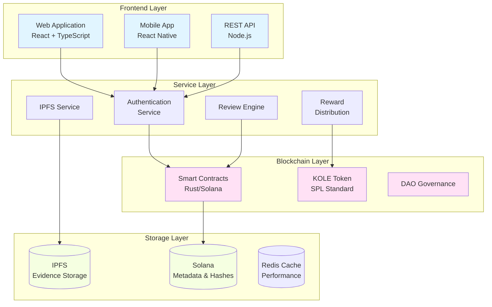

# KOLE - Plataforma de Exposición de Conductas Incorrectas de KOL

<div align="center">


[](LICENSE)

**Un Ecosistema Descentralizado para la Transparencia y Responsabilidad de KOL**

[Sitio Web](https://kolexposure.com) | [Libro Blanco](docs/whitepapers/Whitepaper_ES.md) | [English](README.md) | [中文](README_CN.md) | [Comunidad](https://t.me/kolexposure)

[](https://x.com/kolexposure) [](https://x.com/TODO_dream)

</div>

---

## 🎯 Misión

KOLE está construyendo un ecosistema de supervisión descentralizado que aprovecha la tecnología blockchain para exponer y registrar permanentemente las conductas incorrectas de Líderes de Opinión Clave (KOL). A través de la gobernanza transparente de la comunidad y el almacenamiento inmutable de evidencia, protegemos a inversores y consumidores del comportamiento fraudulento en la economía de influencia digital.

## 🌟 Características Principales

### 🔐 **Almacenamiento Inmutable de Evidencia**
- **Basado en blockchain**: Toda la evidencia almacenada permanentemente en blockchain Solana
- **Integración IPFS**: El almacenamiento distribuido asegura la disponibilidad de evidencia
- **A prueba de manipulación**: El hash criptográfico previene la manipulación de evidencia
- **Verificación pública**: Cualquiera puede verificar la autenticidad de evidencia en la cadena

### ⚖️ **Sistema de Revisión Descentralizado**
- **Jurado de la comunidad**: Mecanismo de consenso multi-revisor
- **Revisiones independientes**: El proceso de revisión ciega previene la colusión
- **Calificación de severidad**: Sistema de clasificación de 5 niveles para conductas incorrectas
- **Aprobación unánime**: Todos los revisores deben estar de acuerdo para la certificación

### 💰 **Economía de Tokens (KOLE)**
- **Suministro total**: 1,000,000,000 KOLE (Fijo)
- **Sistema de recompensas**: Incentiva la presentación de evidencia y revisión
- **Sorteo de suerte**: Recompensas horarias y diarias para tenedores de tokens
- **Deflacionario**: Mecanismos regulares de recompra y quema

### 🏛️ **Gobernanza DAO**
- **Dirigido por la comunidad**: Los tenedores de tokens votan sobre decisiones de la plataforma
- **Transparente**: Todos los procesos de gobernanza en la cadena
- **Descentralización progresiva**: Transición gradual al control completo de DAO

## 📊 Estadísticas de la Plataforma

| Métrica | Valor |
|---------|-------|
| **Blockchain** | Solana |
| **Velocidad de transacción** | 65,000 TPS |
| **Costo de transacción** | < $0.01 |
| **Estándar de token** | SPL |
| **Dirección de contrato (CA)** | `2EL3kJNYbgoqvtK4eyfNxgYiwm2V7B84kfMd1KLRpump` |
| **DEX** | [Ver en Raydium](https://raydium.io/swap/?inputCurrency=sol&outputCurrency=2EL3kJNYbgoqvtK4eyfNxgYiwm2V7B84kfMd1KLRpump) |
| **Explorador** | [Ver en Solscan](https://solscan.io/token/2EL3kJNYbgoqvtK4eyfNxgYiwm2V7B84kfMd1KLRpump) |

## 🏗️ Arquitectura Técnica

> ⚠️ **Usuarios móviles**: Los diagramas pueden no renderizarse en móvil. [Ver versión de texto aquí](docs/DIAGRAMS_VIEWER.md)



## 💎 Tokenomics

### Distribución
| Asignación | Porcentaje | Vesting |
|------------|------------|---------|
| **Recompensas de usuario** | 40% | Desbloqueo diario 0.5% |
| **Pool de sorteo** | 40% | Completamente circulante |
| **Desarrollo del ecosistema** | 10% | Desbloqueo mensual 1% |
| **Equipo y asesores** | 10% | Desbloqueo mensual 2% |

### Estructura de Recompensas
| Acción | Recompensa KOLE |
|--------|-----------------|
| **Primer reporte** | 100,000 KOLE |
| **Evidencia suplementaria** | 20,000 KOLE |
| **Participación en revisión** | 50,000 KOLE |

### Sistema de Sorteo
| Tipo | Frecuencia | Pool de premios | Distribución |
|------|------------|-----------------|--------------|
| **Regular** | Horario | 10 SOL | Ratio 5:3:2 (3 ganadores) |
| **Súper** | Diario 00:00 SGT | 66 SOL | Ratio 40:20:6 (3 ganadores) |

**Elegibilidad**: Mantener 300,000+ KOLE durante al menos 1 hora

## 🗺️ Hoja de Ruta

### ✅ Fase 1: Fundación (Q1 2025)
- [x] Lanzamiento del libro blanco
- [x] Formación del equipo principal
- [x] Diseño de arquitectura técnica
- [x] Desarrollo de contratos inteligentes

### ✅ Fase 2: Lanzamiento (Q2 2025)
- [x] Despliegue en mainnet
- [x] Pruebas beta
- [x] Lanzamiento del sitio web oficial
- [x] Emisión de token (KOLE)

### 🚀 Fase 3: Expansión (Q3 2025)
- [x] Listado en DEX
- [ ] Aplicación para listado en CEX
- [ ] Desarrollo de asociaciones
- [ ] Lanzamiento de aplicación móvil

### 🌍 Fase 4: Globalización (Q4 2025)
- [ ] Soporte multiidioma
- [ ] Puentes cross-chain
- [ ] Sistema de revisión asistido por IA
- [ ] Transición completa a DAO

### 🔮 Fase 5: Futuro (2026+)
- [ ] Establecimiento de estándares de la industria
- [ ] Marco de cumplimiento regulatorio
- [ ] Integración de identidad Web3
- [ ] Expansión al metaverso

## 🚀 Comenzando

### Prerrequisitos
- Node.js 16+
- Herramientas Solana CLI
- Git

### Instalación
```bash
# Clonar el repositorio
git clone https://github.com/qdwqwdqwdqwd/KOLE.git
cd KOLE

# Instalar dependencias
npm install

# Configurar variables de entorno
cp .env.example .env
# Editar .env con tu configuración

# Ejecutar servidor de desarrollo
npm run dev
```

### Documentación
- 📖 [Libro Blanco en Inglés](docs/whitepapers/Whitepaper_EN.md)
- 📖 [中文白皮书](docs/whitepapers/Whitepaper_CN.md)
- 📖 [Guía de la Comunidad](docs/社区资料.md)
- 📖 [Documentación de API](docs/api.md)

## 🤝 Contribuir

¡Damos la bienvenida a las contribuciones de la comunidad! Por favor lee nuestra [Guía de Contribución](CONTRIBUTING.md) para comenzar.

### Cómo Contribuir
1. Haz fork del repositorio
2. Crea tu rama de característica (`git checkout -b feature/AmazingFeature`)
3. Confirma tus cambios (`git commit -m 'Add some AmazingFeature'`)
4. Empuja a la rama (`git push origin feature/AmazingFeature`)
5. Abre un Pull Request

### Pautas de Desarrollo
- Sigue la guía de estilo de código
- Escribe pruebas para nuevas características
- Actualiza la documentación según sea necesario
- Asegúrate de que todas las pruebas pasen antes de enviar PR

## 🌐 Comunidad y Soporte

### Canales Oficiales
- 🌐 **Sitio Web**: [https://kolexposure.com](https://kolexposure.com)
- 💬 **Telegram**: [https://t.me/kolexposure](https://t.me/kolexposure)
- 🐦 **Twitter/X**:
  - Principal: [@kolexposure](https://x.com/kolexposure)
  - Actualizaciones: [@TODO_dream](https://x.com/TODO_dream)
- 🎮 **Discord**: [Unirse al servidor](https://discord.com/invite/sZf44CseTf)
- 📧 **Email**: support@kolexposure.com
- 💰 **CA**: `2EL3kJNYbgoqvtK4eyfNxgYiwm2V7B84kfMd1KLRpump`

### Recursos
- [FAQ](docs/FAQ.md)
- [Tutoriales](docs/tutorials/)
- [Guías en video](https://youtube.com/@kolexposure)
- [Blog](https://blog.kolexposure.com)

## 📄 Licencia

Este proyecto está licenciado bajo la Licencia MIT - consulta el archivo [LICENSE](LICENSE) para más detalles.

## ⚠️ Descargo de Responsabilidad

**Riesgo de inversión**: La inversión en activos digitales conlleva alto riesgo. Por favor evalúa cuidadosamente tu tolerancia al riesgo antes de participar.

**Estado de la plataforma**: KOLE está en desarrollo activo. Las características, tokenomics y mecanismos de gobernanza pueden cambiar.

**No es consejo financiero**: Esta documentación es solo para fines informativos y no constituye consejo de inversión.

**Cumplimiento regulatorio**: Los usuarios son responsables de cumplir con las leyes y regulaciones locales.

## 🙏 Reconocimientos

- Fundación Solana por la infraestructura blockchain
- Comunidad IPFS por las soluciones de almacenamiento distribuido
- Nuestros miembros de la comunidad por el apoyo continuo y retroalimentación
- Todos los contribuyentes que han ayudado a dar forma a este proyecto

---

<div align="center">

**Construyendo un Futuro Transparente para la Influencia Digital**

© 2025 KOLE Platform | Powered by Blockchain Technology

</div>