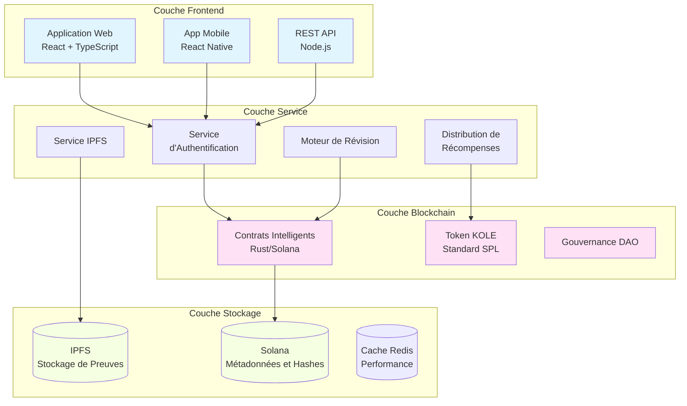

# KOLE - Plateforme d'Exposition des Mauvaises Conduites de KOL

<div align="center">


[](LICENSE)

**Un Écosystème Décentralisé pour la Transparence et la Responsabilité des KOL**

[Site Web](https://kolexposure.com) | [Livre Blanc](docs/KOL%20Misconduct%20Exposure%20Platform%20Whitepaper.md) | [Communauté](https://t.me/kolexposure)

[](https://x.com/kolexposure) [](https://x.com/TODO_dream)

### 🌍 Langues Disponibles
[🇬🇧 English](README.md) | [🇨🇳 中文](README_CN.md) | [🇯🇵 日本語](README_JP.md) | [🇷🇺 Русский](README_RU.md) | [🇪🇸 Español](README_ES.md) | [🇰🇷 한국어](README_KR.md) | [🇸🇦 العربية](README_AR.md) | [🇹🇷 Türkçe](README_TR.md) | [🇧🇷 Português](README_PT.md) | [🇫🇷 Français](README_FR.md) | [🇩🇪 Deutsch](README_DE.md) | [🇮🇳 हिंदी](README_HI.md) | [🇮🇱 עברית](README_HE.md) | [🇻🇳 Tiếng Việt](README_VI.md) | [🇹🇭 ไทย](README_TH.md)

</div>

---

## 🎯 Mission

KOLE construit un écosystème de supervision décentralisé qui exploite la technologie blockchain pour exposer et enregistrer définitivement les mauvaises conduites des Leaders d'Opinion Clés (KOL). Grâce à une gouvernance communautaire transparente et un stockage immuable des preuves, nous protégeons les investisseurs et consommateurs des comportements frauduleux dans l'économie d'influence numérique.

## 🌟 Fonctionnalités Principales

### 🔐 **Stockage Immuable des Preuves**
- **Basé sur blockchain** : Toutes les preuves stockées définitivement sur la blockchain Solana
- **Intégration IPFS** : Le stockage distribué assure la disponibilité des preuves
- **Inviolable** : Le hachage cryptographique empêche la manipulation des preuves
- **Vérification publique** : Tout le monde peut vérifier l'authenticité des preuves on-chain

### ⚖️ **Système de Révision Décentralisé**
- **Jury communautaire** : Mécanisme de consensus multi-réviseurs
- **Révisions indépendantes** : Le processus de révision aveugle empêche la collusion
- **Classification de sévérité** : Système de classification à 5 niveaux pour les mauvaises conduites
- **Approbation unanime** : Tous les réviseurs doivent être d'accord pour la certification

### 💰 **Économie de Token (KOLE)**
- **Offre totale** : 1 000 000 000 KOLE (Fixe)
- **Système de récompenses** : Incite la soumission de preuves et les révisions
- **Tirage au sort** : Récompenses horaires et quotidiennes pour les détenteurs de tokens
- **Déflationniste** : Mécanismes réguliers de rachat et destruction

### 🏛️ **Gouvernance DAO**
- **Dirigée par la communauté** : Les détenteurs de tokens votent sur les décisions de la plateforme
- **Transparente** : Tous les processus de gouvernance on-chain
- **Décentralisation progressive** : Transition graduelle vers un contrôle DAO complet

## 📊 Statistiques de la Plateforme

| Métrique | Valeur |
|----------|--------|
| **Blockchain** | Solana |
| **Vitesse de transaction** | 65 000 TPS |
| **Coût de transaction** | < 0,01 $ |
| **Standard de token** | SPL |
| **Adresse de contrat (CA)** | `2EL3kJNYbgoqvtK4eyfNxgYiwm2V7B84kfMd1KLRpump` |
| **DEX** | [Voir sur Raydium](https://raydium.io/swap/?inputCurrency=sol&outputCurrency=2EL3kJNYbgoqvtK4eyfNxgYiwm2V7B84kfMd1KLRpump) |
| **Explorateur** | [Voir sur Solscan](https://solscan.io/token/2EL3kJNYbgoqvtK4eyfNxgYiwm2V7B84kfMd1KLRpump) |

## 🏗️ Architecture Technique

> ⚠️ **Utilisateurs mobiles** : Les diagrammes peuvent ne pas s'afficher sur mobile. [Voir la version texte ici](docs/DIAGRAMS_VIEWER.md)



## 💎 Tokenomiques

### Distribution
| Allocation | Pourcentage | Vesting |
|------------|-------------|---------|
| **Récompenses utilisateurs** | 40% | Déblocage quotidien 0,5% |
| **Pool de tirage** | 40% | Entièrement circulant |
| **Développement écosystème** | 10% | Déblocage mensuel 1% |
| **Équipe et conseillers** | 10% | Déblocage mensuel 2% |

### Structure de Récompenses
| Action | Récompense KOLE |
|--------|-----------------|
| **Premier rapport** | 100 000 KOLE |
| **Preuve supplémentaire** | 20 000 KOLE |
| **Participation révision** | 50 000 KOLE |

### Système de Tirage au Sort
| Type | Fréquence | Pool de prix | Distribution |
|------|-----------|--------------|--------------|
| **Régulier** | Toutes les heures | 10 SOL | Ratio 5:3:2 (3 gagnants) |
| **Super** | Quotidien 00:00 SGT | 66 SOL | Ratio 40:20:6 (3 gagnants) |

**Éligibilité** : Détenir 300 000+ KOLE pendant au moins 1 heure

## 🗺️ Feuille de Route

### ✅ Phase 1 : Fondation (Q1 2025)
- [x] Publication du livre blanc
- [x] Formation de l'équipe principale
- [x] Conception de l'architecture technique
- [x] Développement des contrats intelligents

### ✅ Phase 2 : Lancement (Q2 2025)
- [x] Déploiement mainnet
- [x] Tests bêta
- [x] Lancement du site officiel
- [x] Émission du token (KOLE)

### 🚀 Phase 3 : Expansion (Q3 2025)
- [x] Listing DEX
- [ ] Application listing CEX
- [ ] Développement de partenariats
- [ ] Sortie de l'app mobile

### 🌍 Phase 4 : Mondialisation (Q4 2025)
- [ ] Support multi-langues
- [ ] Ponts cross-chain
- [ ] Système de révision assisté par IA
- [ ] Transition DAO complète

### 🔮 Phase 5 : Futur (2026+)
- [ ] Établissement de standards industriels
- [ ] Cadre de conformité réglementaire
- [ ] Intégration d'identité Web3
- [ ] Expansion métavers

## 🚀 Démarrage

### Prérequis
- Node.js 16+
- Outils CLI Solana
- Git

### Installation
```bash
# Cloner le dépôt
git clone https://github.com/qdwqwdqwdqwd/KOLE.git
cd KOLE

# Installer les dépendances
npm install

# Configurer les variables d'environnement
cp .env.example .env
# Éditer .env avec votre configuration

# Lancer le serveur de développement
npm run dev
```

### Documentation
- 📖 [Livre blanc anglais](docs/KOL%20Misconduct%20Exposure%20Platform%20Whitepaper.md)
- 📖 [白皮书中文版](docs/KOL劣迹曝光平台白皮书.md)
- 📖 [Guide communauté](docs/社区资料.md)
- 📖 [Documentation API](docs/api.md)

## 🤝 Contribution

Nous accueillons les contributions de la communauté ! Veuillez lire notre [Guide de Contribution](CONTRIBUTING.md) pour commencer.

### Comment Contribuer
1. Forkez le dépôt
2. Créez votre branche de fonctionnalité (`git checkout -b feature/FonctionnaliteGeniale`)
3. Commitez vos changements (`git commit -m 'Ajouter FonctionnaliteGeniale'`)
4. Poussez vers la branche (`git push origin feature/FonctionnaliteGeniale`)
5. Ouvrez une Pull Request

### Directives de Développement
- Suivez le guide de style de code
- Écrivez des tests pour les nouvelles fonctionnalités
- Mettez à jour la documentation si nécessaire
- Assurez-vous que tous les tests passent avant de soumettre la PR

## 🌐 Communauté et Support

### Canaux Officiels
- 🌐 **Site Web** : [https://kolexposure.com](https://kolexposure.com)
- 💬 **Telegram** : [https://t.me/kolexposure](https://t.me/kolexposure)
- 🐦 **Twitter/X** :
  - Principal : [@kolexposure](https://x.com/kolexposure)
  - Mises à jour : [@TODO_dream](https://x.com/TODO_dream)
- 🎮 **Discord** : [Rejoindre le Serveur](https://discord.com/invite/sZf44CseTf)
- 📧 **Email** : support@kolexposure.com
- 💰 **CA** : `2EL3kJNYbgoqvtK4eyfNxgYiwm2V7B84kfMd1KLRpump`

### Ressources
- [FAQ](docs/FAQ.md)
- [Tutoriels](docs/tutorials/)
- [Guides vidéo](https://youtube.com/@kolexposure)
- [Blog](https://blog.kolexposure.com)

## 📄 Licence

Ce projet est sous licence MIT - voir le fichier [LICENSE](LICENSE) pour les détails.

## ⚠️ Avertissement

**Risque d'investissement** : L'investissement en actifs numériques implique un risque élevé. Veuillez évaluer soigneusement votre tolérance au risque avant de participer.

**Statut de la plateforme** : KOLE est en développement actif. Les fonctionnalités, tokenomiques et mécanismes de gouvernance peuvent changer.

**Pas de conseil financier** : Cette documentation est à des fins informatives uniquement et ne constitue pas un conseil d'investissement.

**Conformité réglementaire** : Les utilisateurs sont responsables de se conformer aux lois et réglementations locales.

## 🙏 Remerciements

- Fondation Solana pour l'infrastructure blockchain
- Communauté IPFS pour les solutions de stockage distribué
- Nos membres de la communauté pour leur soutien continu et leurs retours
- Tous les contributeurs qui ont aidé à façonner ce projet

---

<div align="center">

**Construire un Avenir Transparent pour l'Influence Numérique**

© 2025 Plateforme KOLE | Powered by Blockchain Technology

</div>