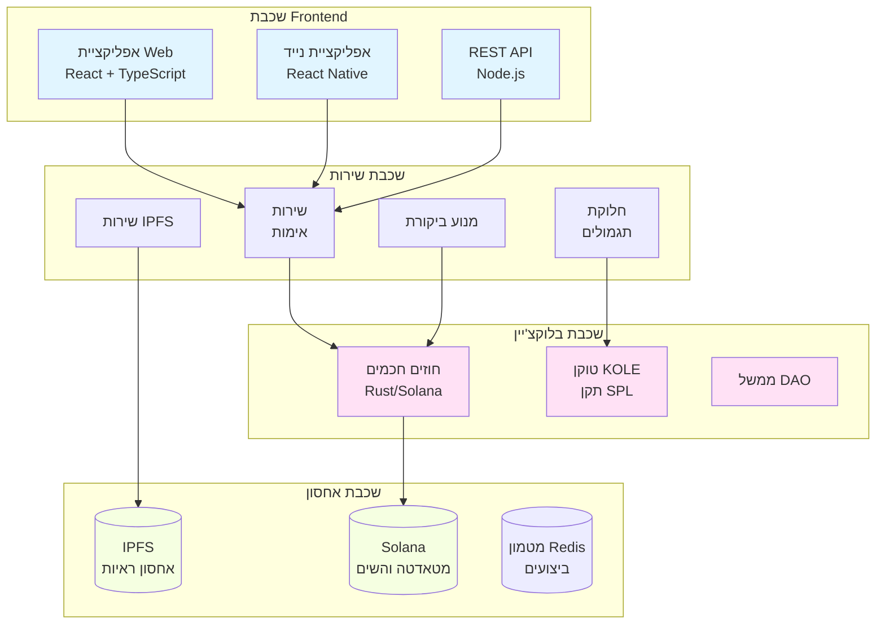

# KOLE - פלטפורמת חשיפת התנהגות בלתי הולמת של KOL

<div align="center">


[](LICENSE)

**מערכת אקולוגית מבוזרת לשקיפות ואחריות של KOL**

[אתר](https://kolexposure.com) | [נייר לבן](docs/KOL%20Misconduct%20Exposure%20Platform%20Whitepaper.md) | [קהילה](https://t.me/kolexposure)

[](https://x.com/kolexposure) [](https://x.com/TODO_dream)

### 🌍 שפות זמינות
[🇬🇧 English](README.md) | [🇨🇳 中文](README_CN.md) | [🇯🇵 日本語](README_JP.md) | [🇷🇺 Русский](README_RU.md) | [🇪🇸 Español](README_ES.md) | [🇰🇷 한국어](README_KR.md) | [🇸🇦 العربية](README_AR.md) | [🇹🇷 Türkçe](README_TR.md) | [🇧🇷 Português](README_PT.md) | [🇫🇷 Français](README_FR.md) | [🇩🇪 Deutsch](README_DE.md) | [🇮🇳 हिंदी](README_HI.md) | [🇮🇱 עברית](README_HE.md) | [🇻🇳 Tiếng Việt](README_VI.md) | [🇹🇭 ไทย](README_TH.md)

</div>

---

## 🎯 משימה

KOLE בונה מערכת אקולוגית של פיקוח מבוזר המנצלת טכנולוגיית בלוקצ'יין כדי לחשוף ולתעד באופן קבוע התנהגות בלתי הולמת של מובילי דעה מרכזיים (KOL). באמצעות ממשל קהילתי שקוף ואחסון ראיות בלתי ניתן לשינוי, אנו מגנים על משקיעים וצרכנים מהתנהגות הונאה בכלכלת ההשפעה הדיגיטלית.

## 🌟 תכונות עיקריות

### 🔐 **אחסון ראיות בלתי ניתן לשינוי**
- **מבוסס בלוקצ'יין**: כל הראיות מאוחסנות באופן קבוע בבלוקצ'יין Solana
- **אינטגרציה IPFS**: אחסון מבוזר מבטיח זמינות ראיות
- **עמיד בפני חבלה**: ערבוב קריפטוגרפי מונע מניפולציה של ראיות
- **אימות ציבורי**: כל אחד יכול לאמת את אמינות הראיות על הצ'יין

### ⚖️ **מערכת ביקורת מבוזרת**
- **חבר מושבעים קהילתי**: מנגנון קונצנזוס של מספר משיינים
- **ביקורות עצמאיות**: תהליך ביקורת עיוור מונע קנוניה
- **דירוג חומרה**: מערכת סיווג של 5 רמות להתנהגות בלתי הולמת
- **אישור פה אחד**: כל המבקרים חייבים להסכים לקבלת הסמכה

### 💰 **כלכלת טוקן (KOLE)**
- **היצע כולל**: 1,000,000,000 KOLE (קבוע)
- **מערכת תגמולים**: מתמרצת הגשת ראיות וביקורת
- **הגרלת מזל**: תגמולים שעתיים ויומיים למחזיקי טוקנים
- **דפלציוני**: מנגנוני רכישה חוזרת ושריפה קבועים

### 🏛️ **ממשל DAO**
- **מונע קהילה**: מחזיקי טוקן מצביעים על החלטות פלטפורמה
- **שקוף**: כל תהליכי הממשל על הצ'יין
- **ביזור הדרגתי**: מעבר הדרגתי לשליטת DAO מלאה

## 📊 סטטיסטיקות פלטפורמה

| מטריקה | ערך |
|---------|-----|
| **בלוקצ'יין** | Solana |
| **מהירות עסקאות** | 65,000 TPS |
| **עלות עסקה** | < $0.01 |
| **תקן טוקן** | SPL |
| **כתובת חוזה (CA)** | `2EL3kJNYbgoqvtK4eyfNxgYiwm2V7B84kfMd1KLRpump` |
| **DEX** | [צפייה ב-Raydium](https://raydium.io/swap/?inputCurrency=sol&outputCurrency=2EL3kJNYbgoqvtK4eyfNxgYiwm2V7B84kfMd1KLRpump) |
| **חוקר** | [צפייה ב-Solscan](https://solscan.io/token/2EL3kJNYbgoqvtK4eyfNxgYiwm2V7B84kfMd1KLRpump) |

## 🏗️ ארכיטקטורה טכנית

> ⚠️ **משתמשי נייד**: דיאגרמות עלולות לא להיות מוצגות בנייד. [צפייה בגרסת טקסט כאן](docs/DIAGRAMS_VIEWER.md)



## 💎 טוקנומיקס

### חלוקה
| הקצאה | אחוז | Vesting |
|--------|------|---------|
| **תגמולי משתמשים** | 40% | שחרור יומי 0.5% |
| **מאגר הגרלה** | 40% | במחזור מלא |
| **פיתוח מערכת אקולוגית** | 10% | שחרור חודשי 1% |
| **צוות ויועצים** | 10% | שחרור חודשי 2% |

### מבנה תגמולים
| פעולה | תגמול KOLE |
|--------|-------------|
| **דוח ראשון** | 100,000 KOLE |
| **ראיות משלימות** | 20,000 KOLE |
| **השתתפות בביקורת** | 50,000 KOLE |

### מערכת הגרלת מזל
| סוג | תדירות | מאגר פרסים | חלוקה |
|-----|---------|------------|--------|
| **רגיל** | שעתי | 10 SOL | יחס 5:3:2 (3 זוכים) |
| **סופר** | יומי 00:00 SGT | 66 SOL | יחס 40:20:6 (3 זוכים) |

**זכאות**: החזקת 300,000+ KOLE למשך שעה אחת לפחות

## 🗺️ מפת דרכים

### ✅ שלב 1: יסוד (רבעון 1 2025)
- [x] פרסום נייר לבן
- [x] הקמת צוות ליבה
- [x] עיצוב ארכיטקטורה טכנית
- [x] פיתוח חוזים חכמים

### ✅ שלב 2: השקה (רבעון 2 2025)
- [x] פריסת mainnet
- [x] בדיקות בטא
- [x] השקת אתר רשמי
- [x] הנפקת טוקן (KOLE)

### 🚀 שלב 3: הרחבה (רבעון 3 2025)
- [x] רישום DEX
- [ ] בקשת רישום CEX
- [ ] פיתוח שותפויות
- [ ] שחרור אפליקציית נייד

### 🌍 שלב 4: גלובליזציה (רבעון 4 2025)
- [ ] תמיכה רב-לשונית
- [ ] גשרי cross-chain
- [ ] מערכת ביקורת בסיוע AI
- [ ] מעבר DAO מלא

### 🔮 שלב 5: עתיד (2026+)
- [ ] קביעת תקן תעשייתי
- [ ] מסגרת ציות רגולטורי
- [ ] אינטגרציית זהות Web3
- [ ] הרחבת מטאוורס

## 🚀 התחלת עבודה

### דרישות מוקדמות
- Node.js 16+
- כלי CLI של Solana
- Git

### התקנה
```bash
# שכפול המאגר
git clone https://github.com/qdwqwdqwdqwd/KOLE.git
cd KOLE

# התקנת תלויות
npm install

# הגדרת משתני סביבה
cp .env.example .env
# עריכת .env עם התצורה שלך

# הפעלת שרת פיתוח
npm run dev
```

### תיעוד
- 📖 [נייר לבן באנגלית](docs/KOL%20Misconduct%20Exposure%20Platform%20Whitepaper.md)
- 📖 [白皮书中文版](docs/KOL劣迹曝光平台白皮书.md)
- 📖 [מדריך קהילה](docs/社区资料.md)
- 📖 [תיעוד API](docs/api.md)

## 🤝 תרומה

אנו מברכים על תרומות מהקהילה! אנא קראו את [מדריך התרומה](CONTRIBUTING.md) שלנו כדי להתחיל.

### איך לתרום
1. בצעו fork למאגר
2. צרו branch לתכונה שלכם (`git checkout -b feature/תכונהמדהימה`)
3. בצעו commit לשינויים שלכם (`git commit -m 'הוספת תכונהמדהימה'`)
4. דחפו לבranch (`git push origin feature/תכונהמדהימה`)
5. פתחו Pull Request

### הנחיות פיתוח
- עקבו אחר מדריך סגנון הקוד
- כתבו בדיקות לתכונות חדשות
- עדכנו תיעוד לפי הצורך
- וודאו שכל הבדיקות עוברות לפני הגשת PR

## 🌐 קהילה ותמיכה

### ערוצים רשמיים
- 🌐 **אתר**: [https://kolexposure.com](https://kolexposure.com)
- 💬 **טלגרם**: [https://t.me/kolexposure](https://t.me/kolexposure)
- 🐦 **Twitter/X**:
  - ראשי: [@kolexposure](https://x.com/kolexposure)
  - עדכונים: [@TODO_dream](https://x.com/TODO_dream)
- 🎮 **Discord**: [הצטרפות לשרת](https://discord.com/invite/sZf44CseTf)
- 📧 **אימייל**: support@kolexposure.com
- 💰 **CA**: `2EL3kJNYbgoqvtK4eyfNxgYiwm2V7B84kfMd1KLRpump`

### משאבים
- [שאלות נפוצות](docs/FAQ.md)
- [מדריכים](docs/tutorials/)
- [מדריכי וידאו](https://youtube.com/@kolexposure)
- [בלוג](https://blog.kolexposure.com)

## 📄 רישיון

פרויקט זה מורשה תחת רישיון MIT - ראו קובץ [LICENSE](LICENSE) לפרטים.

## ⚠️ כתב ויתור

**סיכון השקעה**: השקעה בנכסים דיגיטליים כרוכה בסיכון גבוה. אנא העריכו בזהירות את סבילות הסיכון שלכם לפני השתתפות.

**סטטוס פלטפורמה**: KOLE נמצאת בפיתוח פעיל. תכונות, טוקנומיקס ומנגנוני ממשל עלולים להשתנות.

**לא עצה פיננסית**: תיעוד זה הוא למטרות מידע בלבד ואינו מהווה עצה השקעתית.

**ציות רגולטורי**: משתמשים אחראים לציות לחוקים ותקנות מקומיים.

## 🙏 הכרת תודה

- קרן Solana לתשתית בלוקצ'יין
- קהילת IPFS לפתרונות אחסון מבוזר
- חברי הקהילה שלנו לתמיכה ומשוב מתמשכים
- כל התורמים שעזרו לעצב את הפרויקט הזה

---

<div align="center">

**בניית עתיד שקוף להשפעה דיגיטלית**

© 2025 KOLE Platform | Powered by Blockchain Technology

</div>