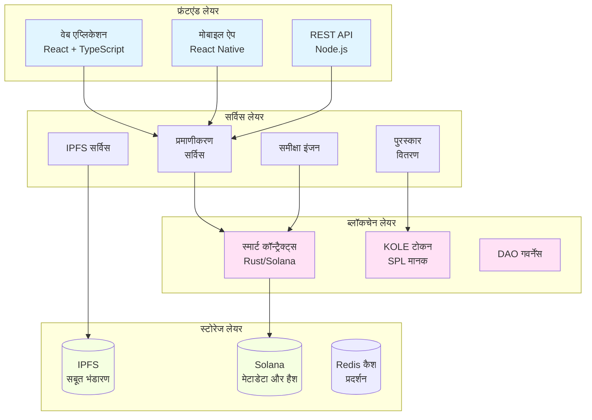

# KOLE - KOL दुर्व्यवहार एक्सपोज़र प्लेटफॉर्म

<div align="center">


[](LICENSE)

**KOL पारदर्शिता और जवाबदेही के लिए एक विकेंद्रीकृत इकोसिस्टम**

[वेबसाइट](https://kolexposure.com) | [व्हाइटपेपर](docs/KOL%20Misconduct%20Exposure%20Platform%20Whitepaper.md) | [समुदाय](https://t.me/kolexposure)

[](https://x.com/kolexposure) [](https://x.com/TODO_dream)

### 🌍 उपलब्ध भाषाएं
[🇬🇧 English](README.md) | [🇨🇳 中文](README_CN.md) | [🇯🇵 日本語](README_JP.md) | [🇷🇺 Русский](README_RU.md) | [🇪🇸 Español](README_ES.md) | [🇰🇷 한국어](README_KR.md) | [🇸🇦 العربية](README_AR.md) | [🇹🇷 Türkçe](README_TR.md) | [🇧🇷 Português](README_PT.md) | [🇫🇷 Français](README_FR.md) | [🇩🇪 Deutsch](README_DE.md) | [🇮🇳 हिंदी](README_HI.md) | [🇮🇱 עברית](README_HE.md) | [🇻🇳 Tiếng Việt](README_VI.md) | [🇹🇭 ไทย](README_TH.md)

</div>

---

## 🎯 मिशन

KOLE एक विकेंद्रीकृत निगरानी इकोसिस्टम बना रहा है जो Key Opinion Leaders (KOL) के दुर्व्यवहार को उजागर करने और स्थायी रूप से रिकॉर्ड करने के लिए ब्लॉकचेन तकनीक का उपयोग करता है। पारदर्शी समुदायिक शासन और अपरिवर्तनीय सबूत भंडारण के माध्यम से, हम डिजिटल प्रभाव अर्थव्यवस्था में धोखाधड़ी के व्यवहार से निवेशकों और उपभोक्ताओं की रक्षा करते हैं।

## 🌟 मुख्य विशेषताएं

### 🔐 **अपरिवर्तनीय सबूत भंडारण**
- **ब्लॉकचेन-आधारित**: सभी सबूत Solana ब्लॉकचेन पर स्थायी रूप से संग्रहीत
- **IPFS एकीकरण**: वितरित भंडारण सबूत की उपलब्धता सुनिश्चित करता है
- **छेड़छाड़-रोधी**: क्रिप्टोग्राफिक हैशिंग सबूत में हेरफेर को रोकती है
- **सार्वजनिक सत्यापन**: कोई भी ऑन-चेन सबूत की प्रामाणिकता सत्यापित कर सकता है

### ⚖️ **विकेंद्रीकृत समीक्षा प्रणाली**
- **समुदायिक जूरी**: बहु-समीक्षक सहमति तंत्र
- **स्वतंत्र समीक्षाएं**: अंधी समीक्षा प्रक्रिया मिलीभगत को रोकती है
- **गंभीरता रेटिंग**: दुर्व्यवहार के लिए 5-स्तरीय वर्गीकरण प्रणाली
- **सर्वसम्मत अनुमोदन**: प्रमाणन के लिए सभी समीक्षकों को सहमत होना होगा

### 💰 **टोकन अर्थव्यवस्था (KOLE)**
- **कुल आपूर्ति**: 1,000,000,000 KOLE (निश्चित)
- **पुरस्कार प्रणाली**: सबूत जमा करने और समीक्षा को प्रोत्साहित करती है
- **लकी ड्रॉ**: टोकन धारकों के लिए प्रति घंटा और दैनिक पुरस्कार
- **डिफ्लेशनरी**: नियमित बायबैक और बर्न तंत्र

### 🏛️ **DAO गवर्नेंस**
- **समुदाय-संचालित**: टोकन धारक प्लेटफॉर्म निर्णयों पर वोट करते हैं
- **पारदर्शी**: सभी गवर्नेंस प्रक्रियाएं ऑन-चेन
- **प्रगतिशील विकेंद्रीकरण**: पूर्ण DAO नियंत्रण में क्रमिक संक्रमण

## 📊 प्लेटफॉर्म आंकड़े

| मेट्रिक | मूल्य |
|---------|-------|
| **ब्लॉकचेन** | Solana |
| **लेनदेन गति** | 65,000 TPS |
| **लेनदेन लागत** | < $0.01 |
| **टोकन मानक** | SPL |
| **कॉन्ट्रैक्ट पता (CA)** | `2EL3kJNYbgoqvtK4eyfNxgYiwm2V7B84kfMd1KLRpump` |
| **DEX** | [Raydium पर देखें](https://raydium.io/swap/?inputCurrency=sol&outputCurrency=2EL3kJNYbgoqvtK4eyfNxgYiwm2V7B84kfMd1KLRpump) |
| **एक्सप्लोरर** | [Solscan पर देखें](https://solscan.io/token/2EL3kJNYbgoqvtK4eyfNxgYiwm2V7B84kfMd1KLRpump) |

## 🏗️ तकनीकी आर्किटेक्चर

> ⚠️ **मोबाइल यूजर्स**: डायग्राम मोबाइल पर रेंडर नहीं हो सकते। [टेक्स्ट वर्जन यहां देखें](docs/DIAGRAMS_VIEWER.md)



## 💎 टोकनॉमिक्स

### वितरण
| आवंटन | प्रतिशत | वेस्टिंग |
|-------|---------|---------|
| **उपयोगकर्ता पुरस्कार** | 40% | दैनिक अनलॉक 0.5% |
| **लकी ड्रॉ पूल** | 40% | पूर्णतः परिचालित |
| **इकोसिस्टम विकास** | 10% | मासिक अनलॉक 1% |
| **टीम और सलाहकार** | 10% | मासिक अनलॉक 2% |

### पुरस्कार संरचना
| कार्य | KOLE पुरस्कार |
|------|-------------|
| **पहली रिपोर्ट** | 100,000 KOLE |
| **पूरक सबूत** | 20,000 KOLE |
| **समीक्षा भागीदारी** | 50,000 KOLE |

### लकी ड्रॉ सिस्टम
| प्रकार | आवृत्ति | पुरस्कार पूल | वितरण |
|------|---------|------------|--------|
| **नियमित** | प्रति घंटा | 10 SOL | 5:3:2 अनुपात (3 विजेता) |
| **सुपर** | दैनिक 00:00 SGT | 66 SOL | 40:20:6 अनुपात (3 विजेता) |

**पात्रता**: कम से कम 1 घंटे के लिए 300,000+ KOLE रखें

## 🗺️ रोडमैप

### ✅ चरण 1: आधारशिला (Q1 2025)
- [x] व्हाइटपेपर रिलीज
- [x] मुख्य टीम गठन
- [x] तकनीकी आर्किटेक्चर डिजाइन
- [x] स्मार्ट कॉन्ट्रैक्ट विकास

### ✅ चरण 2: लॉन्च (Q2 2025)
- [x] मेननेट डिप्लॉयमेंट
- [x] बीटा टेस्टिंग
- [x] आधिकारिक वेबसाइट लॉन्च
- [x] टोकन जारी करना (KOLE)

### 🚀 चरण 3: विस्तार (Q3 2025)
- [x] DEX लिस्टिंग
- [ ] CEX लिस्टिंग आवेदन
- [ ] साझेदारी विकास
- [ ] मोबाइल ऐप रिलीज

### 🌍 चरण 4: वैश्वीकरण (Q4 2025)
- [ ] बहु-भाषा समर्थन
- [ ] क्रॉस-चेन ब्रिज
- [ ] AI-सहायता प्राप्त समीक्षा प्रणाली
- [ ] पूर्ण DAO संक्रमण

### 🔮 चरण 5: भविष्य (2026+)
- [ ] उद्योग मानक स्थापना
- [ ] नियामक अनुपालन ढांचा
- [ ] Web3 पहचान एकीकरण
- [ ] मेटावर्स विस्तार

## 🚀 शुरुआत

### आवश्यकताएं
- Node.js 16+
- Solana CLI टूल्स
- Git

### इंस्टॉलेशन
```bash
# रिपॉजिटरी क्लोन करें
git clone https://github.com/qdwqwdqwdqwd/KOLE.git
cd KOLE

# डिपेंडेंसी इंस्टॉल करें
npm install

# एनवायरनमेंट वेरिएबल सेटअप करें
cp .env.example .env
# अपनी कॉन्फ़िगरेशन के साथ .env संपादित करें

# डेवलपमेंट सर्वर चलाएं
npm run dev
```

### दस्तावेज़ीकरण
- 📖 [अंग्रेजी व्हाइटपेपर](docs/KOL%20Misconduct%20Exposure%20Platform%20Whitepaper.md)
- 📖 [中文白皮书](docs/KOL劣迹曝光平台白皮书.md)
- 📖 [समुदायिक गाइड](docs/社区资料.md)
- 📖 [API दस्तावेज़](docs/api.md)

## 🤝 योगदान

हम समुदाय से योगदान का स्वागत करते हैं! शुरुआत के लिए कृपया हमारी [योगदान गाइड](CONTRIBUTING.md) पढ़ें।

### योगदान कैसे करें
1. रिपॉजिटरी को फोर्क करें
2. अपनी फीचर ब्रांच बनाएं (`git checkout -b feature/अद्भुतफीचर`)
3. अपने परिवर्तन कमिट करें (`git commit -m 'अद्भुतफीचर जोड़ें'`)
4. ब्रांच में पुश करें (`git push origin feature/अद्भुतफीचर`)
5. Pull Request खोलें

### विकास दिशानिर्देश
- कोड स्टाइल गाइड का पालन करें
- नई सुविधाओं के लिए टेस्ट लिखें
- आवश्यकतानुसार दस्तावेज़ीकरण अपडेट करें
- PR सबमिट करने से पहले सुनिश्चित करें कि सभी टेस्ट पास हों

## 🌐 समुदाय और सहायता

### आधिकारिक चैनल
- 🌐 **वेबसाइट**: [https://kolexposure.com](https://kolexposure.com)
- 💬 **टेलीग्राम**: [https://t.me/kolexposure](https://t.me/kolexposure)
- 🐦 **Twitter/X**:
  - मुख्य: [@kolexposure](https://x.com/kolexposure)
  - अपडेट: [@TODO_dream](https://x.com/TODO_dream)
- 🎮 **Discord**: [सर्वर में शामिल हों](https://discord.com/invite/sZf44CseTf)
- 📧 **ईमेल**: support@kolexposure.com
- 💰 **CA**: `2EL3kJNYbgoqvtK4eyfNxgYiwm2V7B84kfMd1KLRpump`

### संसाधन
- [FAQ](docs/FAQ.md)
- [ट्यूटोरियल](docs/tutorials/)
- [वीडियो गाइड](https://youtube.com/@kolexposure)
- [ब्लॉग](https://blog.kolexposure.com)

## 📄 लाइसेंस

यह प्रोजेक्ट MIT लाइसेंस के तहत लाइसेंसीकृत है - विवरण के लिए [LICENSE](LICENSE) फ़ाइल देखें।

## ⚠️ अस्वीकरण

**निवेश जोखिम**: डिजिटल एसेट निवेश में उच्च जोखिम शामिल है। भाग लेने से पहले कृपया अपनी जोखिम सहनशीलता का सावधानीपूर्वक मूल्यांकन करें।

**प्लेटफॉर्म स्थिति**: KOLE सक्रिय विकास में है। सुविधाएं, टोकनॉमिक्स और गवर्नेंस तंत्र बदल सकते हैं।

**वित्तीय सलाह नहीं**: यह दस्तावेज़ीकरण केवल सूचनात्मक उद्देश्यों के लिए है और निवेश सलाह नहीं है।

**नियामक अनुपालन**: उपयोगकर्ता स्थानीय कानूनों और नियमों का अनुपालन करने के लिए जिम्मेदार हैं।

## 🙏 आभार

- ब्लॉकचेन इंफ्रास्ट्रक्चर के लिए Solana Foundation
- वितरित भंडारण समाधान के लिए IPFS समुदाय
- निरंतर समर्थन और फीडबैक के लिए हमारे समुदाय के सदस्य
- इस प्रोजेक्ट को आकार देने में मदद करने वाले सभी योगदानकर्ता

---

<div align="center">

**डिजिटल प्रभाव के लिए एक पारदर्शी भविष्य का निर्माण**

© 2025 KOLE Platform | Powered by Blockchain Technology

</div>