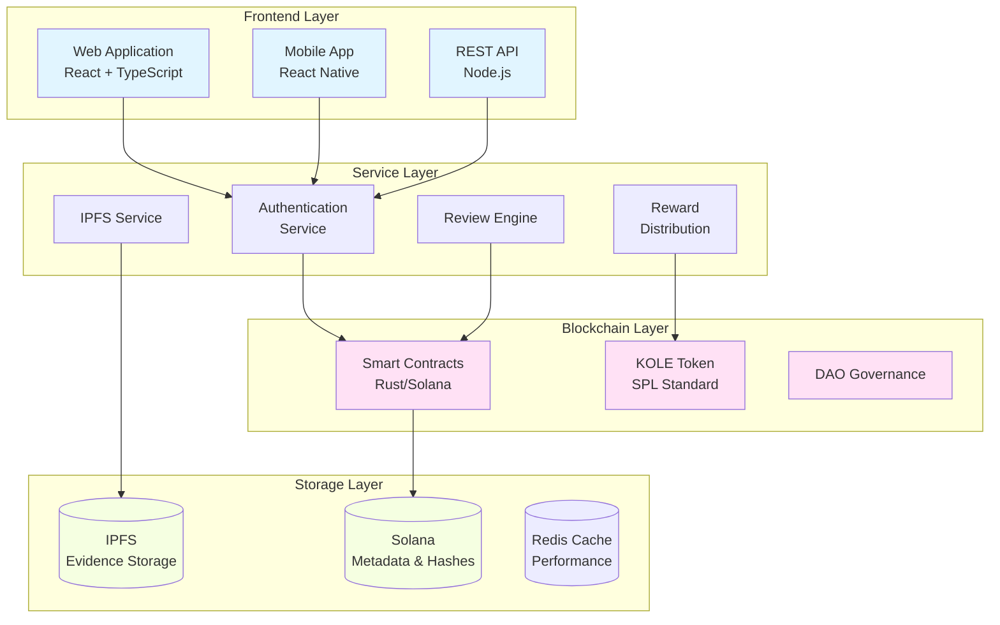

# KOLE - KOL 불법행위 폭로 플랫폼

<div align="center">


[](LICENSE)

**투명한 KOL 책임 추궁을 위한 탈중앙화 생태계**

[웹사이트](https://kolexposure.com) | [백서](docs/whitepapers/Whitepaper_KR.md) | [English](README.md) | [中文](README_CN.md) | [커뮤니티](https://t.me/kolexposure)

[](https://x.com/kolexposure) [](https://x.com/TODO_dream)

### 🌍 다국어 버전
[🇬🇧 English](README.md) | [🇨🇳 中文](README_CN.md) | [🇯🇵 日本語](README_JP.md) | [🇷🇺 Русский](README_RU.md) | [🇪🇸 Español](README_ES.md) | [🇰🇷 한국어](README_KR.md) | [🇸🇦 العربية](README_AR.md) | [🇹🇷 Türkçe](README_TR.md) | [🇧🇷 Português](README_PT.md) | [🇫🇷 Français](README_FR.md) | [🇩🇪 Deutsch](README_DE.md) | [🇮🇳 हिंदी](README_HI.md) | [🇮🇱 עברית](README_HE.md) | [🇻🇳 Tiếng Việt](README_VI.md) | [🇹🇭 ไทย](README_TH.md)

</div>

---

## 🎯 미션

KOLE은 블록체인 기술을 활용하여 핵심 오피니언 리더(KOL)의 불법행위를 폭로하고 영구적으로 기록하는 탈중앙화 감시 생태계를 구축하고 있습니다. 투명한 커뮤니티 거버넌스와 불변의 증거 저장을 통해 디지털 영향력 경제에서 사기 행위로부터 투자자와 소비자를 보호합니다.

## 🌟 주요 특징

### 🔐 **불변의 증거 저장**
- **블록체인 기반**: 모든 증거가 솔라나 블록체인에 영구적으로 저장
- **IPFS 통합**: 분산 저장으로 증거 가용성 보장
- **조작 방지**: 암호화 해싱으로 증거 조작 방지
- **공개 검증**: 누구나 온체인에서 증거의 진위성 검증 가능

### ⚖️ **탈중앙화 검토 시스템**
- **커뮤니티 배심원**: 다중 검토자 합의 메커니즘
- **독립적 검토**: 블라인드 검토 프로세스로 담합 방지
- **심각도 등급**: 불법행위 분류를 위한 5단계 시스템
- **만장일치 승인**: 인증을 위해 모든 검토자의 동의 필요

### 💰 **토큰 이코노미 (KOLE)**
- **총 공급량**: 1,000,000,000 KOLE (고정)
- **보상 시스템**: 증거 제출 및 검토 인센티브
- **럭키 드로우**: 토큰 홀더를 위한 시간별 및 일일 보상
- **디플레이션**: 정기적인 환매 및 소각 메커니즘

### 🏛️ **DAO 거버넌스**
- **커뮤니티 주도**: 토큰 홀더가 플랫폼 결정에 투표
- **투명성**: 모든 거버넌스 프로세스가 온체인
- **점진적 탈중앙화**: 완전한 DAO 제어로의 점진적 전환

## 📊 플랫폼 통계

| 지표 | 값 |
|------|-----|
| **블록체인** | Solana |
| **거래 속도** | 65,000 TPS |
| **거래 비용** | < $0.01 |
| **토큰 표준** | SPL |
| **컨트랙트 주소 (CA)** | `2EL3kJNYbgoqvtK4eyfNxgYiwm2V7B84kfMd1KLRpump` |
| **DEX** | [Raydium에서 보기](https://raydium.io/swap/?inputCurrency=sol&outputCurrency=2EL3kJNYbgoqvtK4eyfNxgYiwm2V7B84kfMd1KLRpump) |
| **익스플로러** | [Solscan에서 보기](https://solscan.io/token/2EL3kJNYbgoqvtK4eyfNxgYiwm2V7B84kfMd1KLRpump) |

## 🏗️ 기술 아키텍처

> ⚠️ **모바일 사용자**: 다이어그램이 모바일에서 렌더링되지 않을 수 있습니다. [여기서 텍스트 버전 보기](docs/DIAGRAMS_VIEWER.md)



## 💎 토크노믹스

### 배분
| 할당 | 비율 | 베스팅 |
|------|------|--------|
| **사용자 보상** | 40% | 일일 해제 0.5% |
| **럭키 드로우 풀** | 40% | 완전 유통 |
| **생태계 개발** | 10% | 월별 해제 1% |
| **팀 및 어드바이저** | 10% | 월별 해제 2% |

### 보상 구조
| 행동 | KOLE 보상 |
|------|-----------|
| **첫 번째 신고** | 100,000 KOLE |
| **추가 증거** | 20,000 KOLE |
| **검토 참여** | 50,000 KOLE |

### 럭키 드로우 시스템
| 유형 | 빈도 | 상금 풀 | 분배 |
|------|------|---------|------|
| **일반** | 매시간 | 10 SOL | 5:3:2 비율 (3명 당첨) |
| **슈퍼** | 매일 00:00 SGT | 66 SOL | 40:20:6 비율 (3명 당첨) |

**참가 자격**: 최소 1시간 동안 300,000+ KOLE 보유

## 🗺️ 로드맵

### ✅ 1단계: 기반 구축 (2025년 1분기)
- [x] 백서 릴리스
- [x] 핵심 팀 구성
- [x] 기술 아키텍처 설계
- [x] 스마트 컨트랙트 개발

### ✅ 2단계: 런칭 (2025년 2분기)
- [x] 메인넷 배포
- [x] 베타 테스팅
- [x] 공식 웹사이트 런칭
- [x] 토큰 발행 (KOLE)

### 🚀 3단계: 확장 (2025년 3분기)
- [x] DEX 상장
- [ ] CEX 상장 신청
- [ ] 파트너십 개발
- [ ] 모바일 앱 출시

### 🌍 4단계: 글로벌화 (2025년 4분기)
- [ ] 다국어 지원
- [ ] 크로스체인 브릿지
- [ ] AI 지원 검토 시스템
- [ ] 완전 DAO 전환

### 🔮 5단계: 미래 (2026년+)
- [ ] 업계 표준 수립
- [ ] 규제 준수 프레임워크
- [ ] Web3 아이덴티티 통합
- [ ] 메타버스 확장

## 🚀 시작하기

### 사전 요구사항
- Node.js 16+
- Solana CLI 도구
- Git

### 설치
```bash
# 저장소 클론
git clone https://github.com/qdwqwdqwdqwd/KOLE.git
cd KOLE

# 의존성 설치
npm install

# 환경 변수 설정
cp .env.example .env
# 설정으로 .env 편집

# 개발 서버 실행
npm run dev
```

### 문서
- 📖 [영문 백서](docs/whitepapers/Whitepaper_EN.md)
- 📖 [中文白皮书](docs/whitepapers/Whitepaper_CN.md)
- 📖 [커뮤니티 가이드](docs/社区资料.md)
- 📖 [API 문서](docs/api.md)

## 🤝 기여하기

커뮤니티의 기여를 환영합니다! 시작하려면 [기여 가이드](CONTRIBUTING.md)를 읽어주세요.

### 기여 방법
1. 저장소 포크
2. 기능 브랜치 생성 (`git checkout -b feature/AmazingFeature`)
3. 변경사항 커밋 (`git commit -m 'Add some AmazingFeature'`)
4. 브랜치에 푸시 (`git push origin feature/AmazingFeature`)
5. Pull Request 열기

### 개발 가이드라인
- 코드 스타일 가이드 따르기
- 새 기능에 대한 테스트 작성
- 필요에 따라 문서 업데이트
- PR 제출 전 모든 테스트 통과 확인

## 🌐 커뮤니티 및 지원

### 공식 채널
- 🌐 **웹사이트**: [https://kolexposure.com](https://kolexposure.com)
- 💬 **텔레그램**: [https://t.me/kolexposure](https://t.me/kolexposure)
- 🐦 **Twitter/X**:
  - 메인: [@kolexposure](https://x.com/kolexposure)
  - 업데이트: [@TODO_dream](https://x.com/TODO_dream)
- 🎮 **디스코드**: [서버 참가](https://discord.com/invite/sZf44CseTf)
- 📧 **이메일**: support@kolexposure.com
- 💰 **CA**: `2EL3kJNYbgoqvtK4eyfNxgYiwm2V7B84kfMd1KLRpump`

### 리소스
- [FAQ](docs/FAQ.md)
- [튜토리얼](docs/tutorials/)
- [비디오 가이드](https://youtube.com/@kolexposure)
- [블로그](https://blog.kolexposure.com)

## 📄 라이선스

이 프로젝트는 MIT 라이선스 하에 라이선스됩니다 - 자세한 내용은 [LICENSE](LICENSE) 파일을 참조하세요.

## ⚠️ 면책 조항

**투자 위험**: 디지털 자산 투자는 높은 위험을 수반합니다. 참여하기 전에 위험 허용 범위를 신중히 평가하십시오.

**플랫폼 상태**: KOLE은 활발한 개발 중입니다. 기능, 토크노믹스 및 거버넌스 메커니즘이 변경될 수 있습니다.

**투자 조언 아님**: 이 문서는 정보 제공 목적만을 위한 것이며 투자 조언을 구성하지 않습니다.

**규제 준수**: 사용자는 현지 법률 및 규정을 준수할 책임이 있습니다.

## 🙏 감사의 말

- 블록체인 인프라를 위한 솔라나 재단
- 분산 스토리지 솔루션을 위한 IPFS 커뮤니티
- 지속적인 지원과 피드백을 위한 커뮤니티 구성원들
- 이 프로젝트를 형성하는 데 도움을 준 모든 기여자들

---

<div align="center">

**디지털 영향력을 위한 투명한 미래 구축**

© 2025 KOLE Platform | Powered by Blockchain Technology

</div>