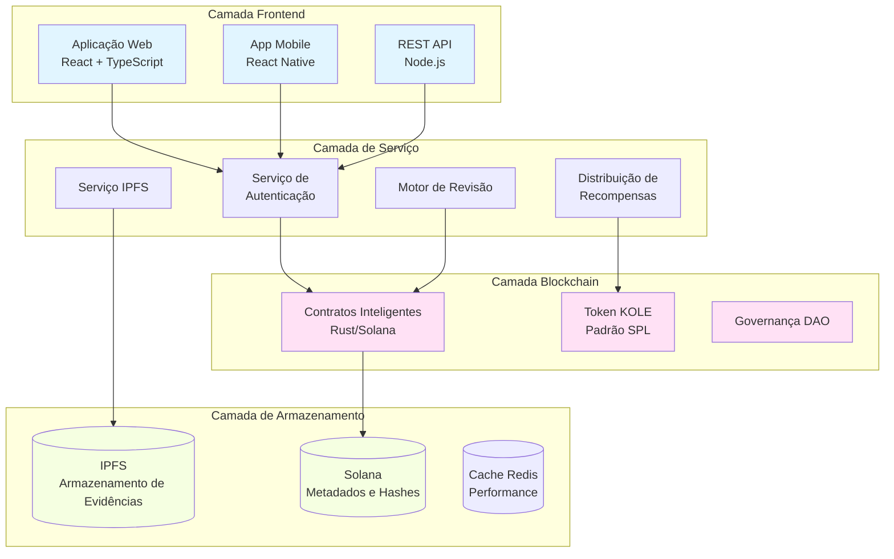

# KOLE - Plataforma de Exposição de Má Conduta de KOL

<div align="center">


[](LICENSE)

**Um Ecossistema Descentralizado para Transparência e Responsabilidade de KOL**

[Website](https://kolexposure.com) | [Whitepaper](docs/KOL%20Misconduct%20Exposure%20Platform%20Whitepaper.md) | [Comunidade](https://t.me/kolexposure)

[](https://x.com/kolexposure) [](https://x.com/TODO_dream)

### 🌍 Idiomas Disponíveis
[🇬🇧 English](README.md) | [🇨🇳 中文](README_CN.md) | [🇯🇵 日本語](README_JP.md) | [🇷🇺 Русский](README_RU.md) | [🇪🇸 Español](README_ES.md) | [🇰🇷 한국어](README_KR.md) | [🇸🇦 العربية](README_AR.md) | [🇹🇷 Türkçe](README_TR.md) | [🇧🇷 Português](README_PT.md) | [🇫🇷 Français](README_FR.md) | [🇩🇪 Deutsch](README_DE.md) | [🇮🇳 हिंदी](README_HI.md) | [🇮🇱 עברית](README_HE.md) | [🇻🇳 Tiếng Việt](README_VI.md) | [🇹🇭 ไทย](README_TH.md)

</div>

---

## 🎯 Missão

A KOLE está construindo um ecossistema de supervisão descentralizado que aproveita a tecnologia blockchain para expor e registrar permanentemente a má conduta de Líderes de Opinião Chave (KOL). Através de governança comunitária transparente e armazenamento imutável de evidências, protegemos investidores e consumidores de comportamentos fraudulentos na economia de influência digital.

## 🌟 Principais Recursos

### 🔐 **Armazenamento Imutável de Evidências**
- **Baseado em blockchain**: Todas as evidências armazenadas permanentemente na blockchain Solana
- **Integração IPFS**: Armazenamento distribuído garante disponibilidade das evidências
- **À prova de violação**: Hash criptográfico previne manipulação de evidências
- **Verificação pública**: Qualquer pessoa pode verificar a autenticidade das evidências on-chain

### ⚖️ **Sistema de Revisão Descentralizado**
- **Júri comunitário**: Mecanismo de consenso com múltiplos revisores
- **Revisões independentes**: Processo de revisão cega previne conluio
- **Classificação de severidade**: Sistema de classificação de 5 níveis para má conduta
- **Aprovação unânime**: Todos os revisores devem concordar para certificação

### 💰 **Economia de Token (KOLE)**
- **Oferta total**: 1.000.000.000 KOLE (Fixa)
- **Sistema de recompensas**: Incentiva submissão de evidências e revisões
- **Sorteio da sorte**: Recompensas horárias e diárias para detentores de tokens
- **Deflacionário**: Mecanismos regulares de recompra e queima

### 🏛️ **Governança DAO**
- **Dirigida pela comunidade**: Detentores de tokens votam nas decisões da plataforma
- **Transparente**: Todos os processos de governança on-chain
- **Descentralização progressiva**: Transição gradual para controle DAO completo

## 📊 Estatísticas da Plataforma

| Métrica | Valor |
|---------|-------|
| **Blockchain** | Solana |
| **Velocidade de transação** | 65.000 TPS |
| **Custo da transação** | < $0,01 |
| **Padrão do token** | SPL |
| **Endereço do contrato (CA)** | `2EL3kJNYbgoqvtK4eyfNxgYiwm2V7B84kfMd1KLRpump` |
| **DEX** | [Ver no Raydium](https://raydium.io/swap/?inputCurrency=sol&outputCurrency=2EL3kJNYbgoqvtK4eyfNxgYiwm2V7B84kfMd1KLRpump) |
| **Explorer** | [Ver no Solscan](https://solscan.io/token/2EL3kJNYbgoqvtK4eyfNxgYiwm2V7B84kfMd1KLRpump) |

## 🏗️ Arquitetura Técnica

> ⚠️ **Usuários móveis**: Os diagramas podem não renderizar no celular. [Ver versão em texto aqui](docs/DIAGRAMS_VIEWER.md)



## 💎 Tokenomics

### Distribuição
| Alocação | Porcentagem | Vesting |
|----------|-------------|---------|
| **Recompensas de usuário** | 40% | Desbloqueio diário 0,5% |
| **Pool de sorteio** | 40% | Totalmente circulante |
| **Desenvolvimento do ecossistema** | 10% | Desbloqueio mensal 1% |
| **Equipe e conselheiros** | 10% | Desbloqueio mensal 2% |

### Estrutura de Recompensas
| Ação | Recompensa KOLE |
|------|-----------------|
| **Primeiro relatório** | 100.000 KOLE |
| **Evidência suplementar** | 20.000 KOLE |
| **Participação em revisão** | 50.000 KOLE |

### Sistema de Sorteio da Sorte
| Tipo | Frequência | Pool de prêmios | Distribuição |
|------|------------|-----------------|--------------|
| **Regular** | A cada hora | 10 SOL | Proporção 5:3:2 (3 ganhadores) |
| **Super** | Diariamente 00:00 SGT | 66 SOL | Proporção 40:20:6 (3 ganhadores) |

**Elegibilidade**: Manter 300.000+ KOLE por pelo menos 1 hora

## 🗺️ Roadmap

### ✅ Fase 1: Fundação (Q1 2025)
- [x] Lançamento do whitepaper
- [x] Formação da equipe principal
- [x] Design da arquitetura técnica
- [x] Desenvolvimento de contratos inteligentes

### ✅ Fase 2: Lançamento (Q2 2025)
- [x] Deploy na mainnet
- [x] Testes beta
- [x] Lançamento do site oficial
- [x] Emissão do token (KOLE)

### 🚀 Fase 3: Expansão (Q3 2025)
- [x] Listagem em DEX
- [ ] Aplicação para listagem em CEX
- [ ] Desenvolvimento de parcerias
- [ ] Lançamento do app mobile

### 🌍 Fase 4: Globalização (Q4 2025)
- [ ] Suporte multi-idioma
- [ ] Pontes cross-chain
- [ ] Sistema de revisão assistido por IA
- [ ] Transição DAO completa

### 🔮 Fase 5: Futuro (2026+)
- [ ] Estabelecimento de padrão da indústria
- [ ] Framework de compliance regulatório
- [ ] Integração de identidade Web3
- [ ] Expansão para metaverso

## 🚀 Começando

### Pré-requisitos
- Node.js 16+
- Ferramentas CLI Solana
- Git

### Instalação
```bash
# Clonar o repositório
git clone https://github.com/qdwqwdqwdqwd/KOLE.git
cd KOLE

# Instalar dependências
npm install

# Configurar variáveis de ambiente
cp .env.example .env
# Editar .env com sua configuração

# Executar servidor de desenvolvimento
npm run dev
```

### Documentação
- 📖 [Whitepaper em inglês](docs/KOL%20Misconduct%20Exposure%20Platform%20Whitepaper.md)
- 📖 [白皮书中文版](docs/KOL劣迹曝光平台白皮书.md)
- 📖 [Guia da comunidade](docs/社区资料.md)
- 📖 [Documentação da API](docs/api.md)

## 🤝 Contribuindo

Bem-vindas contribuições da comunidade! Por favor, leia nosso [Guia de Contribuição](CONTRIBUTING.md) para começar.

### Como Contribuir
1. Faça fork do repositório
2. Crie sua branch de feature (`git checkout -b feature/FeatureIncrivel`)
3. Faça commit das suas mudanças (`git commit -m 'Adicionar FeatureIncrivel'`)
4. Faça push para a branch (`git push origin feature/FeatureIncrivel`)
5. Abra um Pull Request

### Diretrizes de Desenvolvimento
- Siga o guia de estilo de código
- Escreva testes para novas funcionalidades
- Atualize a documentação conforme necessário
- Garanta que todos os testes passem antes de submeter PR

## 🌐 Comunidade e Suporte

### Canais Oficiais
- 🌐 **Website**: [https://kolexposure.com](https://kolexposure.com)
- 💬 **Telegram**: [https://t.me/kolexposure](https://t.me/kolexposure)
- 🐦 **Twitter/X**:
  - Principal: [@kolexposure](https://x.com/kolexposure)
  - Atualizações: [@TODO_dream](https://x.com/TODO_dream)
- 🎮 **Discord**: [Entrar no Servidor](https://discord.com/invite/sZf44CseTf)
- 📧 **Email**: support@kolexposure.com
- 💰 **CA**: `2EL3kJNYbgoqvtK4eyfNxgYiwm2V7B84kfMd1KLRpump`

### Recursos
- [FAQ](docs/FAQ.md)
- [Tutoriais](docs/tutorials/)
- [Guias em vídeo](https://youtube.com/@kolexposure)
- [Blog](https://blog.kolexposure.com)

## 📄 Licença

Este projeto está licenciado sob a Licença MIT - veja o arquivo [LICENSE](LICENSE) para detalhes.

## ⚠️ Isenção de Responsabilidade

**Risco de investimento**: O investimento em ativos digitais envolve alto risco. Avalie cuidadosamente sua tolerância ao risco antes de participar.

**Status da plataforma**: KOLE está em desenvolvimento ativo. Recursos, tokenomics e mecanismos de governança podem mudar.

**Não é conselho financeiro**: Esta documentação é apenas para fins informativos e não constitui conselho de investimento.

**Compliance regulatório**: Os usuários são responsáveis por cumprir as leis e regulamentações locais.

## 🙏 Agradecimentos

- Fundação Solana pela infraestrutura blockchain
- Comunidade IPFS pelas soluções de armazenamento distribuído
- Nossos membros da comunidade pelo suporte contínuo e feedback
- Todos os contribuidores que ajudaram a moldar este projeto

---

<div align="center">

**Construindo um Futuro Transparente para Influência Digital**

© 2025 Plataforma KOLE | Powered by Blockchain Technology

</div>