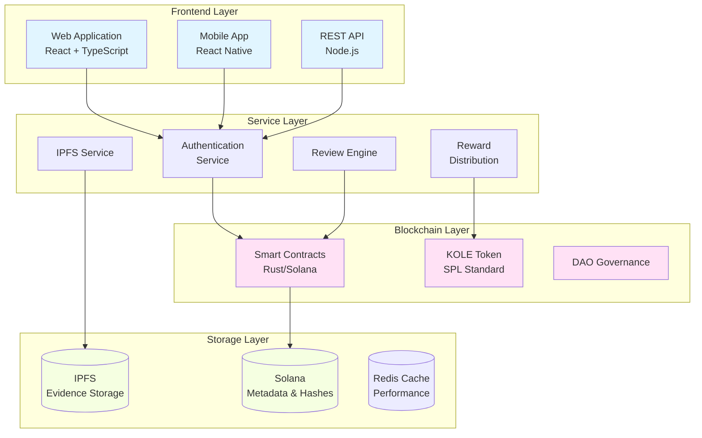

# KOLE - Платформа для Разоблачения Нарушений KOL

<div align="center">


[](LICENSE)

**Децентрализованная Экосистема для Прозрачной Подотчетности KOL**

[Веб-сайт](https://kolexposure.com) | [Белая Книга](docs/whitepapers/Whitepaper_RU.md) | [English](README.md) | [中文](README_CN.md) | [Сообщество](https://t.me/kolexposure)

[](https://x.com/kolexposure) [](https://x.com/TODO_dream)

</div>

---

## 🎯 Миссия

KOLE создает децентрализованную экосистему надзора, которая использует технологию блокчейн для разоблачения и постоянной записи нарушений ключевых лидеров мнений (KOL). Благодаря прозрачному управлению сообществом и неизменяемому хранению доказательств, мы защищаем инвесторов и потребителей от мошеннического поведения в экономике цифрового влияния.

## 🌟 Ключевые Особенности

### 🔐 **Неизменяемое Хранение Доказательств**
- **На основе блокчейна**: Все доказательства постоянно хранятся в блокчейне Solana
- **Интеграция IPFS**: Распределенное хранение обеспечивает доступность доказательств
- **Защита от подделки**: Криптографическое хеширование предотвращает манипуляции с доказательствами
- **Публичная проверка**: Любой может проверить подлинность доказательств в блокчейне

### ⚖️ **Децентрализованная Система Рецензирования**
- **Жюри сообщества**: Механизм консенсуса с несколькими рецензентами
- **Независимые обзоры**: Слепой процесс рецензирования предотвращает сговор
- **Оценка серьезности**: 5-уровневая система классификации нарушений
- **Единогласное одобрение**: Все рецензенты должны согласиться для сертификации

### 💰 **Токеномика (KOLE)**
- **Общее предложение**: 1,000,000,000 KOLE (Фиксированное)
- **Система вознаграждений**: Стимулирует подачу доказательств и рецензирование
- **Лотерея**: Ежечасные и ежедневные вознаграждения для держателей токенов
- **Дефляционная**: Регулярные механизмы выкупа и сжигания

### 🏛️ **DAO Управление**
- **Управляемое сообществом**: Держатели токенов голосуют по решениям платформы
- **Прозрачное**: Все процессы управления в блокчейне
- **Прогрессивная децентрализация**: Постепенный переход к полному контролю DAO

## 📊 Статистика Платформы

| Метрика | Значение |
|---------|----------|
| **Блокчейн** | Solana |
| **Скорость транзакций** | 65,000 TPS |
| **Стоимость транзакции** | < $0.01 |
| **Стандарт токена** | SPL |
| **Адрес контракта (CA)** | `2EL3kJNYbgoqvtK4eyfNxgYiwm2V7B84kfMd1KLRpump` |
| **DEX** | [Посмотреть на Raydium](https://raydium.io/swap/?inputCurrency=sol&outputCurrency=2EL3kJNYbgoqvtK4eyfNxgYiwm2V7B84kfMd1KLRpump) |
| **Эксплорер** | [Посмотреть на Solscan](https://solscan.io/token/2EL3kJNYbgoqvtK4eyfNxgYiwm2V7B84kfMd1KLRpump) |

## 🏗️ Техническая Архитектура

> ⚠️ **Пользователи мобильных устройств**: Диаграммы могут не отображаться на мобильных. [Посмотреть текстовую версию здесь](docs/DIAGRAMS_VIEWER.md)



## 💎 Токеномика

### Распределение
| Выделение | Процент | Вестинг |
|-----------|---------|---------|
| **Вознаграждения пользователей** | 40% | Ежедневная разблокировка 0.5% |
| **Пул лотереи** | 40% | Полностью в обороте |
| **Развитие экосистемы** | 10% | Ежемесячная разблокировка 1% |
| **Команда и советники** | 10% | Ежемесячная разблокировка 2% |

### Структура Вознаграждений
| Действие | Вознаграждение KOLE |
|----------|---------------------|
| **Первый отчет** | 100,000 KOLE |
| **Дополнительные доказательства** | 20,000 KOLE |
| **Участие в рецензировании** | 50,000 KOLE |

### Система Лотереи
| Тип | Частота | Призовой фонд | Распределение |
|-----|---------|---------------|---------------|
| **Обычная** | Ежечасно | 10 SOL | Соотношение 5:3:2 (3 победителя) |
| **Супер** | Ежедневно 00:00 SGT | 66 SOL | Соотношение 40:20:6 (3 победителя) |

**Право участия**: Держать 300,000+ KOLE в течение как минимум 1 часа

## 🗺️ Дорожная Карта

### ✅ Фаза 1: Основание (Q1 2025)
- [x] Релиз белой книги
- [x] Формирование основной команды
- [x] Дизайн технической архитектуры
- [x] Разработка умных контрактов

### ✅ Фаза 2: Запуск (Q2 2025)
- [x] Развертывание в основной сети
- [x] Бета-тестирование
- [x] Запуск официального сайта
- [x] Выпуск токена (KOLE)

### 🚀 Фаза 3: Расширение (Q3 2025)
- [x] Листинг на DEX
- [ ] Подача заявки на листинг CEX
- [ ] Развитие партнерств
- [ ] Релиз мобильного приложения

### 🌍 Фаза 4: Глобализация (Q4 2025)
- [ ] Многоязычная поддержка
- [ ] Кросс-чейн мосты
- [ ] Система рецензирования с ИИ
- [ ] Полный переход к DAO

### 🔮 Фаза 5: Будущее (2026+)
- [ ] Установление отраслевых стандартов
- [ ] Рамки регулятивного соответствия
- [ ] Интеграция Web3 идентичности
- [ ] Расширение в метавселенную

## 🚀 Начало Работы

### Предварительные Требования
- Node.js 16+
- Инструменты Solana CLI
- Git

### Установка
```bash
# Клонировать репозиторий
git clone https://github.com/qdwqwdqwdqwd/KOLE.git
cd KOLE

# Установить зависимости
npm install

# Настроить переменные окружения
cp .env.example .env
# Отредактировать .env с вашей конфигурацией

# Запустить сервер разработки
npm run dev
```

### Документация
- 📖 [Английская Белая Книга](docs/whitepapers/Whitepaper_EN.md)
- 📖 [中文白皮书](docs/whitepapers/Whitepaper_CN.md)
- 📖 [Руководство для Сообщества](docs/社区资料.md)
- 📖 [Документация API](docs/api.md)

## 🤝 Участие в Разработке

Мы приветствуем участие сообщества! Пожалуйста, прочитайте наше [Руководство по Участию](CONTRIBUTING.md) для начала.

### Как Участвовать
1. Сделайте форк репозитория
2. Создайте ветку для функции (`git checkout -b feature/AmazingFeature`)
3. Зафиксируйте изменения (`git commit -m 'Add some AmazingFeature'`)
4. Отправьте в ветку (`git push origin feature/AmazingFeature`)
5. Откройте Pull Request

### Руководящие Принципы Разработки
- Следуйте руководству по стилю кода
- Пишите тесты для новых функций
- Обновляйте документацию при необходимости
- Убедитесь, что все тесты проходят перед отправкой PR

## 🌐 Сообщество и Поддержка

### Официальные Каналы
- 🌐 **Веб-сайт**: [https://kolexposure.com](https://kolexposure.com)
- 💬 **Telegram**: [https://t.me/kolexposure](https://t.me/kolexposure)
- 🐦 **Twitter/X**:
  - Основной: [@kolexposure](https://x.com/kolexposure)
  - Обновления: [@TODO_dream](https://x.com/TODO_dream)
- 🎮 **Discord**: [Присоединиться к серверу](https://discord.com/invite/sZf44CseTf)
- 📧 **Email**: support@kolexposure.com
- 💰 **CA**: `2EL3kJNYbgoqvtK4eyfNxgYiwm2V7B84kfMd1KLRpump`

### Ресурсы
- [FAQ](docs/FAQ.md)
- [Туториалы](docs/tutorials/)
- [Видео Руководства](https://youtube.com/@kolexposure)
- [Блог](https://blog.kolexposure.com)

## 📄 Лицензия

Этот проект лицензирован под лицензией MIT - см. файл [LICENSE](LICENSE) для деталей.

## ⚠️ Отказ от Ответственности

**Инвестиционный риск**: Инвестиции в цифровые активы сопряжены с высоким риском. Пожалуйста, тщательно оцените свою толерантность к риску перед участием.

**Статус платформы**: KOLE находится в активной разработке. Функции, токеномика и механизмы управления могут изменяться.

**Не финансовый совет**: Эта документация предназначена только для информационных целей и не является инвестиционным советом.

**Соответствие нормативным требованиям**: Пользователи несут ответственность за соблюдение местных законов и правил.

## 🙏 Благодарности

- Фонду Solana за блокчейн инфраструктуру
- Сообществу IPFS за решения распределенного хранения
- Нашим членам сообщества за постоянную поддержку и обратную связь
- Всем участникам, которые помогли сформировать этот проект

---

<div align="center">

**Строим Прозрачное Будущее для Цифрового Влияния**

© 2025 KOLE Platform | Powered by Blockchain Technology

</div>