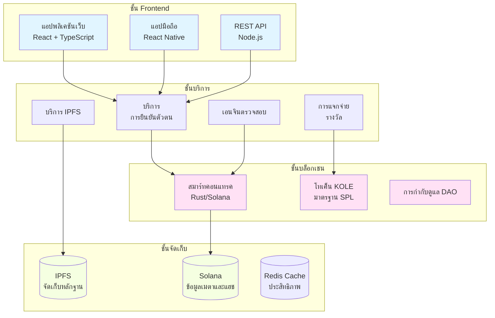

# KOLE - แพลตฟอร์มเปิดโปงพฤติกรรมผิดของ KOL

<div align="center">


[](LICENSE)

**ระบบนิเวศแบบกระจายอำนาจเพื่อความโปร่งใสและความรับผิดชอบของ KOL**

[เว็บไซต์](https://kolexposure.com) | [เอกสารแนวคิด](docs/whitepapers/Whitepaper_TH.md) | [ชุมชน](https://t.me/kolexposure)

[](https://x.com/kolexposure) [](https://x.com/TODO_dream)

### 🌍 ภาษาที่รองรับ
[🇬🇧 English](README.md) | [🇨🇳 中文](README_CN.md) | [🇯🇵 日本語](README_JP.md) | [🇷🇺 Русский](README_RU.md) | [🇪🇸 Español](README_ES.md) | [🇰🇷 한국어](README_KR.md) | [🇸🇦 العربية](README_AR.md) | [🇹🇷 Türkçe](README_TR.md) | [🇧🇷 Português](README_PT.md) | [🇫🇷 Français](README_FR.md) | [🇩🇪 Deutsch](README_DE.md) | [🇮🇳 हिंदी](README_HI.md) | [🇮🇱 עברית](README_HE.md) | [🇻🇳 Tiếng Việt](README_VI.md) | [🇹🇭 ไทย](README_TH.md)

</div>

---

## 🎯 ภารกิจ

KOLE กำลังสร้างระบบนิเวศการกำกับดูแลแบบกระจายอำนาจที่ใช้เทคโนโลยีบล็อกเชนเพื่อเปิดโปงและบันทึกพฤติกรรมผิดของผู้นำทางความคิด (KOL) อย่างถาวร ผ่านการกำกับดูแลชุมชนที่โปร่งใสและการเก็บหลักฐานที่ไม่สามารถเปลี่ยนแปลงได้ เราปกป้องนักลงทุนและผู้บริโภคจากพฤติกรรมฉ้อโกงในเศรษฐกิจอิทธิพลดิจิทัล

## 🌟 ฟีเจอร์หลัก

### 🔐 **การเก็บหลักฐานที่ไม่สามารถเปลี่ยนแปลงได้**
- **ใช้บล็อกเชน**: หลักฐานทั้งหมดถูกเก็บไว้ถาวรบนบล็อกเชน Solana
- **การรวม IPFS**: การจัดเก็บแบบกระจายรับประกันความพร้อมใช้งานของหลักฐาน
- **ป้องกันการปลอมแปลง**: การเข้ารหัสแฮชป้องกันการจัดการหลักฐาน
- **การตรวจสอบสาธารณะ**: ทุกคนสามารถตรวจสอบความถูกต้องของหลักฐานบนเชน

### ⚖️ **ระบบตรวจสอบแบบกระจายอำนาจ**
- **คณะลูกขุนชุมชน**: กลไกฉันทามติของผู้ตรวจสอบหลายคน
- **การตรวจสอบอิสระ**: กระบวนการตรวจสอบแบบปิดตาป้องกันการสมรู้ร่วมคิด
- **การจัดอันดับความรุนแรง**: ระบบจำแนกประเภท 5 ระดับสำหรับพฤติกรรมผิด
- **การอนุมัติเป็นเอกฉันท์**: ผู้ตรวจสอบทุกคนต้องเห็นด้วยเพื่อการรับรอง

### 💰 **เศรษฐศาสตร์โทเค็น (KOLE)**
- **อุปทานทั้งหมด**: 1,000,000,000 KOLE (คงที่)
- **ระบบรางวัล**: สนับสนุนการส่งหลักฐานและการตรวจสอบ
- **ลอตเตอรี่**: รางวัลรายชั่วโมงและรายวันสำหรับผู้ถือโทเค็น
- **เงินฝืด**: กลไกการซื้อคืนและเผาทำลายอย่างสม่ำเสมอ

### 🏛️ **การกำกับดูแล DAO**
- **ขับเคลื่อนโดยชุมชน**: ผู้ถือโทเค็นลงคะแนนในการตัดสินใจของแพลตฟอร์ม
- **โปร่งใส**: กระบวนการกำกับดูแลทั้งหมดบนเชน
- **การกระจายอำนาจอย่างก้าวหน้า**: การเปลี่ยนผ่านแบบค่อยเป็นค่อยไปสู่การควบคุม DAO อย่างสมบูรณ์

## 📊 สถิติแพลตฟอร์ม

| เมตริก | ค่า |
|--------|-----|
| **บล็อกเชน** | Solana |
| **ความเร็วการทำธุรกรรม** | 65,000 TPS |
| **ค่าใช้จ่ายการทำธุรกรรม** | < $0.01 |
| **มาตรฐานโทเค็น** | SPL |
| **ที่อยู่สัญญา (CA)** | `2EL3kJNYbgoqvtK4eyfNxgYiwm2V7B84kfMd1KLRpump` |
| **DEX** | [ดูบน Raydium](https://raydium.io/swap/?inputCurrency=sol&outputCurrency=2EL3kJNYbgoqvtK4eyfNxgYiwm2V7B84kfMd1KLRpump) |
| **Explorer** | [ดูบน Solscan](https://solscan.io/token/2EL3kJNYbgoqvtK4eyfNxgYiwm2V7B84kfMd1KLRpump) |

## 🏗️ สถาปัตยกรรมทางเทคนิค

> ⚠️ **ผู้ใช้มือถือ**: ไดอะแกรมอาจไม่แสดงบนมือถือ [ดูเวอร์ชันข้อความที่นี่](docs/DIAGRAMS_VIEWER.md)



## 💎 โทเค็นโนมิกส์

### การกระจาย
| การจัดสรร | เปอร์เซ็นต์ | การปลดล็อก |
|-----------|-------------|-----------|
| **รางวัลผู้ใช้** | 40% | ปลดล็อกรายวัน 0.5% |
| **พูลลอตเตอรี่** | 40% | หมุนเวียนเต็มรูปแบบ |
| **การพัฒนาระบบนิเวศ** | 10% | ปลดล็อกรายเดือน 1% |
| **ทีม & ที่ปรึกษา** | 10% | ปลดล็อกรายเดือน 2% |

### โครงสร้างรางวัล
| การกระทำ | รางวัล KOLE |
|---------|-------------|
| **รายงานแรก** | 100,000 KOLE |
| **หลักฐานเสริม** | 20,000 KOLE |
| **การมีส่วนร่วมในการตรวจสอบ** | 50,000 KOLE |

### ระบบลอตเตอรี่
| ประเภท | ความถี่ | พูลรางวัล | การแจกจ่าย |
|-------|---------|----------|-----------|
| **ปกติ** | รายชั่วโมง | 10 SOL | อัตราส่วน 5:3:2 (3 ผู้ชนะ) |
| **พิเศษ** | รายวัน 00:00 SGT | 66 SOL | อัตราส่วน 40:20:6 (3 ผู้ชนะ) |

**คุณสมบัติ**: ถือ 300,000+ KOLE เป็นเวลาอย่างน้อย 1 ชั่วโมง

## 🗺️ แผนงาน

### ✅ เฟส 1: รากฐาน (Q1 2025)
- [x] เปิดตัวเอกสารแนวคิด
- [x] การก่อตั้งทีมหลัก
- [x] การออกแบบสถาปัตยกรรมทางเทคนิค
- [x] การพัฒนาสมาร์ทคอนแทรค

### ✅ เฟส 2: เปิดตัว (Q2 2025)
- [x] การติดตั้งเมนเน็ต
- [x] การทดสอบเบต้า
- [x] เปิดตัวเว็บไซต์อย่างเป็นทางการ
- [x] การออกโทเค็น (KOLE)

### 🚀 เฟส 3: การขยาย (Q3 2025)
- [x] การจดทะเบียน DEX
- [ ] การสมัครจดทะเบียน CEX
- [ ] การพัฒนาความเป็นหุ้นส่วน
- [ ] เปิดตัวแอปมือถือ

### 🌍 เฟส 4: โลกาภิวัตน์ (Q4 2025)
- [ ] การสนับสนุนหลายภาษา
- [ ] สะพานข้ามเชน
- [ ] ระบบตรวจสอบที่ช่วยด้วย AI
- [ ] การเปลี่ยนผ่าน DAO อย่างสมบูรณ์

### 🔮 เฟส 5: อนาคต (2026+)
- [ ] การสร้างมาตรฐานอุตสาหกรรม
- [ ] กรอบการปฏิบัติตามกฎระเบียบ
- [ ] การรวมเอกลักษณ์ Web3
- [ ] การขยายเมตาเวิร์ส

## 🚀 การเริ่มต้น

### ข้อกำหนดเบื้องต้น
- Node.js 16+
- เครื่องมือ CLI ของ Solana
- Git

### การติดตั้ง
```bash
# โคลน repository
git clone https://github.com/qdwqwdqwdqwd/KOLE.git
cd KOLE

# ติดตั้ง dependencies
npm install

# ตั้งค่าตัวแปรสภาพแวดล้อม
cp .env.example .env
# แก้ไข .env ด้วยการกำหนดค่าของคุณ

# รันเซิร์ฟเวอร์การพัฒนา
npm run dev
```

### เอกสารประกอบ
- 📖 [เอกสารแนวคิดภาษาอังกฤษ](docs/whitepapers/Whitepaper_EN.md)
- 📖 [白皮书中文版](docs/whitepapers/Whitepaper_CN.md)
- 📖 [คู่มือชุมชน](docs/社区资料.md)
- 📖 [เอกสาร API](docs/api.md)

## 🤝 การมีส่วนร่วม

เรายินดีรับการมีส่วนร่วมจากชุมชน! โปรดอ่าน[คู่มือการมีส่วนร่วม](CONTRIBUTING.md)ของเราเพื่อเริ่มต้น

### วิธีการมีส่วนร่วม
1. Fork repository
2. สร้าง feature branch ของคุณ (`git checkout -b feature/ฟีเจอร์เจ๋ง`)
3. Commit การเปลี่ยนแปลงของคุณ (`git commit -m 'เพิ่มฟีเจอร์เจ๋ง'`)
4. Push ไปยัง branch (`git push origin feature/ฟีเจอร์เจ๋ง`)
5. เปิด Pull Request

### แนวทางการพัฒนา
- ปฏิบัติตามคู่มือสไตล์โค้ด
- เขียนการทดสอบสำหรับฟีเจอร์ใหม่
- อัพเดตเอกสารตามความจำเป็น
- ตรวจสอบให้แน่ใจว่าการทดสอบทั้งหมดผ่านก่อนส่ง PR

## 🌐 ชุมชนและการสนับสนุน

### ช่องทางอย่างเป็นทางการ
- 🌐 **เว็บไซต์**: [https://kolexposure.com](https://kolexposure.com)
- 💬 **Telegram**: [https://t.me/kolexposure](https://t.me/kolexposure)
- 🐦 **Twitter/X**:
  - หลัก: [@kolexposure](https://x.com/kolexposure)
  - อัพเดต: [@TODO_dream](https://x.com/TODO_dream)
- 🎮 **Discord**: [เข้าร่วมเซิร์ฟเวอร์](https://discord.com/invite/sZf44CseTf)
- 📧 **อีเมล**: support@kolexposure.com
- 💰 **CA**: `2EL3kJNYbgoqvtK4eyfNxgYiwm2V7B84kfMd1KLRpump`

### แหล่งข้อมูล
- [คำถามที่พบบ่อย](docs/FAQ.md)
- [บทช่วยสอน](docs/tutorials/)
- [คู่มือวิดีโอ](https://youtube.com/@kolexposure)
- [บล็อก](https://blog.kolexposure.com)

## 📄 ใบอนุญาต

โปรเจ็กต์นี้ได้รับอนุญาตภายใต้ใบอนุญาต MIT - ดูไฟล์ [LICENSE](LICENSE) สำหรับรายละเอียด

## ⚠️ ข้อปฏิเสธความรับผิดชอบ

**ความเสี่ยงจากการลงทุน**: การลงทุนในสินทรัพย์ดิจิทัลมีความเสี่ยงสูง โปรดประเมินการยอมรับความเสี่ยงของคุณอย่างรอบคอบก่อนเข้าร่วม

**สถานะแพลตฟอร์ม**: KOLE อยู่ในระหว่างการพัฒนาอย่างต่อเนื่อง ฟีเจอร์ โทเค็นโนมิกส์ และกลไกการกำกับดูแลอาจเปลี่ยนแปลง

**ไม่ใช่คำแนะนำทางการเงิน**: เอกสารนี้มีไว้เพื่อการให้ข้อมูลเท่านั้นและไม่ถือเป็นคำแนะนำการลงทุน

**การปฏิบัติตามกฎระเบียบ**: ผู้ใช้มีความรับผิดชอบในการปฏิบัติตามกฎหมายและข้อบังคับท้องถิ่น

## 🙏 กิตติกรรมประกาศ

- มูลนิธิ Solana สำหรับโครงสร้างพื้นฐานบล็อกเชน
- ชุมชน IPFS สำหรับโซลูชันการจัดเก็บแบบกระจาย
- สมาชิกชุมชนของเราสำหรับการสนับสนุนและคำติชมอย่างต่อเนื่อง
- ผู้มีส่วนร่วมทุกคนที่ช่วยกำหนดรูปแบบโปรเจ็กต์นี้

---

<div align="center">

**สร้างอนาคตที่โปร่งใสสำหรับอิทธิพลดิจิทัล**

© 2025 KOLE Platform | Powered by Blockchain Technology

</div>