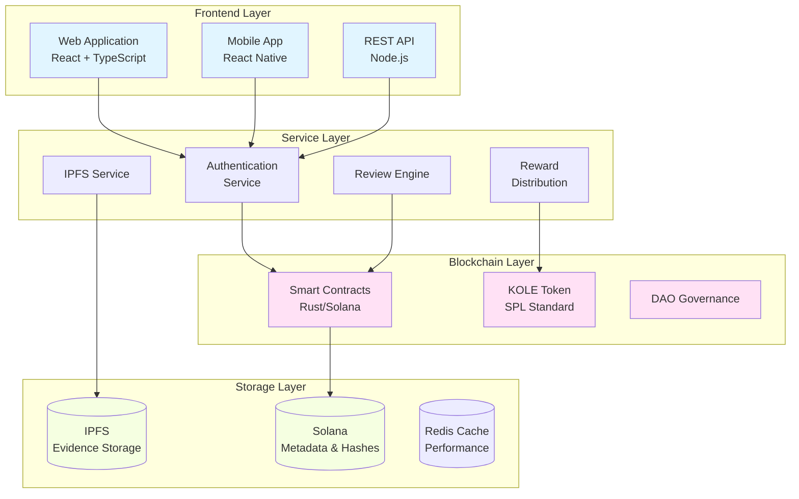

# KOLE - KOL Suistimal İfşa Platformu

<div align="center">


[](LICENSE)

**Şeffaf KOL Hesap Verilebilirliği için Merkeziyetsiz Ekosistem**

[Web Sitesi](https://kolexposure.com) | [Beyaz Kitap](docs/whitepapers/Whitepaper_TR.md) | [English](README.md) | [中文](README_CN.md) | [Topluluk](https://t.me/kolexposure)

[](https://x.com/kolexposure) [](https://x.com/TODO_dream)

</div>

---

## 🎯 Misyon

KOLE, blokzincir teknolojisini kullanarak Kilit Görüş Liderlerinin (KOL) suistimallerini ifşa etmek ve kalıcı olarak kaydetmek için merkeziyetsiz bir denetim ekosistemi inşa ediyor. Şeffaf topluluk yönetimi ve değiştirilemez kanıt depolama yoluyla, dijital etki ekonomisinde dolandırıcılık davranışlarından yatırımcıları ve tüketicileri koruyoruz.

## 🌟 Ana Özellikler

### 🔐 **Değiştirilemez Kanıt Depolama**
- **Blokzincir tabanlı**: Tüm kanıtlar Solana blokzincirinde kalıcı olarak depolanır
- **IPFS Entegrasyonu**: Dağıtık depolama kanıt erişilebilirliğini garanti eder
- **Kurcalama karşıtı**: Kriptografik hash kanıt manipülasyonunu önler
- **Halka açık doğrulama**: Herkes zincir üzerinde kanıt gerçekliğini doğrulayabilir

### ⚖️ **Merkeziyetsiz İnceleme Sistemi**
- **Topluluk jürisi**: Çoklu inceleyici konsensüs mekanizması
- **Bağımsız incelemeler**: Kör inceleme süreci gizli anlaşmayı önler
- **Ciddiyet derecelendirmesi**: Suistimal için 5 seviyeli sınıflandırma sistemi
- **Oybirliği onayı**: Sertifikasyon için tüm inceleyicilerin anlaşması gerekir

### 💰 **Token Ekonomisi (KOLE)**
- **Toplam Arz**: 1,000,000,000 KOLE (Sabit)
- **Ödül Sistemi**: Kanıt sunumu ve incelemeyi teşvik eder
- **Şanslı Çekiliş**: Token sahipleri için saatlik ve günlük ödüller
- **Deflasyonist**: Düzenli geri alım ve yakma mekanizmaları

### 🏛️ **DAO Yönetimi**
- **Topluluk odaklı**: Token sahipleri platform kararlarında oy kullanır
- **Şeffaf**: Tüm yönetim süreçleri zincir üzerinde
- **Aşamalı merkeziyetsizleşme**: Tam DAO kontrolüne kademeli geçiş

## 📊 Platform İstatistikleri

| Metrik | Değer |
|--------|-------|
| **Blokzincir** | Solana |
| **İşlem Hızı** | 65,000 TPS |
| **İşlem Maliyeti** | < $0.01 |
| **Token Standardı** | SPL |
| **Kontrat Adresi (CA)** | `2EL3kJNYbgoqvtK4eyfNxgYiwm2V7B84kfMd1KLRpump` |
| **DEX** | [Raydium'da Görüntüle](https://raydium.io/swap/?inputCurrency=sol&outputCurrency=2EL3kJNYbgoqvtK4eyfNxgYiwm2V7B84kfMd1KLRpump) |
| **Explorer** | [Solscan'da Görüntüle](https://solscan.io/token/2EL3kJNYbgoqvtK4eyfNxgYiwm2V7B84kfMd1KLRpump) |

## 🏗️ Teknik Mimari

> ⚠️ **Mobil Kullanıcılar**: Diyagramlar mobilde oluşmayabilir. [Metin sürümünü burada görüntüleyin](docs/DIAGRAMS_VIEWER.md)



## 💎 Tokenomics

### Dağıtım
| Tahsis | Yüzde | Vesting |
|--------|-------|---------|
| **Kullanıcı Ödülleri** | %40 | Günlük kilidi açma %0.5 |
| **Şanslı Çekiliş Havuzu** | %40 | Tamamen dolaşımda |
| **Ekosistem Geliştirme** | %10 | Aylık kilidi açma %1 |
| **Takım ve Danışmanlar** | %10 | Aylık kilidi açma %2 |

### Ödül Yapısı
| Eylem | KOLE Ödülü |
|-------|-------------|
| **İlk Rapor** | 100,000 KOLE |
| **Tamamlayıcı Kanıt** | 20,000 KOLE |
| **İnceleme Katılımı** | 50,000 KOLE |

### Şanslı Çekiliş Sistemi
| Tür | Sıklık | Ödül Havuzu | Dağıtım |
|-----|-------|-------------|---------|
| **Normal** | Saatlik | 10 SOL | 5:3:2 oranı (3 kazanan) |
| **Süper** | Günlük 00:00 SGT | 66 SOL | 40:20:6 oranı (3 kazanan) |

**Uygunluk**: En az 1 saat boyunca 300,000+ KOLE tutma

## 🗺️ Yol Haritası

### ✅ Faz 1: Temel (2025 Q1)
- [x] Beyaz kitap yayını
- [x] Çekirdek takım oluşumu
- [x] Teknik mimari tasarımı
- [x] Akıllı kontrat geliştirme

### ✅ Faz 2: Lansman (2025 Q2)
- [x] Mainnet dağıtımı
- [x] Beta test
- [x] Resmi web sitesi lansmanı
- [x] Token ihracı (KOLE)

### 🚀 Faz 3: Genişleme (2025 Q3)
- [x] DEX listelenmesi
- [ ] CEX listeleme başvurusu
- [ ] Ortaklık geliştirme
- [ ] Mobil uygulama yayını

### 🌍 Faz 4: Küreselleşme (2025 Q4)
- [ ] Çok dilli destek
- [ ] Cross-chain köprüleri
- [ ] AI destekli inceleme sistemi
- [ ] Tam DAO geçişi

### 🔮 Faz 5: Gelecek (2026+)
- [ ] Endüstri standardı oluşturma
- [ ] Düzenleyici uyum çerçevesi
- [ ] Web3 kimlik entegrasyonu
- [ ] Metaverse genişlemesi

## 🚀 Başlarken

### Ön Koşullar
- Node.js 16+
- Solana CLI araçları
- Git

### Kurulum
```bash
# Deposu klonla
git clone https://github.com/qdwqwdqwdqwd/KOLE.git
cd KOLE

# Bağımlılıkları yükle
npm install

# Ortam değişkenlerini ayarla
cp .env.example .env
# .env dosyasını yapılandırmanızla düzenleyin

# Geliştirme sunucusunu çalıştır
npm run dev
```

### Dokümantasyon
- 📖 [İngilizce Beyaz Kitap](docs/whitepapers/Whitepaper_EN.md)
- 📖 [中文白皮书](docs/whitepapers/Whitepaper_CN.md)
- 📖 [Topluluk Rehberi](docs/社区资料.md)
- 📖 [API Dokümantasyonu](docs/api.md)

## 🤝 Katkıda Bulunma

Topluluktan gelen katkıları memnuniyetle karşılıyoruz! Başlamak için [Katkı Rehberimizi](CONTRIBUTING.md) okuyun.

### Nasıl Katkıda Bulunulur
1. Depoyu fork edin
2. Özellik dalınızı oluşturun (`git checkout -b feature/AmazingFeature`)
3. Değişikliklerinizi commit edin (`git commit -m 'Add some AmazingFeature'`)
4. Dala push edin (`git push origin feature/AmazingFeature`)
5. Pull Request açın

### Geliştirme Yönergeleri
- Kod stil rehberini takip edin
- Yeni özellikler için testler yazın
- Gerektiğinde dokümantasyonu güncelleyin
- PR göndermeden önce tüm testlerin geçtiğinden emin olun

## 🌐 Topluluk ve Destek

### Resmi Kanallar
- 🌐 **Web Sitesi**: [https://kolexposure.com](https://kolexposure.com)
- 💬 **Telegram**: [https://t.me/kolexposure](https://t.me/kolexposure)
- 🐦 **Twitter/X**:
  - Ana: [@kolexposure](https://x.com/kolexposure)
  - Güncellemeler: [@TODO_dream](https://x.com/TODO_dream)
- 🎮 **Discord**: [Sunucuya Katıl](https://discord.com/invite/sZf44CseTf)
- 📧 **E-posta**: support@kolexposure.com
- 💰 **CA**: `2EL3kJNYbgoqvtK4eyfNxgYiwm2V7B84kfMd1KLRpump`

### Kaynaklar
- [SSS](docs/FAQ.md)
- [Eğitimler](docs/tutorials/)
- [Video Rehberleri](https://youtube.com/@kolexposure)
- [Blog](https://blog.kolexposure.com)

## 📄 Lisans

Bu proje MIT Lisansı altında lisanslanmıştır - ayrıntılar için [LICENSE](LICENSE) dosyasına bakın.

## ⚠️ Feragatname

**Yatırım Riski**: Dijital varlık yatırımı yüksek risk içerir. Katılmadan önce lütfen risk toleransınızı dikkatli bir şekilde değerlendirin.

**Platform Durumu**: KOLE aktif geliştirme aşamasındadır. Özellikler, tokenomics ve yönetim mekanizmaları değişebilir.

**Mali Tavsiye Değildir**: Bu dokümantasyon yalnızca bilgilendirme amaçlıdır ve yatırım tavsiyesi oluşturmaz.

**Düzenleyici Uyum**: Kullanıcılar yerel yasa ve düzenlemelere uymaktan sorumludur.

## 🙏 Teşekkürler

- Blokzincir altyapısı için Solana Vakfı'na
- Dağıtık depolama çözümleri için IPFS topluluğuna
- Sürekli destek ve geri bildirim için topluluk üyelerimize
- Bu projeyi şekillendirmeye yardımcı olan tüm katkıda bulunanlara

---

<div align="center">

**Dijital Etki için Şeffaf Bir Gelecek İnşa Etmek**

© 2025 KOLE Platform | Powered by Blockchain Technology

</div>