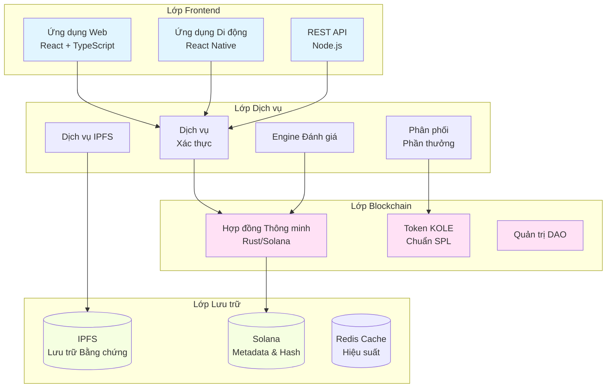

# KOLE - Nền Tảng Phơi Bày Hành Vi Sai Trái Của KOL

<div align="center">


[](LICENSE)

**Một Hệ Sinh Thái Phi Tập Trung Cho Sự Minh Bạch và Trách Nhiệm KOL**

[Website](https://kolexposure.com) | [Whitepaper](docs/whitepapers/Whitepaper_VI.md) | [Cộng Đồng](https://t.me/kolexposure)

[](https://x.com/kolexposure) [](https://x.com/TODO_dream)

### 🌍 Ngôn Ngữ Có Sẵn
[🇬🇧 English](README.md) | [🇨🇳 中文](README_CN.md) | [🇯🇵 日本語](README_JP.md) | [🇷🇺 Русский](README_RU.md) | [🇪🇸 Español](README_ES.md) | [🇰🇷 한국어](README_KR.md) | [🇸🇦 العربية](README_AR.md) | [🇹🇷 Türkçe](README_TR.md) | [🇧🇷 Português](README_PT.md) | [🇫🇷 Français](README_FR.md) | [🇩🇪 Deutsch](README_DE.md) | [🇮🇳 हिंदी](README_HI.md) | [🇮🇱 עברית](README_HE.md) | [🇻🇳 Tiếng Việt](README_VI.md) | [🇹🇭 ไทย](README_TH.md)

</div>

---

## 🎯 Sứ Mệnh

KOLE đang xây dựng một hệ sinh thái giám sát phi tập trung tận dụng công nghệ blockchain để phơi bày và ghi lại vĩnh viễn hành vi sai trái của các Nhà Lãnh Đạo Ý Kiến Chính (KOL). Thông qua quản trị cộng đồng minh bạch và lưu trữ bằng chứng bất biến, chúng tôi bảo vệ các nhà đầu tư và người tiêu dùng khỏi hành vi lừa đảo trong nền kinh tế ảnh hưởng số.

## 🌟 Tính Năng Chính

### 🔐 **Lưu Trữ Bằng Chứng Bất Biến**
- **Dựa trên blockchain**: Tất cả bằng chứng được lưu trữ vĩnh viễn trên blockchain Solana
- **Tích hợp IPFS**: Lưu trữ phân tán đảm bảo tính khả dụng của bằng chứng
- **Chống giả mạo**: Hash mã hóa ngăn chặn việc thao túng bằng chứng
- **Xác minh công khai**: Bất kỳ ai cũng có thể xác minh tính xác thực của bằng chứng trên chuỗi

### ⚖️ **Hệ Thống Đánh Giá Phi Tập Trung**
- **Bồi thẩm đoàn cộng đồng**: Cơ chế đồng thuận đa người đánh giá
- **Đánh giá độc lập**: Quy trình đánh giá mù ngăn chặn thông đồng
- **Xếp hạng mức độ nghiêm trọng**: Hệ thống phân loại 5 cấp độ cho hành vi sai trái
- **Phê duyệt đồng lòng**: Tất cả người đánh giá phải đồng ý để chứng nhận

### 💰 **Kinh Tế Token (KOLE)**
- **Tổng cung**: 1,000,000,000 KOLE (Cố định)
- **Hệ thống phần thưởng**: Khuyến khích nộp bằng chứng và đánh giá
- **Quay số may mắn**: Phần thưởng hàng giờ và hàng ngày cho chủ sở hữu token
- **Giảm phát**: Cơ chế mua lại và đốt thường xuyên

### 🏛️ **Quản Trị DAO**
- **Điều hành bởi cộng đồng**: Chủ sở hữu token bỏ phiếu về các quyết định nền tảng
- **Minh bạch**: Tất cả quy trình quản trị trên chuỗi
- **Phi tập trung dần dần**: Chuyển đổi từ từ sang kiểm soát DAO hoàn toàn

## 📊 Thống Kê Nền Tảng

| Chỉ Số | Giá Trị |
|---------|---------|
| **Blockchain** | Solana |
| **Tốc độ giao dịch** | 65,000 TPS |
| **Chi phí giao dịch** | < $0.01 |
| **Chuẩn token** | SPL |
| **Địa chỉ hợp đồng (CA)** | `2EL3kJNYbgoqvtK4eyfNxgYiwm2V7B84kfMd1KLRpump` |
| **DEX** | [Xem trên Raydium](https://raydium.io/swap/?inputCurrency=sol&outputCurrency=2EL3kJNYbgoqvtK4eyfNxgYiwm2V7B84kfMd1KLRpump) |
| **Explorer** | [Xem trên Solscan](https://solscan.io/token/2EL3kJNYbgoqvtK4eyfNxgYiwm2V7B84kfMd1KLRpump) |

## 🏗️ Kiến Trúc Kỹ Thuật

> ⚠️ **Người dùng di động**: Biểu đồ có thể không hiển thị trên di động. [Xem phiên bản văn bản tại đây](docs/DIAGRAMS_VIEWER.md)



## 💎 Tokenomics

### Phân bổ
| Phân bổ | Phần trăm | Vesting |
|---------|-----------|---------|
| **Phần thưởng người dùng** | 40% | Mở khóa hàng ngày 0.5% |
| **Pool quay số** | 40% | Lưu thông hoàn toàn |
| **Phát triển hệ sinh thái** | 10% | Mở khóa hàng tháng 1% |
| **Đội ngũ & cố vấn** | 10% | Mở khóa hàng tháng 2% |

### Cấu Trúc Phần Thưởng
| Hành động | Phần thưởng KOLE |
|-----------|------------------|
| **Báo cáo đầu tiên** | 100,000 KOLE |
| **Bằng chứng bổ sung** | 20,000 KOLE |
| **Tham gia đánh giá** | 50,000 KOLE |

### Hệ Thống Quay Số May Mắn
| Loại | Tần suất | Pool giải thưởng | Phân phối |
|------|-----------|------------------|-----------|
| **Thường** | Mỗi giờ | 10 SOL | Tỷ lệ 5:3:2 (3 người thắng) |
| **Siêu** | Hàng ngày 00:00 SGT | 66 SOL | Tỷ lệ 40:20:6 (3 người thắng) |

**Điều kiện**: Giữ 300,000+ KOLE ít nhất 1 giờ

## 🗺️ Lộ Trình

### ✅ Giai đoạn 1: Nền tảng (Q1 2025)
- [x] Phát hành whitepaper
- [x] Thành lập đội ngũ cốt lõi
- [x] Thiết kế kiến trúc kỹ thuật
- [x] Phát triển hợp đồng thông minh

### ✅ Giai đoạn 2: Ra mắt (Q2 2025)
- [x] Triển khai mainnet
- [x] Thử nghiệm beta
- [x] Ra mắt website chính thức
- [x] Phát hành token (KOLE)

### 🚀 Giai đoạn 3: Mở rộng (Q3 2025)
- [x] Niêm yết DEX
- [ ] Đăng ký niêm yết CEX
- [ ] Phát triển đối tác
- [ ] Phát hành ứng dụng di động

### 🌍 Giai đoạn 4: Toàn cầu hóa (Q4 2025)
- [ ] Hỗ trợ đa ngôn ngữ
- [ ] Cầu nối cross-chain
- [ ] Hệ thống đánh giá hỗ trợ AI
- [ ] Chuyển đổi DAO hoàn toàn

### 🔮 Giai đoạn 5: Tương lai (2026+)
- [ ] Thiết lập tiêu chuẩn ngành
- [ ] Khung tuân thủ quy định
- [ ] Tích hợp danh tính Web3
- [ ] Mở rộng metaverse

## 🚀 Bắt Đầu

### Yêu cầu tiên quyết
- Node.js 16+
- Công cụ CLI Solana
- Git

### Cài đặt
```bash
# Clone repository
git clone https://github.com/qdwqwdqwdqwd/KOLE.git
cd KOLE

# Cài đặt dependencies
npm install

# Thiết lập biến môi trường
cp .env.example .env
# Chỉnh sửa .env với cấu hình của bạn

# Chạy server phát triển
npm run dev
```

### Tài liệu
- 📖 [Whitepaper tiếng Anh](docs/whitepapers/Whitepaper_EN.md)
- 📖 [白皮书中文版](docs/whitepapers/Whitepaper_CN.md)
- 📖 [Hướng dẫn cộng đồng](docs/社区资料.md)
- 📖 [Tài liệu API](docs/api.md)

## 🤝 Đóng Góp

Chúng tôi hoan nghênh sự đóng góp từ cộng đồng! Vui lòng đọc [Hướng dẫn Đóng góp](CONTRIBUTING.md) để bắt đầu.

### Cách Đóng Góp
1. Fork repository
2. Tạo feature branch của bạn (`git checkout -b feature/TinhNangTuyetVoi`)
3. Commit các thay đổi (`git commit -m 'Thêm TinhNangTuyetVoi'`)
4. Push lên branch (`git push origin feature/TinhNangTuyetVoi`)
5. Mở Pull Request

### Hướng Dẫn Phát Triển
- Tuân theo hướng dẫn style code
- Viết test cho các tính năng mới
- Cập nhật tài liệu khi cần thiết
- Đảm bảo tất cả test đều pass trước khi submit PR

## 🌐 Cộng Đồng & Hỗ Trợ

### Kênh Chính Thức
- 🌐 **Website**: [https://kolexposure.com](https://kolexposure.com)
- 💬 **Telegram**: [https://t.me/kolexposure](https://t.me/kolexposure)
- 🐦 **Twitter/X**:
  - Chính: [@kolexposure](https://x.com/kolexposure)
  - Cập nhật: [@TODO_dream](https://x.com/TODO_dream)
- 🎮 **Discord**: [Tham gia Server](https://discord.com/invite/sZf44CseTf)
- 📧 **Email**: support@kolexposure.com
- 💰 **CA**: `2EL3kJNYbgoqvtK4eyfNxgYiwm2V7B84kfMd1KLRpump`

### Tài Nguyên
- [FAQ](docs/FAQ.md)
- [Hướng dẫn](docs/tutorials/)
- [Video hướng dẫn](https://youtube.com/@kolexposure)
- [Blog](https://blog.kolexposure.com)

## 📄 Giấy Phép

Dự án này được cấp phép theo Giấy phép MIT - xem file [LICENSE](LICENSE) để biết chi tiết.

## ⚠️ Tuyên Bố Miễn Trừ

**Rủi ro đầu tư**: Đầu tư tài sản số có rủi ro cao. Vui lòng đánh giá cẩn thận khả năng chấp nhận rủi ro trước khi tham gia.

**Trạng thái nền tảng**: KOLE đang trong quá trình phát triển tích cực. Các tính năng, tokenomics và cơ chế quản trị có thể thay đổi.

**Không phải lời khuyên tài chính**: Tài liệu này chỉ mang tính chất thông tin và không cấu thành lời khuyên đầu tư.

**Tuân thủ quy định**: Người dùng có trách nhiệm tuân thủ luật pháp và quy định địa phương.

## 🙏 Lời Cảm Ơn

- Solana Foundation cho cơ sở hạ tầng blockchain
- Cộng đồng IPFS cho các giải pháp lưu trữ phân tán
- Các thành viên cộng đồng của chúng tôi vì sự hỗ trợ và phản hồi liên tục
- Tất cả những người đóng góp đã giúp định hình dự án này

---

<div align="center">

**Xây Dựng Tương Lai Minh Bạch Cho Ảnh Hưởng Số**

© 2025 KOLE Platform | Powered by Blockchain Technology

</div>