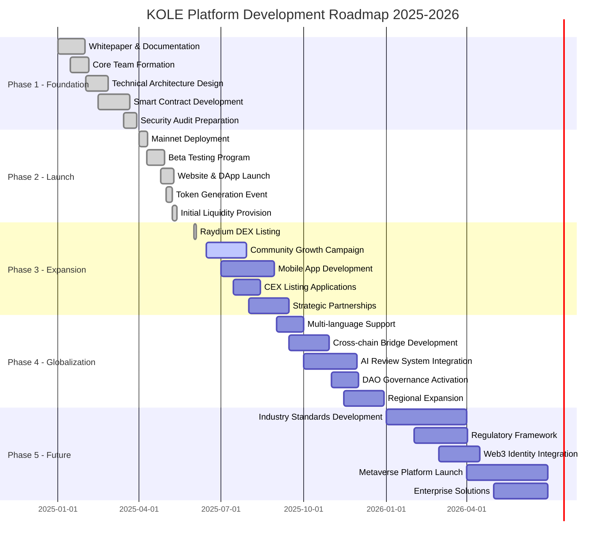
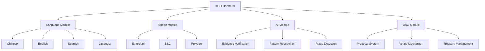
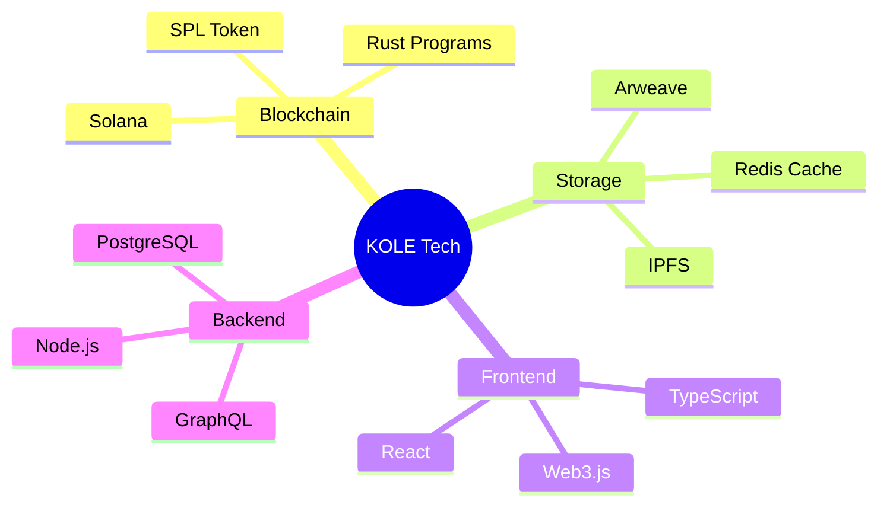
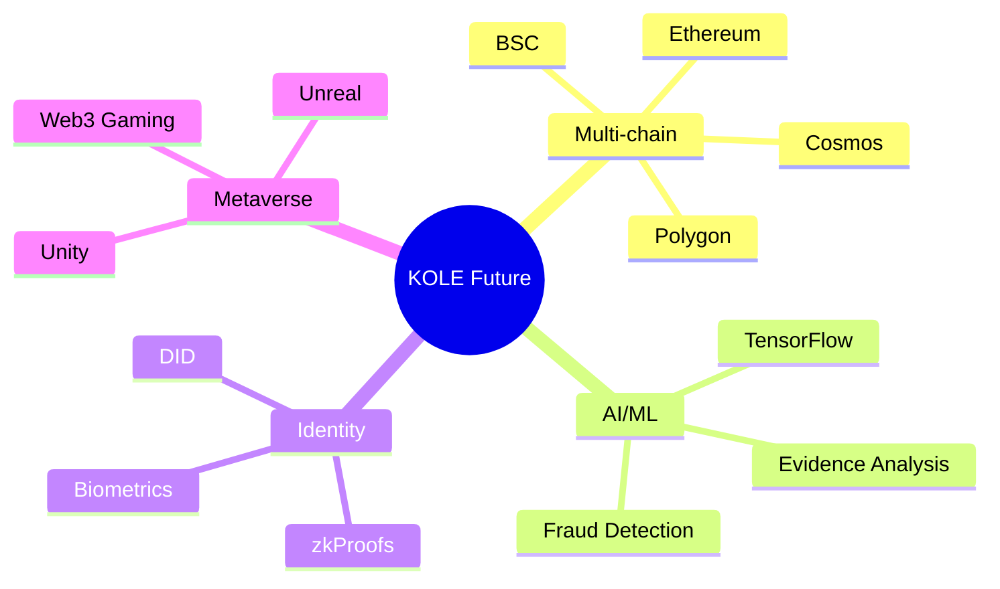
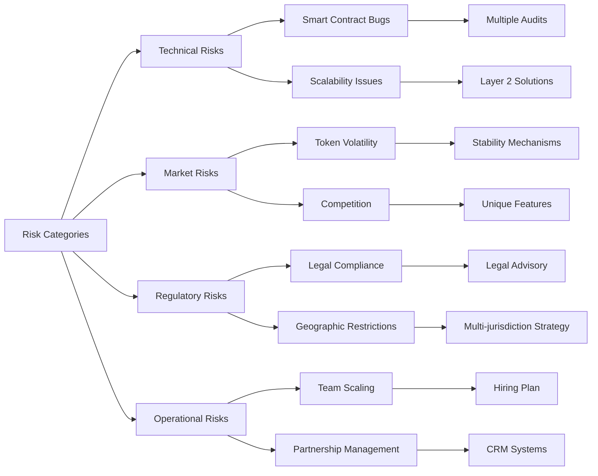
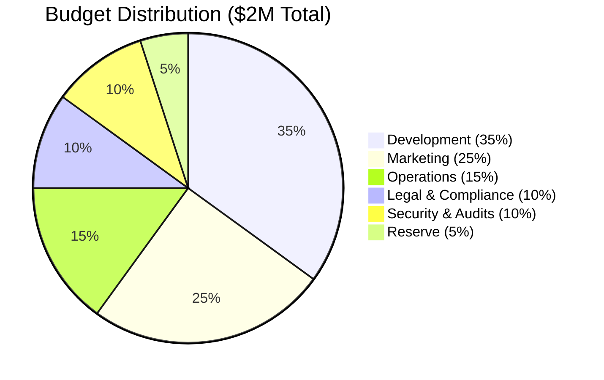
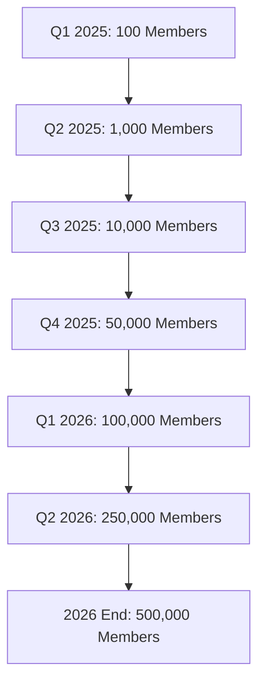

# KOLE Platform Development Roadmap

## Vision

To become the leading decentralized platform for transparent KOL accountability, leveraging blockchain technology to create an immutable record of misconduct and protect the digital economy from fraudulent influencer behavior.

## Development Timeline

## Detailed Milestones

### ✅ Phase 1: Foundation (Q1 2025) - **COMPLETED**

#### Objectives
Establish the foundational infrastructure and technical architecture for the KOLE platform.

#### Key Deliverables

| Milestone | Status | Completion Date | Details |
|-----------|--------|-----------------|---------|
| Whitepaper V1.0 | ✅ Complete | Jan 15, 2025 | Comprehensive platform documentation |
| Team Assembly | ✅ Complete | Jan 25, 2025 | 8 core team members recruited |
| Technical Design | ✅ Complete | Feb 20, 2025 | Solana + IPFS architecture finalized |
| Smart Contracts | ✅ Complete | Mar 20, 2025 | Core contracts developed and tested |
| Security Prep | ✅ Complete | Mar 30, 2025 | Pre-audit review completed |

### ✅ Phase 2: Launch (Q2 2025) - **COMPLETED**

#### Objectives
Deploy the platform to mainnet and establish initial user base and liquidity.

#### Key Deliverables

| Milestone | Status | Completion Date | Details |
|-----------|--------|-----------------|---------|
| Mainnet Deploy | ✅ Complete | Apr 10, 2025 | Solana mainnet launch successful |
| Beta Testing | ✅ Complete | Apr 30, 2025 | 500+ beta testers participated |
| Platform Launch | ✅ Complete | May 10, 2025 | Web app and API live |
| TGE | ✅ Complete | May 7, 2025 | 1B KOLE tokens generated |
| Initial Liquidity | ✅ Complete | May 13, 2025 | 50M KOLE + 5000 SOL locked |

### 🚀 Phase 3: Expansion (Q3 2025) - **IN PROGRESS**

#### Objectives
Scale the platform, increase adoption, and establish market presence.

#### Key Deliverables

| Milestone | Status | Target Date | Details |
|-----------|--------|-------------|---------|
| DEX Listings | ✅ Complete | Jun 3, 2025 | Listed on Raydium, Jupiter |
| Community Growth | 🔄 In Progress | Jul 30, 2025 | Target: 10,000+ active users |
| Mobile Apps | 📅 Planned | Aug 30, 2025 | iOS and Android native apps |
| CEX Applications | 📅 Planned | Aug 15, 2025 | Apply to top 10 exchanges |
| Partnerships | 🔄 In Progress | Sep 15, 2025 | 5+ strategic partners targeted |

#### Current Focus Areas
- Community engagement and growth
- Mobile app development (React Native)
- Exchange listing preparations
- Partnership negotiations with KOL agencies

### 🌍 Phase 4: Globalization (Q4 2025) - **PLANNED**

#### Objectives
Expand globally, implement advanced features, and transition to full DAO governance.

#### Key Deliverables

| Milestone | Target Date | Priority | Details |
|-----------|-------------|----------|---------|
| Multi-language | Sep 30, 2025 | High | Support 10+ languages |
| Cross-chain Bridges | Oct 30, 2025 | High | ETH, BSC, Polygon bridges |
| AI Review System | Nov 30, 2025 | Medium | ML-powered evidence analysis |
| DAO Activation | Dec 1, 2025 | High | Full community governance |
| Regional Expansion | Dec 30, 2025 | Medium | Focus on Asia, Europe, Americas |

#### Technical Specifications

### 🔮 Phase 5: Future (2026+) - **VISION**

#### Objectives
Establish KOLE as the industry standard for KOL accountability and expand into new dimensions.

#### Long-term Goals

| Initiative | Timeline | Impact | Description |
|------------|----------|--------|-------------|
| Industry Standards | Q1-Q2 2026 | High | Define global KOL conduct standards |
| Regulatory Framework | Q2-Q3 2026 | Critical | Work with regulators for compliance |
| Web3 Identity | Q3 2026 | Medium | Integrate DID solutions |
| Metaverse Platform | Q4 2026 | High | Virtual accountability ecosystem |
| Enterprise Solutions | Q4 2026+ | High | B2B verification services |

## Technology Roadmap

### Current Stack (2025)

### Future Stack (2026+)

## Key Performance Indicators (KPIs)

### Platform Metrics

| Metric | Current | Q3 2025 Target | Q4 2025 Target | 2026 Target |
|--------|---------|----------------|----------------|-------------|
| Active Users | 1,000 | 10,000 | 50,000 | 200,000 |
| Evidence Submissions | 50/month | 500/month | 2,000/month | 10,000/month |
| Token Holders | 500 | 5,000 | 20,000 | 100,000 |
| Platform Revenue | $5k/month | $50k/month | $200k/month | $1M/month |
| Partner Integrations | 2 | 10 | 25 | 100 |

### Technical Metrics

| Metric | Current | Target | Status |
|--------|---------|--------|--------|
| Transaction Speed | 65,000 TPS | Maintain | ✅ Optimal |
| Uptime | 99.9% | 99.99% | 🔄 Improving |
| Response Time | <500ms | <200ms | 🔄 Optimizing |
| Storage Redundancy | 3x | 5x | 📅 Planned |
| Security Score | A | A+ | 🔄 Ongoing |

## Risk Management

### Identified Risks & Mitigation

## Budget Allocation

### Development Budget (2025-2026)

## Partnership Strategy

### Target Partners

| Category | Priority | Status | Target Companies |
|----------|----------|--------|------------------|
| KOL Agencies | High | 🔄 Negotiating | Top 10 agencies in Asia |
| Blockchain Projects | High | ✅ 2 Secured | Solana ecosystem projects |
| Media Platforms | Medium | 📅 Planned | YouTube, TikTok integrations |
| Legal Firms | High | 🔄 In Progress | Blockchain-specialized firms |
| Security Firms | Critical | ✅ Engaged | CertiK, Halborn |

## Community Milestones

### Growth Targets

## Success Metrics

### Definition of Success

1. **Short-term (2025)**
   - ✅ Successful mainnet launch
   - ✅ 1,000+ active users
   - 🔄 First major KOL case exposed
   - 📅 Mobile app launch

2. **Medium-term (2026)**
   - 📅 100,000+ platform users
   - 📅 $10M+ in platform volume
   - 📅 Industry recognition
   - 📅 Regulatory compliance achieved

3. **Long-term (2027+)**
   - 📅 Global standard for KOL accountability
   - 📅 1M+ active users
   - 📅 Multi-chain presence
   - 📅 Profitable and sustainable

## Regular Updates

This roadmap is reviewed and updated monthly. Last update: **January 2025**

### How to Track Progress

1. **Monthly Reports**: Published on our blog
2. **Community Calls**: Bi-weekly on Discord
3. **GitHub**: Development progress in real-time
4. **Dashboard**: [status.kolexposure.com](https://status.kolexposure.com)

## Get Involved

### How You Can Contribute

- **Developers**: Contribute to our open-source codebase
- **Community**: Help spread awareness and grow our user base
- **Investors**: Partner with us for long-term success
- **KOLs**: Join us in creating a more transparent ecosystem

### Contact

- **Email**: roadmap@kolexposure.com
- **Telegram**: [https://t.me/kolexposure](https://t.me/kolexposure)
- **Discord**: [Join our server](https://discord.com/invite/sZf44CseTf)

---

*This roadmap is a living document and subject to change based on market conditions, technological developments, and community feedback.*