# KOLE Platform Governance Documentation

## Overview

The KOLE platform implements a progressive decentralization model, transitioning from initial core team management to full DAO (Decentralized Autonomous Organization) governance.

## Governance Structure


## Voting Power Distribution


## Governance Process

### 1. Proposal Lifecycle

```mermaid
stateDiagram-v2
    [*] --> Draft: Create Proposal
    Draft --> Discussion: Submit for Review
    Discussion --> Voting: Meet Threshold
    Discussion --> Archived: Insufficient Support
    Voting --> Passed: Majority Approve
    Voting --> Failed: Majority Reject
    Passed --> Execution: Time Lock Expired
    Execution --> Implemented: Contract Updated
    Implemented --> [*]
    Failed --> [*]
    Archived --> [*]

    note right of Discussion
        5-day discussion period
        Requires 100K KOLE support
    end note

    note right of Voting
        3-day voting period
        Quorum: 10% of supply
    end note

    note right of Execution
        2-day timelock for
        security review
    end note
```



### 2. Voting Mechanisms

#### Token-Based Voting

| Holdings | Base Votes | Multiplier | Max Votes |
|----------|------------|------------|-----------|
| 100,000+ KOLE | 1 | 1.0x | 100,000 |
| 500,000+ KOLE | 5 | 1.2x | 600,000 |
| 1,000,000+ KOLE | 10 | 1.5x | 1,500,000 |
| 5,000,000+ KOLE | 50 | 2.0x | 10,000,000 |

#### Quadratic Voting

For certain proposals, quadratic voting is used to prevent whale dominance:

```
Voting Power = √(Token Balance)
```

### 3. Proposal Types


## Decision Making Framework

### Approval Thresholds


### Quorum Requirements

| Proposal Type | Minimum Participation | Token Threshold |
|--------------|----------------------|-----------------|
| Standard | 10% of circulating supply | 100M KOLE |
| Emergency | 5% of circulating supply | 50M KOLE |
| Constitutional | 20% of circulating supply | 200M KOLE |

## Governance Roles

### 1. Token Holders


### 2. Council Members

Elected representatives who oversee day-to-day operations:

- **Election**: Annual, token-weighted voting
- **Size**: 7 members
- **Powers**: Execute approved proposals, emergency actions
- **Limitations**: Cannot modify core contracts without vote

### 3. Technical Committee

Specialized group for technical decisions:

- **Composition**: 5 technical experts
- **Selection**: Appointed by Council, approved by community
- **Responsibilities**: Code review, security audits, upgrades

## Governance Incentives

### Participation Rewards


## Treasury Management

### Fund Allocation


### Spending Authority

| Amount | Approval Required | Timelock |
|--------|------------------|----------|
| < 10,000 KOLE | Council (3/7) | None |
| 10,000 - 100,000 KOLE | Council (5/7) | 24 hours |
| 100,000 - 1M KOLE | Community Vote (51%) | 48 hours |
| > 1M KOLE | Community Vote (66%) | 7 days |

## Governance Attack Prevention

### Security Measures


## Progressive Decentralization Roadmap

### Phase 1: Foundation (Current)
- Core team maintains admin keys
- Community feedback via Discord/Forum
- Advisory votes on major decisions

### Phase 2: Partial DAO (Q3 2025)
- Council elected by token holders
- Community proposals enabled
- Treasury partially controlled by DAO

### Phase 3: Full DAO (Q4 2025)
- Admin keys transferred to DAO
- All decisions via governance
- Fully decentralized operations

### Phase 4: Autonomous (2026+)
- Self-executing governance
- Cross-chain governance
- AI-assisted proposal analysis

## Governance Metrics

### Key Performance Indicators

| Metric | Target | Current |
|--------|--------|---------|
| Proposal Participation Rate | >15% | 12% |
| Average Voting Power | <5% per address | 3.2% |
| Successful Proposals | >60% | 58% |
| Time to Implementation | <7 days | 9 days |
| Council Approval Rating | >70% | 75% |

## Emergency Procedures

### Crisis Response Protocol


## Dispute Resolution

### Arbitration Process

1. **Initial Dispute**: Raised in governance forum
2. **Mediation**: Council attempts resolution
3. **Community Vote**: If mediation fails
4. **Implementation**: Binding decision executed

### Appeal Mechanism

- Appeals require 5% of token supply support
- Review by independent arbitrators
- Final decision by super-majority (80%)

## Governance Upgrades

### Amendment Process


## Tools and Platforms

### Governance Infrastructure

- **Voting Platform**: Snapshot + Custom DAO contracts
- **Discussion Forum**: Discourse
- **Proposal Repository**: GitHub
- **Analytics Dashboard**: Dune Analytics
- **Communication**: Discord + Telegram

### Integration Points


## Legal Compliance

### Regulatory Considerations

- Governance tokens are utility tokens, not securities
- DAO operates as decentralized protocol
- Compliance with local jurisdiction requirements
- Regular legal review of governance changes

## Contact and Support

### Governance Resources

- **Website**: [https://kolexposure.com](https://kolexposure.com)
- **Documentation**: [https://docs.kolexposure.com/governance](https://docs.kolexposure.com/governance)
- **Forum**: [https://gov.kolexposure.com](https://gov.kolexposure.com)
- **Telegram**: [https://t.me/kolexposure](https://t.me/kolexposure)
- **Twitter/X**: [@kolexposure](https://x.com/kolexposure) | [@TODO_dream](https://x.com/TODO_dream)
- **Discord**: [Governance Channel](https://discord.com/invite/sZf44CseTf)
- **Email**: governance@kolexposure.com

---

*This governance framework is subject to change through community consensus. Last updated: January 2025*