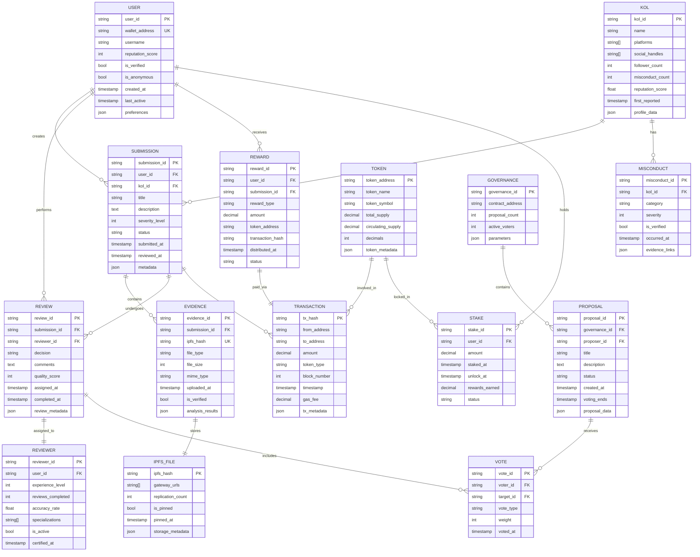
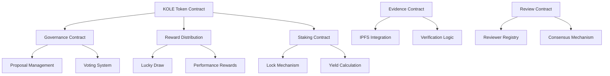
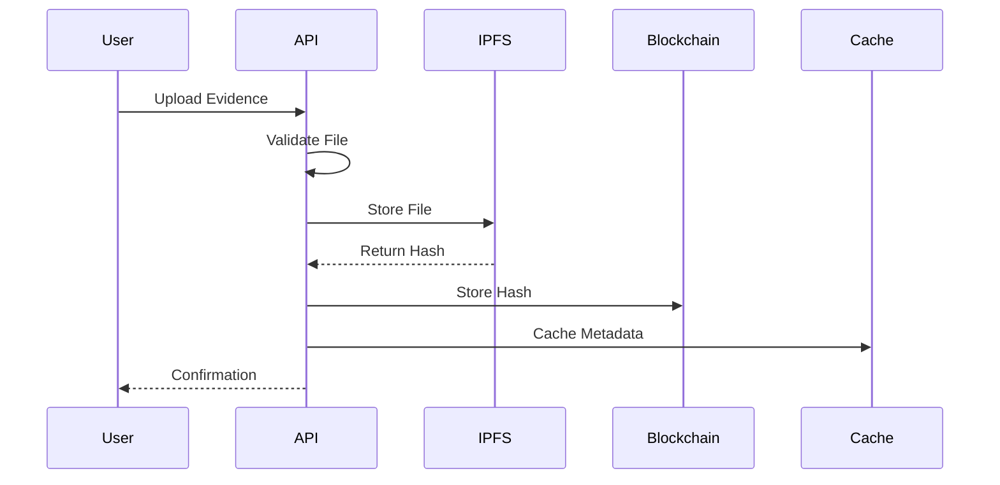
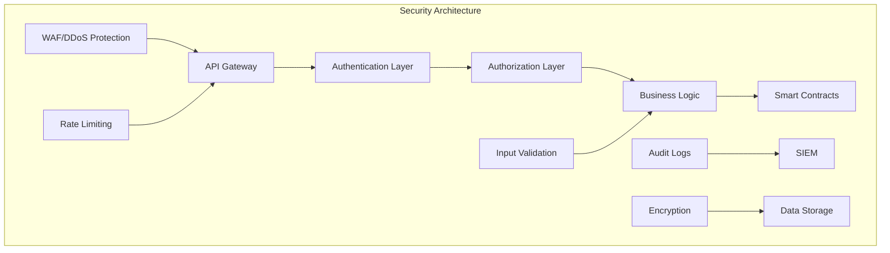
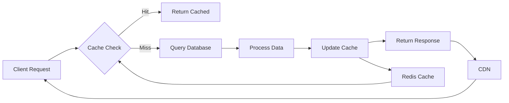

# KOLE Platform Technical Documentation

## Table of Contents

1. [System Architecture](#system-architecture)
2. [Data Model](#data-model)
3. [Smart Contracts](#smart-contracts)
4. [API Reference](#api-reference)
5. [Storage Architecture](#storage-architecture)
6. [Security Implementation](#security-implementation)
7. [Performance Optimization](#performance-optimization)
8. [Deployment Guide](#deployment-guide)

## System Architecture

### Overview

The KOLE platform is built on a microservices architecture leveraging blockchain technology for immutability and distributed storage for evidence preservation.

### Technology Stack

| Layer | Technology | Purpose |
|-------|------------|---------|
| Blockchain | Solana | High-performance smart contract execution |
| Smart Contracts | Rust (Anchor Framework) | Business logic and token management |
| Storage | IPFS + Arweave | Distributed evidence storage |
| Backend | Node.js + Express | API services and business logic |
| Database | PostgreSQL + Redis | Metadata and caching |
| Frontend | React + TypeScript | User interface |
| Mobile | React Native | Cross-platform mobile apps |

## Data Model

### Entity Relationship Diagram



### Database Schema

#### Core Tables

```sql
-- Users table
CREATE TABLE users (
    user_id UUID PRIMARY KEY DEFAULT gen_random_uuid(),
    wallet_address VARCHAR(44) UNIQUE NOT NULL,
    username VARCHAR(50) UNIQUE,
    reputation_score INTEGER DEFAULT 0,
    is_verified BOOLEAN DEFAULT FALSE,
    is_anonymous BOOLEAN DEFAULT FALSE,
    created_at TIMESTAMP DEFAULT CURRENT_TIMESTAMP,
    last_active TIMESTAMP,
    preferences JSONB,
    CONSTRAINT reputation_check CHECK (reputation_score >= 0)
);

-- Submissions table
CREATE TABLE submissions (
    submission_id UUID PRIMARY KEY DEFAULT gen_random_uuid(),
    user_id UUID REFERENCES users(user_id),
    kol_id UUID REFERENCES kols(kol_id),
    title VARCHAR(200) NOT NULL,
    description TEXT NOT NULL,
    severity_level INTEGER CHECK (severity_level BETWEEN 1 AND 5),
    status VARCHAR(20) DEFAULT 'pending',
    submitted_at TIMESTAMP DEFAULT CURRENT_TIMESTAMP,
    reviewed_at TIMESTAMP,
    metadata JSONB,
    INDEX idx_status (status),
    INDEX idx_user (user_id),
    INDEX idx_kol (kol_id)
);

-- Evidence table
CREATE TABLE evidence (
    evidence_id UUID PRIMARY KEY DEFAULT gen_random_uuid(),
    submission_id UUID REFERENCES submissions(submission_id),
    ipfs_hash VARCHAR(46) UNIQUE NOT NULL,
    file_type VARCHAR(50),
    file_size BIGINT,
    mime_type VARCHAR(100),
    uploaded_at TIMESTAMP DEFAULT CURRENT_TIMESTAMP,
    is_verified BOOLEAN DEFAULT FALSE,
    analysis_results JSONB,
    INDEX idx_submission (submission_id),
    INDEX idx_ipfs (ipfs_hash)
);
```

## Smart Contracts

### Contract Architecture



### Core Contracts

#### 1. KOLE Token Contract

```rust
use anchor_lang::prelude::*;
use anchor_spl::token::{self, Token, TokenAccount, Transfer};

#[program]
pub mod kole_token {
    use super::*;

    pub fn initialize(
        ctx: Context<Initialize>,
        total_supply: u64,
    ) -> Result<()> {
        let token = &mut ctx.accounts.token;
        token.total_supply = total_supply;
        token.circulating_supply = 0;
        token.owner = ctx.accounts.owner.key();
        Ok(())
    }

    pub fn transfer(
        ctx: Context<TransferTokens>,
        amount: u64,
    ) -> Result<()> {
        // Transfer logic with anti-dump protection
        require!(amount <= MAX_TRANSFER_AMOUNT, ErrorCode::TransferLimitExceeded);

        let cpi_accounts = Transfer {
            from: ctx.accounts.from.to_account_info(),
            to: ctx.accounts.to.to_account_info(),
            authority: ctx.accounts.owner.to_account_info(),
        };

        let cpi_program = ctx.accounts.token_program.to_account_info();
        let cpi_ctx = CpiContext::new(cpi_program, cpi_accounts);

        token::transfer(cpi_ctx, amount)?;
        Ok(())
    }

    pub fn burn(
        ctx: Context<BurnTokens>,
        amount: u64,
    ) -> Result<()> {
        // Deflationary burn mechanism
        let token = &mut ctx.accounts.token;
        token.total_supply -= amount;

        // Burn tokens
        token::burn(
            ctx.accounts.into(),
            amount,
        )?;
        Ok(())
    }
}
```

#### 2. Evidence Storage Contract

```rust
#[program]
pub mod evidence_storage {
    use super::*;

    pub fn submit_evidence(
        ctx: Context<SubmitEvidence>,
        ipfs_hash: String,
        kol_id: Pubkey,
        severity: u8,
    ) -> Result<()> {
        require!(severity >= 1 && severity <= 5, ErrorCode::InvalidSeverity);

        let evidence = &mut ctx.accounts.evidence;
        evidence.submitter = ctx.accounts.submitter.key();
        evidence.ipfs_hash = ipfs_hash;
        evidence.kol_id = kol_id;
        evidence.severity = severity;
        evidence.timestamp = Clock::get()?.unix_timestamp;
        evidence.status = EvidenceStatus::Pending;

        emit!(EvidenceSubmitted {
            submitter: evidence.submitter,
            ipfs_hash: evidence.ipfs_hash.clone(),
            timestamp: evidence.timestamp,
        });

        Ok(())
    }
}
```

## API Reference

### Base URL

```
Production: https://api.kolexposure.com/v1
Staging: https://staging-api.kolexposure.com/v1
```

### Authentication

All API requests require authentication using JWT tokens:

```http
Authorization: Bearer <jwt_token>
```

### Endpoints

#### User Management

```yaml
POST /auth/login:
  description: Authenticate user with wallet
  request:
    wallet_address: string
    signature: string
  response:
    token: string
    user: User

GET /users/{user_id}:
  description: Get user profile
  response:
    user_id: string
    wallet_address: string
    reputation_score: number
    submissions_count: number
    reviews_count: number

PUT /users/{user_id}:
  description: Update user profile
  request:
    username: string?
    preferences: object?
  response:
    user: User
```

#### Evidence Submission

```yaml
POST /submissions:
  description: Submit new evidence
  request:
    kol_id: string
    title: string
    description: string
    evidence_files: File[]
    severity_level: 1-5
  response:
    submission_id: string
    ipfs_hashes: string[]
    status: string

GET /submissions/{submission_id}:
  description: Get submission details
  response:
    submission: Submission
    evidence: Evidence[]
    reviews: Review[]

GET /submissions:
  description: List submissions
  parameters:
    status: pending|reviewing|approved|rejected
    kol_id: string?
    user_id: string?
    page: number
    limit: number
  response:
    submissions: Submission[]
    total: number
    page: number
```

#### Review System

```yaml
POST /reviews:
  description: Submit review for evidence
  request:
    submission_id: string
    decision: approve|reject
    comments: string
    quality_score: 1-10
  response:
    review_id: string
    status: string

GET /reviews/pending:
  description: Get pending reviews for reviewer
  response:
    reviews: Review[]
    count: number
```

## Storage Architecture

### IPFS Integration



### Storage Strategy

```javascript
class IPFSStorage {
    constructor() {
        this.ipfs = create({
            host: 'ipfs.infura.io',
            port: 5001,
            protocol: 'https',
            headers: {
                authorization: process.env.INFURA_AUTH
            }
        });

        this.pinata = new PinataSDK(
            process.env.PINATA_API_KEY,
            process.env.PINATA_SECRET
        );
    }

    async uploadEvidence(file, metadata) {
        // Add to IPFS
        const { cid } = await this.ipfs.add(file, {
            pin: true,
            wrapWithDirectory: false
        });

        // Pin to Pinata for redundancy
        await this.pinata.pinByHash(cid.toString(), {
            pinataMetadata: {
                name: metadata.filename,
                keyvalues: {
                    submission_id: metadata.submission_id,
                    timestamp: Date.now()
                }
            }
        });

        // Store in Arweave for permanence
        const arweaveId = await this.arweave.upload(file, metadata);

        return {
            ipfs_hash: cid.toString(),
            arweave_id: arweaveId,
            gateway_urls: [
                `https://ipfs.io/ipfs/${cid}`,
                `https://gateway.pinata.cloud/ipfs/${cid}`,
                `https://arweave.net/${arweaveId}`
            ]
        };
    }
}
```

## Security Implementation

### Security Layers



### Security Measures

#### 1. Smart Contract Security

- Multi-signature admin controls
- Time-locked upgrades (48-hour delay)
- Emergency pause functionality
- Reentrancy guards on all state-changing functions

#### 2. API Security

```javascript
// Rate limiting configuration
const rateLimiter = rateLimit({
    windowMs: 15 * 60 * 1000, // 15 minutes
    max: 100, // limit each IP to 100 requests per windowMs
    message: 'Too many requests from this IP',
    standardHeaders: true,
    legacyHeaders: false,
});

// Input validation
const validateSubmission = [
    body('title').isLength({ min: 10, max: 200 }).trim().escape(),
    body('description').isLength({ min: 50, max: 5000 }).trim(),
    body('severity_level').isInt({ min: 1, max: 5 }),
    body('kol_id').isUUID(),
];

// JWT verification
const verifyToken = async (req, res, next) => {
    const token = req.headers.authorization?.split(' ')[1];

    if (!token) {
        return res.status(401).json({ error: 'No token provided' });
    }

    try {
        const decoded = jwt.verify(token, process.env.JWT_SECRET);
        req.user = await User.findById(decoded.user_id);
        next();
    } catch (error) {
        return res.status(401).json({ error: 'Invalid token' });
    }
};
```

## Performance Optimization

### Caching Strategy



### Database Optimization

```sql
-- Indexes for performance
CREATE INDEX idx_submissions_status_created
    ON submissions(status, submitted_at DESC);

CREATE INDEX idx_evidence_submission
    ON evidence(submission_id, uploaded_at DESC);

CREATE INDEX idx_reviews_reviewer_status
    ON reviews(reviewer_id, status, assigned_at DESC);

-- Materialized view for statistics
CREATE MATERIALIZED VIEW platform_stats AS
SELECT
    COUNT(DISTINCT u.user_id) as total_users,
    COUNT(DISTINCT s.submission_id) as total_submissions,
    COUNT(DISTINCT k.kol_id) as total_kols_reported,
    SUM(r.amount) as total_rewards_distributed,
    AVG(rev.quality_score) as avg_review_quality
FROM users u
LEFT JOIN submissions s ON u.user_id = s.user_id
LEFT JOIN kols k ON s.kol_id = k.kol_id
LEFT JOIN rewards r ON s.submission_id = r.submission_id
LEFT JOIN reviews rev ON s.submission_id = rev.submission_id
WITH DATA;

-- Refresh every hour
CREATE UNIQUE INDEX ON platform_stats (1);
REFRESH MATERIALIZED VIEW CONCURRENTLY platform_stats;
```

### Load Balancing

```nginx
upstream api_backend {
    least_conn;
    server api1.kolexposure.com:3000 weight=3;
    server api2.kolexposure.com:3000 weight=2;
    server api3.kolexposure.com:3000 weight=1;

    keepalive 32;
    keepalive_timeout 60s;
}

server {
    listen 443 ssl http2;
    server_name api.kolexposure.com;

    location / {
        proxy_pass http://api_backend;
        proxy_http_version 1.1;
        proxy_set_header Upgrade $http_upgrade;
        proxy_set_header Connection "upgrade";
        proxy_set_header Host $host;
        proxy_cache_bypass $http_upgrade;

        # Cache static responses
        proxy_cache api_cache;
        proxy_cache_valid 200 1m;
        proxy_cache_valid 404 1m;
        proxy_cache_use_stale error timeout invalid_header http_500 http_502 http_503 http_504;
    }
}
```

## Deployment Guide

### Prerequisites

```bash
# System requirements
- Node.js 18+
- PostgreSQL 14+
- Redis 7+
- Solana CLI 1.14+
- Docker & Docker Compose

# Environment variables
cp .env.example .env
# Edit .env with your configuration
```

### Docker Deployment

```yaml
version: '3.8'

services:
  api:
    build: ./api
    ports:
      - "3000:3000"
    environment:
      - NODE_ENV=production
      - DATABASE_URL=${DATABASE_URL}
      - REDIS_URL=${REDIS_URL}
      - SOLANA_RPC_URL=${SOLANA_RPC_URL}
    depends_on:
      - postgres
      - redis
    restart: unless-stopped

  postgres:
    image: postgres:14-alpine
    volumes:
      - postgres_data:/var/lib/postgresql/data
    environment:
      - POSTGRES_DB=kole
      - POSTGRES_USER=${DB_USER}
      - POSTGRES_PASSWORD=${DB_PASSWORD}
    ports:
      - "5432:5432"

  redis:
    image: redis:7-alpine
    volumes:
      - redis_data:/data
    ports:
      - "6379:6379"
    command: redis-server --appendonly yes

  ipfs:
    image: ipfs/go-ipfs:latest
    volumes:
      - ipfs_data:/data/ipfs
    ports:
      - "4001:4001"
      - "5001:5001"
      - "8080:8080"

volumes:
  postgres_data:
  redis_data:
  ipfs_data:
```

### Kubernetes Deployment

```yaml
apiVersion: apps/v1
kind: Deployment
metadata:
  name: kole-api
  namespace: production
spec:
  replicas: 3
  selector:
    matchLabels:
      app: kole-api
  template:
    metadata:
      labels:
        app: kole-api
    spec:
      containers:
      - name: api
        image: kolexposure/api:latest
        ports:
        - containerPort: 3000
        env:
        - name: NODE_ENV
          value: "production"
        - name: DATABASE_URL
          valueFrom:
            secretKeyRef:
              name: kole-secrets
              key: database-url
        resources:
          requests:
            memory: "256Mi"
            cpu: "250m"
          limits:
            memory: "512Mi"
            cpu: "500m"
        livenessProbe:
          httpGet:
            path: /health
            port: 3000
          initialDelaySeconds: 30
          periodSeconds: 10
        readinessProbe:
          httpGet:
            path: /ready
            port: 3000
          initialDelaySeconds: 5
          periodSeconds: 5
---
apiVersion: v1
kind: Service
metadata:
  name: kole-api-service
  namespace: production
spec:
  selector:
    app: kole-api
  ports:
    - protocol: TCP
      port: 80
      targetPort: 3000
  type: LoadBalancer
```

### Monitoring Setup

```yaml
# Prometheus configuration
global:
  scrape_interval: 15s
  evaluation_interval: 15s

scrape_configs:
  - job_name: 'kole-api'
    static_configs:
      - targets: ['api.kolexposure.com:3000']
    metrics_path: /metrics

  - job_name: 'solana-validator'
    static_configs:
      - targets: ['validator.kolexposure.com:8899']

# Grafana dashboards
dashboards:
  - api_performance
  - blockchain_metrics
  - user_analytics
  - security_alerts
```

## Development Guidelines

### Code Standards

```javascript
// ESLint configuration
module.exports = {
    extends: [
        'airbnb-base',
        'plugin:@typescript-eslint/recommended',
    ],
    rules: {
        'max-len': ['error', { code: 100 }],
        'no-console': 'error',
        'no-unused-vars': 'error',
        'prefer-const': 'error',
    },
};
```

### Testing Strategy

```javascript
// Unit test example
describe('Evidence Submission', () => {
    it('should validate IPFS hash format', async () => {
        const validHash = 'QmXoypizjW3WknFiJnKLwHCnL72vedxjQkDDP1mXWo6uco';
        const result = await validateIPFSHash(validHash);
        expect(result).toBe(true);
    });

    it('should reject invalid severity levels', async () => {
        const submission = {
            severity_level: 10,
            // ... other fields
        };
        await expect(submitEvidence(submission))
            .rejects
            .toThrow('Invalid severity level');
    });
});

// Integration test example
describe('API Integration', () => {
    it('should submit evidence end-to-end', async () => {
        const response = await request(app)
            .post('/api/v1/submissions')
            .set('Authorization', `Bearer ${testToken}`)
            .send(testSubmission);

        expect(response.status).toBe(201);
        expect(response.body).toHaveProperty('submission_id');
        expect(response.body).toHaveProperty('ipfs_hash');
    });
});
```

## Troubleshooting

### Common Issues

| Issue | Cause | Solution |
|-------|-------|----------|
| Transaction timeout | Network congestion | Increase gas fees or retry |
| IPFS upload fails | Gateway overload | Use alternative gateway |
| Review not assigned | No available reviewers | Increase reviewer pool |
| Token transfer blocked | Anti-dump protection | Wait for cooldown period |

### Debug Mode

```bash
# Enable debug logging
export DEBUG=kole:*
export LOG_LEVEL=debug

# Run with verbose output
npm run start:debug

# Check logs
tail -f logs/application.log
```

## Support

### Documentation

- API Docs: [https://docs.kolexposure.com/api](https://docs.kolexposure.com/api)
- Smart Contract Docs: [https://docs.kolexposure.com/contracts](https://docs.kolexposure.com/contracts)
- Integration Guide: [https://docs.kolexposure.com/integration](https://docs.kolexposure.com/integration)

### Contact

- **Website**: [https://kolexposure.com](https://kolexposure.com)
- **Technical Support**: tech@kolexposure.com
- **Telegram**: [https://t.me/kolexposure](https://t.me/kolexposure)
- **Twitter/X**: [@kolexposure](https://x.com/kolexposure) | [@TODO_dream](https://x.com/TODO_dream)
- **Discord**: [Developer Channel](https://discord.com/invite/sZf44CseTf)
- **GitHub Issues**: [https://github.com/qdwqwdqwdqwd/KOLE/issues](https://github.com/qdwqwdqwdqwd/KOLE/issues)

---

*Last updated: January 2025 | Version 1.2.0*