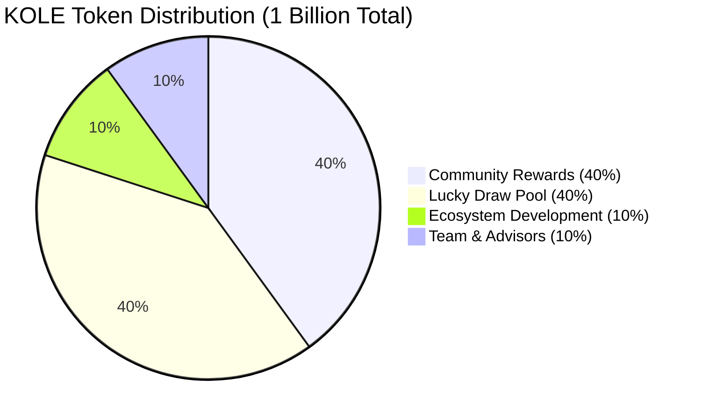
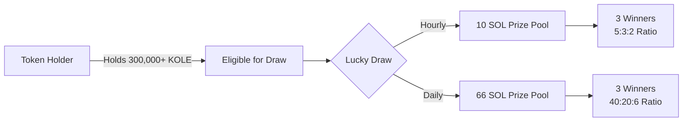
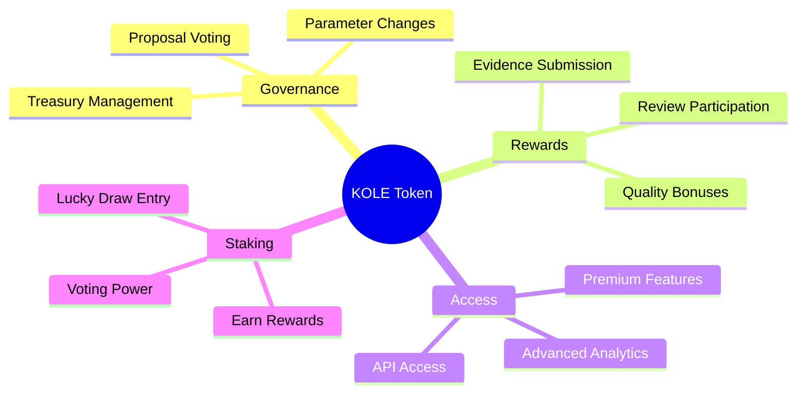
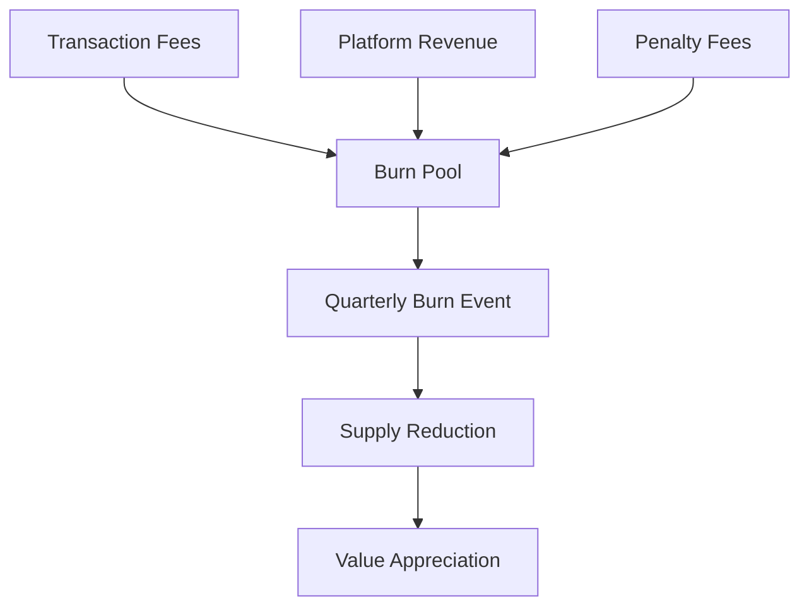
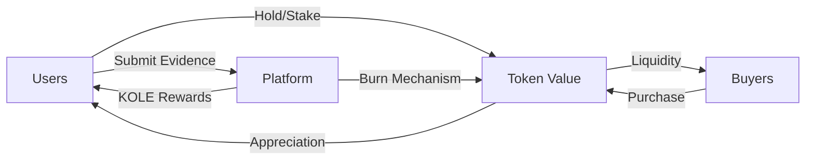
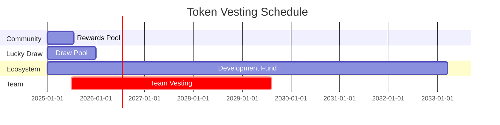

# KOLE Token Economics

## Overview

KOLE token is the native utility and governance token of the KOL Misconduct Exposure Platform. It serves as the economic backbone of our decentralized ecosystem, incentivizing participation, rewarding contributors, and enabling community governance.

## Token Information

| Parameter | Details |
|-----------|---------|
| **Token Name** | KOLE |
| **Token Standard** | SPL (Solana) |
| **Total Supply** | 1,000,000,000 KOLE |
| **Contract Address** | `2EL3kJNYbgoqvtK4eyfNxgYiwm2V7B84kfMd1KLRpump` |
| **Decimal Places** | 9 |
| **Supply Model** | Fixed Supply (No Inflation) |

## Token Distribution

### Detailed Allocation Breakdown

#### 1. Community Rewards (400,000,000 KOLE - 40%)

**Purpose**: Incentivize evidence submission and review participation

**Distribution Schedule**:
- Daily unlock: 0.5% of pool (2,000,000 KOLE/day)
- Expected duration: 200 days for full distribution

**Reward Structure**:

| Action | Reward Amount | Requirements |
|--------|--------------|--------------|
| First Evidence Report | 100,000 KOLE | Original, verified evidence of misconduct |
| Supplementary Evidence | 20,000 KOLE | Additional evidence for existing case |
| Review Participation | 50,000 KOLE | Complete review as assigned reviewer |
| Quality Bonus | 10,000-50,000 KOLE | Exceptional evidence quality |

#### 2. Lucky Draw Pool (400,000,000 KOLE - 40%)

**Purpose**: Reward long-term holders and increase token utility

**Distribution Mechanism**:

**Draw Schedule**:
- Hourly Draw: Every hour (24 draws/day)
- Super Draw: Daily at 00:00 SGT
- Eligibility: Hold minimum 300,000 KOLE for 1+ hours

#### 3. Ecosystem Development (100,000,000 KOLE - 10%)

**Purpose**: Fund platform development, partnerships, and marketing

**Allocation**:
- Platform Development: 40,000,000 KOLE
- Marketing & PR: 30,000,000 KOLE
- Strategic Partnerships: 20,000,000 KOLE
- Emergency Reserve: 10,000,000 KOLE

**Vesting Schedule**:
- Monthly unlock: 1% (1,000,000 KOLE/month)
- Full vesting period: 100 months

#### 4. Team & Advisors (100,000,000 KOLE - 10%)

**Purpose**: Incentivize team and attract top advisors

**Distribution**:
- Core Team: 70,000,000 KOLE
- Advisors: 20,000,000 KOLE
- Future Hires: 10,000,000 KOLE

**Vesting Schedule**:
- 6-month cliff period
- Monthly unlock: 2% after cliff (2,000,000 KOLE/month)
- Full vesting: 50 months post-cliff

## Token Utility

### 1. Platform Functions

### 2. Governance Rights

| Holding Amount | Governance Level | Privileges |
|---------------|------------------|------------|
| 100,000+ KOLE | Basic | Vote on proposals |
| 500,000+ KOLE | Advanced | Create proposals |
| 1,000,000+ KOLE | Premium | Emergency proposals |
| 5,000,000+ KOLE | Elite | Veto rights |

### 3. Staking Rewards

**Annual Percentage Yield (APY)**:
- 30-day lock: 8% APY
- 90-day lock: 12% APY
- 180-day lock: 18% APY
- 365-day lock: 25% APY

## Token Economics Model

### Deflationary Mechanisms

**Burn Schedule**:
- Quarterly burns: 2% of collected fees
- Annual target: Reduce supply by 5%
- Maximum burn: 200,000,000 KOLE (20% of total)

### Revenue Streams

1. **Transaction Fees**: 0.5% on all KOLE transfers
2. **Platform Fees**: 10% of reward distributions
3. **Premium Services**: Subscription fees in KOLE
4. **Partnership Revenue**: Share of partner integrations

### Economic Incentives

## Market Strategy

### Exchange Listings

**Phase 1 (Completed)**:
- ✅ Raydium DEX
- ✅ Jupiter Aggregator

**Phase 2 (Q3 2025)**:
- [ ] Orca DEX
- [ ] Serum DEX

**Phase 3 (Q4 2025)**:
- [ ] Binance
- [ ] OKX
- [ ] Gate.io

### Liquidity Provision

**Initial Liquidity**:
- Pair: KOLE/SOL
- Initial Pool: 50,000,000 KOLE + 5,000 SOL
- Lock Period: 2 years

**Liquidity Mining**:
- Rewards: 1,000,000 KOLE/month
- APR: 50-100% (variable)
- Duration: 12 months

## Price Stability Mechanisms

### 1. Anti-Dump Protection

- Maximum daily sell: 1% of holdings
- Graduated tax on large sells:
  - <100k KOLE: 0% tax
  - 100k-1M KOLE: 5% tax
  - >1M KOLE: 10% tax

### 2. Buy-Back Program

- Quarterly buy-backs using platform revenue
- Target: 5-10% of quarterly revenue
- Purchased tokens sent to burn address

### 3. Vesting Schedules

## Risk Management

### Market Risks

| Risk Type | Mitigation Strategy |
|-----------|-------------------|
| Price Volatility | Staking incentives, burn mechanisms |
| Liquidity Crisis | Locked liquidity, multiple DEX listings |
| Whale Manipulation | Anti-dump mechanisms, gradual distribution |
| Regulatory Changes | Multi-jurisdiction compliance |

### Security Measures

- Smart Contract Audits: CertiK, Halborn
- Multi-signature Treasury: 3/5 required
- Time-locked Upgrades: 48-hour delay
- Bug Bounty Program: Up to 100,000 KOLE

## Future Developments

### Cross-Chain Expansion

**Target Chains**:
- Ethereum (via Wormhole Bridge)
- BSC (via Portal Bridge)
- Polygon (Native Integration)

### DeFi Integration

**Planned Integrations**:
- Lending Protocols (Solend, Mango)
- Yield Aggregators (Tulip, Francium)
- Options Protocols (PsyOptions, Zeta)

### Token Upgrades

**V2 Features (2026)**:
- Dynamic staking rewards
- NFT integration for achievements
- Cross-chain governance
- Revenue sharing for stakers

## Compliance & Regulations

### Legal Structure

- Token Type: Utility Token
- Not a Security: Passes Howey Test
- Jurisdiction: Singapore-friendly
- KYC/AML: For large transactions only

### Tax Considerations

- Token rewards may be taxable income
- Capital gains apply on token sales
- Consult local tax advisors

## Contact & Resources

### Official Links

- Website: [https://kolexposure.com](https://kolexposure.com)
- Token Contract: [Solscan Explorer](https://solscan.io/token/2EL3kJNYbgoqvtK4eyfNxgYiwm2V7B84kfMd1KLRpump)
- DEX Trading: [Raydium](https://raydium.io/swap/?inputCurrency=sol&outputCurrency=2EL3kJNYbgoqvtK4eyfNxgYiwm2V7B84kfMd1KLRpump)

### Community

- Telegram: [https://t.me/kolexposure](https://t.me/kolexposure)
- Discord: [Join Server](https://discord.com/invite/sZf44CseTf)
- Twitter: [@kolexposure](https://x.com/kolexposure)

---

*This document is subject to updates. Last revised: January 2025*