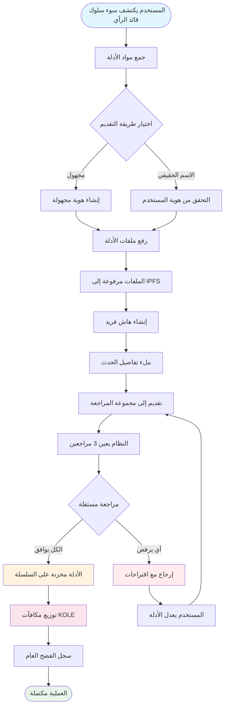

# **الكتاب الأبيض لمنصة فضح سوء السلوك للـ KOL**

### **نظام إيكولوجي للرقابة اللامركزية قائم على تقنية البلوك تشين**

*الإصدار 1.2 | سبتمبر 2025 (مُحدث)*

### 🌍 اللغات المتاحة
[🇬🇧 English](Whitepaper_EN.md) | [🇨🇳 中文](Whitepaper_CN.md) | [🇯🇵 日本語](Whitepaper_JP.md) | [🇷🇺 Русский](Whitepaper_RU.md) | [🇪🇸 Español](Whitepaper_ES.md) | [🇰🇷 한국어](Whitepaper_KR.md) | [🇸🇦 العربية](Whitepaper_AR.md) | [🇹🇷 Türkçe](Whitepaper_TR.md) | [🇧🇷 Português](Whitepaper_PT.md) | [🇫🇷 Français](Whitepaper_FR.md) | [🇩🇪 Deutsch](Whitepaper_DE.md) | [🇮🇳 हिंदी](Whitepaper_HI.md) | [🇮🇱 עברית](Whitepaper_HE.md) | [🇻🇳 Tiếng Việt](Whitepaper_VI.md) | [🇹🇭 ไทย](Whitepaper_TH.md)

---

## **جدول المحتويات**

1.  [الملخص التنفيذي](#الملخص-التنفيذي)
2.  [خلفية المشروع والرؤية](#خلفية-المشروع-والرؤية)
3.  [الهندسة المعمارية التقنية](#الهندسة-المعمارية-التقنية)
4.  [وحدات الوظائف الأساسية](#وحدات-الوظائف-الأساسية)
5.  [اقتصاديات الرمز المميز](#اقتصاديات-الرمز-المميز)
6.  [الحوكمة المجتمعية](#الحوكمة-المجتمعية)
7.  [مزايا المنصة](#مزايا-المنصة)
8.  [خارطة طريق التطوير](#خارطة-طريق-التطوير)
9.  [الكشف عن المخاطر](#الكشف-عن-المخاطر)
10. [الخلاصة](#الخلاصة)

---

## **الملخص التنفيذي**

منصة فضح سوء السلوك للـ KOL هي نظام إيكولوجي للرقابة اللامركزية قائم على تقنية البلوك تشين. تهدف إلى حماية حقوق ومصالح المستثمرين والمستهلكين من خلال فضح وتسجيل سوء سلوك قادة الرأي الرئيسيين (KOL) عبر آلية شفافة وعادلة.

### **اقتراح القيمة الأساسية**
- ✅ **غير قابل للتغيير**: يتم حفظ الأدلة بشكل دائم بناءً على تقنية البلوك تشين.
- ✅ **لامركزي**: محكوم من قبل المجتمع، تجنب نقاط التحكم الواحدة.
- ✅ **شفاف وعادل**: جميع العمليات قابلة للتدقيق العام، والمراجعات تتم بشكل مستقل.
- ✅ **حوافز كافية**: نموذج اقتصاديات الرمز المميز يحفز المشاركة النشطة للمستخدمين.

---

## **خلفية المشروع والرؤية**

### **1.1 نقاط ألم الصناعة**

| نوع المشكلة | التجلي المحدد | نطاق التأثير |
|---|---|---|
| **الإعلان الكاذب** | قادة الرأي يبالغون في تأثيرات المنتجات، يعدون بعوائد كاذبة | خسائر مالية للمستهلكين |
| **"السحب الخبيث"** | استغلال ثقة المعجبين في مخططات "سحب السجادة" | خسائر أصول المستثمرين |
| **احتيال البيانات** | تضخيم التفاعل، شراء المتابعين لخداع المعلنين | ميزانيات تسويقية مهدرة للعلامات التجارية |
| **نقص الإشراف** | تنظيم غير فعال على المنصات الموجودة، قنوات إبلاغ ضعيفة | انتشار مستمر لسوء السلوك |
| **فقدان الأدلة بسهولة** | الأدلة تُحذف بسهولة أو تُعامل بالعلاقات العامة | صعوبة في الدفاع عن الحقوق |

### **1.2 رؤية المنصة**

> **"بناء نظام إيكولوجي لامركزي وشفاف للإشراف على سلوك قادة الرأي، ضمان صحة وعدم قابلية تغيير الأدلة من خلال تقنية البلوك تشين، تحقيق آلية مراجعة عادلة ومنصفة من خلال الحوكمة المجتمعية، وفي النهاية تأسيس نظام إيكولوجي صحي ومنظم لقادة الرأي."**

---

## **الهندسة المعمارية التقنية**

### **2.1 نظرة عامة على المكدس التقني**

- **طبقة التطبيق**
  - الويب | الجوال | واجهة برمجة التطبيقات | الواجهة الخلفية الإدارية
- **طبقة الخدمة**
  - منطق الأعمال | تفاعل العقود الذكية | معالجة البيانات
- **طبقة البلوك تشين**
  - سولانا | العقود الذكية | عقود الرمز المميز
- **طبقة التخزين**
  - تخزين IPFS الموزع | تخزين البيانات على السلسلة

### **2.2 المكونات التقنية الأساسية**

#### **🔗 البنية التحتية للبلوك تشين**
- **اختيار السلسلة الرئيسية**: سولانا
- **مقاييس الأداء**: 65,000 معاملة في الثانية، وقت الكتلة 400 مللي ثانية
- **ميزة التكلفة**: رسوم المعاملات <$0.01

#### **📦 نظام العقود الذكية**
- **عقد الأدلة على السلسلة**: ينفذ تلقائياً عملية تقديم الأدلة.
- **عقد توزيع الرموز المميزة**: يدير توزيع المكافآت.
- **عقد الحوكمة**: يتعامل مع التصويت واتخاذ القرارات.

#### **💾 التخزين الموزع**
- **شبكة IPFS**: تخزن ملفات الأدلة الأصلية.
- **النسخ الاحتياطي المتكرر**: متزامن عبر العقد العالمية.
- **سرعة الوصول**: وصول معجل بـ CDN.

---

## **وحدات الوظائف الأساسية**

### **3.1 نظام التقديم**

#### **عملية التقديم**

#### **الخطوات التفصيلية**
1.  **إعداد الأدلة** - جمع لقطات الشاشة، التسجيلات، سجلات الدردشة
2.  **اختيار الطريقة** - تقديم مجهول أو بالاسم الحقيقي
3.  **رفع الملفات** - الأدلة ترفع تلقائياً إلى IPFS
4.  **ملء المعلومات** - وصف الحادثة والتأثير
5.  **تقديم للمراجعة** - دخول عملية المراجعة اللامركزية
6.  **مراجعة المحلفين** - 3 مراجعين مستقلين يقيمون
7.  **الموافقة** - الأدلة مخزنة بشكل دائم على السلسلة
8.  **استلام المكافأة** - توزيع تلقائي لرموز KOLE

#### **أنواع الأدلة المدعومة**
- 📷 أدلة الصور (لقطات الشاشة، الصور)
- 🎥 أدلة الفيديو (تسجيلات الشاشة، الفيديوهات)
- 💬 سجلات الدردشة (WeChat، Telegram، إلخ)
- 📄 أدلة الوثائق (عقود، اتفاقيات، إلخ)

### **3.2 نظام المراجعة**

#### **تصميم آلية المراجعة**

| عنصر المراجعة | المتطلب المحدد | الغرض |
|---|---|---|
| **عدد المراجعين** | 3 أشخاص كحد أدنى | ضمان العدالة |
| **المراجعة المستقلة** | لا يعرفون نتائج المراجعين الآخرين | منع التواطؤ |
| **متطلب الإجماع** | **جميع المراجعين يجب أن يتفقوا بالإجماع** للاعتماد | ضمان الجودة الأساسية للأدلة |
| **معيار التقييم** | نظام تقييم 1-5 نجوم، **المستوى النهائي هو متوسط جميع التقييمات (مدور)** | تحديد شدة الحادثة كمياً |
| **الحد الزمني** | إنجاز خلال 48 ساعة | تحسين الكفاءة |

### **3.3 نظام عرض الفضح**

#### **تصنيف مستويات الشدة**

| المستوى | عرض النجوم | الوصف | السلوك النمطي |
|---|---|---|---|
| **المستوى 5** | ***** | بشع | احتيال، احتيال جدي |
| **المستوى 4** | **** | سوء سلوك شديد | سحب خبيث، إعلان كاذب |
| **المستوى 3** | *** | سوء سلوك متوسط | ادعاءات مبالغ فيها، احتيال بيانات |
| **المستوى 2** | ** | سوء سلوك بسيط | خيانة الثقة، تعليقات غير مناسبة |
| **المستوى 1** | * | سوء سلوك عام | جودة خدمة ضعيفة، موقف سيء |

---

## **اقتصاديات الرمز المميز**

### **4.1 نظرة عامة على الرمز المميز**

| البند | التفاصيل |
|---|---|
| **اسم الرمز المميز** | KOLE Token |
| **رمز الرمز المميز** | KOLE |
| **إجمالي المعروض** | 1,000,000,000 (مليار واحد) |
| **معيار الرمز المميز** | SPL (مكتبة برنامج سولانا) |
| **الكسور العشرية** | 9 |
| **طريقة الإصدار** | سك دفعة واحدة، معروض ثابت |

### **4.2 خطة توزيع الرموز المميزة**

| التوزيع | النسبة المئوية | الحالة وآلية إلغاء القفل |
|---|---|---|
| **مكافآت تقديم المستخدمين** | 40% | **مقفل**. يُلغى قفل 0.5% يومياً للمكافآت. الرموز المميزة غير المستخدمة تُعاد قفلها أسبوعياً. |
| **يانصيب حاملي الرموز** | 40% | **متداول بالكامل**. يُستخدم لأحداث اليانصيب لحاملي رموز المجتمع. |
| **تطوير النظام الإيكولوجي** | 10% | **مقفل**. للبحث والتطوير، العمليات، إلخ. يُلغى قفل 1% شهرياً. |
| **الفريق والمستشارون** | 10% | **مقفل**. يُلغى قفل 2% شهرياً. |

### **4.3 تفاصيل آلية المكافآت**

| نوع المكافأة | كمية الرموز المميزة (KOLE) | شروط الاستلام |
|---|---|---|
| **مكافأة التقرير الأول** | 100,000 | تقديم أدلة أصيلة وصالحة لسوء سلوك قائد الرأي لأول مرة، واجتياز المراجعة. |
| **مكافأة الأدلة التكميلية** | 20,000 | تقديم أدلة تكميلية صالحة لحالة موجودة، تعزز اكتمالها. |
| **مكافأة المراجع** | 50,000 | المشاركة وإنجاز عمل مراجعة الأدلة كمراجع معتمد. |

### **4.4 نظام اليانصيب (جديد)**

لمكافأة حاملي رموز المجتمع، أسست المنصة نظام يانصيب عالي التكرار وعالي القيمة.

| نوع السحب | التكرار | إجمالي مجموعة الجوائز | نموذج الفوز ونسبة التوزيع |
|---|---|---|---|
| **الجائزة الكبرى العادية** | مرة كل ساعة | **10 SOL** | **3 فائزين**، موزعة بنسبة **5 : 3 : 2** (أي، 5 SOL، 3 SOL، 2 SOL) |
| **الجائزة الكبرى الفائقة** | يومياً في 00:00 (SGT) | **66 SOL** | **3 فائزين**، موزعة بنسبة **40 : 20 : 6** (أي، 40 SOL، 20 SOL، 6 SOL) |

**الأهلية**:
- **عتبة الحيازة**: استلام تذكرة يانصيب واحدة لكل **300,000 رمز KOLE** محتفظ به.
- **حد الوزن**: لضمان العدالة، يمكن لكل عنوان محفظة أن يكون له وزن فوز أقصى يعادل **5 تذاكر يانصيب**.
- **فترة الحيازة**: الرموز المميزة في العنوان يجب أن تُحتفظ بها لمدة **ساعة واحدة** على الأقل لتكون مؤهلة للجولة الحالية من السحب.

### **4.5 آلية الحرق**

| نوع الحرق | شرط الإثارة | الوصف |
|---|---|---|
| **إعادة الشراء والحرق** | مكافآت البث المباشر لمنصة PUMP | جميع مكافآت البث المباشر المحصلة على منصة PUMP ستُستخدم لإعادة شراء وحرق رموز KOLE من السوق الثانوي. |
| **مطابقة المؤسسة والحرق**| لكل قائد رأي مفضوح بنجاح | المؤسسة ستشتري 0.5% من إجمالي المعروض وتحرق الرموز المميزة لزيادة قيمة الرمز المميز. |
| **حرق غير منتظم** | قرار المنصة | المنصة ستعيد شراء وتحرق الرموز المميزة من السوق بشكل دوري بناءً على الظروف التشغيلية. |

### **4.6 دعم مجموعة التمويل**

| نوع الصندوق | المبلغ | الاستخدام الأساسي |
|---|---|---|
| **أموال المنصة الخاصة** | $1,000,000 | العمليات، التطوير، التسويق. الدفعة الأولى من حوالي **$700,000 (ما يعادل 3000 SOL)** تم حقنها في مجموعة جوائز مكافآت اليانصيب. |
| **أموال المستثمرين** | $1,000,000 | (المرحلة 1) لبناء النظام الإيكولوجي، دعم السيولة، والتطوير المستقبلي. |

---

## **الحوكمة المجتمعية**

### **5.1 هيكل حوكمة DAO**

*   **حاملو KOLE** (يصوتون)
    *   ⬇️
*   **لجنة الحوكمة** (تنفذ)
    *   ⬇️
        *   المحلفون
        *   فريق التطوير
        *   فريق العمليات

### **5.2 وزن التصويت**

| مقدار الحيازة (KOLE) | وزن التصويت | الامتيازات |
|---|---|---|
| 1 - 999 | 1x | حقوق التصويت الأساسية |
| 1,000 - 9,999 | 1.2x | حق الاقتراح |
| 10,000 - 99,999 | 1.5x | أهلية ترشح المحلفين |
| 100,000+ | 2x | أهلية ترشح لجنة الحوكمة |

### **5.3 أنواع الاقتراحات**
- **اقتراحات تقنية**: تحديثات الميزات، تعديلات الهندسة المعمارية التقنية
- **اقتراحات اقتصادية**: تعديلات اقتصاديات الرمز المميز، توزيع المكافآت
- **اقتراحات تشغيلية**: قواعد المنصة، أحداث المجتمع
- **اقتراحات طارئة**: حوادث أمنية، قرارات عاجلة

---

## **مزايا المنصة**

### **6.1 المزايا التقنية**

| الميزة | الوصف | القيمة |
|---|---|---|
| **🔒 غير قابل للتغيير** | تخزين دائم على البلوك تشين | أدلة موثوقة 100% |
| **⚡ أداء عالي** | 65,000 معاملة في الثانية لسولانا | تجربة مستخدم سلسة |
| **💰 تكلفة منخفضة** | رسوم معاملات <$0.01 | يقلل حاجز الدخول |
| **🌍 عالمي** | تخزين IPFS الموزع | يمكن الوصول إليه عالمياً |

### **6.2 مزايا الآلية**
- **شفاف وعادل**: جميع العمليات قابلة للتحقق على السلسلة.
- **حوافز كافية**: نظام حوافز رمز مميز متعدد الطبقات.
- **مدفوع بالمجتمع**: حوكمة لامركزية حقيقية.
- **حماية الخصوصية**: يدعم الإبلاغ المجهول.

### **6.3 مزايا النظام الإيكولوجي**
- **تعاون مفتوح**: كود مفتوح المصدر، المساهمات مرحب بها.
- **التوافق عبر السلاسل**: دعم مستقبلي للنشر متعدد السلاسل.
- **واجهة برمجة تطبيقات مفتوحة**: وصول الطرف الثالث للاستعلامات.
- **عمليات متوافقة**: الالتزام بالقوانين واللوائح المحلية.

---

## **خارطة طريق التطوير**

### **المرحلة 1: بناء الأساس (الربع الأول 2025) ✅**
- [x] إطلاق الكتاب الأبيض
- [x] تشكيل الفريق الأساسي
- [x] تصميم الهندسة المعمارية التقنية
- [x] تطوير العقود الذكية

### **المرحلة 2: إطلاق المنتج (الربع الثاني 2025) ✅**
- [x] نشر الشبكة الرئيسية
- [x] اختبار بيتا وإطلاق الموقع الرسمي
- [x] تجنيد المستخدمين الأوائل
- [x] إصدار الرمز المميز (KOLE)

### **المرحلة 3: توسيع النظام الإيكولوجي (الربع الثالث 2025) 🚀**
- [x] إدراج في DEX
- [ ] طلب إدراج في CEX
- [ ] توسيع الشراكات
- [ ] إطلاق تطبيق الجوال

### **المرحلة 4: العولمة (الربع الرابع 2025) 🌱**
- [ ] دعم متعدد اللغات
- [ ] ربط عبر السلاسل
- [ ] مراجعة بمساعدة الذكاء الاصطناعي
- [ ] لامركزية كاملة عبر DAO

### **المرحلة 5: خطة طويلة المدى (2026+) 🔮**
- [ ] وضع معايير الصناعة
- [ ] تعاون تنظيمي
- [ ] تكامل هوية Web3
- [ ] توسع الميتافيرس

---

## **الكشف عن المخاطر**

### **8.1 المخاطر التقنية**

| نوع المخاطر | التأثير المحتمل | تدابير التخفيف |
|---|---|---|
| ثغرات العقود الذكية | فقدان الأموال | تدقيقات متعددة، تحقق رسمي |
| هجمات الشبكة | انقطاع الخدمة | حماية DDoS، نشر متعدد العقد |
| مشاكل القابلية للتوسع | تدهور الأداء | حلول الطبقة الثانية، تقنية التجزئة |

### **8.2 المخاطر التنظيمية**
- **تغييرات السياسة**: مراقبة وثيقة للتطورات التنظيمية في مختلف المناطق.
- **متطلبات الامتثال**: إشراك المستشارين القانونيين لضمان الامتثال.
- **KYC/AML**: تنفيذ التحقق من الهوية عند الضرورة.

### **8.3 المخاطر التشغيلية**
- **تقديمات خبيثة**: فحص بمساعدة الذكاء الاصطناعي + مراجعة يدوية.
- **تواطؤ المراجعين**: تعيين عشوائي + نظام سمعة.
- **منافسة السوق**: ابتكار مستمر + تحسين تجربة المستخدم.

---

## **الخلاصة**

منصة فضح سوء السلوك للـ KOL ملتزمة ببناء نظام إيكولوجي **عادل وشفاف وجدير بالثقة** للإشراف على سلوك قادة الرأي. من خلال تقنية البلوك تشين وآليات الحوكمة المجتمعية، نؤمن أنه يمكننا كبح سوء سلوك قادة الرأي بفعالية، وحماية حقوق المستخدمين، وتعزيز التطوير الصحي للصناعة.

### **انضم إلينا**

🌐 **الموقع الإلكتروني**: `https://kolexposure.com/#/`
💬 **تيليجرام**: `https://t.me/kolexposure`
🐦 **تويتر / X**: `https://x.com/TODO_dream`, `https://x.com/kolexposure`
🤖 **ديسكورد**: `https://discord.com/invite/sZf44CseTf`
🌱 **CA**: `2EL3kJNYbgoqvtK4eyfNxgYiwm2V7B84kfMd1KLRpump`

### **إخلاء المسؤولية**

هذا الكتاب الأبيض للأغراض الإعلامية فقط ولا يشكل نصيحة استثمارية. الاستثمار في الأصول الرقمية ينطوي على مخاطر عالية؛ يرجى التقييم بعناية. المنصة تحتفظ بالحق في تعديل خطط تطويرها وفقاً للظروف الفعلية.

---

**© 2025 منصة فضح سوء السلوك للـ KOL | نظام إيكولوجي للرقابة اللامركزية قائم على تقنية البلوك تشين**