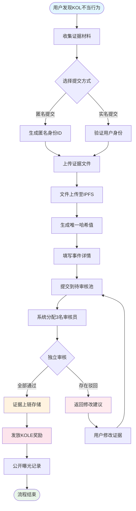

# **KOL劣迹曝光平台白皮书**

### **基于区块链技术的去中心化监督生态**

*版本 1.2 | 2025年9月 (修订版)*

### 🌍 多语言版本
[🇬🇧 English](Whitepaper_EN.md) | [🇨🇳 中文](Whitepaper_CN.md) | [🇯🇵 日本語](Whitepaper_JP.md) | [🇷🇺 Русский](Whitepaper_RU.md) | [🇪🇸 Español](Whitepaper_ES.md) | [🇰🇷 한국어](Whitepaper_KR.md) | [🇸🇦 العربية](Whitepaper_AR.md) | [🇹🇷 Türkçe](Whitepaper_TR.md) | [🇧🇷 Português](Whitepaper_PT.md) | [🇫🇷 Français](Whitepaper_FR.md) | [🇩🇪 Deutsch](Whitepaper_DE.md) | [🇮🇳 हिंदी](Whitepaper_HI.md) | [🇮🇱 עברית](Whitepaper_HE.md) | [🇻🇳 Tiếng Việt](Whitepaper_VI.md) | [🇹🇭 ไทย](Whitepaper_TH.md)

---

## **目录**

1.  [执行摘要](#执行摘要)
2.  [项目背景与愿景](#项目背景与愿景)
3.  [技术架构](#技术架构)
4.  [核心功能模块](#核心功能模块)
5.  [代币经济模型](#代币经济模型)
6.  [社区治理](#社区治理)
7.  [平台优势](#平台优势)
8.  [发展路线图](#发展路线图)
9.  [风险提示](#风险提示)
10. [结语](#结语)

---

## **执行摘要**

KOL劣迹曝光平台是一个基于区块链技术的去中心化监督生态系统，旨在通过透明、公正的机制曝光和记录KOL（关键意见领袖）的不当行为，保护投资者和消费者权益。

### **核心价值主张**
- ✅ **不可篡改**：基于区块链技术确保证据永久保存
- ✅ **去中心化**：社区自治，避免单点控制
- ✅ **透明公正**：所有流程公开可查，评审独立进行
- ✅ **激励充分**：代币经济模型激励用户积极参与

---

## **项目背景与愿景**

### **1.1 行业痛点**

| 问题类型 | 具体表现 | 影响范围 |
|---|---|---|
| **虚假宣传** | KOL夸大产品效果，虚假承诺收益 | 消费者经济损失 |
| **恶意收割** | 利用粉丝信任进行"割韭菜"行为 | 投资者资产损失 |
| **数据造假** | 刷量、买粉，欺骗广告主 | 品牌方营销预算浪费 |
| **缺乏监督** | 现有平台监管不力，举报渠道不畅 | 劣迹行为持续泛滥 |
| **证据易失** | 证据容易被删除或公关处理 | 维权困难 |

### **1.2 平台愿景**

> **"构建一个去中心化、透明化的KOL行为监督生态系统，通过区块链技术确保证据的真实性和不可篡改性，通过社区治理实现公平公正的评审机制，最终建立健康有序的KOL生态环境。"**

---

## **技术架构**

### **2.1 技术栈概览**

- **应用层 (Application)**
  - Web端 | 移动端 | API接口 | 管理后台
- **服务层 (Service)**
  - 业务逻辑 | 智能合约交互 | 数据处理
- **区块链层 (Blockchain)**
  - Solana | 智能合约 | 代币合约
- **存储层 (Storage)**
  - IPFS分布式存储 | 链上数据存储

### **2.2 核心技术组件**

#### **🔗 区块链基础设施**
- **主链选择**：Solana
- **性能指标**：65,000 TPS，400ms出块时间
- **成本优势**：交易费用<$0.01

#### **📦 智能合约系统**
- **证据上链合约**：自动执行存证流程
- **代币分发合约**：管理奖励发放
- **治理合约**：处理投票和决策

#### **💾 分布式存储**
- **IPFS网络**：存储原始证据文件
- **冗余备份**：全球节点同步
- **访问速度**：CDN加速访问

---

## **核心功能模块**

### **3.1 投稿系统**

#### **投稿流程**

#### **详细步骤说明**
1.  **准备证据** - 收集截图、录屏、聊天记录等
2.  **选择方式** - 匿名或实名提交
3.  **上传文件** - 证据自动上传至IPFS
4.  **填写信息** - 描述事件经过和影响
5.  **提交审核** - 进入去中心化评审流程
6.  **评审团审核** - 3名独立审核员评估
7.  **审核通过** - 证据永久上链存储
8.  **获得奖励** - 自动发放KOLE代币

#### **支持的证据类型**
- 📷 图片证据（截图、照片）
- 🎥 视频证据（录屏、录像）
- 💬 聊天记录（微信、Telegram等）
- 📄 文档证据（合同、协议等）

### **3.2 评审系统**

#### **评审机制设计**

| 评审要素 | 具体要求 | 目的 |
|---|---|---|
| **评审人数** | 最少3人 | 确保公正性 |
| **独立评审** | 互不知晓其他评审结果 | 避免串通 |
| **一致性要求** | **所有评审员必须一致同意**方可认证通过 | 保证证据基础质量 |
| **评级标准** | 1-5级评分制，**最终等级为所有评级的平均值（四舍五入）** | 量化事件严重程度 |
| **时限要求** | 48小时内完成 | 提高效率 |

### **3.3 曝光展示系统**

#### **严重等级分类**

| 等级 | 星级显示 | 描述 | 典型行为 |
|---|---|---|---|
| **5级** | ***** | 罪大恶极 | 诈骗、严重欺诈 |
| **4级** | **** | 严重劣迹 | 恶意收割、虚假宣传 |
| **3级** | *** | 中度劣迹 | 夸大宣传、数据造假 |
| **2级** | ** | 轻度劣迹 | 失信行为、不当言论 |
| **1级** | * | 一般劣迹 | 服务质量差、态度恶劣 |

---

## **代币经济模型**

### **4.1 代币概览**

| 项目 | 详情 |
|---|---|
| **代币名称** | KOLE Token |
| **代币符号** | KOLE |
| **总发行量** | 1,000,000,000（10亿枚） |
| **代币标准** | SPL (Solana Program Library) |
| **小数位数** | 9 |
| **发行方式** | 一次性铸造，固定供应 |

### **4.2 代币分配方案**

| 分配对象 | 比例 | 状态与解锁机制 |
|---|---|---|
| **用户投稿奖励** | 40% | **已锁定**。每日解锁0.5%用于发放奖励，未使用的代币将每周重新锁定。 |
| **持币抽奖** | 40% | **完全流通**。用于社区持币用户的抽奖活动。 |
| **生态发展** | 10% | **已锁定**。用于研发、运营等，每月解锁1%。 |
| **团队与顾问** | 10% | **已锁定**。每月解锁2%。 |

### **4.3 奖励机制详情**

| 奖励类型 | 代币数量 (KOLE) | 获得条件 |
|---|---|---|
| **首次举报奖励** | 100,000 | 首次提交真实有效的KOL劣迹证据，并通过审核。 |
| **补充证据奖励** | 20,000 | 为已有案件提供有效补充证据，增加案件完整性。 |
| **评审员奖励** | 50,000 | 作为认证评审员，参与并完成证据评审工作。 |

### **4.4 幸运抽奖系统（新增）**

为回馈社区持币用户，平台设立了高频、高额的幸运抽奖系统。

| 抽奖类型 | 抽奖频率 | 奖金总额 | 中奖模式与分配比例 |
|---|---|---|---|
| **普通大奖** | 每小时一次 | **10 SOL** | **3人中奖**，按 **5 : 3 : 2** 比例分配 (即 5 SOL, 3 SOL, 2 SOL) |
| **超级大奖** | 每日0点(新加坡时间) | **66 SOL** | **3人中奖**，按 **40 : 20 : 6** 比例分配 (即 40 SOL, 20 SOL, 6 SOL) |

**参与资格**：
- **持仓门槛**：每持有 **30万 KOLE 代币** 可获得1张抽奖券。
- **权重上限**：为保证公平性，每个钱包地址最多按 **5张抽奖券** 计算中奖权重。
- **持仓时长**：地址内代币需至少**持仓1小时**方可参与当轮抽奖。

### **4.5 销毁机制**

| 销毁类型 | 触发条件 | 说明 |
|---|---|---|
| **回购销毁** | PUMP平台直播奖励 | 所有在PUMP平台获得的直播奖励将全部用于从二级市场回购并销毁KOLE代币。 |
| **基金会匹配销毁**| 每成功曝光1个KOL | 基金会将购买总供应量0.5%的代币并进行销毁，以提升代币价值。 |
| **不定期销毁** | 平台决策 | 平台将根据运营情况，不定期从市场回购并销毁代币。 |

### **4.6 资金池支持**

| 资金类型 | 金额 | 主要用途 |
|---|---|---|
| **平台自有资金** | $1,000,000 | 运营、开发、市场推广。其中首期约**$700,000 (等值3000 SOL)** 已注入奖金池用于抽奖回馈。 |
| **投资方资金** | $1,000,000 | (第一期) 用于生态建设、流动性支持及未来发展。 |

---

## **社区治理**

### **5.1 DAO治理结构**

*   **KOLE持有者** (进行投票)
    *   ⬇️
*   **治理委员会** (负责执行)
    *   ⬇️
        *   评审团
        *   开发团队
        *   运营团队

### **5.2 投票权重**

| 持币量 (KOLE) | 投票权重 | 特权 |
|---|---|---|
| 1 - 999 | 1x | 基础投票权 |
| 1,000 - 9,999 | 1.2x | 提案权 |
| 10,000 - 99,999 | 1.5x | 评审团候选资格 |
| 100,000+ | 2x | 治理委员会候选资格 |

### **5.3 提案类型**
- **技术提案**：功能更新、技术架构调整
- **经济提案**：代币经济模型调整、奖励分配
- **运营提案**：平台规则、社区活动
- **紧急提案**：安全事件、紧急决策

---

## **平台优势**

### **6.1 技术优势**

| 优势 | 说明 | 价值 |
|---|---|---|
| **🔒 不可篡改** | 区块链永久存储 | 证据可信度100% |
| **⚡ 高性能** | Solana每秒65,000笔交易 | 用户体验流畅 |
| **💰 低成本** | 交易费用<$0.01 | 降低使用门槛 |
| **🌍 全球化** | IPFS分布式存储 | 全球可访问 |

### **6.2 机制优势**
- **透明公正**：所有流程链上可查
- **激励充分**：多层次代币激励体系
- **社区驱动**：真正的去中心化治理
- **隐私保护**：支持匿名举报

### **6.3 生态优势**
- **开放协作**：开源代码，欢迎贡献
- **跨链兼容**：未来支持多链部署
- **API开放**：第三方可接入查询
- **合规运营**：遵守各地法律法规

---

## **发展路线图**

### **Phase 1: 基础建设 (Q1 2025) ✅**
- [x] 白皮书发布
- [x] 核心团队组建
- [x] 技术架构设计
- [x] 智能合约开发

### **Phase 2: 产品上线 (Q2 2025) ✅**
- [x] 主网部署
- [x] Beta测试与官网发布
- [x] 首批用户招募
- [x] 代币发行 (KOLE)

### **Phase 3: 生态扩展 (Q3 2025) 🚀**
- [x] DEX上线交易
- [ ] CEX申请上线
- [ ] 合作伙伴拓展
- [ ] 移动APP发布

### **Phase 4: 全球化 (Q4 2025) 🌱**
- [ ] 多语言支持
- [ ] 跨链桥接
- [ ] AI辅助评审
- [ ] DAO完全去中心化

### **Phase 5: 长期规划 (2026+) 🔮**
- [ ] 行业标准制定
- [ ] 监管合作
- [ ] Web3身份集成
- [ ] 元宇宙扩展

---

## **风险提示**

### **8.1 技术风险**

| 风险类型 | 可能影响 | 应对措施 |
|---|---|---|
| 智能合约漏洞 | 资金损失 | 多重审计、形式化验证 |
| 网络攻击 | 服务中断 | DDoS防护、多节点部署 |
| 扩展性问题 | 性能下降 | Layer2方案、分片技术 |

### **8.2 监管风险**
- **政策变化**：密切关注各地监管动态
- **合规要求**：聘请法律顾问确保合规
- **KYC/AML**：必要时实施身份验证

### **8.3 运营风险**
- **恶意投稿**：AI辅助筛查+人工复核
- **评审串通**：随机分配+信誉系统
- **市场竞争**：持续创新+用户体验优化

---

## **结语**

KOL劣迹曝光平台致力于构建一个**公平、透明、可信**的KOL行为监督生态系统。通过区块链技术和社区治理机制，我们相信能够有效遏制KOL不当行为，保护用户权益，促进行业健康发展。

### **加入我们**

🌐 **官网**: `https://kolexposure.com/#/`
💬 **Telegram**: `https://t.me/kolexposure`
🐦 **Twitter / X**: `https://x.com/TODO_dream`，`https://x.com/kolexposure`
🤖 **Discord**: `https://discord.com/invite/sZf44CseTf`
🌱 **CA**: `2EL3kJNYbgoqvtK4eyfNxgYiwm2V7B84kfMd1KLRpump`

### **免责声明**

本白皮书仅供参考，不构成投资建议。数字资产投资具有高风险，请谨慎评估。平台保留根据实际情况调整发展计划的权利。

---

**© 2025 KOL劣迹曝光平台 | 基于区块链技术的去中心化监督生态**
