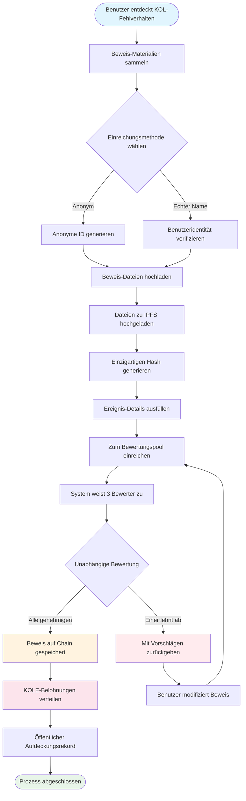

# **KOL Fehlverhalten-Aufdeckungsplattform Whitepaper**

### **Ein Dezentrales Überwachungsökosystem basierend auf Blockchain-Technologie**

*Version 1.2 | September 2025 (Überarbeitet)*

### 🌍 Verfügbare Sprachen
[🇬🇧 English](Whitepaper_EN.md) | [🇨🇳 中文](Whitepaper_CN.md) | [🇯🇵 日本語](Whitepaper_JP.md) | [🇷🇺 Русский](Whitepaper_RU.md) | [🇪🇸 Español](Whitepaper_ES.md) | [🇰🇷 한국어](Whitepaper_KR.md) | [🇸🇦 العربية](Whitepaper_AR.md) | [🇹🇷 Türkçe](Whitepaper_TR.md) | [🇧🇷 Português](Whitepaper_PT.md) | [🇫🇷 Français](Whitepaper_FR.md) | [🇩🇪 Deutsch](Whitepaper_DE.md) | [🇮🇳 हिंदी](Whitepaper_HI.md) | [🇮🇱 עברית](Whitepaper_HE.md) | [🇻🇳 Tiếng Việt](Whitepaper_VI.md) | [🇹🇭 ไทย](Whitepaper_TH.md)

---

## **Inhaltsverzeichnis**

1.  [Zusammenfassung](#zusammenfassung)
2.  [Projekthintergrund und Vision](#projekthintergrund-und-vision)
3.  [Technische Architektur](#technische-architektur)
4.  [Kernfunktionsmodule](#kernfunktionsmodule)
5.  [Tokenomics](#tokenomics)
6.  [Community-Governance](#community-governance)
7.  [Plattformvorteile](#plattformvorteile)
8.  [Entwicklungsroadmap](#entwicklungsroadmap)
9.  [Risikooffenlegung](#risikooffenlegung)
10. [Fazit](#fazit)

---

## **Zusammenfassung**

Die KOL Fehlverhalten-Aufdeckungsplattform ist ein dezentrales Überwachungsökosystem basierend auf Blockchain-Technologie. Sie zielt darauf ab, die Rechte und Interessen von Investoren und Verbrauchern zu schützen, indem sie das Fehlverhalten von KOLs (Key Opinion Leaders) durch einen transparenten und fairen Mechanismus aufdeckt und aufzeichnet.

### **Kernwertversprechen**
- ✅ **Unveränderlich**: Beweise werden permanent basierend auf Blockchain-Technologie gespeichert.
- ✅ **Dezentralisiert**: Community-gesteuert, vermeidet einzelne Kontrollpunkte.
- ✅ **Transparent und Fair**: Alle Prozesse sind öffentlich überprüfbar, und Bewertungen werden unabhängig durchgeführt.
- ✅ **Ausreichende Anreize**: Das Tokenomic-Modell fördert aktive Benutzerbeteiligung.

---

## **Projekthintergrund und Vision**

### **1.1 Branchenschmerzpunkte**

| Problemtyp | Spezifische Manifestation | Wirkungsbereich |
|---|---|---|
| **Falsche Werbung** | KOLs übertreiben Produkteffekte, versprechen falsche Renditen | Finanzielle Verluste für Verbraucher |
| **Bösartige "Rug Pulls"** | Ausnutzung von Fan-Vertrauen für "Rug Pull"-Schemata | Investoren-Asset-Verluste |
| **Datenbetrug** | Aufblähen von Engagement, Kauf von Followern zur Täuschung von Werbetreibenden | Verschwendete Marketing-Budgets für Marken |
| **Mangel an Überwachung** | Ineffektive Regulierung auf bestehenden Plattformen, schlechte Meldekanäle | Anhaltende Verbreitung von Fehlverhalten |
| **Beweise gehen leicht verloren** | Beweise werden leicht gelöscht oder von PR bearbeitet | Schwierigkeit bei der Rechtsverteidigung |

### **1.2 Plattformvision**

> **"Ein dezentrales und transparentes Ökosystem zur Überwachung von KOL-Verhalten aufzubauen, die Authentizität und Unveränderlichkeit von Beweisen durch Blockchain-Technologie zu gewährleisten, einen fairen und gerechten Bewertungsmechanismus durch Community-Governance zu erreichen und letztendlich ein gesundes und geordnetes KOL-Ökosystem zu etablieren."**

---

## **Technische Architektur**

### **2.1 Technologie-Stack-Übersicht**

- **Anwendungsschicht**
  - Web | Mobil | API | Admin-Backend
- **Serviceschicht**
  - Geschäftslogik | Smart Contract-Interaktion | Datenverarbeitung
- **Blockchain-Schicht**
  - Solana | Smart Contracts | Token-Contracts
- **Speicherschicht**
  - IPFS Verteilte Speicherung | On-Chain-Datenspeicherung

### **2.2 Zentrale Technische Komponenten**

#### **🔗 Blockchain-Infrastruktur**
- **Mainchain-Auswahl**: Solana
- **Leistungsmetriken**: 65,000 TPS, 400ms Blockzeit
- **Kostenvorteil**: Transaktionsgebühren <$0.01

#### **📦 Smart Contract-System**
- **Beweis-On-Chain-Contract**: Führt automatisch den Beweisvorlage-Prozess aus.
- **Token-Verteilungscontract**: Verwaltet Belohnungsverteilung.
- **Governance-Contract**: Behandelt Abstimmung und Entscheidungsfindung.

#### **💾 Verteilte Speicherung**
- **IPFS-Netzwerk**: Speichert ursprüngliche Beweis-Dateien.
- **Redundante Sicherung**: Synchronisiert über globale Knoten.
- **Zugriffsgeschwindigkeit**: CDN-beschleunigter Zugriff.

---

## **Kernfunktionsmodule**

### **3.1 Einreichungssystem**

#### **Einreichungsprozess**

#### **Detaillierte Schritte**
1.  **Beweise vorbereiten** - Screenshots, Aufnahmen, Chat-Logs sammeln
2.  **Methode wählen** - Anonyme oder echter Name-Einreichung
3.  **Dateien hochladen** - Beweise automatisch zu IPFS hochgeladen
4.  **Informationen ausfüllen** - Vorfall und Auswirkung beschreiben
5.  **Zur Bewertung einreichen** - Dezentralen Bewertungsprozess betreten
6.  **Jury-Bewertung** - 3 unabhängige Bewerter evaluieren
7.  **Genehmigung** - Beweis permanent on-chain gespeichert
8.  **Belohnung erhalten** - Automatische KOLE-Token-Verteilung

#### **Unterstützte Beweistypen**
- 📷 Bild-Beweis (Screenshots, Fotos)
- 🎥 Video-Beweis (Bildschirmaufnahmen, Videos)
- 💬 Chat-Logs (WeChat, Telegram, etc.)
- 📄 Dokument-Beweis (Verträge, Vereinbarungen, etc.)

### **3.2 Bewertungssystem**

#### **Bewertungsmechanismus-Design**

| Bewertungselement | Spezifische Anforderung | Zweck |
|---|---|---|
| **Anzahl der Bewerter** | Minimum 3 Personen | Fairness gewährleisten |
| **Unabhängige Bewertung** | Kennen die Ergebnisse anderer Bewerter nicht | Absprachen verhindern |
| **Einstimmigkeitsanforderung** | **Alle Bewerter müssen einstimmig zustimmen** für Zertifizierung | Grundqualität der Beweise garantieren |
| **Bewertungsstandard** | 1-5-Sterne-Bewertungssystem, **das finale Level ist der Durchschnitt aller Bewertungen (gerundet)** | Schwere des Vorfalls quantifizieren |
| **Zeitlimit** | Innerhalb von 48 Stunden abschließen | Effizienz verbessern |

### **3.3 Aufdeckungs-Anzeigesystem**

#### **Schweregrad-Level-Klassifizierung**

| Level | Sterne-Anzeige | Beschreibung | Typisches Verhalten |
|---|---|---|---|
| **Level 5** | ***** | Abscheulich | Betrug, schwerer Betrug |
| **Level 4** | **** | Schweres Fehlverhalten | Bösartige Rug Pulls, falsche Werbung |
| **Level 3** | *** | Mäßiges Fehlverhalten | Übertriebene Behauptungen, Datenbetrug |
| **Level 2** | ** | Geringfügiges Fehlverhalten | Vertrauensbruch, unangemessene Bemerkungen |
| **Level 1** | * | Allgemeines Fehlverhalten | Schlechte Servicequalität, schlechte Einstellung |

---

## **Tokenomics**

### **4.1 Token-Übersicht**

| Element | Details |
|---|---|
| **Token-Name** | KOLE Token |
| **Token-Symbol** | KOLE |
| **Gesamtangebot** | 1,000,000,000 (1 Milliarde) |
| **Token-Standard** | SPL (Solana Program Library) |
| **Dezimalstellen** | 9 |
| **Ausgabemethode** | Auf einmal geprägt, festes Angebot |

### **4.2 Token-Zuteilungsplan**

| Zuteilung | Prozentsatz | Status und Freigabemechanismus |
|---|---|---|
| **Benutzer-Einreichungsbelohnungen** | 40% | **Gesperrt**. 0.5% täglich für Belohnungen freigeschaltet. Ungenutzte Token werden wöchentlich erneut gesperrt. |
| **Inhaber-Lotterie** | 40% | **Vollständig zirkulierend**. Für Lotterie-Events für Community-Token-Inhaber verwendet. |
| **Ökosystem-Entwicklung** | 10% | **Gesperrt**. Für F&E, Betrieb, etc. 1% monatlich freigeschaltet. |
| **Team und Berater** | 10% | **Gesperrt**. 2% monatlich freigeschaltet. |

### **4.3 Belohnungsmechanismus-Details**

| Belohnungstyp | Token-Menge (KOLE) | Empfangsbedingungen |
|---|---|---|
| **Erstberichts-Belohnung** | 100,000 | Authentische und gültige Beweise für KOL-Fehlverhalten zum ersten Mal einreichen und die Bewertung bestehen. |
| **Ergänzende Beweis-Belohnung** | 20,000 | Gültige ergänzende Beweise für einen bestehenden Fall bereitstellen, die Vollständigkeit erhöhen. |
| **Bewerter-Belohnung** | 50,000 | Als zertifizierter Bewerter an Beweis-Bewertungsarbeit teilnehmen und abschließen. |

### **4.4 Lotterie-System (Neu)**

Um Community-Token-Inhaber zu belohnen, hat die Plattform ein hochfrequentes, hochwertiges Lotterie-System etabliert.

| Ziehungstyp | Häufigkeit | Gesamter Preispool | Gewinner-Modell und Zuteilungsverhältnis |
|---|---|---|---|
| **Regulärer Hauptpreis** | Einmal pro Stunde | **10 SOL** | **3 Gewinner**, zugestellt im Verhältnis **5 : 3 : 2** (d.h., 5 SOL, 3 SOL, 2 SOL) |
| **Super Hauptpreis** | Täglich um 00:00 (SGT) | **66 SOL** | **3 Gewinner**, zugestellt im Verhältnis **40 : 20 : 6** (d.h., 40 SOL, 20 SOL, 6 SOL) |

**Berechtigung**:
- **Halteschwelle**: 1 Lotterie-Ticket für alle **300,000 KOLE-Token** erhalten.
- **Gewichtslimit**: Um Fairness zu gewährleisten, kann jede Wallet-Adresse ein maximales Gewinngewicht äquivalent zu **5 Lotterie-Tickets** haben.
- **Halteperiode**: Token in der Adresse müssen mindestens **1 Stunde** gehalten werden, um für die aktuelle Ziehungsrunde berechtigt zu sein.

### **4.5 Burn-Mechanismus**

| Burn-Typ | Auslösebedingung | Beschreibung |
|---|---|---|
| **Rückkauf und Burn** | PUMP-Plattform Live-Streaming-Belohnungen | Alle auf der PUMP-Plattform erhaltenen Live-Streaming-Belohnungen werden verwendet, um KOLE-Token vom Sekundärmarkt zurückzukaufen und zu verbrennen. |
| **Stiftungsabgleich und Burn** | Für jeden erfolgreich aufgedeckten KOL | Die Stiftung wird 0.5% des Gesamtangebots kaufen und die Token verbrennen, um den Token-Wert zu steigern. |
| **Unregelmäßige Burns** | Plattform-Entscheidung | Die Plattform wird regelmäßig Token vom Markt basierend auf betrieblichen Bedingungen zurückkaufen und verbrennen. |

### **4.6 Finanzierungspool-Unterstützung**

| Fondstyp | Betrag | Primäre Verwendung |
|---|---|---|
| **Plattform-Eigenmittel** | $1,000,000 | Betrieb, Entwicklung, Marketing. Die erste Rate von etwa **$700,000 (entspricht 3000 SOL)** wurde in den Preispool für Lotterie-Belohnungen injiziert. |
| **Investoren-Fonds** | $1,000,000 | (Phase 1) Für Ökosystem-Aufbau, Liquiditätsunterstützung und zukünftige Entwicklung. |

---

## **Community-Governance**

### **5.1 DAO-Governance-Struktur**

*   **KOLE-Inhaber** (Stimmen ab)
    *   ⬇️
*   **Governance-Komitee** (Führt aus)
    *   ⬇️
        *   Jury
        *   Entwicklungsteam
        *   Betriebsteam

### **5.2 Stimmgewicht**

| Haltebetrag (KOLE) | Stimmgewicht | Privilegien |
|---|---|---|
| 1 - 999 | 1x | Grundlegende Stimmrechte |
| 1,000 - 9,999 | 1.2x | Vorschlagsrecht |
| 10,000 - 99,999 | 1.5x | Jury-Kandidaturberechtigung |
| 100,000+ | 2x | Governance-Komitee-Kandidaturberechtigung |

### **5.3 Vorschlagstypen**
- **Technische Vorschläge**: Feature-Updates, technische Architektur-Anpassungen
- **Wirtschaftliche Vorschläge**: Tokenomics-Anpassungen, Belohnungsverteilung
- **Betriebliche Vorschläge**: Plattformregeln, Community-Events
- **Notfall-Vorschläge**: Sicherheitsvorfälle, dringende Entscheidungen

---

## **Plattformvorteile**

### **6.1 Technische Vorteile**

| Vorteil | Beschreibung | Wert |
|---|---|---|
| **🔒 Unveränderlich** | Permanente Speicherung auf der Blockchain | 100% glaubwürdige Beweise |
| **⚡ Hohe Leistung** | Solanas 65,000 Transaktionen pro Sekunde | Reibungslose Benutzererfahrung |
| **💰 Niedrige Kosten** | Transaktionsgebühren <$0.01 | Senkt Eintrittsbarriere |
| **🌍 Global** | IPFS verteilte Speicherung | Global zugänglich |

### **6.2 Mechanismus-Vorteile**
- **Transparent und Fair**: Alle Prozesse sind on-chain verifizierbar.
- **Ausreichende Anreize**: Multi-Layer-Token-Anreizsystem.
- **Community-getrieben**: Echte dezentrale Governance.
- **Datenschutz**: Unterstützt anonyme Berichterstattung.

### **6.3 Ökosystem-Vorteile**
- **Offene Zusammenarbeit**: Open-Source-Code, Beiträge willkommen.
- **Cross-Chain-Kompatibilität**: Zukünftige Unterstützung für Multi-Chain-Deployment.
- **Offene API**: Drittanbieter-Zugang für Abfragen.
- **Konforme Operationen**: Einhaltung lokaler Gesetze und Vorschriften.

---

## **Entwicklungsroadmap**

### **Phase 1: Grundlagenbau (Q1 2025) ✅**
- [x] Whitepaper-Veröffentlichung
- [x] Kernteam-Formation
- [x] Technisches Architektur-Design
- [x] Smart Contract-Entwicklung

### **Phase 2: Produktlaunch (Q2 2025) ✅**
- [x] Mainnet-Deployment
- [x] Beta-Testing und offizieller Website-Launch
- [x] Rekrutierung erster Benutzer
- [x] Token-Ausgabe (KOLE)

### **Phase 3: Ökosystem-Erweiterung (Q3 2025) 🚀**
- [x] DEX-Listing
- [ ] CEX-Listing-Antrag
- [ ] Partnerschafts-Erweiterung
- [ ] Mobile APP-Veröffentlichung

### **Phase 4: Globalisierung (Q4 2025) 🌱**
- [ ] Multi-Sprachen-Unterstützung
- [ ] Cross-Chain-Bridging
- [ ] KI-unterstützte Bewertung
- [ ] Vollständige Dezentralisierung via DAO

### **Phase 5: Langzeitplan (2026+) 🔮**
- [ ] Branchenstandard-Setzung
- [ ] Regulatorische Kooperation
- [ ] Web3-Identitäts-Integration
- [ ] Metaverse-Erweiterung

---

## **Risikooffenlegung**

### **8.1 Technische Risiken**

| Risikotyp | Potentielle Auswirkung | Minderungsmaßnahmen |
|---|---|---|
| Smart Contract-Schwachstellen | Geldverlust | Mehrfache Audits, formale Verifikation |
| Netzwerkangriffe | Serviceunterbrechung | DDoS-Schutz, Multi-Node-Deployment |
| Skalierbarkeits-Probleme | Leistungseinbußen | Layer-2-Lösungen, Sharding-Technologie |

### **8.2 Regulatorische Risiken**
- **Politikänderungen**: Enge Überwachung regulatorischer Entwicklungen in verschiedenen Regionen.
- **Compliance-Anforderungen**: Rechtsberatung einbeziehen, um Compliance zu gewährleisten.
- **KYC/AML**: Identitätsverifikation bei Bedarf implementieren.

### **8.3 Betriebsrisiken**
- **Bösartige Einreichungen**: KI-unterstütztes Screening + manuelle Bewertung.
- **Bewerter-Absprachen**: Zufällige Zuweisung + Reputationssystem.
- **Marktwettbewerb**: Kontinuierliche Innovation + Benutzererfahrungs-Optimierung.

---

## **Fazit**

Die KOL Fehlverhalten-Aufdeckungsplattform ist verpflichtet, ein **faires, transparentes und vertrauenswürdiges** Ökosystem zur Überwachung von KOL-Verhalten aufzubauen. Durch Blockchain-Technologie und Community-Governance-Mechanismen glauben wir, dass wir KOL-Fehlverhalten effektiv eindämmen, Benutzerrechte schützen und die gesunde Entwicklung der Branche fördern können.

### **Schließen Sie sich uns an**

🌐 **Website**: `https://kolexposure.com/#/`
💬 **Telegram**: `https://t.me/kolexposure`
🐦 **Twitter / X**: `https://x.com/TODO_dream`, `https://x.com/kolexposure`
🤖 **Discord**: `https://discord.com/invite/sZf44CseTf`
🌱 **CA**: `2EL3kJNYbgoqvtK4eyfNxgYiwm2V7B84kfMd1KLRpump`

### **Haftungsausschluss**

Dieses Whitepaper dient nur Informationszwecken und stellt keine Anlageberatung dar. Investitionen in digitale Assets bergen hohe Risiken; bitte bewerten Sie sorgfältig. Die Plattform behält sich das Recht vor, ihre Entwicklungspläne entsprechend den tatsächlichen Umständen anzupassen.

---

**© 2025 KOL Fehlverhalten-Aufdeckungsplattform | Ein Dezentrales Überwachungsökosystem basierend auf Blockchain-Technologie**