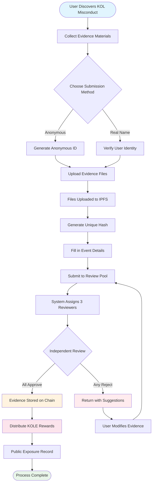

# **KOL Misconduct Exposure Platform Whitepaper**

### **A Decentralized Supervision Ecosystem Based on Blockchain Technology**

*Version 1.2 | September 2025 (Revised)*

---

## **Table of Contents**

1.  [Executive Summary](#executive-summary)
2.  [Project Background and Vision](#project-background-and-vision)
3.  [Technical Architecture](#technical-architecture)
4.  [Core Function Modules](#core-function-modules)
5.  [Tokenomics](#tokenomics)
6.  [Community Governance](#community-governance)
7.  [Platform Advantages](#platform-advantages)
8.  [Development Roadmap](#development-roadmap)
9.  [Risk Disclosure](#risk-disclosure)
10. [Conclusion](#conclusion)

---

## **Executive Summary**

The KOL Misconduct Exposure Platform is a decentralized supervision ecosystem based on blockchain technology. It aims to protect the rights and interests of investors and consumers by exposing and recording the misconduct of KOLs (Key Opinion Leaders) through a transparent and fair mechanism.

### **Core Value Proposition**
- ✅ **Immutable**: Evidence is permanently preserved based on blockchain technology.
- ✅ **Decentralized**: Community-governed, avoiding single points of control.
- ✅ **Transparent & Fair**: All processes are publicly auditable, and reviews are conducted independently.
- ✅ **Sufficient Incentives**: The tokenomic model incentivizes active user participation.

---

## **Project Background and Vision**

### **1.1 Industry Pain Points**

| Problem Type | Specific Manifestation | Scope of Impact |
|---|---|---|
| **False Advertising** | KOLs exaggerating product effects, promising false returns | Consumer financial losses |
| **Malicious "Rug Pulls"** | Exploiting fan trust for "rug pull" schemes | Investor asset losses |
| **Data Fraud** | Inflating engagement, buying followers to deceive advertisers | Wasted marketing budgets for brands |
| **Lack of Supervision** | Ineffective regulation on existing platforms, poor reporting channels | Continued prevalence of misconduct |
| **Evidence is Easily Lost** | Evidence is easily deleted or handled by public relations | Difficulty in defending rights |

### **1.2 Platform Vision**

> **"To build a decentralized and transparent ecosystem for supervising KOL behavior, ensuring the authenticity and immutability of evidence through blockchain technology, achieving a fair and just review mechanism through community governance, and ultimately establishing a healthy and orderly KOL ecosystem."**

---

## **Technical Architecture**

### **2.1 Technology Stack Overview**

- **Application Layer**
  - Web | Mobile | API | Admin Backend
- **Service Layer**
  - Business Logic | Smart Contract Interaction | Data Processing
- **Blockchain Layer**
  - Solana | Smart Contracts | Token Contracts
- **Storage Layer**
  - IPFS Distributed Storage | On-chain Data Storage

### **2.2 Core Technical Components**

#### **🔗 Blockchain Infrastructure**
- **Mainchain Selection**: Solana
- **Performance Metrics**: 65,000 TPS, 400ms block time
- **Cost Advantage**: Transaction fees <$0.01

#### **📦 Smart Contract System**
- **Evidence On-chaining Contract**: Automatically executes the evidence submission process.
- **Token Distribution Contract**: Manages reward distribution.
- **Governance Contract**: Handles voting and decision-making.

#### **💾 Distributed Storage**
- **IPFS Network**: Stores original evidence files.
- **Redundant Backup**: Synchronized across global nodes.
- **Access Speed**: CDN accelerated access.

---

## **Core Function Modules**

### **3.1 Submission System**

#### **Submission Process**

#### **Detailed Steps**
1.  **Prepare Evidence** - Collect screenshots, recordings, chat logs
2.  **Choose Method** - Anonymous or real-name submission
3.  **Upload Files** - Evidence automatically uploaded to IPFS
4.  **Fill Information** - Describe the incident and impact
5.  **Submit for Review** - Enter decentralized review process
6.  **Jury Review** - 3 independent reviewers evaluate
7.  **Approval** - Evidence permanently stored on-chain
8.  **Receive Reward** - Automatic KOLE token distribution

#### **Supported Evidence Types**
- 📷 Image Evidence (screenshots, photos)
- 🎥 Video Evidence (screen recordings, videos)
- 💬 Chat Logs (WeChat, Telegram, etc.)
- 📄 Document Evidence (contracts, agreements, etc.)

### **3.2 Review System**

#### **Review Mechanism Design**

| Review Element | Specific Requirement | Purpose |
|---|---|---|
| **Number of Reviewers** | Minimum of 3 people | Ensure fairness |
| **Independent Review** | Unaware of other reviewers' results | Prevent collusion |
| **Unanimity Requirement** | **All reviewers must unanimously agree** for certification | Guarantee the basic quality of evidence |
| **Rating Standard** | 1-5 star rating system, **the final level is the average of all ratings (rounded)** | Quantify the severity of the incident |
| **Time Limit** | Complete within 48 hours | Improve efficiency |

### **3.3 Exposure Display System**

#### **Severity Level Classification**

| Level | Star Display | Description | Typical Behavior |
|---|---|---|---|
| **Level 5** | ***** | Heinous | Scams, serious fraud |
| **Level 4** | **** | Severe Misconduct | Malicious rug pulls, false advertising |
| **Level 3** | *** | Moderate Misconduct | Exaggerated claims, data fraud |
| **Level 2** | ** | Minor Misconduct | Breach of trust, inappropriate remarks |
| **Level 1** | * | General Misconduct | Poor service quality, bad attitude |

---

## **Tokenomics**

### **4.1 Token Overview**

| Item | Details |
|---|---|
| **Token Name** | KOLE Token |
| **Token Symbol** | KOLE |
| **Total Supply** | 1,000,000,000 (1 Billion) |
| **Token Standard** | SPL (Solana Program Library) |
| **Decimals** | 9 |
| **Issuance Method** | Minted at once, fixed supply |

### **4.2 Token Allocation Plan**

| Allocation | Percentage | Status & Unlocking Mechanism |
|---|---|---|
| **User Submission Rewards** | 40% | **Locked**. 0.5% unlocked daily for rewards. Unused tokens are re-locked weekly. |
| **Holder Lottery** | 40% | **Fully Circulating**. Used for lottery events for community token holders. |
| **Ecosystem Development** | 10% | **Locked**. For R&D, operations, etc. 1% unlocked monthly. |
| **Team & Advisors** | 10% | **Locked**. 2% unlocked monthly. |

### **4.3 Reward Mechanism Details**

| Reward Type | Token Amount (KOLE) | Conditions for Receiving |
|---|---|---|
| **First Report Reward** | 100,000 | Submitting authentic and valid evidence of KOL misconduct for the first time, and passing the review. |
| **Supplementary Evidence Reward** | 20,000 | Providing valid supplementary evidence for an existing case, enhancing its completeness. |
| **Reviewer Reward** | 50,000 | Participating in and completing evidence review work as a certified reviewer. |

### **4.4 Lucky Draw System (New)**

To reward community token holders, the platform has established a high-frequency, high-value lucky draw system.

| Draw Type | Frequency | Total Prize Pool | Winning Model & Allocation Ratio |
|---|---|---|---|
| **Regular Grand Prize** | Once every hour | **10 SOL** | **3 winners**, allocated in a **5 : 3 : 2** ratio (i.e., 5 SOL, 3 SOL, 2 SOL) |
| **Super Grand Prize** | Daily at 00:00 (SGT) | **66 SOL** | **3 winners**, allocated in a **40 : 20 : 6** ratio (i.e., 40 SOL, 20 SOL, 6 SOL) |

**Eligibility**:
- **Holding Threshold**: Receive 1 lottery ticket for every **300,000 KOLE tokens** held.
- **Weight Cap**: To ensure fairness, each wallet address can have a maximum winning weight equivalent to **5 lottery tickets**.
- **Holding Period**: Tokens in the address must be held for at least **1 hour** to be eligible for the current round of the draw.

### **4.5 Burn Mechanism**

| Burn Type | Triggering Condition | Description |
|---|---|---|
| **Buyback & Burn** | PUMP Platform Live Streaming Rewards | All live streaming rewards obtained on the PUMP platform will be used to buy back and burn KOLE tokens from the secondary market. |
| **Foundation Match & Burn**| For every successfully exposed KOL | The foundation will purchase 0.5% of the total supply and burn the tokens to increase token value. |
| **Irregular Burns** | Platform Decision | The platform will periodically buy back and burn tokens from the market based on operational conditions. |

### **4.6 Funding Pool Support**

| Fund Type | Amount | Primary Use |
|---|---|---|
| **Platform's Own Funds** | $1,000,000 | Operations, development, marketing. The initial installment of approximately **$700,000 (equivalent to 3000 SOL)** has been injected into the prize pool for lottery rewards. |
| **Investor Funds** | $1,000,000 | (Phase 1) For ecosystem building, liquidity support, and future development. |

---

## **Community Governance**

### **5.1 DAO Governance Structure**

*   **KOLE Holders** (Vote)
    *   ⬇️
*   **Governance Committee** (Executes)
    *   ⬇️
        *   Jury
        *   Development Team
        *   Operations Team

### **5.2 Voting Weight**

| Holding Amount (KOLE) | Voting Weight | Privileges |
|---|---|---|
| 1 - 999 | 1x | Basic voting rights |
| 1,000 - 9,999 | 1.2x | Right to propose |
| 10,000 - 99,999 | 1.5x | Eligibility for Jury candidacy |
| 100,000+ | 2x | Eligibility for Governance Committee candidacy |

### **5.3 Proposal Types**
- **Technical Proposals**: Feature updates, technical architecture adjustments
- **Economic Proposals**: Tokenomics adjustments, reward distribution
- **Operational Proposals**: Platform rules, community events
- **Emergency Proposals**: Security incidents, urgent decisions

---

## **Platform Advantages**

### **6.1 Technical Advantages**

| Advantage | Description | Value |
|---|---|---|
| **🔒 Immutable** | Permanent storage on the blockchain | 100% credible evidence |
| **⚡ High Performance** | Solana's 65,000 transactions per second | Smooth user experience |
| **💰 Low Cost** | Transaction fees <$0.01 | Lowers the barrier to entry |
| **🌍 Global** | IPFS distributed storage | Globally accessible |

### **6.2 Mechanism Advantages**
- **Transparent & Fair**: All processes are verifiable on-chain.
- **Sufficient Incentives**: Multi-layered token incentive system.
- **Community-Driven**: True decentralized governance.
- **Privacy Protection**: Supports anonymous reporting.

### **6.3 Ecosystem Advantages**
- **Open Collaboration**: Open-source code, contributions welcome.
- **Cross-Chain Compatibility**: Future support for multi-chain deployment.
- **Open API**: Third-party access for queries.
- **Compliant Operations**: Adherence to local laws and regulations.

---

## **Development Roadmap**

### **Phase 1: Foundation Building (Q1 2025) ✅**
- [x] Whitepaper release
- [x] Core team formation
- [x] Technical architecture design
- [x] Smart contract development

### **Phase 2: Product Launch (Q2 2025) ✅**
- [x] Mainnet deployment
- [x] Beta testing and official website launch
- [x] Recruitment of first users
- [x] Token issuance (KOLE)

### **Phase 3: Ecosystem Expansion (Q3 2025) 🚀**
- [x] DEX listing
- [ ] CEX listing application
- [ ] Partnership expansion
- [ ] Mobile APP release

### **Phase 4: Globalization (Q4 2025) 🌱**
- [ ] Multi-language support
- [ ] Cross-chain bridging
- [ ] AI-assisted review
- [ ] Full decentralization via DAO

### **Phase 5: Long-Term Plan (2026+) 🔮**
- [ ] Industry standard setting
- [ ] Regulatory cooperation
- [ ] Web3 identity integration
- [ ] Metaverse expansion

---

## **Risk Disclosure**

### **8.1 Technical Risks**

| Risk Type | Potential Impact | Mitigation Measures |
|---|---|---|
| Smart Contract Vulnerabilities | Loss of funds | Multiple audits, formal verification |
| Network Attacks | Service interruption | DDoS protection, multi-node deployment |
| Scalability Issues | Performance degradation | Layer 2 solutions, sharding technology |

### **8.2 Regulatory Risks**
- **Policy Changes**: Closely monitor regulatory developments in various regions.
- **Compliance Requirements**: Engage legal counsel to ensure compliance.
- **KYC/AML**: Implement identity verification when necessary.

### **8.3 Operational Risks**
- **Malicious Submissions**: AI-assisted screening + manual review.
- **Reviewer Collusion**: Random assignment + reputation system.
- **Market Competition**: Continuous innovation + user experience optimization.

---

## **Conclusion**

The KOL Misconduct Exposure Platform is committed to building a **fair, transparent, and trustworthy** ecosystem for supervising KOL behavior. Through blockchain technology and community governance mechanisms, we believe we can effectively curb KOL misconduct, protect user rights, and promote the healthy development of the industry.

### **Join Us**

🌐 **Website**: `https://kolexposure.com/#/`
💬 **Telegram**: `https://t.me/kolexposure`
🐦 **Twitter / X**: `https://x.com/TODO_dream`, `https://x.com/kolexposure`
🤖 **Discord**: `https://discord.com/invite/sZf44CseTf`
🌱 **CA**: `2EL3kJNYbgoqvtK4eyfNxgYiwm2V7B84kfMd1KLRpump`

### **Disclaimer**

This whitepaper is for informational purposes only and does not constitute investment advice. Investing in digital assets involves high risks; please evaluate carefully. The platform reserves the right to adjust its development plans according to actual circumstances.

---

**© 2025 KOL Misconduct Exposure Platform | A Decentralized Supervision Ecosystem Based on Blockchain Technology**
