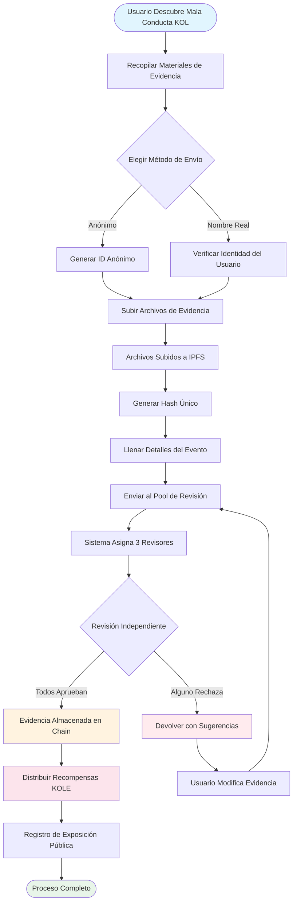

# **Libro Blanco de la Plataforma de Exposición de Mala Conducta KOL**

### **Un Ecosistema de Supervisión Descentralizado Basado en Tecnología Blockchain**

*Versión 1.2 | Septiembre 2025 (Revisada)*

---

## **Tabla de Contenidos**

1.  [Resumen Ejecutivo](#resumen-ejecutivo)
2.  [Antecedentes del Proyecto y Visión](#antecedentes-del-proyecto-y-visión)
3.  [Arquitectura Técnica](#arquitectura-técnica)
4.  [Módulos de Función Principal](#módulos-de-función-principal)
5.  [Tokenómica](#tokenómica)
6.  [Gobernanza Comunitaria](#gobernanza-comunitaria)
7.  [Ventajas de la Plataforma](#ventajas-de-la-plataforma)
8.  [Hoja de Ruta de Desarrollo](#hoja-de-ruta-de-desarrollo)
9.  [Divulgación de Riesgos](#divulgación-de-riesgos)
10. [Conclusión](#conclusión)

---

## **Resumen Ejecutivo**

La Plataforma de Exposición de Mala Conducta KOL es un ecosistema de supervisión descentralizado basado en tecnología blockchain. Su objetivo es proteger los derechos e intereses de inversionistas y consumidores mediante la exposición y registro de la mala conducta de KOLs (Líderes de Opinión Clave) a través de un mecanismo transparente y justo.

### **Propuesta de Valor Central**
- ✅ **Inmutable**: Las evidencias se preservan permanentemente basándose en tecnología blockchain.
- ✅ **Descentralizado**: Gobernado por la comunidad, evitando puntos únicos de control.
- ✅ **Transparente y Justo**: Todos los procesos son auditables públicamente, y las revisiones se realizan independientemente.
- ✅ **Incentivos Suficientes**: El modelo tokenómico incentiva la participación activa de los usuarios.

---

## **Antecedentes del Proyecto y Visión**

### **1.1 Puntos Problemáticos de la Industria**

| Tipo de Problema | Manifestación Específica | Alcance del Impacto |
|---|---|---|
| **Publicidad Falsa** | KOLs exageran efectos de productos, prometen retornos falsos | Pérdidas financieras de consumidores |
| **"Rug Pulls" Maliciosos** | Explotar la confianza de fanáticos para esquemas de "rug pull" | Pérdidas de activos de inversionistas |
| **Fraude de Datos** | Inflar engagement, comprar seguidores para engañar anunciantes | Presupuestos de marketing desperdiciados para marcas |
| **Falta de Supervisión** | Regulación inefectiva en plataformas existentes, canales de reporte deficientes | Prevalencia continua de mala conducta |
| **Evidencia Se Pierde Fácilmente** | Evidencia se elimina fácilmente o se maneja por relaciones públicas | Dificultad para defender derechos |

### **1.2 Visión de la Plataforma**

> **"Construir un ecosistema descentralizado y transparente para supervisar el comportamiento de KOL, asegurando la autenticidad e inmutabilidad de la evidencia a través de tecnología blockchain, logrando un mecanismo de revisión justo y equitativo a través de gobernanza comunitaria, y finalmente estableciendo un ecosistema KOL saludable y ordenado."**

---

## **Arquitectura Técnica**

### **2.1 Resumen del Stack Tecnológico**

- **Capa de Aplicación**
  - Web | Móvil | API | Backend Administrativo
- **Capa de Servicio**
  - Lógica de Negocio | Interacción de Smart Contracts | Procesamiento de Datos
- **Capa de Blockchain**
  - Solana | Smart Contracts | Contratos de Token
- **Capa de Almacenamiento**
  - Almacenamiento Distribuido IPFS | Almacenamiento de Datos On-Chain

### **2.2 Componentes Técnicos Centrales**

#### **🔗 Infraestructura Blockchain**
- **Selección de Mainchain**: Solana
- **Métricas de Rendimiento**: 65,000 TPS, tiempo de bloque de 400ms
- **Ventaja de Costo**: Tarifas de transacción <$0.01

#### **📦 Sistema de Smart Contracts**
- **Contrato de Evidencia On-Chain**: Ejecuta automáticamente el proceso de envío de evidencia.
- **Contrato de Distribución de Tokens**: Gestiona la distribución de recompensas.
- **Contrato de Gobernanza**: Maneja votación y toma de decisiones.

#### **💾 Almacenamiento Distribuido**
- **Red IPFS**: Almacena archivos de evidencia originales.
- **Respaldo Redundante**: Sincronizado a través de nodos globales.
- **Velocidad de Acceso**: Acceso acelerado por CDN.

---

## **Módulos de Función Principal**

### **3.1 Sistema de Envío**

#### **Proceso de Envío**

#### **Pasos Detallados**
1.  **Preparar Evidencia** - Recopilar capturas de pantalla, grabaciones, logs de chat
2.  **Elegir Método** - Envío anónimo o de nombre real
3.  **Subir Archivos** - Evidencia subida automáticamente a IPFS
4.  **Llenar Información** - Describir el incidente y impacto
5.  **Enviar para Revisión** - Entrar al proceso de revisión descentralizado
6.  **Revisión del Jurado** - 3 revisores independientes evalúan
7.  **Aprobación** - Evidencia permanentemente almacenada on-chain
8.  **Recibir Recompensa** - Distribución automática de tokens KOLE

#### **Tipos de Evidencia Soportados**
- 📷 Evidencia de Imagen (capturas de pantalla, fotos)
- 🎥 Evidencia de Video (grabaciones de pantalla, videos)
- 💬 Logs de Chat (WeChat, Telegram, etc.)
- 📄 Evidencia Documental (contratos, acuerdos, etc.)

### **3.2 Sistema de Revisión**

#### **Diseño del Mecanismo de Revisión**

| Elemento de Revisión | Requerimiento Específico | Propósito |
|---|---|---|
| **Número de Revisores** | Mínimo de 3 personas | Asegurar equidad |
| **Revisión Independiente** | No conocen los resultados de otros revisores | Prevenir colusión |
| **Requerimiento de Unanimidad** | **Todos los revisores deben estar de acuerdo unánimemente** para certificación | Garantizar la calidad básica de la evidencia |
| **Estándar de Calificación** | Sistema de calificación de 1-5 estrellas, **el nivel final es el promedio de todas las calificaciones (redondeado)** | Cuantificar la severidad del incidente |
| **Límite de Tiempo** | Completar dentro de 48 horas | Mejorar eficiencia |

### **3.3 Sistema de Exhibición de Exposición**

#### **Clasificación de Niveles de Severidad**

| Nivel | Exhibición de Estrellas | Descripción | Comportamiento Típico |
|---|---|---|---|
| **Nivel 5** | ***** | Atroz | Estafas, fraude serio |
| **Nivel 4** | **** | Mala Conducta Severa | Rug pulls maliciosos, publicidad falsa |
| **Nivel 3** | *** | Mala Conducta Moderada | Afirmaciones exageradas, fraude de datos |
| **Nivel 2** | ** | Mala Conducta Menor | Quebrantamiento de confianza, comentarios inapropiados |
| **Nivel 1** | * | Mala Conducta General | Calidad de servicio pobre, mala actitud |

---

## **Tokenómica**

### **4.1 Resumen del Token**

| Ítem | Detalles |
|---|---|
| **Nombre del Token** | KOLE Token |
| **Símbolo del Token** | KOLE |
| **Suministro Total** | 1,000,000,000 (1 Billón) |
| **Estándar del Token** | SPL (Solana Program Library) |
| **Decimales** | 9 |
| **Método de Emisión** | Acuñado de una vez, suministro fijo |

### **4.2 Plan de Asignación de Tokens**

| Asignación | Porcentaje | Estado y Mecanismo de Desbloqueo |
|---|---|---|
| **Recompensas de Envío de Usuarios** | 40% | **Bloqueado**. 0.5% desbloqueado diariamente para recompensas. Tokens no utilizados se re-bloquean semanalmente. |
| **Lotería de Tenedores** | 40% | **Completamente Circulando**. Usado para eventos de lotería para tenedores de tokens de la comunidad. |
| **Desarrollo del Ecosistema** | 10% | **Bloqueado**. Para I+D, operaciones, etc. 1% desbloqueado mensualmente. |
| **Equipo y Asesores** | 10% | **Bloqueado**. 2% desbloqueado mensualmente. |

### **4.3 Detalles del Mecanismo de Recompensas**

| Tipo de Recompensa | Cantidad de Tokens (KOLE) | Condiciones para Recibir |
|---|---|---|
| **Recompensa de Primer Reporte** | 100,000 | Enviar evidencia auténtica y válida de mala conducta KOL por primera vez, y pasar la revisión. |
| **Recompensa de Evidencia Suplementaria** | 20,000 | Proporcionar evidencia suplementaria válida para un caso existente, mejorando su completitud. |
| **Recompensa de Revisor** | 50,000 | Participar y completar trabajo de revisión de evidencia como revisor certificado. |

### **4.4 Sistema de Lotería (Nuevo)**

Para recompensar a los tenedores de tokens de la comunidad, la plataforma ha establecido un sistema de lotería de alta frecuencia y alto valor.

| Tipo de Sorteo | Frecuencia | Pool de Premios Total | Modelo de Ganadores y Ratio de Asignación |
|---|---|---|---|
| **Gran Premio Regular** | Una vez cada hora | **10 SOL** | **3 ganadores**, asignados en una relación **5 : 3 : 2** (es decir, 5 SOL, 3 SOL, 2 SOL) |
| **Super Gran Premio** | Diariamente a las 00:00 (SGT) | **66 SOL** | **3 ganadores**, asignados en una relación **40 : 20 : 6** (es decir, 40 SOL, 20 SOL, 6 SOL) |

**Elegibilidad**:
- **Umbral de Tenencia**: Recibir 1 boleto de lotería por cada **300,000 tokens KOLE** mantenidos.
- **Límite de Peso**: Para asegurar equidad, cada dirección de wallet puede tener un peso máximo de ganar equivalente a **5 boletos de lotería**.
- **Período de Tenencia**: Los tokens en la dirección deben mantenerse por al menos **1 hora** para ser elegibles para la ronda actual del sorteo.

### **4.5 Mecanismo de Quema**

| Tipo de Quema | Condición Desencadenante | Descripción |
|---|---|---|
| **Recompra y Quema** | Recompensas de Streaming en Vivo de Plataforma PUMP | Todas las recompensas de streaming en vivo obtenidas en la plataforma PUMP serán usadas para recomprar y quemar tokens KOLE del mercado secundario. |
| **Igualación de Fundación y Quema**| Por cada KOL expuesto exitosamente | La fundación comprará 0.5% del suministro total y quemará los tokens para aumentar el valor del token. |
| **Quemas Irregulares** | Decisión de la Plataforma | La plataforma periódicamente recomprará y quemará tokens del mercado basado en condiciones operacionales. |

### **4.6 Soporte del Pool de Financiamiento**

| Tipo de Fondo | Cantidad | Uso Principal |
|---|---|---|
| **Fondos Propios de la Plataforma** | $1,000,000 | Operaciones, desarrollo, marketing. La cuota inicial de aproximadamente **$700,000 (equivalente a 3000 SOL)** ha sido inyectada en el pool de premios para recompensas de lotería. |
| **Fondos de Inversionistas** | $1,000,000 | (Fase 1) Para construcción del ecosistema, soporte de liquidez, y desarrollo futuro. |

---

## **Gobernanza Comunitaria**

### **5.1 Estructura de Gobernanza DAO**

*   **Tenedores KOLE** (Votan)
    *   ⬇️
*   **Comité de Gobernanza** (Ejecuta)
    *   ⬇️
        *   Jurado
        *   Equipo de Desarrollo
        *   Equipo de Operaciones

### **5.2 Peso de Voto**

| Cantidad de Tenencia (KOLE) | Peso de Voto | Privilegios |
|---|---|---|
| 1 - 999 | 1x | Derechos de voto básicos |
| 1,000 - 9,999 | 1.2x | Derecho a proponer |
| 10,000 - 99,999 | 1.5x | Elegibilidad para candidatura a Jurado |
| 100,000+ | 2x | Elegibilidad para candidatura al Comité de Gobernanza |

### **5.3 Tipos de Propuestas**
- **Propuestas Técnicas**: Actualizaciones de características, ajustes de arquitectura técnica
- **Propuestas Económicas**: Ajustes de tokenómica, distribución de recompensas
- **Propuestas Operacionales**: Reglas de plataforma, eventos comunitarios
- **Propuestas de Emergencia**: Incidentes de seguridad, decisiones urgentes

---

## **Ventajas de la Plataforma**

### **6.1 Ventajas Técnicas**

| Ventaja | Descripción | Valor |
|---|---|---|
| **🔒 Inmutable** | Almacenamiento permanente en blockchain | 100% evidencia creíble |
| **⚡ Alto Rendimiento** | 65,000 transacciones por segundo de Solana | Experiencia de usuario fluida |
| **💰 Bajo Costo** | Tarifas de transacción <$0.01 | Reduce la barrera de entrada |
| **🌍 Global** | Almacenamiento distribuido IPFS | Accesible globalmente |

### **6.2 Ventajas del Mecanismo**
- **Transparente y Justo**: Todos los procesos son verificables on-chain.
- **Incentivos Suficientes**: Sistema de incentivos de token multi-capa.
- **Impulsado por la Comunidad**: Verdadera gobernanza descentralizada.
- **Protección de Privacidad**: Soporta reportes anónimos.

### **6.3 Ventajas del Ecosistema**
- **Colaboración Abierta**: Código abierto, contribuciones bienvenidas.
- **Compatibilidad Cross-Chain**: Soporte futuro para despliegue multi-chain.
- **API Abierto**: Acceso de terceros para consultas.
- **Operaciones Conformes**: Adherencia a leyes y regulaciones locales.

---

## **Hoja de Ruta de Desarrollo**

### **Fase 1: Construcción de Fundación (Q1 2025) ✅**
- [x] Lanzamiento del libro blanco
- [x] Formación del equipo central
- [x] Diseño de arquitectura técnica
- [x] Desarrollo de smart contracts

### **Fase 2: Lanzamiento del Producto (Q2 2025) ✅**
- [x] Despliegue en mainnet
- [x] Pruebas beta y lanzamiento del sitio web oficial
- [x] Reclutamiento de primeros usuarios
- [x] Emisión de token (KOLE)

### **Fase 3: Expansión del Ecosistema (Q3 2025) 🚀**
- [x] Listado en DEX
- [ ] Aplicación para listado en CEX
- [ ] Expansión de asociaciones
- [ ] Lanzamiento de APP móvil

### **Fase 4: Globalización (Q4 2025) 🌱**
- [ ] Soporte multi-idioma
- [ ] Puentes cross-chain
- [ ] Revisión asistida por IA
- [ ] Descentralización completa vía DAO

### **Fase 5: Plan a Largo Plazo (2026+) 🔮**
- [ ] Establecimiento de estándares de la industria
- [ ] Cooperación regulatoria
- [ ] Integración de identidad Web3
- [ ] Expansión al metaverso

---

## **Divulgación de Riesgos**

### **8.1 Riesgos Técnicos**

| Tipo de Riesgo | Impacto Potencial | Medidas de Mitigación |
|---|---|---|
| Vulnerabilidades de Smart Contracts | Pérdida de fondos | Auditorías múltiples, verificación formal |
| Ataques de Red | Interrupción del servicio | Protección DDoS, despliegue multi-nodo |
| Problemas de Escalabilidad | Degradación del rendimiento | Soluciones de capa 2, tecnología de sharding |

### **8.2 Riesgos Regulatorios**
- **Cambios de Política**: Monitoreo cercano de desarrollos regulatorios en varias regiones.
- **Requerimientos de Cumplimiento**: Involucrar asesoría legal para asegurar cumplimiento.
- **KYC/AML**: Implementar verificación de identidad cuando sea necesario.

### **8.3 Riesgos Operacionales**
- **Envíos Maliciosos**: Filtrado asistido por IA + revisión manual.
- **Colusión de Revisores**: Asignación aleatoria + sistema de reputación.
- **Competencia del Mercado**: Innovación continua + optimización de experiencia de usuario.

---

## **Conclusión**

La Plataforma de Exposición de Mala Conducta KOL está comprometida a construir un ecosistema **justo, transparente y confiable** para supervisar el comportamiento de KOL. A través de tecnología blockchain y mecanismos de gobernanza comunitaria, creemos que podemos efectivamente frenar la mala conducta de KOL, proteger los derechos de usuarios, y promover el desarrollo saludable de la industria.

### **Únete a Nosotros**

🌐 **Sitio Web**: `https://kolexposure.com/#/`
💬 **Telegram**: `https://t.me/kolexposure`
🐦 **Twitter / X**: `https://x.com/TODO_dream`, `https://x.com/kolexposure`
🤖 **Discord**: `https://discord.com/invite/sZf44CseTf`
🌱 **CA**: `2EL3kJNYbgoqvtK4eyfNxgYiwm2V7B84kfMd1KLRpump`

### **Descargo de Responsabilidad**

Este libro blanco es solo para propósitos informativos y no constituye consejo de inversión. Invertir en activos digitales involucra altos riesgos; por favor evalúe cuidadosamente. La plataforma se reserva el derecho de ajustar sus planes de desarrollo según las circunstancias reales.

---

**© 2025 Plataforma de Exposición de Mala Conducta KOL | Un Ecosistema de Supervisión Descentralizado Basado en Tecnología Blockchain**