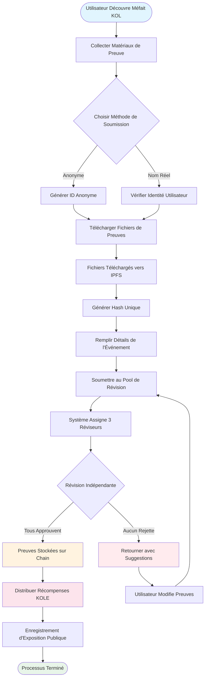

# **Livre Blanc de la Plateforme d'Exposition des Méfaits KOL**

### **Un Écosystème de Supervision Décentralisé Basé sur la Technologie Blockchain**

*Version 1.2 | Septembre 2025 (Révisé)*

### 🌍 Langues Disponibles
[🇬🇧 English](Whitepaper_EN.md) | [🇨🇳 中文](Whitepaper_CN.md) | [🇯🇵 日本語](Whitepaper_JP.md) | [🇷🇺 Русский](Whitepaper_RU.md) | [🇪🇸 Español](Whitepaper_ES.md) | [🇰🇷 한국어](Whitepaper_KR.md) | [🇸🇦 العربية](Whitepaper_AR.md) | [🇹🇷 Türkçe](Whitepaper_TR.md) | [🇧🇷 Português](Whitepaper_PT.md) | [🇫🇷 Français](Whitepaper_FR.md) | [🇩🇪 Deutsch](Whitepaper_DE.md) | [🇮🇳 हिंदी](Whitepaper_HI.md) | [🇮🇱 עברית](Whitepaper_HE.md) | [🇻🇳 Tiếng Việt](Whitepaper_VI.md) | [🇹🇭 ไทย](Whitepaper_TH.md)

---

## **Table des Matières**

1.  [Résumé Exécutif](#résumé-exécutif)
2.  [Contexte du Projet et Vision](#contexte-du-projet-et-vision)
3.  [Architecture Technique](#architecture-technique)
4.  [Modules de Fonction Principaux](#modules-de-fonction-principaux)
5.  [Tokenomics](#tokenomics)
6.  [Gouvernance Communautaire](#gouvernance-communautaire)
7.  [Avantages de la Plateforme](#avantages-de-la-plateforme)
8.  [Feuille de Route de Développement](#feuille-de-route-de-développement)
9.  [Divulgation des Risques](#divulgation-des-risques)
10. [Conclusion](#conclusion)

---

## **Résumé Exécutif**

La Plateforme d'Exposition des Méfaits KOL est un écosystème de supervision décentralisé basé sur la technologie blockchain. Elle vise à protéger les droits et intérêts des investisseurs et consommateurs en exposant et enregistrant les méfaits des KOL (Leaders d'Opinion Clés) à travers un mécanisme transparent et équitable.

### **Proposition de Valeur Centrale**
- ✅ **Immuable** : Les preuves sont préservées de manière permanente basées sur la technologie blockchain.
- ✅ **Décentralisé** : Gouverné par la communauté, évitant les points de contrôle uniques.
- ✅ **Transparent et Équitable** : Tous les processus sont auditables publiquement, et les révisions sont menées indépendamment.
- ✅ **Incitations Suffisantes** : Le modèle tokenomique incite la participation active des utilisateurs.

---

## **Contexte du Projet et Vision**

### **1.1 Points Douloureux de l'Industrie**

| Type de Problème | Manifestation Spécifique | Portée d'Impact |
|---|---|---|
| **Publicité Mensongère** | Les KOL exagèrent les effets des produits, promettent de faux rendements | Pertes financières des consommateurs |
| **"Rug Pulls" Malveillants** | Exploiter la confiance des fans pour des schémas de "rug pull" | Pertes d'actifs des investisseurs |
| **Fraude de Données** | Gonfler l'engagement, acheter des abonnés pour tromper les annonceurs | Budgets marketing gaspillés pour les marques |
| **Manque de Supervision** | Régulation inefficace sur les plateformes existantes, mauvais canaux de signalement | Prévalence continue des méfaits |
| **Preuves Facilement Perdues** | Les preuves sont facilement supprimées ou traitées par les relations publiques | Difficulté à défendre les droits |

### **1.2 Vision de la Plateforme**

> **"Construire un écosystème décentralisé et transparent pour superviser le comportement des KOL, assurant l'authenticité et l'immuabilité des preuves grâce à la technologie blockchain, réalisant un mécanisme de révision équitable et juste grâce à la gouvernance communautaire, et finalement établir un écosystème KOL sain et ordonné."**

---

## **Architecture Technique**

### **2.1 Aperçu de la Stack Technologique**

- **Couche Application**
  - Web | Mobile | API | Backend Administratif
- **Couche Service**
  - Logique Métier | Interaction Smart Contract | Traitement des Données
- **Couche Blockchain**
  - Solana | Smart Contracts | Contrats de Token
- **Couche Stockage**
  - Stockage Distribué IPFS | Stockage de Données On-Chain

### **2.2 Composants Techniques Centraux**

#### **🔗 Infrastructure Blockchain**
- **Sélection de Mainchain** : Solana
- **Métriques de Performance** : 65,000 TPS, temps de bloc de 400ms
- **Avantage Coût** : Frais de transaction <$0.01

#### **📦 Système de Smart Contracts**
- **Contrat de Preuves On-Chain** : Exécute automatiquement le processus de soumission de preuves.
- **Contrat de Distribution de Tokens** : Gère la distribution des récompenses.
- **Contrat de Gouvernance** : Gère le vote et la prise de décision.

#### **💾 Stockage Distribué**
- **Réseau IPFS** : Stocke les fichiers de preuves originaux.
- **Sauvegarde Redondante** : Synchronisé à travers les nœuds globaux.
- **Vitesse d'Accès** : Accès accéléré par CDN.

---

## **Modules de Fonction Principaux**

### **3.1 Système de Soumission**

#### **Processus de Soumission**

#### **Étapes Détaillées**
1.  **Préparer Preuves** - Collecter captures d'écran, enregistrements, logs de chat
2.  **Choisir Méthode** - Soumission anonyme ou avec nom réel
3.  **Télécharger Fichiers** - Preuves automatiquement téléchargées vers IPFS
4.  **Remplir Informations** - Décrire l'incident et l'impact
5.  **Soumettre pour Révision** - Entrer dans le processus de révision décentralisé
6.  **Révision du Jury** - 3 réviseurs indépendants évaluent
7.  **Approbation** - Preuves stockées de manière permanente on-chain
8.  **Recevoir Récompense** - Distribution automatique de tokens KOLE

#### **Types de Preuves Supportés**
- 📷 Preuves d'Image (captures d'écran, photos)
- 🎥 Preuves Vidéo (enregistrements d'écran, vidéos)
- 💬 Logs de Chat (WeChat, Telegram, etc.)
- 📄 Preuves Documentaires (contrats, accords, etc.)

### **3.2 Système de Révision**

#### **Conception du Mécanisme de Révision**

| Élément de Révision | Exigence Spécifique | Objectif |
|---|---|---|
| **Nombre de Réviseurs** | Minimum 3 personnes | Assurer l'équité |
| **Révision Indépendante** | Ne connaissent pas les résultats des autres réviseurs | Prévenir la collusion |
| **Exigence d'Unanimité** | **Tous les réviseurs doivent unanimement s'accorder** pour la certification | Garantir la qualité de base des preuves |
| **Standard d'Évaluation** | Système d'évaluation 1-5 étoiles, **le niveau final est la moyenne de toutes les évaluations (arrondi)** | Quantifier la sévérité de l'incident |
| **Limite de Temps** | Terminer dans les 48 heures | Améliorer l'efficacité |

### **3.3 Système d'Affichage d'Exposition**

#### **Classification des Niveaux de Sévérité**

| Niveau | Affichage Étoiles | Description | Comportement Typique |
|---|---|---|---|
| **Niveau 5** | ***** | Atroce | Escroqueries, fraude sérieuse |
| **Niveau 4** | **** | Méfait Sévère | Rug pulls malveillants, publicité mensongère |
| **Niveau 3** | *** | Méfait Modéré | Affirmations exagérées, fraude de données |
| **Niveau 2** | ** | Méfait Mineur | Trahison de confiance, commentaires inappropriés |
| **Niveau 1** | * | Méfait Général | Qualité de service médiocre, mauvaise attitude |

---

## **Tokenomics**

### **4.1 Aperçu du Token**

| Élément | Détails |
|---|---|
| **Nom du Token** | KOLE Token |
| **Symbole du Token** | KOLE |
| **Approvisionnement Total** | 1,000,000,000 (1 Milliard) |
| **Standard du Token** | SPL (Solana Program Library) |
| **Décimales** | 9 |
| **Méthode d'Émission** | Frappé en une fois, approvisionnement fixe |

### **4.2 Plan d'Allocation des Tokens**

| Allocation | Pourcentage | Statut et Mécanisme de Déverrouillage |
|---|---|---|
| **Récompenses de Soumission Utilisateurs** | 40% | **Verrouillé**. 0.5% déverrouillé quotidiennement pour les récompenses. Les tokens non utilisés sont re-verrouillés hebdomadairement. |
| **Loterie des Détenteurs** | 40% | **Entièrement en Circulation**. Utilisé pour les événements de loterie pour les détenteurs de tokens de la communauté. |
| **Développement Écosystème** | 10% | **Verrouillé**. Pour R&D, opérations, etc. 1% déverrouillé mensuellement. |
| **Équipe et Conseillers** | 10% | **Verrouillé**. 2% déverrouillé mensuellement. |

### **4.3 Détails du Mécanisme de Récompenses**

| Type de Récompense | Quantité de Tokens (KOLE) | Conditions de Réception |
|---|---|---|
| **Récompense Premier Rapport** | 100,000 | Soumettre des preuves authentiques et valides de méfait KOL pour la première fois, et passer la révision. |
| **Récompense Preuves Supplémentaires** | 20,000 | Fournir des preuves supplémentaires valides pour un cas existant, améliorant sa complétude. |
| **Récompense Réviseur** | 50,000 | Participer et terminer le travail de révision de preuves en tant que réviseur certifié. |

### **4.4 Système de Loterie (Nouveau)**

Pour récompenser les détenteurs de tokens de la communauté, la plateforme a établi un système de loterie haute fréquence et haute valeur.

| Type de Tirage | Fréquence | Pool Total de Prix | Modèle de Gagnants et Ratio d'Allocation |
|---|---|---|---|
| **Grand Prix Régulier** | Une fois par heure | **10 SOL** | **3 gagnants**, alloués dans un ratio **5 : 3 : 2** (c'est-à-dire, 5 SOL, 3 SOL, 2 SOL) |
| **Super Grand Prix** | Quotidiennement à 00:00 (SGT) | **66 SOL** | **3 gagnants**, alloués dans un ratio **40 : 20 : 6** (c'est-à-dire, 40 SOL, 20 SOL, 6 SOL) |

**Éligibilité** :
- **Seuil de Détention** : Recevoir 1 ticket de loterie pour chaque **300,000 tokens KOLE** détenus.
- **Limite de Poids** : Pour assurer l'équité, chaque adresse de portefeuille peut avoir un poids de gain maximum équivalent à **5 tickets de loterie**.
- **Période de Détention** : Les tokens dans l'adresse doivent être détenus pendant au moins **1 heure** pour être éligibles au tour actuel du tirage.

### **4.5 Mécanisme de Burn**

| Type de Burn | Condition de Déclenchement | Description |
|---|---|---|
| **Rachat et Burn** | Récompenses Live Streaming Plateforme PUMP | Toutes les récompenses de live streaming obtenues sur la plateforme PUMP seront utilisées pour racheter et brûler les tokens KOLE du marché secondaire. |
| **Correspondance Fondation et Burn** | Pour chaque KOL exposé avec succès | La fondation achètera 0.5% de l'approvisionnement total et brûlera les tokens pour augmenter la valeur du token. |
| **Burns Irréguliers** | Décision de la Plateforme | La plateforme rachètera et brûlera périodiquement des tokens du marché basé sur les conditions opérationnelles. |

### **4.6 Support du Pool de Financement**

| Type de Fonds | Montant | Usage Principal |
|---|---|---|
| **Fonds Propres de la Plateforme** | $1,000,000 | Opérations, développement, marketing. La première tranche d'environ **$700,000 (équivalent à 3000 SOL)** a été injectée dans le pool de prix pour les récompenses de loterie. |
| **Fonds d'Investisseurs** | $1,000,000 | (Phase 1) Pour la construction de l'écosystème, support de liquidité, et développement futur. |

---

## **Gouvernance Communautaire**

### **5.1 Structure de Gouvernance DAO**

*   **Détenteurs KOLE** (Votent)
    *   ⬇️
*   **Comité de Gouvernance** (Exécute)
    *   ⬇️
        *   Jury
        *   Équipe de Développement
        *   Équipe d'Opérations

### **5.2 Poids de Vote**

| Montant de Détention (KOLE) | Poids de Vote | Privilèges |
|---|---|---|
| 1 - 999 | 1x | Droits de vote de base |
| 1,000 - 9,999 | 1.2x | Droit de proposer |
| 10,000 - 99,999 | 1.5x | Éligibilité pour candidature au Jury |
| 100,000+ | 2x | Éligibilité pour candidature au Comité de Gouvernance |

### **5.3 Types de Propositions**
- **Propositions Techniques** : Mises à jour de fonctionnalités, ajustements d'architecture technique
- **Propositions Économiques** : Ajustements de tokenomics, distribution de récompenses
- **Propositions Opérationnelles** : Règles de plateforme, événements communautaires
- **Propositions d'Urgence** : Incidents de sécurité, décisions urgentes

---

## **Avantages de la Plateforme**

### **6.1 Avantages Techniques**

| Avantage | Description | Valeur |
|---|---|---|
| **🔒 Immuable** | Stockage permanent sur blockchain | 100% preuves crédibles |
| **⚡ Haute Performance** | 65,000 transactions par seconde de Solana | Expérience utilisateur fluide |
| **💰 Coût Faible** | Frais de transaction <$0.01 | Abaisse la barrière d'entrée |
| **🌍 Global** | Stockage distribué IPFS | Accessible globalement |

### **6.2 Avantages du Mécanisme**
- **Transparent et Équitable** : Tous les processus sont vérifiables on-chain.
- **Incitations Suffisantes** : Système d'incitations token multi-couches.
- **Piloté par la Communauté** : Vraie gouvernance décentralisée.
- **Protection de la Vie Privée** : Supporte le signalement anonyme.

### **6.3 Avantages de l'Écosystème**
- **Collaboration Ouverte** : Code open-source, contributions bienvenues.
- **Compatibilité Cross-Chain** : Support futur pour déploiement multi-chaîne.
- **API Ouverte** : Accès tiers pour requêtes.
- **Opérations Conformes** : Adhésion aux lois et régulations locales.

---

## **Feuille de Route de Développement**

### **Phase 1 : Construction des Fondations (Q1 2025) ✅**
- [x] Publication du livre blanc
- [x] Formation de l'équipe centrale
- [x] Conception de l'architecture technique
- [x] Développement de smart contracts

### **Phase 2 : Lancement du Produit (Q2 2025) ✅**
- [x] Déploiement mainnet
- [x] Test bêta et lancement site web officiel
- [x] Recrutement des premiers utilisateurs
- [x] Émission de token (KOLE)

### **Phase 3 : Expansion de l'Écosystème (Q3 2025) 🚀**
- [x] Listing DEX
- [ ] Application listing CEX
- [ ] Expansion des partenariats
- [ ] Sortie APP mobile

### **Phase 4 : Globalisation (Q4 2025) 🌱**
- [ ] Support multi-langues
- [ ] Pontage cross-chain
- [ ] Révision assistée par IA
- [ ] Décentralisation complète via DAO

### **Phase 5 : Plan Long Terme (2026+) 🔮**
- [ ] Établissement de standards industriels
- [ ] Coopération réglementaire
- [ ] Intégration identité Web3
- [ ] Expansion métaverse

---

## **Divulgation des Risques**

### **8.1 Risques Techniques**

| Type de Risque | Impact Potentiel | Mesures d'Atténuation |
|---|---|---|
| Vulnérabilités Smart Contracts | Perte de fonds | Audits multiples, vérification formelle |
| Attaques Réseau | Interruption de service | Protection DDoS, déploiement multi-nœuds |
| Problèmes de Scalabilité | Dégradation de performance | Solutions couche 2, technologie sharding |

### **8.2 Risques Réglementaires**
- **Changements de Politique** : Surveillance étroite des développements réglementaires dans diverses régions.
- **Exigences de Conformité** : Engager conseil juridique pour assurer la conformité.
- **KYC/AML** : Implémenter vérification d'identité quand nécessaire.

### **8.3 Risques Opérationnels**
- **Soumissions Malveillantes** : Filtrage assisté par IA + révision manuelle.
- **Collusion de Réviseurs** : Attribution aléatoire + système de réputation.
- **Concurrence Marché** : Innovation continue + optimisation expérience utilisateur.

---

## **Conclusion**

La Plateforme d'Exposition des Méfaits KOL s'engage à construire un écosystème **équitable, transparent et digne de confiance** pour superviser le comportement des KOL. À travers la technologie blockchain et les mécanismes de gouvernance communautaire, nous croyons que nous pouvons efficacement freiner les méfaits des KOL, protéger les droits des utilisateurs, et promouvoir le développement sain de l'industrie.

### **Rejoignez-Nous**

🌐 **Site Web** : `https://kolexposure.com/#/`
💬 **Telegram** : `https://t.me/kolexposure`
🐦 **Twitter / X** : `https://x.com/TODO_dream`, `https://x.com/kolexposure`
🤖 **Discord** : `https://discord.com/invite/sZf44CseTf`
🌱 **CA** : `2EL3kJNYbgoqvtK4eyfNxgYiwm2V7B84kfMd1KLRpump`

### **Avertissement**

Ce livre blanc est à des fins informatives seulement et ne constitue pas un conseil d'investissement. Investir dans des actifs numériques implique des risques élevés ; veuillez évaluer soigneusement. La plateforme se réserve le droit d'ajuster ses plans de développement selon les circonstances réelles.

---

**© 2025 Plateforme d'Exposition des Méfaits KOL | Un Écosystème de Supervision Décentralisé Basé sur la Technologie Blockchain**