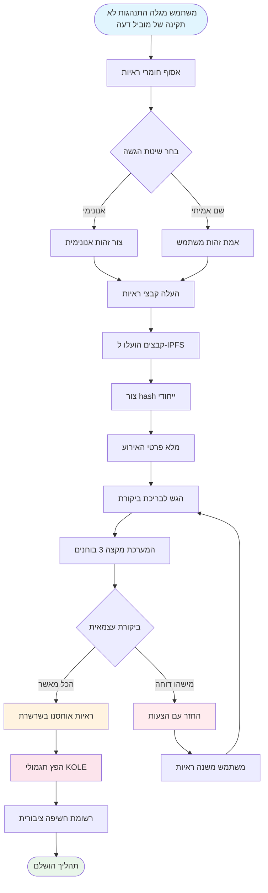

# **ניירת לבן של פלטפורמת חשיפת התנהגות לא תקינה של מובילי דעה**

### **מערכת אקולוגית מבוזרת לפיקוח המבוססת על טכנולוגיית בלוקצ'יין**

*גרסה 1.2 | ספטמבר 2025 (מעודכן)*

---

## **תוכן עניינים**

1.  [סיכום מנהלים](#סיכום-מנהלים)
2.  [רקע הפרויקט וחזון](#רקע-הפרויקט-וחזון)
3.  [ארכיטקטורה טכנית](#ארכיטקטורה-טכנית)
4.  [מודולי פונקציה מרכזיים](#מודולי-פונקציה-מרכזיים)
5.  [כלכלת טוקנים](#כלכלת-טוקנים)
6.  [ממשל קהילתי](#ממשל-קהילתי)
7.  [יתרונות הפלטפורמה](#יתרונות-הפלטפורמה)
8.  [מפת דרכים לפיתוח](#מפת-דרכים-לפיתוח)
9.  [גילוי סיכונים](#גילוי-סיכונים)
10. [מסקנה](#מסקנה)

---

## **סיכום מנהלים**

פלטפורמת חשיפת התנהגות לא תקינה של מובילי דעה היא מערכת אקולוגית מבוזרת לפיקוח המבוססת על טכנולוגיית בלוקצ'יין. היא מטרתה להגן על זכויות ואינטרסים של משקיעים וצרכנים על ידי חשיפה ותיעוד של התנהגות לא תקינה של מובילי דעה (KOL) באמצעות מנגנון שקוף והוגן.

### **הצעת הערך המרכזית**
- ✅ **בלתי ניתן לשינוי**: הראיות נשמרות לצמיתות המבוססות על טכנולוגיית בלוקצ'יין.
- ✅ **מבוזר**: מנוהל על ידי הקהילה, נמנע מנקודות שליטה יחידות.
- ✅ **שקוף והוגן**: כל התהליכים ניתנים לביקורת ציבורית, והביקורות מתנהלות באופן עצמאי.
- ✅ **תמריצים מספיקים**: המודל הכלכלי של הטוקן מעודד השתתפות פעילה של המשתמשים.

---

## **רקע הפרויקט וחזון**

### **1.1 נקודות כאב בתעשייה**

| סוג הבעיה | ביטוי ספציפי | היקף ההשפעה |
|---|---|---|
| **פרסומת כוזבת** | מובילי דעה מגזימים בהשפעות מוצרים, מבטיחים החזרות כוזבות | הפסדים כספיים לצרכנים |
| **"רג פולס" זדוניים** | ניצול אמון מעריצים לתכניות "רג פול" | הפסדי נכסים למשקיעים |
| **הונאת נתונים** | ניפוח אינטראקציה, קניית עוקבים להטעיית מפרסמים | תקציבי שיווק מבוזבזים למותגים |
| **חוסר פיקוח** | רגולציה לא יעילה בפלטפורמות קיימות, ערוצי דיווח גרועים | המשך התפשטות התנהגות לא תקינה |
| **ראיות נאבדות בקלות** | ראיות נמחקות בקלות או מטופלות על ידי יחסי ציבור | קושי בהגנה על זכויות |

### **1.2 חזון הפלטפורמה**

> **"לבנות מערכת אקולוגית מבוזרת ושקופה לפיקוח על התנהגות מובילי דעה, להבטיח את האותנטיות ואי-השינוי של הראיות באמצעות טכנולוגיית בלוקצ'יין, להשיג מנגנון ביקורת הוגן וצודק באמצעות ממשל קהילתי, ולבסוף להקים מערכת אקולוגית בריאה ומסודרת של מובילי דעה."**

---

## **ארכיטקטורה טכנית**

### **2.1 סקירת המחסנית הטכנולוגית**

- **שכבת יישומים**
  - Web | Mobile | API | Backend ניהולי
- **שכבת שירותים**
  - לוגיקה עסקית | אינטראקציה עם חוזים חכמים | עיבוד נתונים
- **שכבת בלוקצ'יין**
  - Solana | חוזים חכמים | חוזי טוקנים
- **שכבת אחסון**
  - אחסון מבוזר IPFS | אחסון נתונים בשרשרת

### **2.2 רכיבים טכניים מרכזיים**

#### **🔗 תשתית בלוקצ'יין**
- **בחירת שרשרת ראשית**: Solana
- **מדדי ביצועים**: 65,000 TPS, זמן בלוק 400ms
- **יתרון עלות**: עמלות עסקה <$0.01

#### **📦 מערכת חוזים חכמים**
- **חוזה ראיות בשרשרת**: מבצע אוטומטית את תהליך הגשת הראיות.
- **חוזה הפצת טוקנים**: מנהל הפצת תגמולים.
- **חוזה ממשל**: מטפל בהצבעה וקבלת החלטות.

#### **💾 אחסון מבוזר**
- **רשת IPFS**: אוחסנת קבצי ראיות מקוריים.
- **גיבוי מיותר**: מסונכרן על פני צמתים גלובליים.
- **מהירות גישה**: גישה מואצת CDN.

---

## **מודולי פונקציה מרכזיים**

### **3.1 מערכת הגשה**

#### **תהליך הגשה**

#### **שלבים מפורטים**
1.  **הכן ראיות** - אסוף צילומי מסך, הקלטות, יומני צ'אט
2.  **בחר שיטה** - הגשה אנונימית או בשם אמיתי
3.  **העלה קבצים** - ראיות מועלות אוטומטית ל-IPFS
4.  **מלא מידע** - תאר את האירוע וההשפעה
5.  **הגש לביקורת** - היכנס לתהליך ביקורת מבוזר
6.  **ביקורת חבר מושבעים** - 3 בוחנים עצמאיים מעריכים
7.  **אישור** - ראיות אוחסנות לצמיתות בשרשרת
8.  **קבל תגמול** - הפצה אוטומטית של טוקני KOLE

#### **סוגי ראיות נתמכים**
- 📷 ראיות תמונה (צילומי מסך, תמונות)
- 🎥 ראיות וידאו (הקלטות מסך, סרטונים)
- 💬 יומני צ'אט (WeChat, Telegram, וכו')
- 📄 ראיות מסמכים (חוזים, הסכמים, וכו')

### **3.2 מערכת ביקורת**

#### **עיצוב מנגנון ביקורת**

| אלמנט ביקורת | דרישה ספציפית | מטרה |
|---|---|---|
| **מספר בוחנים** | מינימום 3 אנשים | הבטחת הוגנות |
| **ביקורת עצמאית** | לא מכירים את תוצאות בוחנים אחרים | מניעת קשירת קשר |
| **דרישת פה אחד** | **כל הבוחנים חייבים להסכים פה אחד** לאישור | הבטחת איכות בסיסית של הראיות |
| **תקן דירוג** | מערכת דירוג 1-5 כוכבים, **הרמה הסופית היא ממוצע כל הדירוגים (מעוגל)** | כימות חומרת האירוע |
| **מגבלת זמן** | השלמה תוך 48 שעות | שיפור יעילות |

### **3.3 מערכת תצוגת חשיפה**

#### **סיווג רמות חומרה**

| רמה | תצוגת כוכבים | תיאור | התנהגות טיפוסית |
|---|---|---|---|
| **רמה 5** | ***** | מתועב | הונאות, הונאה חמורה |
| **רמה 4** | **** | התנהגות לא תקינה חמורה | רג פולס זדוניים, פרסומת כוזבת |
| **רמה 3** | *** | התנהגות לא תקינה בינונית | טענות מוגזמות, הונאת נתונים |
| **רמה 2** | ** | התנהגות לא תקינה קלה | הפרת אמון, הערות לא הולמות |
| **רמה 1** | * | התנהגות לא תקינה כללית | איכות שירות גרועה, יחס רע |

---

## **כלכלת טוקנים**

### **4.1 סקירת הטוקן**

| פריט | פרטים |
|---|---|
| **שם הטוקן** | KOLE Token |
| **סמל הטוקן** | KOLE |
| **היצע כולל** | 1,000,000,000 (מיליארד) |
| **תקן הטוקן** | SPL (Solana Program Library) |
| **עשרוניות** | 9 |
| **שיטת הנפקה** | הוטבע פעם אחת, היצע קבוע |

### **4.2 תכנית הקצאת טוקנים**

| הקצאה | אחוז | מצב ומנגנון שחרור |
|---|---|---|
| **תגמולי הגשות משתמשים** | 40% | **נעול**. 0.5% משוחרר יומית לתגמולים. טוקנים לא בשימוש ננעלים מחדש שבועית. |
| **הגרלת מחזיקים** | 40% | **במחזור מלא**. משמש לאירועי הגרלה למחזיקי טוקנים קהילתיים. |
| **פיתוח מערכת אקולוגית** | 10% | **נעול**. למחקר ופיתוח, פעולות וכו'. 1% משוחרר חודשית. |
| **צוות ויועצים** | 10% | **נעול**. 2% משוחרר חודשית. |

### **4.3 פרטי מנגנון תגמולים**

| סוג תגמול | כמות טוקנים (KOLE) | תנאים לקבלה |
|---|---|---|
| **תגמול דיווח ראשון** | 100,000 | הגשת ראיות אותנטיות ותקפות של התנהגות לא תקינה של מוביל דעה בפעם הראשונה, ועברו את הביקורת. |
| **תגמול ראיות משלימות** | 20,000 | מתן ראיות משלימות תקפות למקרה קיים, שיפור שלמותו. |
| **תגמול בוחן** | 50,000 | השתתפות והשלמת עבודת ביקורת ראיות כבוחן מוסמך. |

### **4.4 מערכת הגרלה (חדש)**

כדי לתגמל מחזיקי טוקנים קהילתיים, הפלטפורמה הקימה מערכת הגרלה בתדירות גבוהה ובערך גבוה.

| סוג הגרלה | תדירות | בריכת פרסים כוללת | מודל זוכים ויחס הקצאה |
|---|---|---|---|
| **פרס גדול רגיל** | פעם בשעה | **10 SOL** | **3 זוכים**, מוקצים ביחס **5 : 3 : 2** (כלומר, 5 SOL, 3 SOL, 2 SOL) |
| **פרס גדול סופר** | יומית ב-00:00 (SGT) | **66 SOL** | **3 זוכים**, מוקצים ביחס **40 : 20 : 6** (כלומר, 40 SOL, 20 SOL, 6 SOL) |

**זכאות**:
- **סף החזקה**: קבל כרטיס הגרלה אחד לכל **300,000 טוקני KOLE** שמוחזקים.
- **מגבלת משקל**: כדי להבטיח הוגנות, כל כתובת ארנק יכולה להיות בעלת משקל זכייה מקסימלי שווה ל-**5 כרטיסי הגרלה**.
- **תקופת החזקה**: טוקנים בכתובת חייבים להיות מוחזקים לפחות **שעה אחת** כדי להיות זכאים לסיבוב הנוכחי של ההגרלה.

### **4.5 מנגנון שריפה**

| סוג שריפה | תנאי הפעלה | תיאור |
|---|---|---|
| **רכישה חוזרת ושריפה** | תגמולי שידור חי בפלטפורמת PUMP | כל תגמולי השידור החי שהושגו בפלטפורמת PUMP ישמשו לרכישה חוזרת ושריפה של טוקני KOLE מהשוק המשני. |
| **התאמת קרן ושריפה** | לכל מוביל דעה שנחשף בהצלחה | הקרן תרכוש 0.5% מההיצע הכולל ותשרוף את הטוקנים כדי להגדיל את ערך הטוקן. |
| **שריפות לא סדירות** | החלטת פלטפורמה | הפלטפורמה תרכוש ותשרוף טוקנים מהשוק באופן תקופתי בהתבסס על תנאים תפעוליים. |

### **4.6 תמיכת בריכת מימון**

| סוג קרן | סכום | שימוש עיקרי |
|---|---|---|
| **כספים עצמיים של הפלטפורמה** | $1,000,000 | פעולות, פיתוח, שיווק. המנה הראשונית של כ-**$700,000 (שווה ל-3000 SOL)** הוזרקה לבריכת הפרסים לתגמולי הגרלה. |
| **כספי משקיעים** | $1,000,000 | (שלב 1) לבניית מערכת אקולוגית, תמיכה בנזילות ופיתוח עתידי. |

---

## **ממשל קהילתי**

### **5.1 מבנה ממשל DAO**

*   **מחזיקי KOLE** (מצביעים)
    *   ⬇️
*   **ועדת ממשל** (מבצעת)
    *   ⬇️
        *   חבר מושבעים
        *   צוות פיתוח
        *   צוות תפעול

### **5.2 משקל הצבעה**

| כמות החזקה (KOLE) | משקל הצבעה | הרשאות |
|---|---|---|
| 1 - 999 | 1x | זכויות הצבעה בסיסיות |
| 1,000 - 9,999 | 1.2x | זכות הצעה |
| 10,000 - 99,999 | 1.5x | זכאות למועמדות לחבר מושבעים |
| 100,000+ | 2x | זכאות למועמדות לועדת ממשל |

### **5.3 סוגי הצעות**
- **הצעות טכניות**: עדכוני תכונות, התאמות ארכיטקטורה טכנית
- **הצעות כלכליות**: התאמות כלכלת טוקנים, הפצת תגמולים
- **הצעות תפעוליות**: כללי פלטפורמה, אירועי קהילה
- **הצעות חירום**: אירועי אבטחה, החלטות דחופות

---

## **יתרונות הפלטפורמה**

### **6.1 יתרונות טכניים**

| יתרון | תיאור | ערך |
|---|---|---|
| **🔒 בלתי ניתן לשינוי** | אחסון קבוע בבלוקצ'יין | ראיות אמינות ב-100% |
| **⚡ ביצועים גבוהים** | 65,000 עסקאות לשנייה של Solana | חוויית משתמש חלקה |
| **💰 עלות נמוכה** | עמלות עסקה <$0.01 | מוריד מחסום כניסה |
| **🌍 גלובלי** | אחסון מבוזר IPFS | נגיש גלובלית |

### **6.2 יתרונות מנגנון**
- **שקוף והוגן**: כל התהליכים ניתנים לוידוא בשרשרת.
- **תמריצים מספיקים**: מערכת תמריצי טוקן רב-שכבתית.
- **מונע קהילה**: ממשל מבוזר אמיתי.
- **הגנת פרטיות**: תומך בדיווח אנונימי.

### **6.3 יתרונות מערכת אקולוגית**
- **שיתוף פעולה פתוח**: קוד פתוח, תרומות מתקבלות בברכה.
- **תאימות חוצת שרשראות**: תמיכה עתידית לפריסה רב-שרשראות.
- **API פתוח**: גישת צד שלישי לשאילתות.
- **פעולות תואמות**: דבקות בחוקים ותקנות מקומיים.

---

## **מפת דרכים לפיתוח**

### **שלב 1: בניית יסודות (Q1 2025) ✅**
- [x] פרסום הנייר הלבן
- [x] הקמת צוות ליבה
- [x] עיצוב ארכיטקטורה טכנית
- [x] פיתוח חוזים חכמים

### **שלב 2: השקת מוצר (Q2 2025) ✅**
- [x] פריסת mainnet
- [x] בדיקות בטא והשקת אתר רשמי
- [x] גיוס משתמשים ראשונים
- [x] הנפקת טוקן (KOLE)

### **שלב 3: הרחבת מערכת אקולוגית (Q3 2025) 🚀**
- [x] רישום DEX
- [ ] בקשת רישום CEX
- [ ] הרחבת שותפויות
- [ ] פרסום אפליקציה לנייד

### **שלב 4: גלובליזציה (Q4 2025) 🌱**
- [ ] תמיכה רב-לשונית
- [ ] גישור חוצה שרשראות
- [ ] ביקורת מסייעת AI
- [ ] ביזור מלא דרך DAO

### **שלב 5: תכנית ארוכת טווח (2026+) 🔮**
- [ ] קביעת תקני תעשייה
- [ ] שיתוף פעולה רגולטורי
- [ ] שילוב זהות Web3
- [ ] הרחבת מטאוורס

---

## **גילוי סיכונים**

### **8.1 סיכונים טכניים**

| סוג סיכון | השפעה פוטנציאלית | אמצעי הפחתה |
|---|---|---|
| פגיעויות חוזים חכמים | הפסד כספים | ביקורות מרובות, אימות פורמלי |
| התקפות רשת | הפרעה לשירות | הגנת DDoS, פריסה רב-צמתית |
| בעיות מדרגיות | ירידה בביצועים | פתרונות שכבה 2, טכנולוגיית שארדינג |

### **8.2 סיכונים רגולטוריים**
- **שינויי מדיניות**: מעקב קרוב אחר התפתחויות רגולטוריות באזורים שונים.
- **דרישות תאימות**: שילוב ייעוץ משפטי להבטחת תאימות.
- **KYC/AML**: יישום אימות זהות כשצריך.

### **8.3 סיכונים תפעוליים**
- **הגשות זדוניות**: סינון מסייע AI + ביקורת ידנית.
- **קשירת קשר של בוחנים**: הקצאה אקראית + מערכת מוניטין.
- **תחרות שוק**: חדשנות מתמשכת + אופטימיזציה של חוויית משתמש.

---

## **מסקנה**

פלטפורמת חשיפת התנהגות לא תקינה של מובילי דעה מחויבת לבנות מערכת אקולוגית **הוגנת, שקופה ואמינה** לפיקוח על התנהגות מובילי דעה. באמצעות טכנולוגיית בלוקצ'יין ומנגנוני ממשל קהילתי, אנו מאמינים שנוכל לרסן ביעילות התנהגות לא תקינה של מובילי דעה, להגן על זכויות משתמשים ולקדם פיתוח בריא של התעשייה.

### **הצטרפו אלינו**

🌐 **אתר**: `https://kolexposure.com/#/`
💬 **טלגרם**: `https://t.me/kolexposure`
🐦 **טוויטר / X**: `https://x.com/TODO_dream`, `https://x.com/kolexposure`
🤖 **דיסקורד**: `https://discord.com/invite/sZf44CseTf`
🌱 **CA**: `2EL3kJNYbgoqvtK4eyfNxgYiwm2V7B84kfMd1KLRpump`

### **כתב ויתור**

ניירת לבן זה מיועד למטרות מידע בלבד ואינו מהווה ייעוץ השקעות. השקעה בנכסים דיגיטליים כרוכה בסיכונים גבוהים; אנא העריכו בקפידה. הפלטפורמה שומרת לעצמה את הזכות להתאים את תוכניות הפיתוח שלה בהתאם לנסיבות בפועל.

---

**© 2025 פלטפורמת חשיפת התנהגות לא תקינה של מובילי דעה | מערכת אקולוגית מבוזרת לפיקוח המבוססת על טכנולוגיית בלוקצ'יין**