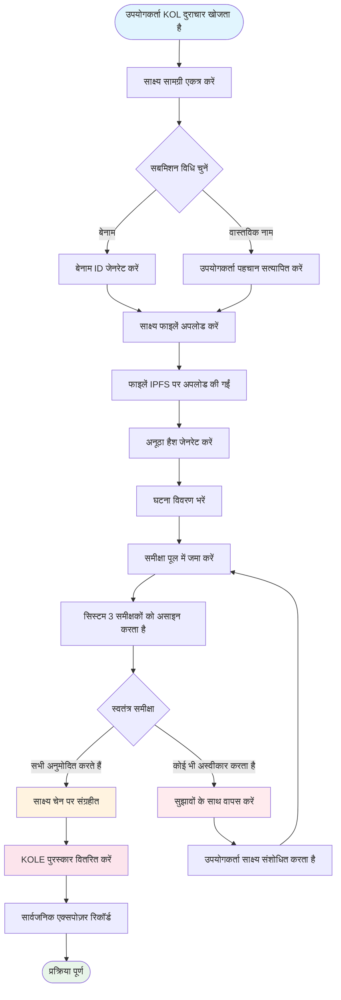

# **KOL दुराचार एक्सपोज़र प्लेटफॉर्म व्हाइटपेपर**

### **ब्लॉकचेन तकनीक पर आधारित विकेन्द्रीकृत निगरानी पारिस्थितिकी तंत्र**

*संस्करण 1.2 | सितंबर 2025 (संशोधित)*

### 🌍 उपलब्ध भाषाएं
[🇬🇧 English](Whitepaper_EN.md) | [🇨🇳 中文](Whitepaper_CN.md) | [🇯🇵 日本語](Whitepaper_JP.md) | [🇷🇺 Русский](Whitepaper_RU.md) | [🇪🇸 Español](Whitepaper_ES.md) | [🇰🇷 한국어](Whitepaper_KR.md) | [🇸🇦 العربية](Whitepaper_AR.md) | [🇹🇷 Türkçe](Whitepaper_TR.md) | [🇧🇷 Português](Whitepaper_PT.md) | [🇫🇷 Français](Whitepaper_FR.md) | [🇩🇪 Deutsch](Whitepaper_DE.md) | [🇮🇳 हिंदी](Whitepaper_HI.md) | [🇮🇱 עברית](Whitepaper_HE.md) | [🇻🇳 Tiếng Việt](Whitepaper_VI.md) | [🇹🇭 ไทย](Whitepaper_TH.md)

---

## **विषय सूची**

1.  [कार्यकारी सारांश](#कार्यकारी-सारांश)
2.  [परियोजना पृष्ठभूमि और दृष्टि](#परियोजना-पृष्ठभूमि-और-दृष्टि)
3.  [तकनीकी वास्तुकला](#तकनीकी-वास्तुकला)
4.  [मुख्य कार्य मॉड्यूल](#मुख्य-कार्य-मॉड्यूल)
5.  [टोकन अर्थशास्त्र](#टोकन-अर्थशास्त्र)
6.  [सामुदायिक शासन](#सामुदायिक-शासन)
7.  [प्लेटफॉर्म लाभ](#प्लेटफॉर्म-लाभ)
8.  [विकास रोडमैप](#विकास-रोडमैप)
9.  [जोखिम प्रकटीकरण](#जोखिम-प्रकटीकरण)
10. [निष्कर्ष](#निष्कर्ष)

---

## **कार्यकारी सारांश**

KOL दुराचार एक्सपोज़र प्लेटफॉर्म ब्लॉकचेन तकनीक पर आधारित एक विकेन्द्रीकृत निगरानी पारिस्थितिकी तंत्र है। यह एक पारदर्शी और निष्पक्ष तंत्र के माध्यम से KOL (मुख्य राय नेताओं) के दुराचार को उजागर करके और रिकॉर्ड करके निवेशकों और उपभोक्ताओं के अधिकारों और हितों की रक्षा करने का लक्ष्य रखता है।

### **मुख्य मूल्य प्रस्ताव**
- ✅ **अपरिवर्तनीय**: ब्लॉकचेन तकनीक के आधार पर साक्ष्य स्थायी रूप से संरक्षित होते हैं।
- ✅ **विकेन्द्रीकृत**: समुदाय द्वारा शासित, एकल नियंत्रण बिंदुओं से बचना।
- ✅ **पारदर्शी और निष्पक्ष**: सभी प्रक्रियाएं सार्वजनिक रूप से ऑडिट योग्य हैं, और समीक्षाएं स्वतंत्र रूप से की जाती हैं।
- ✅ **पर्याप्त प्रोत्साहन**: टोकन आर्थिक मॉडल उपयोगकर्ताओं की सक्रिय भागीदारी को प्रोत्साहित करता है।

---

## **परियोजना पृष्ठभूमि और दृष्टि**

### **1.1 उद्योग की समस्याएं**

| समस्या प्रकार | विशिष्ट अभिव्यक्ति | प्रभाव का दायरा |
|---|---|---|
| **झूठा विज्ञापन** | KOL उत्पाद प्रभावों को बढ़ा-चढ़ाकर पेश करते हैं, झूठे रिटर्न का वादा करते हैं | उपभोक्ता वित्तीय नुकसान |
| **दुर्भावनापूर्ण "रग पुल"** | "रग पुल" योजनाओं के लिए प्रशंसक विश्वास का शोषण | निवेशक संपत्ति हानि |
| **डेटा धोखाधड़ी** | एंगेजमेंट बढ़ाना, विज्ञापनदाताओं को धोखा देने के लिए फॉलोअर्स खरीदना | ब्रांडों के लिए बर्बाद मार्केटिंग बजट |
| **निगरानी की कमी** | मौजूदा प्लेटफॉर्म पर अप्रभावी नियंत्रण, खराब रिपोर्टिंग चैनल | दुराचार का निरंतर प्रसार |
| **साक्ष्य आसानी से खो जाते हैं** | साक्ष्य आसानी से हटा दिए जाते हैं या PR द्वारा संभाले जाते हैं | अधिकारों की रक्षा में कठिनाई |

### **1.2 प्लेटफॉर्म दृष्टि**

> **"KOL व्यवहार की निगरानी के लिए एक विकेन्द्रीकृत और पारदर्शी पारिस्थितिकी तंत्र का निर्माण करना, ब्लॉकचेन तकनीक के माध्यम से साक्ष्य की प्रामाणिकता और अपरिवर्तनीयता सुनिश्चित करना, सामुदायिक शासन के माध्यम से एक निष्पक्ष और न्यायसंगत समीक्षा तंत्र प्राप्त करना, और अंततः एक स्वस्थ और व्यवस्थित KOL पारिस्थितिकी तंत्र स्थापित करना।"**

---

## **तकनीकी वास्तुकला**

### **2.1 तकनीकी स्टैक अवलोकन**

- **एप्लिकेशन परत**
  - वेब | मोबाइल | API | एडमिन बैकएंड
- **सेवा परत**
  - व्यावसायिक तर्क | स्मार्ट कॉन्ट्रैक्ट इंटरैक्शन | डेटा प्रोसेसिंग
- **ब्लॉकचेन परत**
  - सोलाना | स्मार्ट कॉन्ट्रैक्ट्स | टोकन कॉन्ट्रैक्ट्स
- **भंडारण परत**
  - IPFS वितरित भंडारण | ऑन-चेन डेटा भंडारण

### **2.2 मुख्य तकनीकी घटक**

#### **🔗 ब्लॉकचेन अवसंरचना**
- **मेनचेन चयन**: सोलाना
- **प्रदर्शन मेट्रिक्स**: 65,000 TPS, 400ms ब्लॉक समय
- **लागत लाभ**: लेनदेन शुल्क <$0.01

#### **📦 स्मार्ट कॉन्ट्रैक्ट सिस्टम**
- **साक्ष्य ऑन-चेन कॉन्ट्रैक्ट**: साक्ष्य सबमिशन प्रक्रिया को स्वचालित रूप से निष्पादित करता है।
- **टोकन वितरण कॉन्ट्रैक्ट**: पुरस्कार वितरण का प्रबंधन करता है।
- **शासन कॉन्ट्रैक्ट**: मतदान और निर्णय लेने को संभालता है।

#### **💾 वितरित भंडारण**
- **IPFS नेटवर्क**: मूल साक्ष्य फाइलों को संग्रहीत करता है।
- **रिडंडेंट बैकअप**: वैश्विक नोड्स में सिंक्रोनाइज़ किया गया।
- **पहुंच गति**: CDN त्वरित पहुंच।

---

## **मुख्य कार्य मॉड्यूल**

### **3.1 सबमिशन सिस्टम**

#### **सबमिशन प्रक्रिया**

#### **विस्तृत चरण**
1.  **साक्ष्य तैयार करें** - स्क्रीनशॉट, रिकॉर्डिंग, चैट लॉग एकत्र करें
2.  **विधि चुनें** - बेनाम या वास्तविक नाम सबमिशन
3.  **फाइलें अपलोड करें** - साक्ष्य स्वचालित रूप से IPFS पर अपलोड किए गए
4.  **जानकारी भरें** - घटना और प्रभाव का वर्णन करें
5.  **समीक्षा के लिए जमा करें** - विकेन्द्रीकृत समीक्षा प्रक्रिया में प्रवेश करें
6.  **जूरी समीक्षा** - 3 स्वतंत्र समीक्षक मूल्यांकन करते हैं
7.  **अनुमोदन** - साक्ष्य स्थायी रूप से ऑन-चेन संग्रहीत
8.  **पुरस्कार प्राप्त करें** - स्वचालित KOLE टोकन वितरण

#### **समर्थित साक्ष्य प्रकार**
- 📷 छवि साक्ष्य (स्क्रीनशॉट, फोटो)
- 🎥 वीडियो साक्ष्य (स्क्रीन रिकॉर्डिंग, वीडियो)
- 💬 चैट लॉग (WeChat, Telegram, आदि)
- 📄 दस्तावेज़ साक्ष्य (अनुबंध, समझौते, आदि)

### **3.2 समीक्षा सिस्टम**

#### **समीक्षा तंत्र डिज़ाइन**

| समीक्षा तत्व | विशिष्ट आवश्यकता | उद्देश्य |
|---|---|---|
| **समीक्षकों की संख्या** | न्यूनतम 3 लोग | निष्पक्षता सुनिश्चित करना |
| **स्वतंत्र समीक्षा** | अन्य समीक्षकों के परिणाम नहीं जानते | मिलीभगत को रोकना |
| **सर्वसम्मति आवश्यकता** | **सभी समीक्षकों को प्रमाणन के लिए सर्वसम्मति से सहमत होना चाहिए** | साक्ष्य की बुनियादी गुणवत्ता की गारंटी |
| **रेटिंग मानक** | 1-5 स्टार रेटिंग सिस्टम, **अंतिम स्तर सभी रेटिंग का औसत है (गोल)** | घटना की गंभीरता को परिमाणित करना |
| **समय सीमा** | 48 घंटों के भीतर पूरा करें | दक्षता में सुधार |

### **3.3 एक्सपोज़र डिस्प्ले सिस्टम**

#### **गंभीरता स्तर वर्गीकरण**

| स्तर | स्टार डिस्प्ले | विवरण | विशिष्ट व्यवहार |
|---|---|---|---|
| **स्तर 5** | ***** | जघन्य | घोटाले, गंभीर धोखाधड़ी |
| **स्तर 4** | **** | गंभीर दुराचार | दुर्भावनापूर्ण रग पुल, झूठा विज्ञापन |
| **स्तर 3** | *** | मध्यम दुराचार | अतिशयोक्तिपूर्ण दावे, डेटा धोखाधड़ी |
| **स्तर 2** | ** | मामूली दुराचार | विश्वास का उल्लंघन, अनुचित टिप्पणियां |
| **स्तर 1** | * | सामान्य दुराचार** | खराब सेवा गुणवत्ता, बुरा रवैया |

---

## **टोकन अर्थशास्त्र**

### **4.1 टोकन अवलोकन**

| आइटम | विवरण |
|---|---|
| **टोकन नाम** | KOLE Token |
| **टोकन प्रतीक** | KOLE |
| **कुल आपूर्ति** | 1,000,000,000 (1 अरब) |
| **टोकन मानक** | SPL (सोलाना प्रोग्राम लाइब्रेरी) |
| **दशमलव** | 9 |
| **जारी करने की विधि** | एक बार में मिंट किया गया, निश्चित आपूर्ति |

### **4.2 टोकन आवंटन योजना**

| आवंटन | प्रतिशत | स्थिति और अनलॉक तंत्र |
|---|---|---|
| **उपयोगकर्ता सबमिशन पुरस्कार** | 40% | **लॉक किया गया**। पुरस्कारों के लिए दैनिक 0.5% अनलॉक। अप्रयुक्त टोकन साप्ताहिक पुनः लॉक किए जाते हैं। |
| **धारक लॉटरी** | 40% | **पूरी तरह परिचालित**। समुदायिक टोकन धारकों के लिए लॉटरी इवेंट्स में उपयोग किया जाता है। |
| **पारिस्थितिकी तंत्र विकास** | 10% | **लॉक किया गया**। R&D, संचालन, आदि के लिए। मासिक 1% अनलॉक। |
| **टीम और सलाहकार** | 10% | **लॉक किया गया**। मासिक 2% अनलॉक। |

### **4.3 पुरस्कार तंत्र विवरण**

| पुरस्कार प्रकार | टोकन मात्रा (KOLE) | प्राप्त करने की शर्तें |
|---|---|---|
| **प्रथम रिपोर्ट पुरस्कार** | 100,000 | पहली बार KOL दुराचार के प्रामाणिक और वैध साक्ष्य जमा करना, और समीक्षा पास करना। |
| **पूरक साक्ष्य पुरस्कार** | 20,000 | मौजूदा मामले के लिए वैध पूरक साक्ष्य प्रदान करना, इसकी पूर्णता बढ़ाना। |
| **समीक्षक पुरस्कार** | 50,000 | प्रमाणित समीक्षक के रूप में साक्ष्य समीक्षा कार्य में भाग लेना और पूरा करना। |

### **4.4 लॉटरी सिस्टम (नया)**

समुदायिक टोकन धारकों को पुरस्कृत करने के लिए, प्लेटफॉर्म ने एक उच्च आवृत्ति, उच्च मूल्य लॉटरी सिस्टम स्थापित किया है।

| ड्रॉ प्रकार | आवृत्ति | कुल पुरस्कार पूल | विजेता मॉडल और आवंटन अनुपात |
|---|---|---|---|
| **नियमित ग्रैंड प्राइज़** | हर घंटे एक बार | **10 SOL** | **3 विजेता**, **5 : 3 : 2** अनुपात में आवंटित (यानी, 5 SOL, 3 SOL, 2 SOL) |
| **सुपर ग्रैंड प्राइज़** | दैनिक 00:00 (SGT) पर | **66 SOL** | **3 विजेता**, **40 : 20 : 6** अनुपात में आवंटित (यानी, 40 SOL, 20 SOL, 6 SOL) |

**पात्रता**:
- **होल्डिंग थ्रेशोल्ड**: प्रत्येक **300,000 KOLE टोकन** रखने पर 1 लॉटरी टिकट प्राप्त करें।
- **वेट कैप**: निष्पक्षता सुनिश्चित करने के लिए, प्रत्येक वॉलेट पता **5 लॉटरी टिकटों** के बराबर अधिकतम जीत वजन रख सकता है।
- **होल्डिंग अवधि**: पते में टोकन वर्तमान ड्रॉ राउंड के लिए पात्र होने के लिए कम से कम **1 घंटे** के लिए रखे जाने चाहिए।

### **4.5 बर्न तंत्र**

| बर्न प्रकार | ट्रिगर स्थिति | विवरण |
|---|---|---|
| **बायबैक और बर्न** | PUMP प्लेटफॉर्म लाइव स्ट्रीमिंग पुरस्कार | PUMP प्लेटफॉर्म पर प्राप्त सभी लाइव स्ट्रीमिंग पुरस्कारों का उपयोग द्वितीयक बाजार से KOLE टोकन वापस खरीदने और जलाने के लिए किया जाएगा। |
| **फाउंडेशन मैच और बर्न** | सफलतापूर्वक एक्सपोज़ किए गए प्रत्येक KOL के लिए | फाउंडेशन कुल आपूर्ति का 0.5% खरीदेगा और टोकन मूल्य बढ़ाने के लिए टोकन जलाएगा। |
| **अनियमित बर्न** | प्लेटफॉर्म निर्णय | प्लेटफॉर्म परिचालन स्थितियों के आधार पर समय-समय पर बाजार से टोकन वापस खरीदेगा और जलाएगा। |

### **4.6 फंडिंग पूल सपोर्ट**

| फंड प्रकार | राशि | प्राथमिक उपयोग |
|---|---|---|
| **प्लेटफॉर्म के स्वयं के फंड** | $1,000,000 | संचालन, विकास, मार्केटिंग। लगभग **$700,000 (3000 SOL के बराबर)** की प्रारंभिक किस्त लॉटरी पुरस्कारों के लिए पुरस्कार पूल में इंजेक्ट की गई है। |
| **निवेशक फंड** | $1,000,000 | (चरण 1) पारिस्थितिकी तंत्र निर्माण, तरलता समर्थन, और भविष्य के विकास के लिए। |

---

## **सामुदायिक शासन**

### **5.1 DAO शासन संरचना**

*   **KOLE धारक** (वोट करते हैं)
    *   ⬇️
*   **शासन समिति** (निष्पादित करती है)
    *   ⬇️
        *   जूरी
        *   विकास टीम
        *   संचालन टीम

### **5.2 वोट वजन**

| होल्डिंग राशि (KOLE) | वोट वजन | विशेषाधिकार |
|---|---|---|
| 1 - 999 | 1x | बुनियादी मतदान अधिकार |
| 1,000 - 9,999 | 1.2x | प्रस्ताव का अधिकार |
| 10,000 - 99,999 | 1.5x | जूरी उम्मीदवारी पात्रता |
| 100,000+ | 2x | शासन समिति उम्मीदवारी पात्रता |

### **5.3 प्रस्ताव प्रकार**
- **तकनीकी प्रस्ताव**: फीचर अपडेट, तकनीकी आर्किटेक्चर समायोजन
- **आर्थिक प्रस्ताव**: टोकन अर्थशास्त्र समायोजन, पुरस्कार वितरण
- **परिचालन प्रस्ताव**: प्लेटफॉर्म नियम, सामुदायिक कार्यक्रम
- **आपातकालीन प्रस्ताव**: सुरक्षा घटनाएं, तत्काल निर्णय

---

## **प्लेटफॉर्म लाभ**

### **6.1 तकनीकी लाभ**

| लाभ | विवरण | मूल्य |
|---|---|---|
| **🔒 अपरिवर्तनीय** | ब्लॉकचेन पर स्थायी भंडारण | 100% विश्वसनीय साक्ष्य |
| **⚡ उच्च प्रदर्शन** | सोलाना के 65,000 लेनदेन प्रति सेकंड | सहज उपयोगकर्ता अनुभव |
| **💰 कम लागत** | लेनदेन शुल्क <$0.01 | प्रवेश बाधा को कम करता है |
| **🌍 वैश्विक** | IPFS वितरित भंडारण | विश्व स्तर पर पहुंच योग्य |

### **6.2 तंत्र लाभ**
- **पारदर्शी और निष्पक्ष**: सभी प्रक्रियाएं ऑन-चेन सत्यापन योग्य हैं।
- **पर्याप्त प्रोत्साहन**: बहु-स्तरीय टोकन प्रोत्साहन प्रणाली।
- **समुदाय-संचालित**: सच्चा विकेन्द्रीकृत शासन।
- **गोपनीयता सुरक्षा**: बेनाम रिपोर्टिंग का समर्थन करता है।

### **6.3 पारिस्थितिकी तंत्र लाभ**
- **खुला सहयोग**: ओपन-सोर्स कोड, योगदान का स्वागत।
- **क्रॉस-चेन संगतता**: मल्टी-चेन तैनाती के लिए भविष्य का समर्थन।
- **खुला API**: प्रश्नों के लिए तृतीय-पक्ष पहुंच।
- **अनुपालन संचालन**: स्थानीय कानूनों और नियमों का पालन।

---

## **विकास रोडमैप**

### **चरण 1: फाउंडेशन बिल्डिंग (Q1 2025) ✅**
- [x] व्हाइटपेपर रिलीज़
- [x] कोर टीम गठन
- [x] तकनीकी आर्किटेक्चर डिज़ाइन
- [x] स्मार्ट कॉन्ट्रैक्ट विकास

### **चरण 2: उत्पाद लॉन्च (Q2 2025) ✅**
- [x] मेननेट तैनाती
- [x] बीटा परीक्षण और आधिकारिक वेबसाइट लॉन्च
- [x] पहले उपयोगकर्ताओं की भर्ती
- [x] टोकन जारी करना (KOLE)

### **चरण 3: पारिस्थितिकी तंत्र विस्तार (Q3 2025) 🚀**
- [x] DEX लिस्टिंग
- [ ] CEX लिस्टिंग आवेदन
- [ ] साझेदारी विस्तार
- [ ] मोबाइल APP रिलीज़

### **चरण 4: वैश्वीकरण (Q4 2025) 🌱**
- [ ] बहु-भाषा समर्थन
- [ ] क्रॉस-चेन ब्रिजिंग
- [ ] AI-सहायता प्राप्त समीक्षा
- [ ] DAO के माध्यम से पूर्ण विकेन्द्रीकरण

### **चरण 5: दीर्घकालिक योजना (2026+) 🔮**
- [ ] उद्योग मानक स्थापना
- [ ] नियामक सहयोग
- [ ] Web3 पहचान एकीकरण
- [ ] मेटावर्स विस्तार

---

## **जोखिम प्रकटीकरण**

### **8.1 तकनीकी जोखिम**

| जोखिम प्रकार | संभावित प्रभाव | शमन उपाय |
|---|---|---|
| स्मार्ट कॉन्ट्रैक्ट कमजोरियां | फंड का नुकसान | बहुविध ऑडिट, औपचारिक सत्यापन |
| नेटवर्क हमले | सेवा बाधा | DDoS सुरक्षा, मल्टी-नोड तैनाती |
| स्केलेबिलिटी समस्याएं | प्रदर्शन गिरावट | लेयर 2 समाधान, शार्डिंग तकनीक |

### **8.2 नियामक जोखिम**
- **नीति परिवर्तन**: विभिन्न क्षेत्रों में नियामक विकास की निकट निगरानी।
- **अनुपालन आवश्यकताएं**: अनुपालन सुनिश्चित करने के लिए कानूनी सलाह शामिल करना।
- **KYC/AML**: आवश्यकता पड़ने पर पहचान सत्यापन लागू करना।

### **8.3 परिचालन जोखिम**
- **दुर्भावनापूर्ण सबमिशन**: AI-सहायता प्राप्त स्क्रीनिंग + मैन्युअल समीक्षा।
- **समीक्षक मिलीभगत**: यादृच्छिक असाइनमेंट + प्रतिष्ठा प्रणाली।
- **बाजार प्रतिस्पर्धा**: निरंतर नवाचार + उपयोगकर्ता अनुभव अनुकूलन।

---

## **निष्कर्ष**

KOL दुराचार एक्सपोज़र प्लेटफॉर्म KOL व्यवहार की निगरानी के लिए एक **निष्पक्ष, पारदर्शी और भरोसेमंद** पारिस्थितिकी तंत्र बनाने के लिए प्रतिबद्ध है। ब्लॉकचेन तकनीक और सामुदायिक शासन तंत्र के माध्यम से, हम मानते हैं कि हम KOL दुराचार को प्रभावी रूप से रोक सकते हैं, उपयोगकर्ता अधिकारों की रक्षा कर सकते हैं, और उद्योग के स्वस्थ विकास को बढ़ावा दे सकते हैं।

### **हमसे जुड़ें**

🌐 **वेबसाइट**: `https://kolexposure.com/#/`
💬 **टेलीग्राम**: `https://t.me/kolexposure`
🐦 **ट्विटर / X**: `https://x.com/TODO_dream`, `https://x.com/kolexposure`
🤖 **डिस्कॉर्ड**: `https://discord.com/invite/sZf44CseTf`
🌱 **CA**: `2EL3kJNYbgoqvtK4eyfNxgYiwm2V7B84kfMd1KLRpump`

### **अस्वीकरण**

यह व्हाइटपेपर केवल सूचनात्मक उद्देश्यों के लिए है और निवेश सलाह का गठन नहीं करता। डिजिटल संपत्तियों में निवेश उच्च जोखिम शामिल करता है; कृपया सावधानीपूर्वक मूल्यांकन करें। प्लेटफॉर्म वास्तविक परिस्थितियों के अनुसार अपनी विकास योजनाओं को समायोजित करने का अधिकार सुरक्षित रखता है।

---

**© 2025 KOL दुराचार एक्सपोज़र प्लेटफॉर्म | ब्लॉकचेन तकनीक पर आधारित विकेन्द्रीकृत निगरानी पारिस्थितिकी तंत्र**