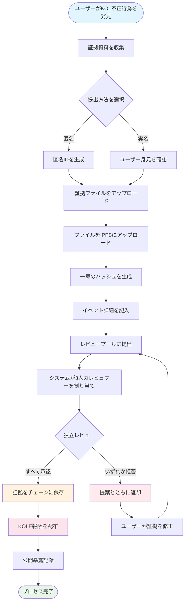

# **KOL不正行為暴露プラットフォーム ホワイトペーパー**

### **ブロックチェーン技術に基づく分散型監督エコシステム**

*バージョン 1.2 | 2025年9月（改訂版）*

### 🌍 利用可能な言語
[🇬🇧 English](Whitepaper_EN.md) | [🇨🇳 中文](Whitepaper_CN.md) | [🇯🇵 日本語](Whitepaper_JP.md) | [🇷🇺 Русский](Whitepaper_RU.md) | [🇪🇸 Español](Whitepaper_ES.md) | [🇰🇷 한국어](Whitepaper_KR.md) | [🇸🇦 العربية](Whitepaper_AR.md) | [🇹🇷 Türkçe](Whitepaper_TR.md) | [🇧🇷 Português](Whitepaper_PT.md) | [🇫🇷 Français](Whitepaper_FR.md) | [🇩🇪 Deutsch](Whitepaper_DE.md) | [🇮🇳 हिंदी](Whitepaper_HI.md) | [🇮🇱 עברית](Whitepaper_HE.md) | [🇻🇳 Tiếng Việt](Whitepaper_VI.md) | [🇹🇭 ไทย](Whitepaper_TH.md)

---

## **目次**

1.  [エグゼクティブサマリー](#エグゼクティブサマリー)
2.  [プロジェクトの背景とビジョン](#プロジェクトの背景とビジョン)
3.  [技術アーキテクチャ](#技術アーキテクチャ)
4.  [コア機能モジュール](#コア機能モジュール)
5.  [トークンエコノミクス](#トークンエコノミクス)
6.  [コミュニティガバナンス](#コミュニティガバナンス)
7.  [プラットフォームの優位性](#プラットフォームの優位性)
8.  [開発ロードマップ](#開発ロードマップ)
9.  [リスク開示](#リスク開示)
10. [結論](#結論)

---

## **エグゼクティブサマリー**

KOL不正行為暴露プラットフォームは、ブロックチェーン技術に基づく分散型監督エコシステムです。透明で公正なメカニズムを通じてKOL（Key Opinion Leader）の不正行為を暴露・記録し、投資家と消費者の権利と利益を保護することを目的としています。

### **コア価値提案**
- ✅ **不変性**: ブロックチェーン技術により証拠が永続的に保存されます。
- ✅ **分散化**: コミュニティガバナンス、単一の制御ポイントを回避。
- ✅ **透明性と公正性**: すべてのプロセスが公開監査可能、レビューは独立して実施。
- ✅ **十分なインセンティブ**: トークンエコノミクスモデルによりユーザーの積極的な参加を促進。

---

## **プロジェクトの背景とビジョン**

### **1.1 業界の課題**

| 問題の種類 | 具体的な現れ | 影響範囲 |
|---|---|---|
| **虚偽広告** | KOLが製品効果を誇張、虚偽のリターンを約束 | 消費者の金銭的損失 |
| **悪意のある「ラグプル」** | ファンの信頼を悪用した「ラグプル」スキーム | 投資家の資産損失 |
| **データ詐欺** | エンゲージメントの膨張、フォロワー購入による広告主への詐欺 | ブランドのマーケティング予算の浪費 |
| **監督の欠如** | 既存プラットフォームでの効果的でない規制、貧弱な報告チャネル | 不正行為の継続的な蔓延 |
| **証拠の消失** | 証拠が簡単に削除されるかPRで処理される | 権利擁護の困難 |

### **1.2 プラットフォームビジョン**

> **「KOL行動を監督する分散化された透明なエコシステムを構築し、ブロックチェーン技術により証拠の真正性と不変性を確保し、コミュニティガバナンスにより公正で正義のあるレビューメカニズムを実現し、最終的に健全で秩序ある KOL エコシステムを確立する。」**

---

## **技術アーキテクチャ**

### **2.1 技術スタック概要**

- **アプリケーション層**
  - Web | モバイル | API | 管理バックエンド
- **サービス層**
  - ビジネスロジック | スマートコントラクト相互作用 | データ処理
- **ブロックチェーン層**
  - Solana | スマートコントラクト | トークンコントラクト
- **ストレージ層**
  - IPFS分散ストレージ | オンチェーンデータストレージ

### **2.2 コア技術コンポーネント**

#### **🔗 ブロックチェーンインフラ**
- **メインチェーン選択**: Solana
- **パフォーマンス指標**: 65,000 TPS、400msブロック時間
- **コスト優位性**: 取引手数料 <$0.01

#### **📦 スマートコントラクトシステム**
- **証拠オンチェーンコントラクト**: 証拠提出プロセスを自動実行。
- **トークン配布コントラクト**: 報酬配布を管理。
- **ガバナンスコントラクト**: 投票と意思決定を処理。

#### **💾 分散ストレージ**
- **IPFSネットワーク**: 元の証拠ファイルを保存。
- **冗長バックアップ**: 世界中のノードで同期。
- **アクセス速度**: CDN加速アクセス。

---

## **コア機能モジュール**

### **3.1 提出システム**

#### **提出プロセス**

#### **詳細ステップ**
1.  **証拠準備** - スクリーンショット、録画、チャットログを収集
2.  **方法選択** - 匿名または実名提出
3.  **ファイルアップロード** - 証拠が自動的にIPFSにアップロード
4.  **情報記入** - インシデントと影響を記述
5.  **レビュー提出** - 分散レビュープロセスに入る
6.  **陪審レビュー** - 3人の独立レビュワーが評価
7.  **承認** - 証拠が永続的にオンチェーンに保存
8.  **報酬受取** - 自動KOLE トークン配布

#### **対応証拠タイプ**
- 📷 画像証拠（スクリーンショット、写真）
- 🎥 動画証拠（画面録画、動画）
- 💬 チャットログ（WeChat、Telegram等）
- 📄 文書証拠（契約書、合意書等）

### **3.2 レビューシステム**

#### **レビューメカニズム設計**

| レビュー要素 | 具体的要件 | 目的 |
|---|---|---|
| **レビュワー数** | 最低3人 | 公平性を確保 |
| **独立レビュー** | 他のレビュワーの結果を知らない | 共謀を防ぐ |
| **全会一致要件** | **すべてのレビュワーが一致して同意する必要がある**認証のため | 証拠の基本品質を保証 |
| **評価基準** | 1-5星評価システム、**最終レベルはすべての評価の平均（四捨五入）** | インシデントの重要度を定量化 |
| **時間制限** | 48時間以内に完了 | 効率を向上 |

### **3.3 暴露表示システム**

#### **重要度レベル分類**

| レベル | 星表示 | 説明 | 典型的行動 |
|---|---|---|---|
| **レベル5** | ***** | 凶悪 | 詐欺、重大な詐欺 |
| **レベル4** | **** | 重大な不正行為 | 悪意のあるラグプル、虚偽広告 |
| **レベル3** | *** | 中程度の不正行為 | 誇張主張、データ詐欺 |
| **レベル2** | ** | 軽微な不正行為 | 信頼の裏切り、不適切な発言 |
| **レベル1** | * | 一般的不正行為 | サービス品質の低さ、悪い態度 |

---

## **トークンエコノミクス**

### **4.1 トークン概要**

| 項目 | 詳細 |
|---|---|
| **トークン名** | KOLE Token |
| **トークンシンボル** | KOLE |
| **総供給量** | 1,000,000,000（10億） |
| **トークン標準** | SPL（Solana Program Library） |
| **小数点** | 9 |
| **発行方法** | 一括発行、固定供給 |

### **4.2 トークン配分計画**

| 配分 | パーセンテージ | ステータス & アンロックメカニズム |
|---|---|---|
| **ユーザー提出報酬** | 40% | **ロック済み**。報酬のため毎日0.5%アンロック。未使用トークンは毎週再ロック。 |
| **保有者宝くじ** | 40% | **完全流通**。コミュニティトークン保有者の宝くじイベントに使用。 |
| **エコシステム開発** | 10% | **ロック済み**。R&D、運営等のため。毎月1%アンロック。 |
| **チーム & アドバイザー** | 10% | **ロック済み**。毎月2%アンロック。 |

### **4.3 報酬メカニズム詳細**

| 報酬タイプ | トークン量（KOLE） | 受取条件 |
|---|---|---|
| **初回報告報酬** | 100,000 | KOL不正行為の真正で有効な証拠を初回提出し、レビューに合格。 |
| **補足証拠報酬** | 20,000 | 既存ケースに有効な補足証拠を提供し、その完全性を向上。 |
| **レビュワー報酬** | 50,000 | 認定レビュワーとして証拠レビュー作業に参加し完了。 |

### **4.4 抽選システム（新規）**

コミュニティトークン保有者に報いるため、プラットフォームは高頻度・高価値の抽選システムを確立しました。

| 抽選タイプ | 頻度 | 総賞金プール | 当選モデル & 配分比率 |
|---|---|---|---|
| **通常大賞** | 毎時1回 | **10 SOL** | **3人の当選者**、**5 : 3 : 2**比率で配分（即ち、5 SOL、3 SOL、2 SOL） |
| **スーパー大賞** | 毎日00:00（SGT） | **66 SOL** | **3人の当選者**、**40 : 20 : 6**比率で配分（即ち、40 SOL、20 SOL、6 SOL） |

**受給資格**:
- **保有閾値**: **300,000 KOLE トークン**保有ごとに1抽選券を受取。
- **重み上限**: 公平性を確保するため、各ウォレットアドレスは最大**5抽選券**相当の当選重みを持つことができます。
- **保有期間**: アドレス内のトークンは、現在の抽選ラウンドに参加資格を得るため最低**1時間**保有する必要があります。

### **4.5 バーンメカニズム**

| バーンタイプ | トリガー条件 | 説明 |
|---|---|---|
| **買戻し & バーン** | PUMPプラットフォームライブストリーミング報酬 | PUMPプラットフォームで得られたすべてのライブストリーミング報酬は、セカンダリー市場からKOLEトークンを買戻してバーンするために使用されます。 |
| **財団マッチ & バーン**| 暴露に成功したKOLごと | 財団は総供給量の0.5%を購入し、トークン価値を高めるためにトークンをバーンします。 |
| **不定期バーン** | プラットフォーム決定 | プラットフォームは運営状況に基づいて定期的に市場からトークンを買戻してバーンします。 |

### **4.6 資金プールサポート**

| 基金タイプ | 金額 | 主な用途 |
|---|---|---|
| **プラットフォーム自己資金** | $1,000,000 | 運営、開発、マーケティング。約**$700,000（3000 SOL相当）**の初回分が抽選報酬の賞金プールに注入されました。 |
| **投資家資金** | $1,000,000 | （フェーズ1）エコシステム構築、流動性サポート、将来の開発のため。 |

---

## **コミュニティガバナンス**

### **5.1 DAOガバナンス構造**

*   **KOLE保有者**（投票）
    *   ⬇️
*   **ガバナンス委員会**（実行）
    *   ⬇️
        *   陪審団
        *   開発チーム
        *   運営チーム

### **5.2 投票重み**

| 保有量（KOLE） | 投票重み | 特権 |
|---|---|---|
| 1 - 999 | 1x | 基本投票権 |
| 1,000 - 9,999 | 1.2x | 提案権 |
| 10,000 - 99,999 | 1.5x | 陪審候補資格 |
| 100,000+ | 2x | ガバナンス委員会候補資格 |

### **5.3 提案タイプ**
- **技術提案**: 機能更新、技術アーキテクチャ調整
- **経済提案**: トークンエコノミクス調整、報酬配布
- **運営提案**: プラットフォームルール、コミュニティイベント
- **緊急提案**: セキュリティインシデント、緊急決定

---

## **プラットフォームの優位性**

### **6.1 技術的優位性**

| 優位性 | 説明 | 価値 |
|---|---|---|
| **🔒 不変性** | ブロックチェーンでの永続保存 | 100%信頼できる証拠 |
| **⚡ 高性能** | Solanaの毎秒65,000トランザクション | スムーズなユーザー体験 |
| **💰 低コスト** | 取引手数料 <$0.01 | 参入障壁を下げる |
| **🌍 グローバル** | IPFS分散ストレージ | 世界中でアクセス可能 |

### **6.2 メカニズムの優位性**
- **透明で公正**: すべてのプロセスがオンチェーンで検証可能。
- **十分なインセンティブ**: 多層トークンインセンティブシステム。
- **コミュニティ主導**: 真の分散ガバナンス。
- **プライバシー保護**: 匿名報告をサポート。

### **6.3 エコシステムの優位性**
- **オープンコラボレーション**: オープンソースコード、貢献歓迎。
- **クロスチェーン互換性**: 将来のマルチチェーン展開をサポート。
- **オープンAPI**: サードパーティクエリアクセス。
- **コンプライアント運営**: 地方法規制の遵守。

---

## **開発ロードマップ**

### **フェーズ1: 基盤構築（2025年Q1）✅**
- [x] ホワイトペーパーリリース
- [x] コアチーム結成
- [x] 技術アーキテクチャ設計
- [x] スマートコントラクト開発

### **フェーズ2: 製品ローンチ（2025年Q2）✅**
- [x] メインネット展開
- [x] ベータテストと公式ウェブサイト立ち上げ
- [x] 初期ユーザー募集
- [x] トークン発行（KOLE）

### **フェーズ3: エコシステム拡張（2025年Q3）🚀**
- [x] DEX上場
- [ ] CEX上場申請
- [ ] パートナーシップ拡大
- [ ] モバイルAPPリリース

### **フェーズ4: グローバル化（2025年Q4）🌱**
- [ ] 多言語サポート
- [ ] クロスチェーンブリッジング
- [ ] AI支援レビュー
- [ ] DAO による完全分散化

### **フェーズ5: 長期計画（2026+）🔮**
- [ ] 業界標準設定
- [ ] 規制協力
- [ ] Web3アイデンティティ統合
- [ ] メタバース拡張

---

## **リスク開示**

### **8.1 技術リスク**

| リスクタイプ | 潜在的影響 | 緩和策 |
|---|---|---|
| スマートコントラクトの脆弱性 | 資金損失 | 複数監査、形式検証 |
| ネットワーク攻撃 | サービス中断 | DDoS保護、マルチノード展開 |
| スケーラビリティ問題 | パフォーマンス劣化 | レイヤー2ソリューション、シャーディング技術 |

### **8.2 規制リスク**
- **政策変更**: 各地域の規制動向を密接に監視。
- **コンプライアンス要件**: 法律顧問と連携してコンプライアンスを確保。
- **KYC/AML**: 必要に応じて身元確認を実装。

### **8.3 運営リスク**
- **悪意のある提出**: AI支援スクリーニング + 手動レビュー。
- **レビュワー共謀**: ランダム割り当て + 評判システム。
- **市場競争**: 継続的革新 + ユーザー体験最適化。

---

## **結論**

KOL不正行為暴露プラットフォームは、KOL行動を監督する**公正で透明で信頼できる**エコシステムの構築に取り組んでいます。ブロックチェーン技術とコミュニティガバナンスメカニズムを通じて、KOL不正行為を効果的に抑制し、ユーザーの権利を保護し、業界の健全な発展を促進できると信じています。

### **参加しませんか**

🌐 **ウェブサイト**: `https://kolexposure.com/#/`
💬 **Telegram**: `https://t.me/kolexposure`
🐦 **Twitter / X**: `https://x.com/TODO_dream`, `https://x.com/kolexposure`
🤖 **Discord**: `https://discord.com/invite/sZf44CseTf`
🌱 **CA**: `2EL3kJNYbgoqvtK4eyfNxgYiwm2V7B84kfMd1KLRpump`

### **免責事項**

このホワイトペーパーは情報提供のみを目的としており、投資アドバイスを構成するものではありません。デジタル資産への投資には高いリスクが伴います；慎重に評価してください。プラットフォームは実際の状況に応じて開発計画を調整する権利を留保します。

---

**© 2025 KOL不正行為暴露プラットフォーム | ブロックチェーン技術に基づく分散型監督エコシステム**