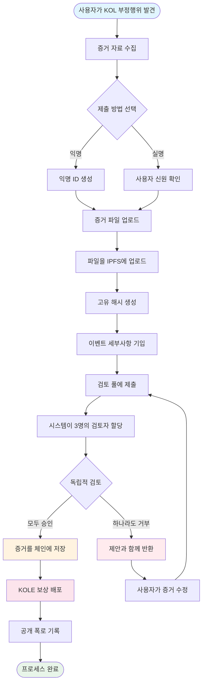

# **KOL 부정행위 폭로 플랫폼 백서**

### **블록체인 기술 기반 분산형 감독 생태계**

*버전 1.2 | 2025년 9월 (개정판)*

### 🌍 사용 가능한 언어
[🇬🇧 English](Whitepaper_EN.md) | [🇨🇳 中文](Whitepaper_CN.md) | [🇯🇵 日本語](Whitepaper_JP.md) | [🇷🇺 Русский](Whitepaper_RU.md) | [🇪🇸 Español](Whitepaper_ES.md) | [🇰🇷 한국어](Whitepaper_KR.md) | [🇸🇦 العربية](Whitepaper_AR.md) | [🇹🇷 Türkçe](Whitepaper_TR.md) | [🇧🇷 Português](Whitepaper_PT.md) | [🇫🇷 Français](Whitepaper_FR.md) | [🇩🇪 Deutsch](Whitepaper_DE.md) | [🇮🇳 हिंदी](Whitepaper_HI.md) | [🇮🇱 עברית](Whitepaper_HE.md) | [🇻🇳 Tiếng Việt](Whitepaper_VI.md) | [🇹🇭 ไทย](Whitepaper_TH.md)

---

## **목차**

1.  [요약](#요약)
2.  [프로젝트 배경 및 비전](#프로젝트-배경-및-비전)
3.  [기술 아키텍처](#기술-아키텍처)
4.  [핵심 기능 모듈](#핵심-기능-모듈)
5.  [토큰이코노믹스](#토큰이코노믹스)
6.  [커뮤니티 거버넌스](#커뮤니티-거버넌스)
7.  [플랫폼 장점](#플랫폼-장점)
8.  [개발 로드맵](#개발-로드맵)
9.  [위험 공시](#위험-공시)
10. [결론](#결론)

---

## **요약**

KOL 부정행위 폭로 플랫폼은 블록체인 기술을 기반으로 한 분산형 감독 생태계입니다. 투명하고 공정한 메커니즘을 통해 KOL(핵심 의견 리더)의 부정행위를 폭로하고 기록하여 투자자와 소비자의 권리와 이익을 보호하는 것을 목표로 합니다.

### **핵심 가치 제안**
- ✅ **불변성**: 블록체인 기술을 기반으로 증거가 영구적으로 보존됩니다.
- ✅ **분산화**: 커뮤니티 거버넌스, 단일 통제점 회피.
- ✅ **투명성 및 공정성**: 모든 프로세스가 공개적으로 감사 가능하며, 검토는 독립적으로 수행됩니다.
- ✅ **충분한 인센티브**: 토큰이코노믹 모델이 사용자의 적극적인 참여를 장려합니다.

---

## **프로젝트 배경 및 비전**

### **1.1 업계 문제점**

| 문제 유형 | 구체적 발현 | 영향 범위 |
|---|---|---|
| **허위 광고** | KOL이 제품 효과를 과장하고 허위 수익을 약속 | 소비자 금전적 손실 |
| **악의적 "러그풀"** | 팬의 신뢰를 악용한 "러그풀" 계획 | 투자자 자산 손실 |
| **데이터 사기** | 인게이지먼트를 부풀리고, 팔로워를 구매하여 광고주를 속임 | 브랜드의 마케팅 예산 낭비 |
| **감독 부재** | 기존 플랫폼의 비효과적인 규제, 열악한 신고 채널 | 부정행위의 지속적인 만연 |
| **증거 손실 용이성** | 증거가 쉽게 삭제되거나 PR로 처리됨 | 권리 옹호의 어려움 |

### **1.2 플랫폼 비전**

> **"KOL 행동을 감독하는 분산화되고 투명한 생태계를 구축하고, 블록체인 기술을 통해 증거의 진정성과 불변성을 보장하며, 커뮤니티 거버넌스를 통해 공정하고 정의로운 검토 메커니즘을 달성하고, 궁극적으로 건강하고 질서있는 KOL 생태계를 확립한다."**

---

## **기술 아키텍처**

### **2.1 기술 스택 개요**

- **애플리케이션 계층**
  - 웹 | 모바일 | API | 관리 백엔드
- **서비스 계층**
  - 비즈니스 로직 | 스마트 컨트랙트 상호작용 | 데이터 처리
- **블록체인 계층**
  - Solana | 스마트 컨트랙트 | 토큰 컨트랙트
- **스토리지 계층**
  - IPFS 분산 스토리지 | 온체인 데이터 스토리지

### **2.2 핵심 기술 구성요소**

#### **🔗 블록체인 인프라**
- **메인체인 선택**: Solana
- **성능 지표**: 65,000 TPS, 400ms 블록 시간
- **비용 우위**: 거래 수수료 <$0.01

#### **📦 스마트 컨트랙트 시스템**
- **증거 온체인 컨트랙트**: 증거 제출 프로세스를 자동으로 실행.
- **토큰 배포 컨트랙트**: 보상 배포를 관리.
- **거버넌스 컨트랙트**: 투표와 의사결정을 처리.

#### **💾 분산 스토리지**
- **IPFS 네트워크**: 원본 증거 파일을 저장.
- **중복 백업**: 글로벌 노드에서 동기화.
- **접근 속도**: CDN 가속 접근.

---

## **핵심 기능 모듈**

### **3.1 제출 시스템**

#### **제출 프로세스**

#### **세부 단계**
1.  **증거 준비** - 스크린샷, 녹화, 채팅 로그 수집
2.  **방법 선택** - 익명 또는 실명 제출
3.  **파일 업로드** - 증거가 자동으로 IPFS에 업로드
4.  **정보 기입** - 사건과 영향을 설명
5.  **검토 제출** - 분산형 검토 프로세스 진입
6.  **배심원 검토** - 3명의 독립적 검토자가 평가
7.  **승인** - 증거가 영구적으로 온체인에 저장
8.  **보상 수령** - 자동 KOLE 토큰 배포

#### **지원되는 증거 유형**
- 📷 이미지 증거 (스크린샷, 사진)
- 🎥 비디오 증거 (화면 녹화, 동영상)
- 💬 채팅 로그 (WeChat, Telegram 등)
- 📄 문서 증거 (계약서, 협정서 등)

### **3.2 검토 시스템**

#### **검토 메커니즘 설계**

| 검토 요소 | 구체적 요구사항 | 목적 |
|---|---|---|
| **검토자 수** | 최소 3명 | 공정성 보장 |
| **독립적 검토** | 다른 검토자의 결과를 모름 | 공모 방지 |
| **만장일치 요구사항** | **모든 검토자가 만장일치로 동의해야** 인증 | 증거의 기본 품질 보장 |
| **평가 기준** | 1-5점 평가 시스템, **최종 레벨은 모든 평가의 평균(반올림)** | 사건의 심각성을 정량화 |
| **시간 제한** | 48시간 내 완료 | 효율성 향상 |

### **3.3 폭로 표시 시스템**

#### **심각도 레벨 분류**

| 레벨 | 별 표시 | 설명 | 전형적 행동 |
|---|---|---|---|
| **레벨 5** | ***** | 극악무도 | 사기, 심각한 사기 |
| **레벨 4** | **** | 심각한 부정행위 | 악의적 러그풀, 허위 광고 |
| **레벨 3** | *** | 중간 부정행위 | 과장된 주장, 데이터 사기 |
| **레벨 2** | ** | 경미한 부정행위 | 신뢰 위반, 부적절한 발언 |
| **레벨 1** | * | 일반적 부정행위 | 서비스 품질 불량, 나쁜 태도 |

---

## **토큰이코노믹스**

### **4.1 토큰 개요**

| 항목 | 세부사항 |
|---|---|
| **토큰 명** | KOLE Token |
| **토큰 심볼** | KOLE |
| **총 공급량** | 1,000,000,000 (10억) |
| **토큰 표준** | SPL (Solana Program Library) |
| **소수점** | 9 |
| **발행 방법** | 일괄 발행, 고정 공급 |

### **4.2 토큰 할당 계획**

| 할당 | 백분율 | 상태 및 언락 메커니즘 |
|---|---|---|
| **사용자 제출 보상** | 40% | **락됨**. 보상을 위해 매일 0.5% 언락. 미사용 토큰은 매주 재락됨. |
| **보유자 복권** | 40% | **완전 유통**. 커뮤니티 토큰 보유자를 위한 복권 이벤트에 사용. |
| **생태계 개발** | 10% | **락됨**. R&D, 운영 등을 위해. 매월 1% 언락. |
| **팀 및 어드바이저** | 10% | **락됨**. 매월 2% 언락. |

### **4.3 보상 메커니즘 세부사항**

| 보상 유형 | 토큰 수량 (KOLE) | 수령 조건 |
|---|---|---|
| **최초 신고 보상** | 100,000 | KOL 부정행위의 진정하고 유효한 증거를 최초로 제출하고 검토를 통과. |
| **보완 증거 보상** | 20,000 | 기존 사례에 유효한 보완 증거를 제공하여 완전성을 향상. |
| **검토자 보상** | 50,000 | 인증된 검토자로서 증거 검토 작업에 참여하고 완료. |

### **4.4 복권 시스템 (신규)**

커뮤니티 토큰 보유자에게 보상하기 위해, 플랫폼은 고빈도, 고가치 복권 시스템을 구축했습니다.

| 추첨 유형 | 빈도 | 총 상금 풀 | 당첨 모델 및 할당 비율 |
|---|---|---|---|
| **일반 대상** | 매시간 1회 | **10 SOL** | **3명의 당첨자**, **5 : 3 : 2** 비율로 할당 (즉, 5 SOL, 3 SOL, 2 SOL) |
| **슈퍼 대상** | 매일 00:00 (SGT) | **66 SOL** | **3명의 당첨자**, **40 : 20 : 6** 비율로 할당 (즉, 40 SOL, 20 SOL, 6 SOL) |

**자격**:
- **보유 임계값**: **300,000 KOLE 토큰** 보유마다 1장의 복권 티켓 수령.
- **가중치 상한**: 공정성을 보장하기 위해, 각 지갑 주소는 **5장의 복권 티켓**에 해당하는 최대 당첨 가중치를 가질 수 있습니다.
- **보유 기간**: 주소의 토큰은 현재 추첨 라운드에 참여 자격을 얻기 위해 최소 **1시간** 보유되어야 합니다.

### **4.5 소각 메커니즘**

| 소각 유형 | 트리거 조건 | 설명 |
|---|---|---|
| **환매 및 소각** | PUMP 플랫폼 라이브 스트리밍 보상 | PUMP 플랫폼에서 얻은 모든 라이브 스트리밍 보상은 2차 시장에서 KOLE 토큰을 환매하고 소각하는 데 사용됩니다. |
| **재단 매칭 및 소각**| 성공적으로 폭로된 KOL당 | 재단은 총 공급량의 0.5%를 구매하고 토큰 가치를 높이기 위해 토큰을 소각합니다. |
| **비정기 소각** | 플랫폼 결정 | 플랫폼은 운영 조건에 따라 정기적으로 시장에서 토큰을 환매하고 소각합니다. |

### **4.6 펀딩 풀 지원**

| 펀드 유형 | 금액 | 주요 용도 |
|---|---|---|
| **플랫폼 자체 자금** | $1,000,000 | 운영, 개발, 마케팅. 약 **$700,000 (3000 SOL 상당)**의 초기 분할금이 복권 보상 상금 풀에 주입되었습니다. |
| **투자자 자금** | $1,000,000 | (1단계) 생태계 구축, 유동성 지원 및 미래 개발을 위해. |

---

## **커뮤니티 거버넌스**

### **5.1 DAO 거버넌스 구조**

*   **KOLE 보유자** (투표)
    *   ⬇️
*   **거버넌스 위원회** (실행)
    *   ⬇️
        *   배심원단
        *   개발팀
        *   운영팀

### **5.2 투표 가중치**

| 보유량 (KOLE) | 투표 가중치 | 특권 |
|---|---|---|
| 1 - 999 | 1x | 기본 투표권 |
| 1,000 - 9,999 | 1.2x | 제안권 |
| 10,000 - 99,999 | 1.5x | 배심원 후보 자격 |
| 100,000+ | 2x | 거버넌스 위원회 후보 자격 |

### **5.3 제안 유형**
- **기술 제안**: 기능 업데이트, 기술 아키텍처 조정
- **경제 제안**: 토큰이코노믹스 조정, 보상 배포
- **운영 제안**: 플랫폼 규칙, 커뮤니티 이벤트
- **긴급 제안**: 보안 사건, 긴급 결정

---

## **플랫폼 장점**

### **6.1 기술적 장점**

| 장점 | 설명 | 가치 |
|---|---|---|
| **🔒 불변성** | 블록체인에서의 영구 저장 | 100% 신뢰할 수 있는 증거 |
| **⚡ 고성능** | Solana의 초당 65,000 트랜잭션 | 원활한 사용자 경험 |
| **💰 저비용** | 거래 수수료 <$0.01 | 진입 장벽 낮춤 |
| **🌍 글로벌** | IPFS 분산 스토리지 | 전 세계적으로 접근 가능 |

### **6.2 메커니즘 장점**
- **투명하고 공정**: 모든 프로세스가 온체인에서 검증 가능.
- **충분한 인센티브**: 다층 토큰 인센티브 시스템.
- **커뮤니티 주도**: 진정한 분산 거버넌스.
- **프라이버시 보호**: 익명 신고 지원.

### **6.3 생태계 장점**
- **개방적 협업**: 오픈소스 코드, 기여 환영.
- **크로스체인 호환성**: 미래의 멀티체인 배포 지원.
- **개방형 API**: 쿼리를 위한 제3자 접근.
- **규정 준수 운영**: 지역 법률 및 규정 준수.

---

## **개발 로드맵**

### **1단계: 기반 구축 (2025년 Q1) ✅**
- [x] 백서 발표
- [x] 핵심 팀 구성
- [x] 기술 아키텍처 설계
- [x] 스마트 컨트랙트 개발

### **2단계: 제품 출시 (2025년 Q2) ✅**
- [x] 메인넷 배포
- [x] 베타 테스트 및 공식 웹사이트 출시
- [x] 초기 사용자 모집
- [x] 토큰 발행 (KOLE)

### **3단계: 생태계 확장 (2025년 Q3) 🚀**
- [x] DEX 상장
- [ ] CEX 상장 신청
- [ ] 파트너십 확장
- [ ] 모바일 앱 출시

### **4단계: 글로벌화 (2025년 Q4) 🌱**
- [ ] 다국어 지원
- [ ] 크로스체인 브릿징
- [ ] AI 지원 검토
- [ ] DAO를 통한 완전 분산화

### **5단계: 장기 계획 (2026+) 🔮**
- [ ] 업계 표준 설정
- [ ] 규제 협력
- [ ] Web3 정체성 통합
- [ ] 메타버스 확장

---

## **위험 공시**

### **8.1 기술적 위험**

| 위험 유형 | 잠재적 영향 | 완화 조치 |
|---|---|---|
| 스마트 컨트랙트 취약점 | 자금 손실 | 다중 감사, 공식 검증 |
| 네트워크 공격 | 서비스 중단 | DDoS 보호, 다중 노드 배포 |
| 확장성 문제 | 성능 저하 | 레이어 2 솔루션, 샤딩 기술 |

### **8.2 규제 위험**
- **정책 변화**: 다양한 지역의 규제 발전을 면밀히 모니터링.
- **규정 준수 요구사항**: 규정 준수를 보장하기 위해 법률 자문 참여.
- **KYC/AML**: 필요시 신원 확인 구현.

### **8.3 운영 위험**
- **악의적 제출**: AI 지원 스크리닝 + 수동 검토.
- **검토자 공모**: 무작위 할당 + 평판 시스템.
- **시장 경쟁**: 지속적인 혁신 + 사용자 경험 최적화.

---

## **결론**

KOL 부정행위 폭로 플랫폼은 KOL 행동을 감독하는 **공정하고 투명하며 신뢰할 수 있는** 생태계 구축에 전념하고 있습니다. 블록체인 기술과 커뮤니티 거버넌스 메커니즘을 통해 KOL 부정행위를 효과적으로 억제하고, 사용자 권리를 보호하며, 업계의 건전한 발전을 촉진할 수 있다고 믿습니다.

### **함께 해주세요**

🌐 **웹사이트**: `https://kolexposure.com/#/`
💬 **텔레그램**: `https://t.me/kolexposure`
🐦 **트위터 / X**: `https://x.com/TODO_dream`, `https://x.com/kolexposure`
🤖 **디스코드**: `https://discord.com/invite/sZf44CseTf`
🌱 **CA**: `2EL3kJNYbgoqvtK4eyfNxgYiwm2V7B84kfMd1KLRpump`

### **면책조항**

이 백서는 정보 제공 목적으로만 작성되었으며 투자 조언을 구성하지 않습니다. 디지털 자산에 대한 투자는 높은 위험을 수반합니다; 신중히 평가해 주시기 바랍니다. 플랫폼은 실제 상황에 따라 개발 계획을 조정할 권리를 보유합니다.

---

**© 2025 KOL 부정행위 폭로 플랫폼 | 블록체인 기술 기반 분산형 감독 생태계**