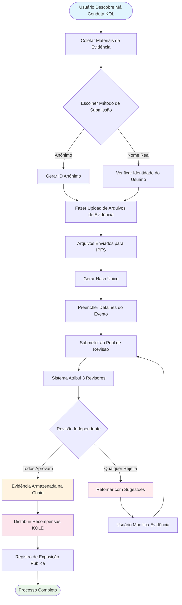

# **Livro Branco da Plataforma de Exposição de Má Conduta KOL**

### **Um Ecossistema de Supervisão Descentralizado Baseado em Tecnologia Blockchain**

*Versão 1.2 | Setembro 2025 (Revisado)*

### 🌍 Idiomas Disponíveis
[🇬🇧 English](Whitepaper_EN.md) | [🇨🇳 中文](Whitepaper_CN.md) | [🇯🇵 日本語](Whitepaper_JP.md) | [🇷🇺 Русский](Whitepaper_RU.md) | [🇪🇸 Español](Whitepaper_ES.md) | [🇰🇷 한국어](Whitepaper_KR.md) | [🇸🇦 العربية](Whitepaper_AR.md) | [🇹🇷 Türkçe](Whitepaper_TR.md) | [🇧🇷 Português](Whitepaper_PT.md) | [🇫🇷 Français](Whitepaper_FR.md) | [🇩🇪 Deutsch](Whitepaper_DE.md) | [🇮🇳 हिंदी](Whitepaper_HI.md) | [🇮🇱 עברית](Whitepaper_HE.md) | [🇻🇳 Tiếng Việt](Whitepaper_VI.md) | [🇹🇭 ไทย](Whitepaper_TH.md)

---

## **Índice**

1.  [Resumo Executivo](#resumo-executivo)
2.  [Contexto do Projeto e Visão](#contexto-do-projeto-e-visão)
3.  [Arquitetura Técnica](#arquitetura-técnica)
4.  [Módulos de Função Principal](#módulos-de-função-principal)
5.  [Tokenomics](#tokenomics)
6.  [Governança Comunitária](#governança-comunitária)
7.  [Vantagens da Plataforma](#vantagens-da-plataforma)
8.  [Roteiro de Desenvolvimento](#roteiro-de-desenvolvimento)
9.  [Divulgação de Riscos](#divulgação-de-riscos)
10. [Conclusão](#conclusão)

---

## **Resumo Executivo**

A Plataforma de Exposição de Má Conduta KOL é um ecossistema de supervisão descentralizado baseado em tecnologia blockchain. Visa proteger os direitos e interesses de investidores e consumidores através da exposição e registro da má conduta de KOLs (Líderes de Opinião Chave) através de um mecanismo transparente e justo.

### **Proposta de Valor Central**
- ✅ **Imutável**: Evidências são preservadas permanentemente baseadas em tecnologia blockchain.
- ✅ **Descentralizado**: Governado pela comunidade, evitando pontos únicos de controle.
- ✅ **Transparente e Justo**: Todos os processos são auditáveis publicamente, e revisões são conduzidas independentemente.
- ✅ **Incentivos Suficientes**: O modelo tokenômico incentiva participação ativa dos usuários.

---

## **Contexto do Projeto e Visão**

### **1.1 Pontos Problemáticos da Indústria**

| Tipo de Problema | Manifestação Específica | Escopo de Impacto |
|---|---|---|
| **Propaganda Falsa** | KOLs exagerando efeitos de produtos, prometendo retornos falsos | Perdas financeiras dos consumidores |
| **"Rug Pulls" Maliciosos** | Explorar a confiança dos fãs para esquemas de "rug pull" | Perdas de ativos dos investidores |
| **Fraude de Dados** | Inflando engajamento, comprando seguidores para enganar anunciantes | Orçamentos de marketing desperdiçados para marcas |
| **Falta de Supervisão** | Regulamentação ineficaz em plataformas existentes, canais de denúncia ruins | Prevalência contínua de má conduta |
| **Evidência é Facilmente Perdida** | Evidências são facilmente deletadas ou manipuladas por relações públicas | Dificuldade em defender direitos |

### **1.2 Visão da Plataforma**

> **"Construir um ecossistema descentralizado e transparente para supervisionar o comportamento de KOL, garantindo a autenticidade e imutabilidade das evidências através da tecnologia blockchain, alcançando um mecanismo de revisão justo e equitativo através da governança comunitária, e finalmente estabelecendo um ecossistema KOL saudável e ordenado."**

---

## **Arquitetura Técnica**

### **2.1 Visão Geral da Pilha Tecnológica**

- **Camada de Aplicação**
  - Web | Mobile | API | Backend Administrativo
- **Camada de Serviço**
  - Lógica de Negócio | Interação de Smart Contracts | Processamento de Dados
- **Camada Blockchain**
  - Solana | Smart Contracts | Contratos de Token
- **Camada de Armazenamento**
  - Armazenamento Distribuído IPFS | Armazenamento de Dados On-Chain

### **2.2 Componentes Técnicos Centrais**

#### **🔗 Infraestrutura Blockchain**
- **Seleção da Mainchain**: Solana
- **Métricas de Performance**: 65,000 TPS, tempo de bloco de 400ms
- **Vantagem de Custo**: Taxas de transação <$0.01

#### **📦 Sistema de Smart Contracts**
- **Contrato de Evidência On-Chain**: Executa automaticamente o processo de submissão de evidências.
- **Contrato de Distribuição de Tokens**: Gerencia distribuição de recompensas.
- **Contrato de Governança**: Lida com votação e tomada de decisões.

#### **💾 Armazenamento Distribuído**
- **Rede IPFS**: Armazena arquivos de evidência originais.
- **Backup Redundante**: Sincronizado através de nós globais.
- **Velocidade de Acesso**: Acesso acelerado por CDN.

---

## **Módulos de Função Principal**

### **3.1 Sistema de Submissão**

#### **Processo de Submissão**

#### **Passos Detalhados**
1.  **Preparar Evidência** - Coletar screenshots, gravações, logs de chat
2.  **Escolher Método** - Submissão anônima ou com nome real
3.  **Upload de Arquivos** - Evidência automaticamente enviada para IPFS
4.  **Preencher Informações** - Descrever o incidente e impacto
5.  **Submeter para Revisão** - Entrar no processo de revisão descentralizado
6.  **Revisão do Júri** - 3 revisores independentes avaliam
7.  **Aprovação** - Evidência permanentemente armazenada on-chain
8.  **Receber Recompensa** - Distribuição automática de tokens KOLE

#### **Tipos de Evidência Suportados**
- 📷 Evidência de Imagem (screenshots, fotos)
- 🎥 Evidência de Vídeo (gravações de tela, vídeos)
- 💬 Logs de Chat (WeChat, Telegram, etc.)
- 📄 Evidência Documental (contratos, acordos, etc.)

### **3.2 Sistema de Revisão**

#### **Design do Mecanismo de Revisão**

| Elemento de Revisão | Requisito Específico | Propósito |
|---|---|---|
| **Número de Revisores** | Mínimo de 3 pessoas | Garantir equidade |
| **Revisão Independente** | Não sabem dos resultados de outros revisores | Prevenir conluio |
| **Requisito de Unanimidade** | **Todos os revisores devem concordar unanimemente** para certificação | Garantir qualidade básica da evidência |
| **Padrão de Avaliação** | Sistema de avaliação de 1-5 estrelas, **o nível final é a média de todas as avaliações (arredondado)** | Quantificar a severidade do incidente |
| **Limite de Tempo** | Completar dentro de 48 horas | Melhorar eficiência |

### **3.3 Sistema de Exibição de Exposição**

#### **Classificação de Níveis de Severidade**

| Nível | Exibição de Estrelas | Descrição | Comportamento Típico |
|---|---|---|---|
| **Nível 5** | ***** | Atroz | Golpes, fraude séria |
| **Nível 4** | **** | Má Conduta Severa | Rug pulls maliciosos, propaganda falsa |
| **Nível 3** | *** | Má Conduta Moderada | Alegações exageradas, fraude de dados |
| **Nível 2** | ** | Má Conduta Menor | Quebra de confiança, comentários inadequados |
| **Nível 1** | * | Má Conduta Geral | Qualidade de serviço ruim, atitude ruim |

---

## **Tokenomics**

### **4.1 Visão Geral do Token**

| Item | Detalhes |
|---|---|
| **Nome do Token** | KOLE Token |
| **Símbolo do Token** | KOLE |
| **Fornecimento Total** | 1,000,000,000 (1 Bilhão) |
| **Padrão do Token** | SPL (Solana Program Library) |
| **Decimais** | 9 |
| **Método de Emissão** | Cunhado de uma vez, fornecimento fixo |

### **4.2 Plano de Alocação de Tokens**

| Alocação | Porcentagem | Status e Mecanismo de Desbloqueio |
|---|---|---|
| **Recompensas de Submissão de Usuários** | 40% | **Bloqueado**. 0.5% desbloqueado diariamente para recompensas. Tokens não utilizados são rebloqueados semanalmente. |
| **Loteria de Portadores** | 40% | **Totalmente Circulando**. Usado para eventos de loteria para portadores de tokens da comunidade. |
| **Desenvolvimento do Ecossistema** | 10% | **Bloqueado**. Para P&D, operações, etc. 1% desbloqueado mensalmente. |
| **Equipe e Consultores** | 10% | **Bloqueado**. 2% desbloqueado mensalmente. |

### **4.3 Detalhes do Mecanismo de Recompensas**

| Tipo de Recompensa | Quantidade de Tokens (KOLE) | Condições para Recebimento |
|---|---|---|
| **Recompensa de Primeiro Relatório** | 100,000 | Submeter evidência autêntica e válida de má conduta KOL pela primeira vez, e passar na revisão. |
| **Recompensa de Evidência Suplementar** | 20,000 | Fornecer evidência suplementar válida para um caso existente, melhorando sua completude. |
| **Recompensa de Revisor** | 50,000 | Participar e completar trabalho de revisão de evidência como revisor certificado. |

### **4.4 Sistema de Loteria (Novo)**

Para recompensar portadores de tokens da comunidade, a plataforma estabeleceu um sistema de loteria de alta frequência e alto valor.

| Tipo de Sorteio | Frequência | Pool Total de Prêmios | Modelo de Vencedores e Razão de Alocação |
|---|---|---|---|
| **Grande Prêmio Regular** | Uma vez por hora | **10 SOL** | **3 vencedores**, alocados numa razão **5 : 3 : 2** (ou seja, 5 SOL, 3 SOL, 2 SOL) |
| **Super Grande Prêmio** | Diariamente às 00:00 (SGT) | **66 SOL** | **3 vencedores**, alocados numa razão **40 : 20 : 6** (ou seja, 40 SOL, 20 SOL, 6 SOL) |

**Elegibilidade**:
- **Limite de Posse**: Receber 1 bilhete de loteria para cada **300,000 tokens KOLE** mantidos.
- **Limite de Peso**: Para garantir equidade, cada endereço de carteira pode ter um peso máximo de vitória equivalente a **5 bilhetes de loteria**.
- **Período de Posse**: Tokens no endereço devem ser mantidos por pelo menos **1 hora** para serem elegíveis para a rodada atual do sorteio.

### **4.5 Mecanismo de Queima**

| Tipo de Queima | Condição Desencadeadora | Descrição |
|---|---|---|
| **Recompra e Queima** | Recompensas de Live Streaming da Plataforma PUMP | Todas as recompensas de live streaming obtidas na plataforma PUMP serão usadas para recomprar e queimar tokens KOLE do mercado secundário. |
| **Correspondência da Fundação e Queima**| Para cada KOL exposto com sucesso | A fundação comprará 0.5% do fornecimento total e queimará os tokens para aumentar o valor do token. |
| **Queimas Irregulares** | Decisão da Plataforma | A plataforma periodicamente recomprará e queimará tokens do mercado baseado em condições operacionais. |

### **4.6 Suporte do Pool de Financiamento**

| Tipo de Fundo | Quantia | Uso Principal |
|---|---|---|
| **Fundos Próprios da Plataforma** | $1,000,000 | Operações, desenvolvimento, marketing. A parcela inicial de aproximadamente **$700,000 (equivalente a 3000 SOL)** foi injetada no pool de prêmios para recompensas de loteria. |
| **Fundos de Investidores** | $1,000,000 | (Fase 1) Para construção do ecossistema, suporte de liquidez e desenvolvimento futuro. |

---

## **Governança Comunitária**

### **5.1 Estrutura de Governança DAO**

*   **Portadores KOLE** (Votam)
    *   ⬇️
*   **Comitê de Governança** (Executa)
    *   ⬇️
        *   Júri
        *   Equipe de Desenvolvimento
        *   Equipe de Operações

### **5.2 Peso de Voto**

| Quantidade de Posse (KOLE) | Peso de Voto | Privilégios |
|---|---|---|
| 1 - 999 | 1x | Direitos básicos de voto |
| 1,000 - 9,999 | 1.2x | Direito de propor |
| 10,000 - 99,999 | 1.5x | Elegibilidade para candidatura ao Júri |
| 100,000+ | 2x | Elegibilidade para candidatura ao Comitê de Governança |

### **5.3 Tipos de Propostas**
- **Propostas Técnicas**: Atualizações de recursos, ajustes de arquitetura técnica
- **Propostas Econômicas**: Ajustes de tokenomics, distribuição de recompensas
- **Propostas Operacionais**: Regras da plataforma, eventos comunitários
- **Propostas de Emergência**: Incidentes de segurança, decisões urgentes

---

## **Vantagens da Plataforma**

### **6.1 Vantagens Técnicas**

| Vantagem | Descrição | Valor |
|---|---|---|
| **🔒 Imutável** | Armazenamento permanente no blockchain | 100% evidência confiável |
| **⚡ Alta Performance** | 65,000 transações por segundo do Solana | Experiência de usuário suave |
| **💰 Baixo Custo** | Taxas de transação <$0.01 | Reduz barreira de entrada |
| **🌍 Global** | Armazenamento distribuído IPFS | Acessível globalmente |

### **6.2 Vantagens do Mecanismo**
- **Transparente e Justo**: Todos os processos são verificáveis on-chain.
- **Incentivos Suficientes**: Sistema de incentivos de token multi-camada.
- **Dirigido pela Comunidade**: Verdadeira governança descentralizada.
- **Proteção de Privacidade**: Suporta relatórios anônimos.

### **6.3 Vantagens do Ecossistema**
- **Colaboração Aberta**: Código open-source, contribuições bem-vindas.
- **Compatibilidade Cross-Chain**: Suporte futuro para implantação multi-chain.
- **API Aberta**: Acesso de terceiros para consultas.
- **Operações Conformes**: Aderência a leis e regulamentações locais.

---

## **Roteiro de Desenvolvimento**

### **Fase 1: Construção de Fundação (Q1 2025) ✅**
- [x] Lançamento do livro branco
- [x] Formação da equipe central
- [x] Design da arquitetura técnica
- [x] Desenvolvimento de smart contracts

### **Fase 2: Lançamento do Produto (Q2 2025) ✅**
- [x] Implantação da mainnet
- [x] Teste beta e lançamento do site oficial
- [x] Recrutamento dos primeiros usuários
- [x] Emissão de token (KOLE)

### **Fase 3: Expansão do Ecossistema (Q3 2025) 🚀**
- [x] Listagem DEX
- [ ] Aplicação para listagem CEX
- [ ] Expansão de parcerias
- [ ] Lançamento de APP móvel

### **Fase 4: Globalização (Q4 2025) 🌱**
- [ ] Suporte multi-idioma
- [ ] Ponte cross-chain
- [ ] Revisão assistida por IA
- [ ] Descentralização completa via DAO

### **Fase 5: Plano de Longo Prazo (2026+) 🔮**
- [ ] Estabelecimento de padrões da indústria
- [ ] Cooperação regulatória
- [ ] Integração de identidade Web3
- [ ] Expansão do metaverso

---

## **Divulgação de Riscos**

### **8.1 Riscos Técnicos**

| Tipo de Risco | Impacto Potencial | Medidas de Mitigação |
|---|---|---|
| Vulnerabilidades de Smart Contracts | Perda de fundos | Múltiplas auditorias, verificação formal |
| Ataques de Rede | Interrupção de serviço | Proteção DDoS, implantação multi-nó |
| Problemas de Escalabilidade | Degradação de performance | Soluções de camada 2, tecnologia de sharding |

### **8.2 Riscos Regulatórios**
- **Mudanças de Política**: Monitoramento próximo de desenvolvimentos regulatórios em várias regiões.
- **Requisitos de Conformidade**: Envolver consultoria jurídica para garantir conformidade.
- **KYC/AML**: Implementar verificação de identidade quando necessário.

### **8.3 Riscos Operacionais**
- **Submissões Maliciosas**: Triagem assistida por IA + revisão manual.
- **Conluio de Revisores**: Atribuição aleatória + sistema de reputação.
- **Competição de Mercado**: Inovação contínua + otimização da experiência do usuário.

---

## **Conclusão**

A Plataforma de Exposição de Má Conduta KOL está comprometida em construir um ecossistema **justo, transparente e confiável** para supervisionar o comportamento de KOL. Através da tecnologia blockchain e mecanismos de governança comunitária, acreditamos que podemos efetivamente frear a má conduta de KOL, proteger os direitos dos usuários e promover o desenvolvimento saudável da indústria.

### **Junte-se a Nós**

🌐 **Website**: `https://kolexposure.com/#/`
💬 **Telegram**: `https://t.me/kolexposure`
🐦 **Twitter / X**: `https://x.com/TODO_dream`, `https://x.com/kolexposure`
🤖 **Discord**: `https://discord.com/invite/sZf44CseTf`
🌱 **CA**: `2EL3kJNYbgoqvtK4eyfNxgYiwm2V7B84kfMd1KLRpump`

### **Isenção de Responsabilidade**

Este livro branco é apenas para fins informativos e não constitui conselho de investimento. Investir em ativos digitais envolve altos riscos; por favor, avalie cuidadosamente. A plataforma reserva o direito de ajustar seus planos de desenvolvimento de acordo com circunstâncias reais.

---

**© 2025 Plataforma de Exposição de Má Conduta KOL | Um Ecossistema de Supervisão Descentralizado Baseado em Tecnologia Blockchain**