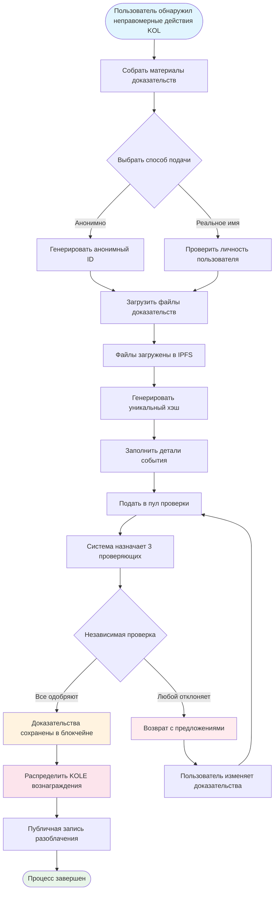

# **Белая книга платформы разоблачения неправомерных действий KOL**

### **Децентрализованная экосистема надзора на основе блокчейн технологий**

*Версия 1.2 | Сентябрь 2025 (Пересмотренная)*

---

## **Содержание**

1.  [Резюме](#резюме)
2.  [Предпосылки проекта и видение](#предпосылки-проекта-и-видение)
3.  [Техническая архитектура](#техническая-архитектура)
4.  [Основные функциональные модули](#основные-функциональные-модули)
5.  [Токеномика](#токеномика)
6.  [Управление сообществом](#управление-сообществом)
7.  [Преимущества платформы](#преимущества-платформы)
8.  [Дорожная карта разработки](#дорожная-карта-разработки)
9.  [Раскрытие рисков](#раскрытие-рисков)
10. [Заключение](#заключение)

---

## **Резюме**

Платформа разоблачения неправомерных действий KOL представляет собой децентрализованную экосистему надзора на основе блокчейн технологий. Она направлена на защиту прав и интересов инвесторов и потребителей путем разоблачения и фиксирования неправомерных действий KOL (Ключевых лидеров мнений) через прозрачный и справедливый механизм.

### **Основное ценностное предложение**
- ✅ **Неизменность**: Доказательства постоянно сохраняются на основе блокчейн технологий.
- ✅ **Децентрализация**: Управление сообществом, избегание единых точек контроля.
- ✅ **Прозрачность и справедливость**: Все процессы подлежат публичному аудиту, проверки проводятся независимо.
- ✅ **Достаточные стимулы**: Токеномическая модель стимулирует активное участие пользователей.

---

## **Предпосылки проекта и видение**

### **1.1 Проблемы индустрии**

| Тип проблемы | Конкретное проявление | Масштаб воздействия |
|---|---|---|
| **Ложная реклама** | KOL преувеличивают эффекты продуктов, обещают ложную прибыль | Финансовые потери потребителей |
| **Злонамеренные "Rug Pull"** | Использование доверия фанатов для схем "rug pull" | Потери активов инвесторов |
| **Мошенничество с данными** | Завышение вовлеченности, покупка подписчиков для обмана рекламодателей | Потраченные впустую маркетинговые бюджеты брендов |
| **Отсутствие надзора** | Неэффективное регулирование на существующих платформах, плохие каналы отчетности | Продолжающееся распространение неправомерных действий |
| **Легкая потеря доказательств** | Доказательства легко удаляются или обрабатываются PR | Сложность защиты прав |

### **1.2 Видение платформы**

> **"Построить децентрализованную и прозрачную экосистему для надзора за поведением KOL, обеспечивая подлинность и неизменность доказательств через блокчейн технологии, достигая справедливого и честного механизма проверки через управление сообществом, и в конечном итоге установив здоровую и упорядоченную экосистему KOL."**

---

## **Техническая архитектура**

### **2.1 Обзор технологического стека**

- **Уровень приложений**
  - Веб | Мобильные | API | Административный бэкенд
- **Уровень сервисов**
  - Бизнес-логика | Взаимодействие смарт-контрактов | Обработка данных
- **Уровень блокчейна**
  - Solana | Смарт-контракты | Токеновые контракты
- **Уровень хранения**
  - IPFS распределенное хранилище | Хранение данных на блокчейне

### **2.2 Основные технические компоненты**

#### **🔗 Блокчейн инфраструктура**
- **Выбор основной сети**: Solana
- **Показатели производительности**: 65,000 TPS, время блока 400мс
- **Преимущество в стоимости**: Комиссии за транзакции <$0.01

#### **📦 Система смарт-контрактов**
- **Контракт размещения доказательств на блокчейне**: Автоматически выполняет процесс подачи доказательств.
- **Контракт распределения токенов**: Управляет распределением вознаграждений.
- **Контракт управления**: Обрабатывает голосование и принятие решений.

#### **💾 Распределенное хранилище**
- **Сеть IPFS**: Хранит оригинальные файлы доказательств.
- **Резервное копирование**: Синхронизация по глобальным узлам.
- **Скорость доступа**: Ускоренный доступ через CDN.

---

## **Основные функциональные модули**

### **3.1 Система подачи**

#### **Процесс подачи**

#### **Подробные шаги**
1.  **Подготовить доказательства** - Собрать скриншоты, записи, логи чатов
2.  **Выбрать метод** - Анонимная или именная подача
3.  **Загрузить файлы** - Доказательства автоматически загружаются в IPFS
4.  **Заполнить информацию** - Описать инцидент и воздействие
5.  **Подать на проверку** - Войти в децентрализованный процесс проверки
6.  **Проверка жюри** - 3 независимых проверяющих оценивают
7.  **Одобрение** - Доказательства постоянно сохраняются в блокчейне
8.  **Получить вознаграждение** - Автоматическое распределение KOLE токенов

#### **Поддерживаемые типы доказательств**
- 📷 Графические доказательства (скриншоты, фотографии)
- 🎥 Видео доказательства (записи экрана, видео)
- 💬 Логи чатов (WeChat, Telegram, и т.д.)
- 📄 Документальные доказательства (контракты, соглашения, и т.д.)

### **3.2 Система проверки**

#### **Дизайн механизма проверки**

| Элемент проверки | Конкретное требование | Цель |
|---|---|---|
| **Количество проверяющих** | Минимум 3 человека | Обеспечить справедливость |
| **Независимая проверка** | Не знают результатов других проверяющих | Предотвратить сговор |
| **Требование единогласия** | **Все проверяющие должны единогласно согласиться** для сертификации | Гарантировать базовое качество доказательств |
| **Стандарт оценки** | Система оценки 1-5 звезд, **финальный уровень - среднее всех оценок (округленное)** | Количественно оценить серьезность инцидента |
| **Временной лимит** | Завершить в течение 48 часов | Повысить эффективность |

### **3.3 Система отображения разоблачений**

#### **Классификация уровней серьезности**

| Уровень | Отображение звезд | Описание | Типичное поведение |
|---|---|---|---|
| **Уровень 5** | ***** | Чудовищные | Мошенничество, серьезное мошенничество |
| **Уровень 4** | **** | Серьезные неправомерные действия | Злонамеренные rug pull, ложная реклама |
| **Уровень 3** | *** | Умеренные неправомерные действия | Преувеличенные заявления, мошенничество с данными |
| **Уровень 2** | ** | Незначительные неправомерные действия | Нарушение доверия, неуместные замечания |
| **Уровень 1** | * | Общие неправомерные действия | Низкое качество обслуживания, плохое отношение |

---

## **Токеномика**

### **4.1 Обзор токена**

| Параметр | Детали |
|---|---|
| **Название токена** | KOLE Token |
| **Символ токена** | KOLE |
| **Общее предложение** | 1,000,000,000 (1 миллиард) |
| **Стандарт токена** | SPL (Solana Program Library) |
| **Десятичные знаки** | 9 |
| **Метод выпуска** | Выпущен сразу, фиксированное предложение |

### **4.2 План распределения токенов**

| Распределение | Процент | Статус и механизм разблокировки |
|---|---|---|
| **Вознаграждения за подачи пользователей** | 40% | **Заблокировано**. 0.5% разблокируется ежедневно для вознаграждений. Неиспользованные токены перезаблокируются еженедельно. |
| **Лотерея для держателей** | 40% | **Полностью в обращении**. Используется для лотерейных событий для держателей токенов сообщества. |
| **Развитие экосистемы** | 10% | **Заблокировано**. Для R&D, операций, и т.д. 1% разблокируется ежемесячно. |
| **Команда и советники** | 10% | **Заблокировано**. 2% разблокируется ежемесячно. |

### **4.3 Детали механизма вознаграждений**

| Тип вознаграждения | Количество токенов (KOLE) | Условия получения |
|---|---|---|
| **Вознаграждение за первый отчет** | 100,000 | Подача подлинных и действительных доказательств неправомерных действий KOL впервые и прохождение проверки. |
| **Вознаграждение за дополнительные доказательства** | 20,000 | Предоставление действительных дополнительных доказательств для существующего дела, повышающих его полноту. |
| **Вознаграждение проверяющего** | 50,000 | Участие и завершение работы по проверке доказательств в качестве сертифицированного проверяющего. |

### **4.4 Система лотереи (Новая)**

Для вознаграждения держателей токенов сообщества платформа установила высокочастотную, высокоценную систему лотереи.

| Тип розыгрыша | Частота | Общий призовой фонд | Модель выигрыша и коэффициент распределения |
|---|---|---|---|
| **Обычный Гранд Приз** | Раз в час | **10 SOL** | **3 победителя**, распределяются в соотношении **5 : 3 : 2** (т.е., 5 SOL, 3 SOL, 2 SOL) |
| **Супер Гранд Приз** | Ежедневно в 00:00 (SGT) | **66 SOL** | **3 победителя**, распределяются в соотношении **40 : 20 : 6** (т.е., 40 SOL, 20 SOL, 6 SOL) |

**Право участия**:
- **Порог владения**: Получите 1 лотерейный билет за каждые **300,000 KOLE токенов** во владении.
- **Лимит веса**: Для обеспечения справедливости каждый адрес кошелька может иметь максимальный вес выигрыша, эквивалентный **5 лотерейным билетам**.
- **Период владения**: Токены в адресе должны удерживаться не менее **1 часа**, чтобы иметь право на текущий раунд розыгрыша.

### **4.5 Механизм сжигания**

| Тип сжигания | Условие срабатывания | Описание |
|---|---|---|
| **Выкуп и сжигание** | Вознаграждения за прямые трансляции на платформе PUMP | Все вознаграждения за прямые трансляции, полученные на платформе PUMP, будут использованы для выкупа и сжигания KOLE токенов с вторичного рынка. |
| **Соответствие фонда и сжигание**| За каждого успешно разоблаченного KOL | Фонд приобретет 0.5% от общего предложения и сожжет токены для увеличения стоимости токена. |
| **Нерегулярные сжигания** | Решение платформы | Платформа периодически выкупает и сжигает токены с рынка на основе операционных условий. |

### **4.6 Поддержка фонда финансирования**

| Тип фонда | Сумма | Основное использование |
|---|---|---|
| **Собственные средства платформы** | $1,000,000 | Операции, разработка, маркетинг. Первоначальный взнос приблизительно **$700,000 (эквивалент 3000 SOL)** был внесен в призовой фонд для лотерейных вознаграждений. |
| **Средства инвесторов** | $1,000,000 | (Фаза 1) Для строительства экосистемы, поддержки ликвидности и будущего развития. |

---

## **Управление сообществом**

### **5.1 Структура управления DAO**

*   **Держатели KOLE** (Голосуют)
    *   ⬇️
*   **Комитет управления** (Выполняют)
    *   ⬇️
        *   Жюри
        *   Команда разработки
        *   Операционная команда

### **5.2 Вес голоса**

| Количество владения (KOLE) | Вес голоса | Привилегии |
|---|---|---|
| 1 - 999 | 1x | Базовые права голоса |
| 1,000 - 9,999 | 1.2x | Право предложения |
| 10,000 - 99,999 | 1.5x | Право кандидатуры в жюри |
| 100,000+ | 2x | Право кандидатуры в комитет управления |

### **5.3 Типы предложений**
- **Технические предложения**: Обновления функций, корректировки технической архитектуры
- **Экономические предложения**: Корректировки токеномики, распределение вознаграждений
- **Операционные предложения**: Правила платформы, события сообщества
- **Экстренные предложения**: Инциденты безопасности, срочные решения

---

## **Преимущества платформы**

### **6.1 Технические преимущества**

| Преимущество | Описание | Ценность |
|---|---|---|
| **🔒 Неизменность** | Постоянное хранение в блокчейне | 100% достоверные доказательства |
| **⚡ Высокая производительность** | 65,000 транзакций в секунду Solana | Плавный пользовательский опыт |
| **💰 Низкая стоимость** | Комиссии за транзакции <$0.01 | Снижает барьер для входа |
| **🌍 Глобальность** | IPFS распределенное хранилище | Глобально доступно |

### **6.2 Преимущества механизма**
- **Прозрачность и справедливость**: Все процессы проверяемы в блокчейне.
- **Достаточные стимулы**: Многоуровневая система токеновых стимулов.
- **Управляемое сообществом**: Истинное децентрализованное управление.
- **Защита конфиденциальности**: Поддержка анонимной отчетности.

### **6.3 Преимущества экосистемы**
- **Открытое сотрудничество**: Открытый исходный код, приветствуются вклады.
- **Кросс-чейн совместимость**: Будущая поддержка мульти-чейн развертывания.
- **Открытый API**: Доступ третьих сторон для запросов.
- **Соответствующие операции**: Соблюдение местных законов и правил.

---

## **Дорожная карта разработки**

### **Фаза 1: Строительство фундамента (Q1 2025) ✅**
- [x] Выпуск белой книги
- [x] Формирование основной команды
- [x] Дизайн технической архитектуры
- [x] Разработка смарт-контрактов

### **Фаза 2: Запуск продукта (Q2 2025) ✅**
- [x] Развертывание мейннета
- [x] Бета-тестирование и запуск официального сайта
- [x] Набор первых пользователей
- [x] Выпуск токена (KOLE)

### **Фаза 3: Расширение экосистемы (Q3 2025) 🚀**
- [x] Листинг на DEX
- [ ] Заявка на листинг CEX
- [ ] Расширение партнерства
- [ ] Выпуск мобильного приложения

### **Фаза 4: Глобализация (Q4 2025) 🌱**
- [ ] Поддержка нескольких языков
- [ ] Кросс-чейн мостинг
- [ ] ИИ-ассистируемая проверка
- [ ] Полная децентрализация через DAO

### **Фаза 5: Долгосрочный план (2026+) 🔮**
- [ ] Установление отраслевых стандартов
- [ ] Сотрудничество с регуляторами
- [ ] Интеграция Web3 идентичности
- [ ] Расширение в метавселенную

---

## **Раскрытие рисков**

### **8.1 Технические риски**

| Тип риска | Потенциальное воздействие | Меры по смягчению |
|---|---|---|
| Уязвимости смарт-контрактов | Потеря средств | Множественные аудиты, формальная верификация |
| Сетевые атаки | Прерывание сервиса | Защита от DDoS, развертывание на нескольких узлах |
| Проблемы масштабируемости | Ухудшение производительности | Решения уровня 2, технология шардинга |

### **8.2 Регуляторные риски**
- **Изменения политики**: Тщательный мониторинг регуляторных изменений в различных регионах.
- **Требования соответствия**: Привлечение юридических консультантов для обеспечения соответствия.
- **KYC/AML**: Внедрение верификации личности при необходимости.

### **8.3 Операционные риски**
- **Злонамеренные подачи**: ИИ-ассистируемый скрининг + ручная проверка.
- **Сговор проверяющих**: Случайное назначение + система репутации.
- **Рыночная конкуренция**: Непрерывные инновации + оптимизация пользовательского опыта.

---

## **Заключение**

Платформа разоблачения неправомерных действий KOL стремится построить **справедливую, прозрачную и заслуживающую доверия** экосистему для надзора за поведением KOL. Через блокчейн технологии и механизмы управления сообществом мы верим, что можем эффективно сдерживать неправомерные действия KOL, защищать права пользователей и способствовать здоровому развитию индустрии.

### **Присоединяйтесь к нам**

🌐 **Веб-сайт**: `https://kolexposure.com/#/`
💬 **Telegram**: `https://t.me/kolexposure`
🐦 **Twitter / X**: `https://x.com/TODO_dream`, `https://x.com/kolexposure`
🤖 **Discord**: `https://discord.com/invite/sZf44CseTf`
🌱 **CA**: `2EL3kJNYbgoqvtK4eyfNxgYiwm2V7B84kfMd1KLRpump`

### **Отказ от ответственности**

Данная белая книга предназначена только для информационных целей и не является инвестиционным советом. Инвестирование в цифровые активы связано с высокими рисками; пожалуйста, оценивайте тщательно. Платформа оставляет за собой право корректировать свои планы развития в соответствии с фактическими обстоятельствами.

---

**© 2025 Платформа разоблачения неправомерных действий KOL | Децентрализованная экосистема надзора на основе блокчейн технологий**