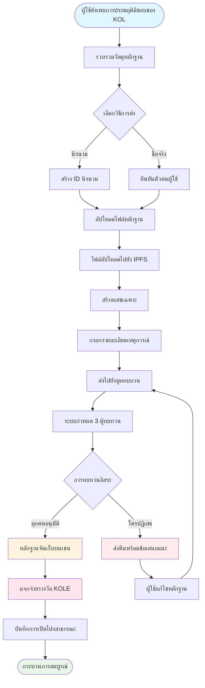

# **เอกสารแสดงวิสัยทัศน์แพลตฟอร์มเปิดโปงการประพฤติมิชอบของ KOL**

### **ระบบนิเวศการกำกับดูแลแบบกระจายศูนย์บนเทคโนโลยีบล็อกเชน**

*เวอร์ชัน 1.2 | กันยายน 2025 (ปรับปรุงแล้ว)*

---

## **สารบัญ**

1.  [บทสรุปสำหรับผู้บริหาร](#บทสรุปสำหรับผู้บริหาร)
2.  [ภูมิหลังโครงการและวิสัยทัศน์](#ภูมิหลังโครงการและวิสัยทัศน์)
3.  [สถาปัตยกรรมเทคนิค](#สถาปัตยกรรมเทคนิค)
4.  [โมดูลฟังก์ชันหลัก](#โมดูลฟังก์ชันหลัก)
5.  [โทเค็นโนมิกส์](#โทเค็นโนมิกส์)
6.  [การกำกับดูแลชุมชน](#การกำกับดูแลชุมชน)
7.  [ข้อได้เปรียบของแพลตฟอร์ม](#ข้อได้เปรียบของแพลตฟอร์ม)
8.  [แผนที่นำทางการพัฒนา](#แผนที่นำทางการพัฒนา)
9.  [การเปิดเผยความเสี่ยง](#การเปิดเผยความเสี่ยง)
10. [บทสรุป](#บทสรุป)

---

## **บทสรุปสำหรับผู้บริหาร**

แพลตฟอร์มเปิดโปงการประพฤติมิชอบของ KOL เป็นระบบนิเวศการกำกับดูแลแบบกระจายศูนย์ที่อยู่บนเทคโนโลยีบล็อกเชน มันมีเป้าหมายเพื่อปกป้องสิทธิและประโยชน์ของนักลงทุนและผู้บริโภคโดยการเปิดโปงและบันทึกการประพฤติมิชอบของ KOL (ผู้นำทางความคิดหลัก) ผ่านกลไกที่โปร่งใสและยุติธรรม

### **ข้อเสนอคุณค่าหลัก**
- ✅ **ไม่เปลี่ยนแปลง**: หลักฐานถูกเก็บรักษาอย่างถาวรบนพื้นฐานเทคโนโลยีบล็อกเชน
- ✅ **กระจายศูนย์**: ถูกควบคุมโดยชุมชน หลีกเลี่ยงจุดควบคุมเดียว
- ✅ **โปร่งใสและยุติธรรม**: กระบวนการทั้งหมดสามารถตรวจสอบได้สาธารณะ และการทบทวนดำเนินการโดยอิสระ
- ✅ **แรงจูงใจเพียงพอ**: โมเดลโทเค็นโนมิกส์ส่งเสริมการมีส่วนร่วมอย่างแข็งขันของผู้ใช้

---

## **ภูมิหลังโครงการและวิสัยทัศน์**

### **1.1 จุดเจ็บปวดของอุตสาหกรรม**

| ประเภทปัญหา | การแสดงออกเฉพาะ | ขอบเขตของผลกระทบ |
|---|---|---|
| **การโฆษณาเท็จ** | KOL เกินจริงเกี่ยวกับผลของผลิตภัณฑ์ สัญญาผลตอบแทนเท็จ | ความสูญเสียทางการเงินของผู้บริโภค |
| **"รักพูล" ที่เป็นอันตราย** | การใช้ประโยชน์จากความไว้วางใจของแฟนคลับในโครงการ "รักพูล" | ความสูญเสียสินทรัพย์ของนักลงทุน |
| **การฉ้อโกงข้อมูล** | การพองตัวของการมีส่วนร่วม ซื้อผู้ติดตามเพื่อหลอกผู้โฆษณา | งบประมาณการตลาดที่เสียไปของแบรนด์ |
| **ขาดการกำกับดูแล** | การควบคุมที่ไม่มีประสิทธิภาพบนแพลตฟอร์มที่มีอยู่ ช่องทางการรายงานที่แย่ | การแพร่กระจายอย่างต่อเนื่องของการประพฤติมิชอบ |
| **หลักฐานหายได้ง่าย** | หลักฐานถูกลบได้ง่ายหรือถูกจัดการโดยฝ่ายประชาสัมพันธ์ | ความยากลำบากในการปกป้องสิทธิ |

### **1.2 วิสัยทัศน์แพลตฟอร์ม**

> **"สร้างระบบนิเวศแบบกระจายศูนย์และโปร่งใสเพื่อกำกับดูแลพฤติกรรม KOL รับรองความถูกต้องและความไม่เปลี่ยนแปลงของหลักฐานผ่านเทคโนโลยีบล็อกเชน บรรลุกลไกการทบทวนที่ยุติธรรมและเป็นธรรมผ่านการกำกับดูแลของชุมชน และในที่สุดสร้างระบบนิเวศ KOL ที่แข็งแรงและเป็นระเบียบ"**

---

## **สถาปัตยกรรมเทคนิค**

### **2.1 ภาพรวมสแต็กเทคโนโลยี**

- **ชั้นแอปพลิเคชัน**
  - เว็บ | มือถือ | API | แบ็กเอนด์ผู้ดูแล
- **ชั้นบริการ**
  - ตรรกะทางธุรกิจ | การโต้ตอบสมาร์ทคอนแทรค | การประมวลผลข้อมูล
- **ชั้นบล็อกเชน**
  - Solana | สมาร์ทคอนแทรค | คอนแทรคโทเค็น
- **ชั้นจัดเก็บ**
  - IPFS การจัดเก็บแบบกระจาย | การจัดเก็บข้อมูลบนเชน

### **2.2 ส่วนประกอบเทคนิคหลัก**

#### **🔗 โครงสร้างพื้นฐานบล็อกเชน**
- **การเลือกเมนเชน**: Solana
- **เมตริกประสิทธิภาพ**: 65,000 TPS, เวลาบล็อก 400ms
- **ข้อได้เปรียบด้านต้นทุน**: ค่าธรรมเนียมธุรกรรม <$0.01

#### **📦 ระบบสมาร์ทคอนแทรค**
- **คอนแทรคหลักฐานบนเชน**: ดำเนินกระบวนการส่งหลักฐานโดยอัตโนมัติ
- **คอนแทรคการแจกจ่ายโทเค็น**: จัดการการแจกจ่ายรางวัล
- **คอนแทรคการกำกับดูแล**: จัดการการลงคะแนนและการตัดสินใจ

#### **💾 การจัดเก็บแบบกระจาย**
- **เครือข่าย IPFS**: จัดเก็บไฟล์หลักฐานต้นฉบับ
- **การสำรองซ้ำซ้อน**: ซิงค์ข้ามโหนดทั่วโลก
- **ความเร็วการเข้าถึง**: การเข้าถึงที่เร่งความเร็วด้วย CDN

---

## **โมดูลฟังก์ชันหลัก**

### **3.1 ระบบการส่ง**

#### **กระบวนการส่ง**

#### **ขั้นตอนรายละเอียด**
1.  **เตรียมหลักฐาน** - รวบรวมภาพหน้าจอ การบันทึก บันทึกแชต
2.  **เลือกวิธี** - การส่งแบบนิรนามหรือชื่อจริง
3.  **อัปโหลดไฟล์** - หลักฐานอัปโหลดไปยัง IPFS โดยอัตโนมัติ
4.  **กรอกข้อมูล** - อธิบายเหตุการณ์และผลกระทบ
5.  **ส่งเพื่อทบทวน** - เข้าสู่กระบวนการทบทวนแบบกระจายศูนย์
6.  **การทบทวนคณะลูกขุน** - ผู้ทบทวนอิสระ 3 คนประเมิน
7.  **การอนุมัติ** - หลักฐานจัดเก็บบนเชนอย่างถาวร
8.  **รับรางวัล** - การแจกจ่ายโทเค็น KOLE อัตโนมัติ

#### **ประเภทหลักฐานที่รองรับ**
- 📷 หลักฐานภาพ (ภาพหน้าจอ ภาพถ่าย)
- 🎥 หลักฐานวิดีโอ (การบันทึกหน้าจอ วิดีโอ)
- 💬 บันทึกแชต (WeChat, Telegram ฯลฯ)
- 📄 หลักฐานเอกสาร (สัญญา ข้อตกลง ฯลฯ)

### **3.2 ระบบทบทวน**

#### **การออกแบบกลไกทบทวน**

| องค์ประกอบการทบทวน | ข้อกำหนดเฉพาะ | วัตถุประสงค์ |
|---|---|---|
| **จำนวนผู้ทบทวน** | อย่างน้อย 3 คน | รับประกันความยุติธรรม |
| **การทบทวนอิสระ** | ไม่รู้ผลลัพธ์ของผู้ทบทวนคนอื่น | ป้องกันการสมรู้ร่วมคิด |
| **ข้อกำหนดความเป็นเอกฉันท์** | **ผู้ทบทวนทุกคนต้องเห็นพ้องต้องกันเป็นเอกฉันท์** สำหรับการรับรอง | รับประกันคุณภาพพื้นฐานของหลักฐาน |
| **มาตรฐานการให้คะแนน** | ระบบการให้คะแนน 1-5 ดาว **ระดับสุดท้ายคือค่าเฉลี่ยของการให้คะแนนทั้งหมด (ปัดเศษ)** | วัดความรุนแรงของเหตุการณ์เป็นตัวเลข |
| **ขีดจำกัดเวลา** | เสร็จสิ้นภายใน 48 ชั่วโมง | ปรับปรุงประสิทธิภาพ |

### **3.3 ระบบแสดงการเปิดโปง**

#### **การจำแนกระดับความรุนแรง**

| ระดับ | การแสดงดาว | คำอธิบาย | พฤติกรรมทั่วไป |
|---|---|---|---|
| **ระดับ 5** | ***** | อุกฉกรรจ์ | การฉ้อโกง การหลอกลวงร้ายแรง |
| **ระดับ 4** | **** | การประพฤติมิชอบร้ายแรง | รักพูลที่เป็นอันตราย การโฆษณาเท็จ |
| **ระดับ 3** | *** | การประพฤติมิชอบปานกลาง | การอ้างที่เกินจริง การฉ้อโกงข้อมูล |
| **ระดับ 2** | ** | การประพฤติมิชอบเล็กน้อย | การทำลายความไว้วางใจ ความคิดเห็นที่ไม่เหมาะสม |
| **ระดับ 1** | * | การประพฤติมิชอบทั่วไป | คุณภาพการบริการต่ำ ทัศนคติแย่ |

---

## **โทเค็นโนมิกส์**

### **4.1 ภาพรวมโทเค็น**

| รายการ | รายละเอียด |
|---|---|
| **ชื่อโทเค็น** | KOLE Token |
| **สัญลักษณ์โทเค็น** | KOLE |
| **อุปทานรวม** | 1,000,000,000 (1 พันล้าน) |
| **มาตรฐานโทเค็น** | SPL (Solana Program Library) |
| **ทศนิยม** | 9 |
| **วิธีการออก** | หล่อครั้งเดียว อุปทานคงที่ |

### **4.2 แผนการจัดสรรโทเค็น**

| การจัดสรร | เปอร์เซ็นต์ | สถานะและกลไกปลดล็อก |
|---|---|---|
| **รางวัลการส่งผู้ใช้** | 40% | **ล็อกอยู่** ปลดล็อก 0.5% รายวันสำหรับรางวัล โทเค็นที่ไม่ได้ใช้จะถูกล็อกใหม่รายสัปดาห์ |
| **ลอตเตอรี่ผู้ถือ** | 40% | **หมุนเวียนเต็มที่** ใช้สำหรับกิจกรรมลอตเตอรี่สำหรับผู้ถือโทเค็นชุมชน |
| **การพัฒนาระบบนิเวศ** | 10% | **ล็อกอยู่** สำหรับ R&D การดำเนินงาน ฯลฯ ปลดล็อก 1% รายเดือน |
| **ทีมและที่ปรึกษา** | 10% | **ล็อกอยู่** ปลดล็อก 2% รายเดือน |

### **4.3 รายละเอียดกลไกรางวัล**

| ประเภทรางวัล | จำนวนโทเค็น (KOLE) | เงื่อนไขการรับ |
|---|---|---|
| **รางวัลรายงานแรก** | 100,000 | ส่งหลักฐานที่แท้จริงและถูกต้องของการประพฤติมิชอบของ KOL เป็นครั้งแรก และผ่านการทบทวน |
| **รางวัลหลักฐานเสริม** | 20,000 | ให้หลักฐานเสริมที่ถูกต้องสำหรับคดีที่มีอยู่ เพิ่มความสมบูรณ์ |
| **รางวัลผู้ทบทวน** | 50,000 | เข้าร่วมและเสร็จสิ้นงานทบทวนหลักฐานในฐานะผู้ทบทวนที่ได้รับการรับรอง |

### **4.4 ระบบลอตเตอรี่ (ใหม่)**

เพื่อให้รางวัลผู้ถือโทเค็นชุมชน แพลตฟอร์มได้สร้างระบบลอตเตอรี่ความถี่สูงและมูลค่าสูง

| ประเภทการจับรางวัล | ความถี่ | พูลรางวัลรวม | โมเดลผู้ชนะและอัตราส่วนการจัดสรร |
|---|---|---|---|
| **รางวัลใหญ่ปกติ** | ครั้งหนึ่งต่อชั่วโมง | **10 SOL** | **ผู้ชนะ 3 คน** จัดสรรในอัตราส่วน **5 : 3 : 2** (คือ 5 SOL, 3 SOL, 2 SOL) |
| **รางวัลใหญ่พิเศษ** | รายวันเวลา 00:00 (SGT) | **66 SOL** | **ผู้ชนะ 3 คน** จัดสรรในอัตราส่วน **40 : 20 : 6** (คือ 40 SOL, 20 SOL, 6 SOL) |

**คุณสมบัติ**:
- **เกณฑ์การถือ**: รับ 1 ตั้งลอตเตอรี่ทุก **300,000 โทเค็น KOLE** ที่ถือ
- **ขีดจำกัดน้ำหนัก**: เพื่อความยุติธรรม แต่ละที่อยู่กระเป๋าเงินสามารถมีน้ำหนักชนะสูงสุดเทียบเท่า **5 ตั้งลอตเตอรี่**
- **ระยะเวลาการถือ**: โทเค็นในที่อยู่ต้องถืออย่างน้อย **1 ชั่วโมง** เพื่อมีสิทธิ์สำหรับรอบการจับรางวัลปัจจุบัน

### **4.5 กลไกการเผา**

| ประเภทการเผา | เงื่อนไขที่เรียก | คำอธิบาย |
|---|---|---|
| **ซื้อคืนและเผา** | รางวัลไลฟ์สตรีมมิงแพลตฟอร์ม PUMP | รางวัลไลฟ์สตรีมมิงทั้งหมดที่ได้รับในแพลตฟอร์ม PUMP จะถูกใช้เพื่อซื้อคืนและเผาโทเค็น KOLE จากตลาดรอง |
| **การจับคู่มูลนิธิและเผา** | สำหรับทุก KOL ที่เปิดโปงสำเร็จ | มูลนิธิจะซื้อ 0.5% ของอุปทานรวมและเผาโทเค็นเพื่อเพิ่มมูลค่าโทเค็น |
| **การเผาไม่สม่ำเสมอ** | การตัดสินใจของแพลตฟอร์ม | แพลตฟอร์มจะซื้อคืนและเผาโทเค็นจากตลาดเป็นระยะๆ ตามสภาวะการดำเนินงาน |

### **4.6 การสนับสนุนพูลเงินทุน**

| ประเภทกองทุน | จำนวน | การใช้หลัก |
|---|---|---|
| **เงินทุนของแพลตฟอร์มเอง** | $1,000,000 | การดำเนินงาน การพัฒนา การตลาด งวดแรกประมาณ **$700,000 (เทียบเท่า 3000 SOL)** ถูกฉีดเข้าพูลรางวัลสำหรับรางวัลลอตเตอรี่ |
| **เงินทุนนักลงทุน** | $1,000,000 | (เฟส 1) สำหรับการสร้างระบบนิเวศ การสนับสนุนสภาพคล่อง และการพัฒนาในอนาคต |

---

## **การกำกับดูแลชุมชน**

### **5.1 โครงสร้างการกำกับดูแล DAO**

*   **ผู้ถือ KOLE** (ลงคะแนน)
    *   ⬇️
*   **คณะกรรมการกำกับดูแล** (ดำเนินการ)
    *   ⬇️
        *   คณะลูกขุน
        *   ทีมพัฒนา
        *   ทีมปฏิบัติการ

### **5.2 น้ำหนักการลงคะแนน**

| จำนวนการถือ (KOLE) | น้ำหนักการลงคะแนน | สิทธิพิเศษ |
|---|---|---|
| 1 - 999 | 1x | สิทธิการลงคะแนนพื้นฐาน |
| 1,000 - 9,999 | 1.2x | สิทธิในการเสนอ |
| 10,000 - 99,999 | 1.5x | คุณสมบัติสำหรับการเป็นผู้สมัครคณะลูกขุน |
| 100,000+ | 2x | คุณสมบัติสำหรับการเป็นผู้สมัครคณะกรรมการกำกับดูแล |

### **5.3 ประเภทข้อเสนอ**
- **ข้อเสนอทางเทคนิค**: การอัปเดตคุณสมบัติ การปรับสถาปัตยกรรมทางเทคนิค
- **ข้อเสนอทางเศรษฐกิจ**: การปรับโทเค็นโนมิกส์ การแจกจ่ายรางวัล
- **ข้อเสนอการดำเนินงาน**: กฎแพลตฟอร์ม กิจกรรมชุมชน
- **ข้อเสนอฉุกเฉิน**: เหตุการณ์ความปลอดภัย การตัดสินใจเร่งด่วน

---

## **ข้อได้เปรียบของแพลตฟอร์ม**

### **6.1 ข้อได้เปรียบทางเทคนิค**

| ข้อได้เปรียบ | คำอธิบาย | คุณค่า |
|---|---|---|
| **🔒 ไม่เปลี่ยนแปลง** | การจัดเก็บถาวรบนบล็อกเชน | หลักฐานที่เชื่อถือได้ 100% |
| **⚡ ประสิทธิภาพสูง** | 65,000 ธุรกรรมต่อวินาทีของ Solana | ประสบการณ์ผู้ใช้ที่ราบรื่น |
| **💰 ต้นทุนต่ำ** | ค่าธรรมเนียมธุรกรรม <$0.01 | ลดอุปสรรคการเข้า |
| **🌍 ทั่วโลก** | การจัดเก็บแบบกระจาย IPFS | เข้าถึงได้ทั่วโลก |

### **6.2 ข้อได้เปรียบของกลไก**
- **โปร่งใสและยุติธรรม**: กระบวนการทั้งหมดสามารถตรวจสอบได้บนเชน
- **แรงจูงใจเพียงพอ**: ระบบแรงจูงใจโทเค็นหลายชั้น
- **ขับเคลื่อนโดยชุมชน**: การกำกับดูแลแบบกระจายศูนย์ที่แท้จริง
- **การปกป้องความเป็นส่วนตัว**: รองรับการรายงานแบบนิรนาม

### **6.3 ข้อได้เปรียบของระบบนิเวศ**
- **การร่วมมือแบบเปิด**: โค้ดโอเพนซอร์ส ยินดีรับการสนับสนุน
- **ความเข้ากันได้ข้ามเชน**: การสนับสนุนในอนาคตสำหรับการปรับใช้แบบหลายเชน
- **API เปิด**: การเข้าถึงบุคคลที่สามสำหรับการสอบถาม
- **การดำเนินงานที่สอดคล้อง**: การปฏิบัติตามกฎหมายและระเบียบท้องถิ่น

---

## **แผนที่นำทางการพัฒนา**

### **เฟส 1: การสร้างรากฐาน (Q1 2025) ✅**
- [x] เปิดตัวเอกสารแสดงวิสัยทัศน์
- [x] การก่อตั้งทีมหลัก
- [x] การออกแบบสถาปัตยกรรมทางเทคนิค
- [x] การพัฒนาสมาร์ทคอนแทรค

### **เฟส 2: เปิดตัวผลิตภัณฑ์ (Q2 2025) ✅**
- [x] การปรับใช้เมนเน็ต
- [x] การทดสอบเบต้าและเปิดตัวเว็บไซต์อย่างเป็นทางการ
- [x] การสรรหาผู้ใช้แรก
- [x] การออกโทเค็น (KOLE)

### **เฟส 3: การขยายระบบนิเวศ (Q3 2025) 🚀**
- [x] การจดทะเบียน DEX
- [ ] การสมัครจดทะเบียน CEX
- [ ] การขยายความเป็นหุ้นส่วน
- [ ] การเปิดตัวแอปมือถือ

### **เฟส 4: โลกาภิวัตน์ (Q4 2025) 🌱**
- [ ] การสนับสนุนหลายภาษา
- [ ] การเชื่อมโยงข้ามเชน
- [ ] การทบทวนที่ช่วยด้วย AI
- [ ] การกระจายศูนย์อย่างเต็มรูปแบบผ่าน DAO

### **เฟส 5: แผนระยะยาว (2026+) 🔮**
- [ ] การตั้งมาตรฐานอุตสาหกรรม
- [ ] ความร่วมมือด้านกฎระเบียบ
- [ ] การรวมตัวตนเว็บ 3
- [ ] การขยายเมตาเวิร์ส

---

## **การเปิดเผยความเสี่ยง**

### **8.1 ความเสี่ยงทางเทคนิค**

| ประเภทความเสี่ยง | ผลกระทบที่อาจเกิดขึ้น | มาตรการลดความเสี่ยง |
|---|---|---|
| ช่องโหว่สมาร์ทคอนแทรค | การสูญเสียเงินทุน | การตรวจสอบหลายครั้ง การตรวจสอบอย่างเป็นทางการ |
| การโจมตีเครือข่าย | การหยุดชะงักของบริการ | การป้องกัน DDoS การปรับใช้หลายโหนด |
| ปัญหาความสามารถในการขยาย | การลดลงของประสิทธิภาพ | โซลูชันเลเยอร์ 2 เทคโนโลยีชาร์ดดิง |

### **8.2 ความเสี่ยงด้านกฎระเบียบ**
- **การเปลี่ยนแปลงนโยบาย**: การติดตามอย่างใกล้ชิดการพัฒนาด้านกฎระเบียบในภูมิภาคต่างๆ
- **ข้อกำหนดการปฏิบัติตาม**: การมีส่วนร่วมของที่ปรึกษากฎหมายเพื่อรับรองการปฏิบัติตาม
- **KYC/AML**: การนำการยืนยันตัวตนมาใช้เมื่อจำเป็น

### **8.3 ความเสี่ยงในการดำเนินงาน**
- **การส่งที่เป็นอันตราย**: การคัดกรองที่ช่วยด้วย AI + การทบทวนด้วยมือ
- **การสมรู้ร่วมคิดของผู้ทบทวน**: การมอบหมายแบบสุ่ม + ระบบชื่อเสียง
- **การแข่งขันในตลาด**: นวัตกรรมอย่างต่อเนื่อง + การปรับปรุงประสบการณ์ผู้ใช้

---

## **บทสรุป**

แพลตฟอร์มเปิดโปงการประพฤติมิชอบของ KOL มุ่งมั่นที่จะสร้างระบบนิเวศที่ **ยุติธรรม โปร่งใส และน่าเชื่อถือ** เพื่อกำกับดูแลพฤติกรรม KOL ผ่านเทคโนโลยีบล็อกเชนและกลไกการกำกับดูแลชุมชน เราเชื่อว่าเราสามารถยับยั้งการประพฤติมิชอบของ KOL ได้อย่างมีประสิทธิภาพ ปกป้องสิทธิของผู้ใช้ และส่งเสริมการพัฒนาที่แข็งแรงของอุตสาหกรรม

### **เข้าร่วมกับเรา**

🌐 **เว็บไซต์**: `https://kolexposure.com/#/`
💬 **Telegram**: `https://t.me/kolexposure`
🐦 **Twitter / X**: `https://x.com/TODO_dream`, `https://x.com/kolexposure`
🤖 **Discord**: `https://discord.com/invite/sZf44CseTf`
🌱 **CA**: `2EL3kJNYbgoqvtK4eyfNxgYiwm2V7B84kfMd1KLRpump`

### **ข้อปฏิเสธความรับผิดชอบ**

เอกสารแสดงวิสัยทัศน์นี้เป็นเพียงวัตถุประสงค์ในการให้ข้อมูลเท่านั้น และไม่ถือเป็นคำแนะนำการลงทุน การลงทุนในสินทรัพย์ดิจิทัลมีความเสี่ยงสูง โปรดประเมินอย่างรอบคอบ แพลตฟอร์มขอสงวนสิทธิ์ในการปรับแผนการพัฒนาตามสถานการณ์จริง

---

**© 2025 แพลตฟอร์มเปิดโปงการประพฤติมิชอบของ KOL | ระบบนิเวศการกำกับดูแลแบบกระจายศูนย์บนเทคโนโลยีบล็อกเชน**