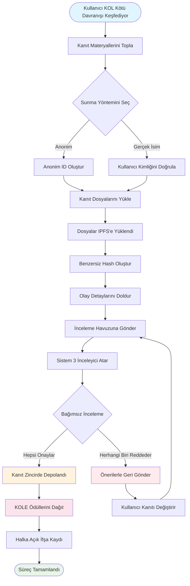

# **KOL Kötü Davranış İfşa Platformu Beyaz Kağıdı**

### **Blockchain Teknolojisine Dayalı Merkezi Olmayan Denetim Ekosistemi**

*Versiyon 1.2 | Eylül 2025 (Revize)*

### 🌍 Mevcut Diller
[🇬🇧 English](Whitepaper_EN.md) | [🇨🇳 中文](Whitepaper_CN.md) | [🇯🇵 日本語](Whitepaper_JP.md) | [🇷🇺 Русский](Whitepaper_RU.md) | [🇪🇸 Español](Whitepaper_ES.md) | [🇰🇷 한국어](Whitepaper_KR.md) | [🇸🇦 العربية](Whitepaper_AR.md) | [🇹🇷 Türkçe](Whitepaper_TR.md) | [🇧🇷 Português](Whitepaper_PT.md) | [🇫🇷 Français](Whitepaper_FR.md) | [🇩🇪 Deutsch](Whitepaper_DE.md) | [🇮🇳 हिंदी](Whitepaper_HI.md) | [🇮🇱 עברית](Whitepaper_HE.md) | [🇻🇳 Tiếng Việt](Whitepaper_VI.md) | [🇹🇭 ไทย](Whitepaper_TH.md)

---

## **İçindekiler**

1.  [Yönetici Özeti](#yönetici-özeti)
2.  [Proje Arka Planı ve Vizyonu](#proje-arka-planı-ve-vizyonu)
3.  [Teknik Mimari](#teknik-mimari)
4.  [Temel İşlev Modülleri](#temel-işlev-modülleri)
5.  [Token Ekonomisi](#token-ekonomisi)
6.  [Topluluk Yönetimi](#topluluk-yönetimi)
7.  [Platform Avantajları](#platform-avantajları)
8.  [Geliştirme Yol Haritası](#geliştirme-yol-haritası)
9.  [Risk Açıklaması](#risk-açıklaması)
10. [Sonuç](#sonuç)

---

## **Yönetici Özeti**

KOL Kötü Davranış İfşa Platformu, blockchain teknolojisine dayalı merkezi olmayan bir denetim ekosistemidir. Şeffaf ve adil bir mekanizma aracılığıyla KOL'ların (Kilit Görüş Liderleri) kötü davranışlarını ifşa ederek ve kaydederek yatırımcılar ve tüketicilerin hak ve çıkarlarını korumayı amaçlar.

### **Temel Değer Önerisi**
- ✅ **Değiştirilemez**: Kanıtlar blockchain teknolojisine dayalı olarak kalıcı şekilde korunur.
- ✅ **Merkezi Olmayan**: Topluluk tarafından yönetilen, tek kontrol noktalarından kaçınan.
- ✅ **Şeffaf ve Adil**: Tüm süreçler herkese açık denetlenebilir, incelemeler bağımsız olarak yapılır.
- ✅ **Yeterli Teşvikler**: Token ekonomik modeli kullanıcıların aktif katılımını teşvik eder.

---

## **Proje Arka Planı ve Vizyonu**

### **1.1 Endüstri Sorunları**

| Sorun Türü | Spesifik Tezahür | Etki Kapsamı |
|---|---|---|
| **Sahte Reklam** | KOL'lar ürün etkilerini abartıyor, sahte getiri vaat ediyor | Tüketici mali kayıpları |
| **Kötü Niyetli "Rug Pull"** | Hayran güvenini "rug pull" planları için sömürme | Yatırımcı varlık kayıpları |
| **Veri Sahtekarlığı** | Etkileşimi şişirme, reklamverenleri kandırmak için takipçi satın alma | Markalar için boşa giden pazarlama bütçeleri |
| **Denetim Eksikliği** | Mevcut platformlarda etkisiz düzenleme, zayıf raporlama kanalları | Kötü davranışın devam eden yaygınlığı |
| **Kanıt Kolayca Kaybolur** | Kanıtlar kolayca silinir veya halkla ilişkiler tarafından ele alınır | Hakları savunmada zorluk |

### **1.2 Platform Vizyonu**

> **"KOL davranışını denetlemek için merkezi olmayan ve şeffaf bir ekosistem inşa etmek, blockchain teknolojisi aracılığıyla kanıtların gerçekliğini ve değiştirilemezliğini sağlamak, topluluk yönetimi aracılığıyla adil ve hakkaniyetli bir inceleme mekanizması elde etmek ve sonuçta sağlıklı ve düzenli bir KOL ekosistemi kurmak."**

---

## **Teknik Mimari**

### **2.1 Teknoloji Yığını Genel Bakış**

- **Uygulama Katmanı**
  - Web | Mobil | API | Yönetici Arka Ucu
- **Hizmet Katmanı**
  - İş Mantığı | Akıllı Sözleşme Etkileşimi | Veri İşleme
- **Blockchain Katmanı**
  - Solana | Akıllı Sözleşmeler | Token Sözleşmeleri
- **Depolama Katmanı**
  - IPFS Dağıtık Depolama | Zincir Üzeri Veri Depolama

### **2.2 Temel Teknik Bileşenler**

#### **🔗 Blockchain Altyapısı**
- **Ana Zincir Seçimi**: Solana
- **Performans Metrikleri**: 65,000 TPS, 400ms blok süresi
- **Maliyet Avantajı**: İşlem ücretleri <$0.01

#### **📦 Akıllı Sözleşme Sistemi**
- **Kanıt Zincire Alma Sözleşmesi**: Kanıt sunma sürecini otomatik olarak yürütür.
- **Token Dağıtım Sözleşmesi**: Ödül dağıtımını yönetir.
- **Yönetim Sözleşmesi**: Oylama ve karar verme işlemlerini yürütür.

#### **💾 Dağıtık Depolama**
- **IPFS Ağı**: Orijinal kanıt dosyalarını depolar.
- **Yedek Kopya**: Küresel düğümler arasında senkronize.
- **Erişim Hızı**: CDN hızlandırılmış erişim.

---

## **Temel İşlev Modülleri**

### **3.1 Sunma Sistemi**

#### **Sunma Süreci**

#### **Detaylı Adımlar**
1.  **Kanıt Hazırlama** - Ekran görüntüleri, kayıtlar, sohbet günlüklerini toplama
2.  **Yöntem Seçme** - Anonim veya gerçek isimle sunma
3.  **Dosya Yükleme** - Kanıtlar otomatik olarak IPFS'e yüklenir
4.  **Bilgi Doldurma** - Olayı ve etkisini tanımlama
5.  **İnceleme İçin Sunma** - Merkezi olmayan inceleme sürecine girme
6.  **Jüri İncelemesi** - 3 bağımsız inceleyici değerlendirme yapar
7.  **Onay** - Kanıt kalıcı olarak zincir üzerinde depolanır
8.  **Ödül Alma** - Otomatik KOLE token dağıtımı

#### **Desteklenen Kanıt Türleri**
- 📷 Görüntü Kanıtı (ekran görüntüleri, fotoğraflar)
- 🎥 Video Kanıtı (ekran kayıtları, videolar)
- 💬 Sohbet Günlükleri (WeChat, Telegram, vb.)
- 📄 Belge Kanıtı (sözleşmeler, anlaşmalar, vb.)

### **3.2 İnceleme Sistemi**

#### **İnceleme Mekanizması Tasarımı**

| İnceleme Öğesi | Spesifik Gereksinim | Amaç |
|---|---|---|
| **İnceleyici Sayısı** | Minimum 3 kişi | Adaleyi sağlama |
| **Bağımsız İnceleme** | Diğer inceleyicilerin sonuçlarını bilmiyor | Gizli anlaşmayı engelleme |
| **Oybirliği Gereksinimi** | **Tüm inceleyiciler sertifikasyon için oybirliğiyle anlaşmalı** | Kanıtın temel kalitesini garanti etme |
| **Derecelendirme Standardı** | 1-5 yıldız derecelendirme sistemi, **son seviye tüm derecelendirmelerin ortalaması (yuvarlanmış)** | Olayın ciddiyetini niceliksel olarak belirleme |
| **Zaman Sınırı** | 48 saat içinde tamamlama | Verimliliği artırma |

### **3.3 İfşa Görüntüleme Sistemi**

#### **Ciddiyet Seviyesi Sınıflandırması**

| Seviye | Yıldız Gösterimi | Açıklama | Tipik Davranış |
|---|---|---|---|
| **Seviye 5** | ***** | İğrenç | Dolandırıcılık, ciddi sahtekarlık |
| **Seviye 4** | **** | Ciddi Kötü Davranış | Kötü niyetli rug pull'lar, sahte reklam |
| **Seviye 3** | *** | Orta Kötü Davranış | Abartılı iddialar, veri sahtekarlığı |
| **Seviye 2** | ** | Küçük Kötü Davranış | Güveni ihlal, uygunsuz yorumlar |
| **Seviye 1** | * | Genel Kötü Davranış | Zayıf hizmet kalitesi, kötü tutum |

---

## **Token Ekonomisi**

### **4.1 Token Genel Bakış**

| Öğe | Detaylar |
|---|---|
| **Token Adı** | KOLE Token |
| **Token Sembolü** | KOLE |
| **Toplam Arz** | 1,000,000,000 (1 Milyar) |
| **Token Standardı** | SPL (Solana Program Library) |
| **Ondalık Sayılar** | 9 |
| **Çıkarım Yöntemi** | Bir kerede basıldı, sabit arz |

### **4.2 Token Tahsis Planı**

| Tahsis | Yüzde | Durum ve Kilit Açma Mekanizması |
|---|---|---|
| **Kullanıcı Sunma Ödülleri** | 40% | **Kilitli**. Ödüller için günlük %0.5 kilit açılır. Kullanılmayan tokenlar haftalık olarak yeniden kilitlenir. |
| **Sahip Piyangosu** | 40% | **Tamamen Dolaşımda**. Topluluk token sahipleri için piyango etkinliklerinde kullanılır. |
| **Ekosistem Geliştirme** | 10% | **Kilitli**. Ar-Ge, operasyonlar vb. için. Aylık %1 kilit açılır. |
| **Takım ve Danışmanlar** | 10% | **Kilitli**. Aylık %2 kilit açılır. |

### **4.3 Ödül Mekanizması Detayları**

| Ödül Türü | Token Miktarı (KOLE) | Alma Koşulları |
|---|---|---|
| **İlk Rapor Ödülü** | 100,000 | KOL kötü davranışının otantik ve geçerli kanıtını ilk kez sunma ve incelemeyi geçme. |
| **Destekleyici Kanıt Ödülü** | 20,000 | Mevcut bir dava için geçerli destekleyici kanıt sağlama, tamamlığını artırma. |
| **İnceleyici Ödülü** | 50,000 | Sertifikalı inceleyici olarak kanıt inceleme işinde katılma ve tamamlama. |

### **4.4 Piyango Sistemi (Yeni)**

Topluluk token sahiplerini ödüllendirmek için platform yüksek frekanslı, yüksek değerli bir piyango sistemi kurmuştur.

| Çekiliş Türü | Sıklık | Toplam Ödül Havuzu | Kazanma Modeli ve Tahsis Oranı |
|---|---|---|---|
| **Düzenli Büyük Ödül** | Saatte bir kez | **10 SOL** | **3 kazanan**, **5 : 3 : 2** oranında tahsis edilir (yani, 5 SOL, 3 SOL, 2 SOL) |
| **Süper Büyük Ödül** | Günlük 00:00'da (SGT) | **66 SOL** | **3 kazanan**, **40 : 20 : 6** oranında tahsis edilir (yani, 40 SOL, 20 SOL, 6 SOL) |

**Uygunluk**:
- **Sahiplik Eşiği**: Her **300,000 KOLE token** tutma başına 1 piyango bileti alın.
- **Ağırlık Sınırı**: Adaleti sağlamak için her cüzdan adresi **5 piyango biletine** eşdeğer maksimum kazanma ağırlığına sahip olabilir.
- **Tutma Süresi**: Adresteki tokenlar mevcut çekiliş turu için uygun olmak için en az **1 saat** tutulmalıdır.

### **4.5 Yakma Mekanizması**

| Yakma Türü | Tetikleyici Koşul | Açıklama |
|---|---|---|
| **Geri Alım ve Yakma** | PUMP Platform Canlı Yayın Ödülleri | PUMP platformunda elde edilen tüm canlı yayın ödülleri ikincil piyasadan KOLE tokenları geri almak ve yakmak için kullanılacaktır. |
| **Vakıf Eşleştirme ve Yakma**| Başarıyla ifşa edilen her KOL için | Vakıf toplam arzın %0.5'ini satın alacak ve token değerini artırmak için tokenları yakacaktır. |
| **Düzensiz Yakmalar** | Platform Kararı | Platform operasyonel koşullara dayalı olarak periyodik olarak piyasadan token geri alıp yakacaktır. |

### **4.6 Finansman Havuzu Desteği**

| Fon Türü | Miktar | Birincil Kullanım |
|---|---|---|
| **Platformun Kendi Fonları** | $1,000,000 | Operasyonlar, geliştirme, pazarlama. Yaklaşık **$700,000 (3000 SOL eşdeğeri)** ilk taksit piyango ödülleri için ödül havuzuna enjekte edilmiştir. |
| **Yatırımcı Fonları** | $1,000,000 | (Faz 1) Ekosistem inşası, likidite desteği ve gelecek geliştirme için. |

---

## **Topluluk Yönetimi**

### **5.1 DAO Yönetim Yapısı**

*   **KOLE Sahipleri** (Oy Verirler)
    *   ⬇️
*   **Yönetim Komitesi** (Yürütür)
    *   ⬇️
        *   Jüri
        *   Geliştirme Takımı
        *   Operasyon Takımı

### **5.2 Oy Ağırlığı**

| Sahiplik Miktarı (KOLE) | Oy Ağırlığı | Ayrıcalıklar |
|---|---|---|
| 1 - 999 | 1x | Temel oy hakları |
| 1,000 - 9,999 | 1.2x | Öneride bulunma hakkı |
| 10,000 - 99,999 | 1.5x | Jüri adaylığı uygunluğu |
| 100,000+ | 2x | Yönetim Komitesi adaylığı uygunluğu |

### **5.3 Öneri Türleri**
- **Teknik Öneriler**: Özellik güncellemeleri, teknik mimari ayarlamaları
- **Ekonomik Öneriler**: Token ekonomisi ayarlamaları, ödül dağıtımı
- **Operasyonel Öneriler**: Platform kuralları, topluluk etkinlikleri
- **Acil Öneriler**: Güvenlik olayları, acil kararlar

---

## **Platform Avantajları**

### **6.1 Teknik Avantajlar**

| Avantaj | Açıklama | Değer |
|---|---|---|
| **🔒 Değiştirilemez** | Blockchain'de kalıcı depolama | %100 güvenilir kanıt |
| **⚡ Yüksek Performans** | Solana'nın saniyede 65,000 işlemi | Sorunsuz kullanıcı deneyimi |
| **💰 Düşük Maliyet** | İşlem ücretleri <$0.01 | Giriş engelini düşürür |
| **🌍 Küresel** | IPFS dağıtık depolama | Küresel olarak erişilebilir |

### **6.2 Mekanizma Avantajları**
- **Şeffaf ve Adil**: Tüm süreçler zincir üzerinde doğrulanabilir.
- **Yeterli Teşvikler**: Çok katmanlı token teşvik sistemi.
- **Topluluk Odaklı**: Gerçek merkezi olmayan yönetim.
- **Gizlilik Koruması**: Anonim raporlamayı destekler.

### **6.3 Ekosistem Avantajları**
- **Açık İşbirliği**: Açık kaynak kod, katkılar memnuniyetle karşılanır.
- **Çapraz Zincir Uyumluluğu**: Çoklu zincir dağıtımı için gelecek desteği.
- **Açık API**: Sorgular için üçüncü taraf erişimi.
- **Uyumlu Operasyonlar**: Yerel yasa ve düzenlemelere bağlılık.

---

## **Geliştirme Yol Haritası**

### **Faz 1: Temel İnşa (2025 Q1) ✅**
- [x] Beyaz kağıt yayını
- [x] Çekirdek takım oluşumu
- [x] Teknik mimari tasarım
- [x] Akıllı sözleşme geliştirme

### **Faz 2: Ürün Lansmanı (2025 Q2) ✅**
- [x] Ana ağ dağıtımı
- [x] Beta test ve resmi web sitesi lansmanı
- [x] İlk kullanıcı alımı
- [x] Token çıkarımı (KOLE)

### **Faz 3: Ekosistem Genişlemesi (2025 Q3) 🚀**
- [x] DEX listeleme
- [ ] CEX listeleme başvurusu
- [ ] Ortaklık genişlemesi
- [ ] Mobil APP yayını

### **Faz 4: Küreselleşme (2025 Q4) 🌱**
- [ ] Çok dilli destek
- [ ] Çapraz zincir köprüleme
- [ ] AI destekli inceleme
- [ ] DAO aracılığıyla tam merkeziyetsizlik

### **Faz 5: Uzun Vadeli Plan (2026+) 🔮**
- [ ] Endüstri standardı belirleme
- [ ] Düzenleyici işbirliği
- [ ] Web3 kimlik entegrasyonu
- [ ] Metaverse genişlemesi

---

## **Risk Açıklaması**

### **8.1 Teknik Riskler**

| Risk Türü | Potansiyel Etki | Azaltma Önlemleri |
|---|---|---|
| Akıllı Sözleşme Güvenlik Açıkları | Fon kaybı | Çoklu denetimler, formal doğrulama |
| Ağ Saldırıları | Hizmet kesintisi | DDoS koruması, çoklu düğüm dağıtımı |
| Ölçeklenebilirlik Sorunları | Performans bozulması | Katman 2 çözümleri, parçalama teknolojisi |

### **8.2 Düzenleyici Riskler**
- **Politika Değişiklikleri**: Çeşitli bölgelerdeki düzenleyici gelişmeleri yakından izleme.
- **Uyum Gereksinimleri**: Uyumu sağlamak için hukuk müşaviri dahil etme.
- **KYC/AML**: Gerektiğinde kimlik doğrulama uygulama.

### **8.3 Operasyonel Riskler**
- **Kötü Niyetli Sunumlar**: AI destekli tarama + manuel inceleme.
- **İnceleyici Gizli Anlaşması**: Rastgele atama + itibar sistemi.
- **Pazar Rekabeti**: Sürekli yenilik + kullanıcı deneyimi optimizasyonu.

---

## **Sonuç**

KOL Kötü Davranış İfşa Platformu, KOL davranışını denetlemek için **adil, şeffaf ve güvenilir** bir ekosistem inşa etmeye kendini adamıştır. Blockchain teknolojisi ve topluluk yönetim mekanizmaları aracılığıyla KOL kötü davranışını etkili bir şekilde engelleyebileceğimize, kullanıcı haklarını koruyabileceğimize ve endüstrinin sağlıklı gelişimini teşvik edebileceğimize inanıyoruz.

### **Bize Katılın**

🌐 **Web Sitesi**: `https://kolexposure.com/#/`
💬 **Telegram**: `https://t.me/kolexposure`
🐦 **Twitter / X**: `https://x.com/TODO_dream`, `https://x.com/kolexposure`
🤖 **Discord**: `https://discord.com/invite/sZf44CseTf`
🌱 **CA**: `2EL3kJNYbgoqvtK4eyfNxgYiwm2V7B84kfMd1KLRpump`

### **Sorumluluk Reddi**

Bu beyaz kağıt yalnızca bilgilendirme amaçlıdır ve yatırım tavsiyesi oluşturmaz. Dijital varlıklara yatırım yapmak yüksek riskler içerir; lütfen dikkatlice değerlendirin. Platform, gerçek koşullara göre geliştirme planlarını ayarlama hakkını saklı tutar.

---

**© 2025 KOL Kötü Davranış İfşa Platformu | Blockchain Teknolojisine Dayalı Merkezi Olmayan Denetim Ekosistemi**