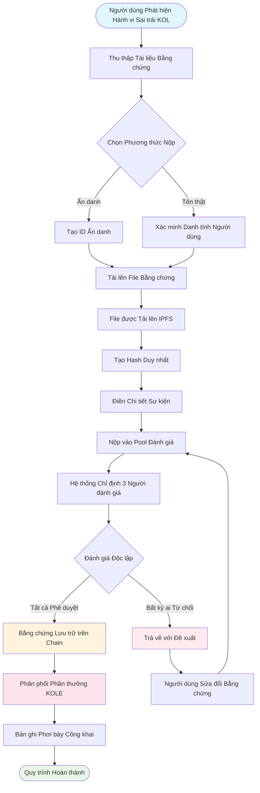

# **Whitepaper Nền tảng Phơi bày Hành vi Sai trái của KOL**

### **Hệ sinh thái Giám sát Phi tập trung dựa trên Công nghệ Blockchain**

*Phiên bản 1.2 | Tháng 9 năm 2025 (Đã chỉnh sửa)*

### 🌍 Ngôn ngữ có sẵn
[🇬🇧 English](Whitepaper_EN.md) | [🇨🇳 中文](Whitepaper_CN.md) | [🇯🇵 日本語](Whitepaper_JP.md) | [🇷🇺 Русский](Whitepaper_RU.md) | [🇪🇸 Español](Whitepaper_ES.md) | [🇰🇷 한국어](Whitepaper_KR.md) | [🇸🇦 العربية](Whitepaper_AR.md) | [🇹🇷 Türkçe](Whitepaper_TR.md) | [🇧🇷 Português](Whitepaper_PT.md) | [🇫🇷 Français](Whitepaper_FR.md) | [🇩🇪 Deutsch](Whitepaper_DE.md) | [🇮🇳 हिंदी](Whitepaper_HI.md) | [🇮🇱 עברית](Whitepaper_HE.md) | [🇻🇳 Tiếng Việt](Whitepaper_VI.md) | [🇹🇭 ไทย](Whitepaper_TH.md)

---

## **Mục lục**

1.  [Tóm tắt điều hành](#tóm-tắt-điều-hành)
2.  [Bối cảnh và Tầm nhìn Dự án](#bối-cảnh-và-tầm-nhìn-dự-án)
3.  [Kiến trúc Kỹ thuật](#kiến-trúc-kỹ-thuật)
4.  [Các Module Chức năng Cốt lõi](#các-module-chức-năng-cốt-lõi)
5.  [Tokenomics](#tokenomics)
6.  [Quản trị Cộng đồng](#quản-trị-cộng-đồng)
7.  [Ưu điểm Nền tảng](#ưu-điểm-nền-tảng)
8.  [Lộ trình Phát triển](#lộ-trình-phát-triển)
9.  [Tiết lộ Rủi ro](#tiết-lộ-rủi-ro)
10. [Kết luận](#kết-luận)

---

## **Tóm tắt điều hành**

Nền tảng Phơi bày Hành vi Sai trái của KOL là một hệ sinh thái giám sát phi tập trung dựa trên công nghệ blockchain. Nó nhằm bảo vệ quyền và lợi ích của các nhà đầu tư và người tiêu dùng bằng cách phơi bày và ghi lại hành vi sai trái của các KOL (Người lãnh đạo ý kiến chủ chốt) thông qua một cơ chế minh bạch và công bằng.

### **Đề xuất Giá trị Cốt lõi**
- ✅ **Bất biến**: Bằng chứng được bảo tồn vĩnh viễn dựa trên công nghệ blockchain.
- ✅ **Phi tập trung**: Được điều hành bởi cộng đồng, tránh các điểm kiểm soát đơn lẻ.
- ✅ **Minh bạch và Công bằng**: Tất cả các quy trình đều có thể kiểm toán công khai, và các đánh giá được tiến hành độc lập.
- ✅ **Khuyến khích Đầy đủ**: Mô hình tokenomic khuyến khích sự tham gia tích cực của người dùng.

---

## **Bối cảnh và Tầm nhìn Dự án**

### **1.1 Điểm đau Ngành**

| Loại Vấn đề | Biểu hiện Cụ thể | Phạm vi Tác động |
|---|---|---|
| **Quảng cáo Sai sự thật** | KOL phóng đại hiệu quả sản phẩm, hứa hẹn lợi nhuận sai | Tổn thất tài chính của người tiêu dùng |
| **"Rug Pulls" Độc hại** | Khai thác lòng tin của fan cho các kế hoạch "rug pull" | Tổn thất tài sản của nhà đầu tư |
| **Gian lận Dữ liệu** | Thổi phồng tương tác, mua follower để lừa dối nhà quảng cáo | Ngân sách marketing lãng phí cho các thương hiệu |
| **Thiếu Giám sát** | Quy định không hiệu quả trên các nền tảng hiện có, kênh báo cáo kém | Sự lan tràn liên tục của hành vi sai trái |
| **Bằng chứng Dễ bị Mất** | Bằng chứng dễ bị xóa hoặc xử lý bởi PR | Khó khăn trong bảo vệ quyền lợi |

### **1.2 Tầm nhìn Nền tảng**

> **"Xây dựng một hệ sinh thái phi tập trung và minh bạch để giám sát hành vi của KOL, đảm bảo tính xác thực và bất biến của bằng chứng thông qua công nghệ blockchain, đạt được cơ chế đánh giá công bằng và công chính thông qua quản trị cộng đồng, và cuối cùng thiết lập một hệ sinh thái KOL lành mạnh và có trật tự."**

---

## **Kiến trúc Kỹ thuật**

### **2.1 Tổng quan Ngăn xếp Công nghệ**

- **Lớp Ứng dụng**
  - Web | Mobile | API | Backend Quản trị
- **Lớp Dịch vụ**
  - Logic Kinh doanh | Tương tác Smart Contract | Xử lý Dữ liệu
- **Lớp Blockchain**
  - Solana | Smart Contracts | Token Contracts
- **Lớp Lưu trữ**
  - Lưu trữ Phân tán IPFS | Lưu trữ Dữ liệu On-Chain

### **2.2 Các Thành phần Kỹ thuật Cốt lõi**

#### **🔗 Cơ sở hạ tầng Blockchain**
- **Lựa chọn Mainchain**: Solana
- **Chỉ số Hiệu suất**: 65,000 TPS, thời gian block 400ms
- **Lợi thế Chi phí**: Phí giao dịch <$0.01

#### **📦 Hệ thống Smart Contract**
- **Contract Bằng chứng On-Chain**: Tự động thực hiện quy trình nộp bằng chứng.
- **Contract Phân phối Token**: Quản lý phân phối phần thưởng.
- **Contract Quản trị**: Xử lý bỏ phiếu và ra quyết định.

#### **💾 Lưu trữ Phân tán**
- **Mạng IPFS**: Lưu trữ các file bằng chứng gốc.
- **Sao lưu Dự phòng**: Đồng bộ hóa qua các node toàn cầu.
- **Tốc độ Truy cập**: Truy cập tăng tốc CDN.

---

## **Các Module Chức năng Cốt lõi**

### **3.1 Hệ thống Nộp**

#### **Quy trình Nộp**

#### **Các Bước Chi tiết**
1.  **Chuẩn bị Bằng chứng** - Thu thập ảnh chụp màn hình, ghi âm, nhật ký chat
2.  **Chọn Phương thức** - Nộp ẩn danh hoặc tên thật
3.  **Tải lên File** - Bằng chứng tự động tải lên IPFS
4.  **Điền Thông tin** - Mô tả sự cố và tác động
5.  **Nộp để Đánh giá** - Vào quy trình đánh giá phi tập trung
6.  **Đánh giá Ban giám khảo** - 3 người đánh giá độc lập thẩm định
7.  **Phê duyệt** - Bằng chứng lưu trữ vĩnh viễn on-chain
8.  **Nhận Phần thưởng** - Phân phối token KOLE tự động

#### **Các Loại Bằng chứng Được hỗ trợ**
- 📷 Bằng chứng Hình ảnh (ảnh chụp màn hình, ảnh)
- 🎥 Bằng chứng Video (ghi màn hình, video)
- 💬 Nhật ký Chat (WeChat, Telegram, v.v.)
- 📄 Bằng chứng Tài liệu (hợp đồng, thỏa thuận, v.v.)

### **3.2 Hệ thống Đánh giá**

#### **Thiết kế Cơ chế Đánh giá**

| Yếu tố Đánh giá | Yêu cầu Cụ thể | Mục đích |
|---|---|---|
| **Số lượng Người đánh giá** | Tối thiểu 3 người | Đảm bảo công bằng |
| **Đánh giá Độc lập** | Không biết kết quả của người đánh giá khác | Ngăn chặn thông đồng |
| **Yêu cầu Nhất trí** | **Tất cả người đánh giá phải nhất trí đồng ý** để chứng nhận | Đảm bảo chất lượng cơ bản của bằng chứng |
| **Tiêu chuẩn Đánh giá** | Hệ thống đánh giá 1-5 sao, **cấp độ cuối cùng là trung bình của tất cả đánh giá (làm tròn)** | Định lượng mức độ nghiêm trọng của sự cố |
| **Giới hạn Thời gian** | Hoàn thành trong 48 giờ | Cải thiện hiệu quả |

### **3.3 Hệ thống Hiển thị Phơi bày**

#### **Phân loại Cấp độ Nghiêm trọng**

| Cấp độ | Hiển thị Sao | Mô tả | Hành vi Điển hình |
|---|---|---|---|
| **Cấp độ 5** | ***** | Tàn bạo | Lừa đảo, gian lận nghiêm trọng |
| **Cấp độ 4** | **** | Hành vi Sai trái Nghiêm trọng | Rug pull độc hại, quảng cáo sai |
| **Cấp độ 3** | *** | Hành vi Sai trái Vừa phải | Tuyên bố cường điệu, gian lận dữ liệu |
| **Cấp độ 2** | ** | Hành vi Sai trái Nhỏ | Vi phạm lòng tin, bình luận không phù hợp |
| **Cấp độ 1** | * | Hành vi Sai trái Chung | Chất lượng dịch vụ kém, thái độ xấu |

---

## **Tokenomics**

### **4.1 Tổng quan Token**

| Mục | Chi tiết |
|---|---|
| **Tên Token** | KOLE Token |
| **Ký hiệu Token** | KOLE |
| **Tổng Cung** | 1,000,000,000 (1 Tỷ) |
| **Tiêu chuẩn Token** | SPL (Solana Program Library) |
| **Số thập phân** | 9 |
| **Phương pháp Phát hành** | Đúc một lần, cung cố định |

### **4.2 Kế hoạch Phân bổ Token**

| Phân bổ | Phần trăm | Trạng thái và Cơ chế Mở khóa |
|---|---|---|
| **Phần thưởng Nộp Người dùng** | 40% | **Bị khóa**. 0.5% mở khóa hàng ngày cho phần thưởng. Token không sử dụng được khóa lại hàng tuần. |
| **Xổ số Người nắm giữ** | 40% | **Lưu thông Hoàn toàn**. Được sử dụng cho các sự kiện xổ số cho người nắm giữ token cộng đồng. |
| **Phát triển Hệ sinh thái** | 10% | **Bị khóa**. Cho R&D, vận hành, v.v. 1% mở khóa hàng tháng. |
| **Đội ngũ và Cố vấn** | 10% | **Bị khóa**. 2% mở khóa hàng tháng. |

### **4.3 Chi tiết Cơ chế Phần thưởng**

| Loại Phần thưởng | Số lượng Token (KOLE) | Điều kiện Nhận |
|---|---|---|
| **Phần thưởng Báo cáo Đầu tiên** | 100,000 | Nộp bằng chứng xác thực và hợp lệ về hành vi sai trái KOL lần đầu tiên, và vượt qua đánh giá. |
| **Phần thưởng Bằng chứng Bổ sung** | 20,000 | Cung cấp bằng chứng bổ sung hợp lệ cho một trường hợp hiện có, nâng cao tính đầy đủ của nó. |
| **Phần thưởng Người đánh giá** | 50,000 | Tham gia và hoàn thành công việc đánh giá bằng chứng với tư cách là người đánh giá được chứng nhận. |

### **4.4 Hệ thống Xổ số (Mới)**

Để thưởng cho những người nắm giữ token cộng đồng, nền tảng đã thiết lập một hệ thống xổ số tần suất cao, giá trị cao.

| Loại Quay số | Tần suất | Tổng Pool Giải thưởng | Mô hình Người thắng và Tỷ lệ Phân bổ |
|---|---|---|---|
| **Giải thưởng Lớn Thường xuyên** | Một lần mỗi giờ | **10 SOL** | **3 người thắng**, phân bổ theo tỷ lệ **5 : 3 : 2** (tức là, 5 SOL, 3 SOL, 2 SOL) |
| **Siêu Giải thưởng Lớn** | Hàng ngày lúc 00:00 (SGT) | **66 SOL** | **3 người thắng**, phân bổ theo tỷ lệ **40 : 20 : 6** (tức là, 40 SOL, 20 SOL, 6 SOL) |

**Tính đủ điều kiện**:
- **Ngưỡng Nắm giữ**: Nhận 1 vé xổ số cho mỗi **300,000 token KOLE** được nắm giữ.
- **Giới hạn Trọng số**: Để đảm bảo công bằng, mỗi địa chỉ ví có thể có trọng số thắng tối đa tương đương với **5 vé xổ số**.
- **Thời gian Nắm giữ**: Token trong địa chỉ phải được nắm giữ ít nhất **1 giờ** để đủ điều kiện cho vòng quay hiện tại.

### **4.5 Cơ chế Đốt**

| Loại Đốt | Điều kiện Kích hoạt | Mô tả |
|---|---|---|
| **Mua lại và Đốt** | Phần thưởng Live Streaming Nền tảng PUMP | Tất cả phần thưởng live streaming thu được trên nền tảng PUMP sẽ được sử dụng để mua lại và đốt token KOLE từ thị trường thứ cấp. |
| **Quỹ Khớp và Đốt** | Cho mỗi KOL được phơi bày thành công | Quỹ sẽ mua 0.5% tổng cung và đốt token để tăng giá trị token. |
| **Đốt Không đều** | Quyết định Nền tảng | Nền tảng sẽ định kỳ mua lại và đốt token từ thị trường dựa trên điều kiện vận hành. |

### **4.6 Hỗ trợ Pool Tài trợ**

| Loại Quỹ | Số tiền | Sử dụng Chính |
|---|---|---|
| **Quỹ Riêng của Nền tảng** | $1,000,000 | Vận hành, phát triển, marketing. Đợt đầu tiên khoảng **$700,000 (tương đương 3000 SOL)** đã được bơm vào pool giải thưởng cho phần thưởng xổ số. |
| **Quỹ Nhà đầu tư** | $1,000,000 | (Giai đoạn 1) Cho xây dựng hệ sinh thái, hỗ trợ thanh khoản, và phát triển tương lai. |

---

## **Quản trị Cộng đồng**

### **5.1 Cấu trúc Quản trị DAO**

*   **Người nắm giữ KOLE** (Bỏ phiếu)
    *   ⬇️
*   **Ủy ban Quản trị** (Thực hiện)
    *   ⬇️
        *   Ban giám khảo
        *   Đội Phát triển
        *   Đội Vận hành

### **5.2 Trọng số Bỏ phiếu**

| Số lượng Nắm giữ (KOLE) | Trọng số Bỏ phiếu | Đặc quyền |
|---|---|---|
| 1 - 999 | 1x | Quyền bỏ phiếu cơ bản |
| 1,000 - 9,999 | 1.2x | Quyền đề xuất |
| 10,000 - 99,999 | 1.5x | Đủ điều kiện ứng cử Ban giám khảo |
| 100,000+ | 2x | Đủ điều kiện ứng cử Ủy ban Quản trị |

### **5.3 Các Loại Đề xuất**
- **Đề xuất Kỹ thuật**: Cập nhật tính năng, điều chỉnh kiến trúc kỹ thuật
- **Đề xuất Kinh tế**: Điều chỉnh tokenomics, phân phối phần thưởng
- **Đề xuất Vận hành**: Quy tắc nền tảng, sự kiện cộng đồng
- **Đề xuất Khẩn cấp**: Sự cố bảo mật, quyết định khẩn cấp

---

## **Ưu điểm Nền tảng**

### **6.1 Ưu điểm Kỹ thuật**

| Ưu điểm | Mô tả | Giá trị |
|---|---|---|
| **🔒 Bất biến** | Lưu trữ vĩnh viễn trên blockchain | 100% bằng chứng đáng tin cậy |
| **⚡ Hiệu suất Cao** | 65,000 giao dịch mỗi giây của Solana | Trải nghiệm người dùng mượt mà |
| **💰 Chi phí Thấp** | Phí giao dịch <$0.01 | Giảm rào cản gia nhập |
| **🌍 Toàn cầu** | Lưu trữ phân tán IPFS | Có thể truy cập toàn cầu |

### **6.2 Ưu điểm Cơ chế**
- **Minh bạch và Công bằng**: Tất cả quy trình đều có thể xác minh trên chuỗi.
- **Khuyến khích Đầy đủ**: Hệ thống khuyến khích token đa tầng.
- **Được Cộng đồng Thúc đẩy**: Quản trị phi tập trung thực sự.
- **Bảo vệ Quyền riêng tư**: Hỗ trợ báo cáo ẩn danh.

### **6.3 Ưu điểm Hệ sinh thái**
- **Hợp tác Mở**: Mã nguồn mở, đóng góp được chào đón.
- **Tương thích Cross-Chain**: Hỗ trợ tương lai cho triển khai đa chuỗi.
- **API Mở**: Truy cập bên thứ ba cho truy vấn.
- **Vận hành Tuân thủ**: Tuân thủ luật pháp và quy định địa phương.

---

## **Lộ trình Phát triển**

### **Giai đoạn 1: Xây dựng Nền tảng (Q1 2025) ✅**
- [x] Phát hành whitepaper
- [x] Thành lập đội ngũ cốt lõi
- [x] Thiết kế kiến trúc kỹ thuật
- [x] Phát triển smart contract

### **Giai đoạn 2: Ra mắt Sản phẩm (Q2 2025) ✅**
- [x] Triển khai mainnet
- [x] Thử nghiệm beta và ra mắt website chính thức
- [x] Tuyển dụng người dùng đầu tiên
- [x] Phát hành token (KOLE)

### **Giai đoạn 3: Mở rộng Hệ sinh thái (Q3 2025) 🚀**
- [x] Niêm yết DEX
- [ ] Đăng ký niêm yết CEX
- [ ] Mở rộng đối tác
- [ ] Phát hành APP di động

### **Giai đoạn 4: Toàn cầu hóa (Q4 2025) 🌱**
- [ ] Hỗ trợ đa ngôn ngữ
- [ ] Cầu nối cross-chain
- [ ] Đánh giá hỗ trợ AI
- [ ] Phi tập trung hoàn toàn qua DAO

### **Giai đoạn 5: Kế hoạch Dài hạn (2026+) 🔮**
- [ ] Thiết lập tiêu chuẩn ngành
- [ ] Hợp tác quy định
- [ ] Tích hợp danh tính Web3
- [ ] Mở rộng metaverse

---

## **Tiết lộ Rủi ro**

### **8.1 Rủi ro Kỹ thuật**

| Loại Rủi ro | Tác động Tiềm năng | Biện pháp Giảm thiểu |
|---|---|---|
| Lỗ hổng Smart Contract | Mất tiền | Kiểm toán đa lần, xác minh chính thức |
| Tấn công Mạng | Gián đoạn dịch vụ | Bảo vệ DDoS, triển khai đa node |
| Vấn đề Khả năng mở rộng | Suy giảm hiệu suất | Giải pháp layer 2, công nghệ sharding |

### **8.2 Rủi ro Quy định**
- **Thay đổi Chính sách**: Theo dõi chặt chẽ các phát triển quy định ở nhiều khu vực.
- **Yêu cầu Tuân thủ**: Tham gia tư vấn pháp lý để đảm bảo tuân thủ.
- **KYC/AML**: Triển khai xác minh danh tính khi cần thiết.

### **8.3 Rủi ro Vận hành**
- **Nộp Độc hại**: Sàng lọc hỗ trợ AI + đánh giá thủ công.
- **Thông đồng Người đánh giá**: Chỉ định ngẫu nhiên + hệ thống uy tín.
- **Cạnh tranh Thị trường**: Đổi mới liên tục + tối ưu hóa trải nghiệm người dùng.

---

## **Kết luận**

Nền tảng Phơi bày Hành vi Sai trái của KOL cam kết xây dựng một hệ sinh thái **công bằng, minh bạch và đáng tin cậy** để giám sát hành vi KOL. Thông qua công nghệ blockchain và các cơ chế quản trị cộng đồng, chúng tôi tin rằng chúng ta có thể kiềm chế hiệu quả hành vi sai trái của KOL, bảo vệ quyền lợi người dùng, và thúc đẩy sự phát triển lành mạnh của ngành.

### **Tham gia cùng Chúng tôi**

🌐 **Website**: `https://kolexposure.com/#/`
💬 **Telegram**: `https://t.me/kolexposure`
🐦 **Twitter / X**: `https://x.com/TODO_dream`, `https://x.com/kolexposure`
🤖 **Discord**: `https://discord.com/invite/sZf44CseTf`
🌱 **CA**: `2EL3kJNYbgoqvtK4eyfNxgYiwm2V7B84kfMd1KLRpump`

### **Tuyên bố Miễn trừ Trách nhiệm**

Whitepaper này chỉ dành cho mục đích thông tin và không cấu thành lời khuyên đầu tư. Đầu tư vào tài sản số có rủi ro cao; vui lòng đánh giá cẩn thận. Nền tảng bảo lưu quyền điều chỉnh kế hoạch phát triển theo hoàn cảnh thực tế.

---

**© 2025 Nền tảng Phơi bày Hành vi Sai trái của KOL | Hệ sinh thái Giám sát Phi tập trung dựa trên Công nghệ Blockchain**