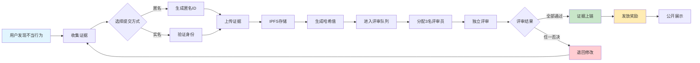

# 社区资料

---

### **第一部分：KOL劣迹曝光平台 - 机制详细版本 (已更新)**

此版本旨在深入剖析平台各个核心功能的内部工作流程和逻辑。

#### **一、 核心监督与曝光机制**

这是一个由用户驱动、社区审核、区块链固证的闭环流程。

1.  **投稿与证据受理机制**:
    *   **触发**: 任何用户发现KOL存在不当行为（如虚假宣传、欺诈、数据造假等）即可启动此流程。
    *   **证据收集**: 用户需准备包括但不限于图片、视频、聊天记录等多格式的电子证据。
    *   **提交入口**: 用户通过平台的“投稿系统”进行提交。平台支持**匿名或实名**两种方式，旨在保护爆料人隐私。
    *   **信息录入**: 提交时需填写被曝光KOL的关键信息（如社交账号）和劣迹事件的详细描述。
    *   **初步处理**: 系统收到投稿后，会将其标记为“审核中”，并自动进入评审系统的待处理队列。

2.  **去中心化评审机制**:
    *   **评审主体**: 核心是平台的“评审团”，成员通过社区投票选举产生，确保了其代表性和公信力。
    *   **任务分配**: 系统会自动将待审核的证据随机分配给多名评审员（示例中为3名）。
    *   **独立审核**: 为了保证公平，每位评审员都进行**独立、背对背**的审核，无法看到其他评审员的评级和意见，从而避免相互影响。
    *   **评级与共识**:
        *   每位评审员根据证据的真实性、严重性给出 **1至5级** 的评级。
        *   **通过机制**：必须所有参与该案例的评审员都判定为“通过”（**一致性原则**），该证据才会被初步认证。任何一票否决都将导致投稿被拒绝。
        *   **最终等级计算**: 如果证据通过，系统将所有评审员的评级相加后计算平均值，并**四舍五入**，得出该劣迹事件的最终严重等级。
    *   **结果确认与奖励触发**: 所有评审员确认最终结果后，该事件状态变更为“已通过”。同时，系统将自动触发智能合约，向投稿人和参与评审的评审员发放预设的代币奖励。

3.  **区块链存证机制**:
    *   **触发**: 在评审团确认证据“已通过”后，存证流程自动启动。
    *   **分布式存储 (IPFS)**: 证据的原始文件（图片、视频等）会被上传至IPFS（星际文件系统）这类分布式存储网络。这确保了文件的永久存储和防篡改，同时生成一个唯一的哈希值（内容标识符）。
    *   **智能合约上链**: 平台的智能合约被调用，将关键信息写入Solana区块链。这些信息包括：
        *   **证据哈希**: 指向IPFS中存储的证据文件的哈希值。
        *   **元数据**: 被曝光KOL的信息、事件描述、最终评级、时间戳等。
        *   **评审记录**: 参与评审的评审员ID和评审结果的记录。
    *   **不可篡改与公开验证**: 一旦写入区块链，这些记录便永久存在且无法被任何人修改。任何人都可以通过区块链浏览器，使用记录ID或交易哈希公开查询和验证这些信息，实现了完全的透明和可信。

#### **二、 代币激励与经济循环机制**

平台的代币（KOLE）是驱动整个生态系统运转的血液，其设计旨在激励参与、奖励贡献并维持平台价值。

1.  **获取与奖励机制**:
    *   **主要贡献奖励**:
        *   **首次举报 (100,000 KOLE)**: 首次提交关于某个KOL的有效劣迹证据，并成功通过审核。
        *   **补充证据 (20,000 KOLE)**: 为一个已经立案的事件提供新的、有效的补充证据。
        *   **评审工作 (50,000 KOLE)**: 作为认证评审员，完成评审任务并保证质量。
    *   **参与激励**: 用户通过参与社区投票、治理等活动也可以获得代币。

2.  **代币应用与消耗机制**:
    *   **治理权**: 持有代币是参与社区治理的基础。例如，参与社区投票（100 KOLE/次）或参与更深度的平台政策制定（500 KOLE/月）。
    *   **交易流通**: KOLE代币可以在去中心化交易所（DEX）上进行自由交易，赋予其市场价值。

3.  **价值支撑与通缩机制**:
    *   **平台资金池**: 平台启动时便注入100万美元作为初始资金，其中大部分（约70万美元）直接用于抽奖活动回馈社区，这为代币提供了早期的价值支撑和市场信心。
    *   **持续回购与销毁**:
        *   **PUMP直播奖励**: 合作渠道的直播奖励将**全部用于在市场上回购KOLE代币并进行销毁**。
        *   **基金会匹配销毁**: 每当平台上成功曝光一名KOL，基金会承诺会从二级市场**购买总供应量0.5%的代币并将其销毁**。
        *   **不定期销毁**: 平台也会根据运营情况进行不定期回购销毁。
    *   **效果**: 这些销毁机制会持续减少代币的流通总量，形成**通货紧缩**模型，从而对代币的长期价值构成有力支撑。

#### **三、 幸运抽奖运行机制 (已更新)**

这是一个为代币持有者设计的、高频且透明的福利系统。**（请注意：抽奖系统已完成重大更新，旨在提升公平性和趣味性，以下为最新规则）**

1.  **资格与权重计算**:
    *   **持仓时间**: 钱包地址中的代币持有时间必须**超过1小时**才能获得抽奖资格。
    *   **抽奖券生成**: 系统按**每持有30万代币兑换1张抽奖券**的规则计算。
    *   **权重上限**: 为了防止巨鲸垄断中奖机会，每个地址**最多只能计算5张抽奖券的权重**。即使持有超过150万的代币，也只按5张计算，这提升了小户持有者的中奖概率。

2.  **抽奖执行流程**:
    *   **地址导入**: 在每次抽奖（每小时）开始前，系统会运行一个“立即导入”的程序，扫描全网所有符合持仓时间要求的持币地址，并根据规则计算每个地址的抽奖券数量，生成当期的参与地址列表。
    *   **随机抽取与奖金发放**: **每轮抽奖将产生三名中奖者**。中奖地址产生后，奖金将根据名次自动发放至三位中奖者的钱包地址。
        *   **普通奖（总奖金10 SOL）**: **将按第一名5 SOL、第二名3 SOL、第三名2 SOL的比例发放。**
        *   **超级大奖（总奖金66 SOL）**: **则按第一名40 SOL、第二名20 SOL、第三名6 SOL的比例发放。**

3.  **透明与公正保障**:
    *   **算法开源**: 抽奖算法是公开的，任何人都可以审查其公平性。
    *   **数据公开**: 平台实时展示下一次抽奖的倒计时、奖金池余额、历史中奖地址列表以及详细的奖金发放交易哈希，所有记录均在链上可查。

---

### **第二部分：KOL劣迹曝光平台 - 整理原文完整版 (已更新)**

#### **平台总览**

**KOL劣迹曝光平台**是一个基于区块链技术的去中心化监督生态系统。它通过社区治理和代币激励机制，致力于构建一个公平、透明的监督环境，以曝光Key Opinion Leader (KOL)的不良行为，保护用户权益。

*   **平台愿景**: 去中心化监督，透明化治理。
*   **社交媒体**: X (Twitter), Telegram, Discord
*   **支持语言**: 中文 (🇨🇳), English (🇺🇸)

---

#### **一、 核心功能**

##### **1. 投稿系统**

用户提交KOL劣迹证据，以获得代币奖励。

*   **投稿流程**:
    1.  **准备证据**: 收集相关图片、视频、聊天记录等证据材料。
    2.  **填写信息**: 填写KOL信息和事件详情。
    3.  **提交审核**: 提交证据等待评审团审核。
    4.  **审核通过**: 证据通过审核，获得认证。
    5.  **获得奖励**: 获得平台代币奖励。

##### **2. 评审系统**

建立透明公正的证据审核机制。

*   **评审团机制**:
    *   **多人评审**: 每个证据由多名评审员独立审核。
    *   **一致通过**: 所有评审员必须同意才能通过认证。
    *   **评级系统**: 评审员对证据进行1-5级评级，最终等级为所有评级的平均值（四舍五入）。
*   **评审流程**: 证据提交 → 独立评审 → 评级汇总 → 结果确认 → 奖励发放。
*   **奖励机制**:
    *   **投稿者奖励**: 证据通过后可获得 **100,000代币**。
    *   **评审员奖励**: 参与评审工作可获得 **50,000代币**。

##### **3. 曝光展示**

展示经过验证的劣迹KOL名单。

*   **功能**:
    *   **星级评级**: 按事件严重程度对KOL分级。
    *   **搜索功能**: 用户可搜索特定KOL。
    *   **详细信息**: 显示KOL的ID、劣迹事件数、查看次数等。
*   **示例 (部分为测试数据)**:
    *   **凉兮**: 币圈知名KOL，多次涉嫌割韭菜行为。

##### **4. 区块链存证系统**

确保证据的不可篡改和永久保存。

*   **系统功能**:
    *   **智能合约**: 自动执行存证合约，过程透明。
    *   **分布式存储 (IPFS)**: 确保证据冗余备份和全球同步。
    *   **公开查询**: 通过区块链浏览器可公开查询存证记录。
    *   **不可篡改**: 基于哈希算法，数据上链后无法修改。
*   **系统架构**: 证据提交 → 社区评审 → 分布式存储 → 智能合约上链 → 公开查询。

---

#### **二、 代币激励系统 (KOLE)**

基于区块链的透明激励机制，驱动社区参与和治理。

##### **1. 代币经济模型**

*   **代币概览**:
    *   **区块链网络**: Solana (SPL代币标准)
    *   **总发行量**: 10亿 (固定)
*   **代币分配**:
    *   **用户投稿奖励**: 40% (每日解锁0.5%)
    *   **持币抽奖**: 40% (自由流通)
    *   **生态发展**: 10% (每月解锁1%)
    *   **团队顾问**: 10% (每月解锁2%)
*   **销毁池 (通缩机制)**:
    *   PUMP直播奖励全部用于回购销毁。
    *   每列出一个KOL，基金会购买0.5%代币进行销毁。
    *   平台不定期回购销毁。
*   **平台资金池**:
    *   平台自有资金**100万美金**。第一期约70万美金（3000 SOL）用于抽奖回馈。
    *   投资方第一期已投资**100万美金**，后续将全部投入项目。

##### **2. 奖励机制**

*   **首次举报奖励**: **100,000 KOLE**
*   **补充证据奖励**: **20,000 KOLE**
*   **评审奖励**: **50,000 KOLE**

##### **3. 代币用途**

*   **社区投票**: 100 KOLE/次
*   **治理参与**: 500 KOLE/月
*   **获得奖励**: 参与各类活动获得奖励。
*   **交易流通**: 在交易所和DEX上进行交易。

---

#### **三、 幸运抽奖 (代币持有者专属) (已更新)**

为回馈社区，平台设立了高频、高额的抽奖活动。**（请注意：抽奖系统已进行重大更新，旨在提升公平性和趣味性，以下为最新规则）**

*   **合约地址**: `2EL3kJNYbgoqvtK4eyfNxgYiwm2V7B84kfMd1KLRpump`
*   **奖金与频率（三人中奖模式）**:
    *   **普通大奖**: **每小时**直播抽奖一次，总奖金 **10 SOL**。
        *   **奖励分配**: 第一名 **5 SOL**，第二名 **3 SOL**，第三名 **2 SOL**。
    *   **超级大奖**: **新加坡时间每日0点0分**直播抽取，总奖金 **66 SOL**。
        *   **奖励分配**: 第一名 **40 SOL**，第二名 **20 SOL**，第三名 **6 SOL**。
*   **参与规则**:
    *   **持仓门槛**: 持仓 **1小时** 的地址方可参与。
    *   **抽奖券**: 每持有 **30万代币** 获得1张抽奖券。
    *   **权重上限**: 每个地址最多只有 **5张** 抽奖券计算权重，超出部分不计。
*   **透明度**:
    *   抽奖算法开源公示。
    *   实时展示奖金池余额、倒计时、历史中奖地址和链上奖金发放记录。
    *   **当前奖金池余额**: 2588 SOL (数据截至原文时间)

---

#### **四、 社区建设**

*   **评审团选举**: 代币持有者通过投票选举评审团成员。
*   **透明运营**: 定期发布代币分配、证据审核等数据。
*   **用户反馈**: 建立反馈渠道，持续优化平台功能。